# Device memory consumers: implementation roadmap

Saved: 2026-09-10

Last source review: 2026-10-06 for C5b qualification after the shared-workspace hardening rebase; earlier checkpoint evidence is unchanged.

## Status and how to resume

Current focus: CUDA compatibility C1-C6 is merged into `feature/adaptive-kv-stream-v2` at `60f023ef6`, including C6b documentation at `0f8f99d73`. Post-C6 hardening addresses failed CUDA copy-resource construction and retained startup admission for streams/events. The broader all-phase arena-size verifier remains future work; this hardening is not a total-process OOM guarantee. Actual older-GPU qualification remains pending. The accepted SM61 tile bound and 1e-8 consumer vector regression guard are unchanged; consumer MMA comparisons remain byte-exact. Forward-JIT evidence on newer hardware is not actual older-device acceptance. The `C` stage identifiers are independent of existing milestone numbers; milestone 8 is not renumbered or started.

Older evidence sections retain their original commit IDs. The rebase mapping is:

| Stage | Original | Rebased |
| --- | --- | --- |
| C1a | c24565acf | 166121069 |
| C1b | 7ed51795d | 5e1cd258f |
| C2a | 86334e695 | 7901adbde |
| C2b | 8e8f77446 | f269138b8 |
| C3a | f0b8ce2cb | f210494a0 |
| C3b | 3ec1b8841 | 1a573e3ac |
| C4a | 386fee9dc | adb64391a |
| C4b | 7b4d57390 | b9e1b35de |
| C4c | 774d22244 | f5f791a58 |
| C4d | 40c2ce93d | 35bc9ea73 |
| C5a | 081193bec | e6beee78f |

Milestone 4 is committed at `2b3b27bc8` and checkpointed as `feature/device-memory-manager-milestone-4`. Development continues on `feature/device-memory-consumers`. Substages **5.1a** and **5.1b** are committed at `fe2189418` and `74b400abb`. Substage **5.2a** is committed at `4717474c3`; **5.2b** is committed at `0e3d5a0c0`. Stage **5.3a** is committed at `7bfc17ac3`; **5.3b** is committed at `15d47eb72`; **5.4a** is committed at `ff4d3bdef`. Stage **5.3c** is committed at `6c724dee1`; **5.4b** is committed at `6db00070d`; **5.4c** is committed at `28e7999a0`; **5.4d** is committed at `59591b6da`; **5.4e** is committed at `a92107200`; **5.4f** is committed at `d48a1faa8`; **5.4g** is committed at `f069590ef`; **5.4h** is committed at `5887c18a0`; **5.4i** is committed at `6f98b1276`; **5.4j** is committed at `17b92d321`. The combined **5.4j.1-5.4j.4 optimization bundle** is committed at `5ee09b7e1`; **5.4k** is committed at `6879fe81a`; **5.5a** is committed at `b72bcc9e6`; **5.5b** is committed at `10ec8902d`; **5.5c** is committed at `123e76b44`. Backend-neutral publication through stage **5.6f** completes the milestone 5 checkpoint. Stages **5.7-5.9** retain their identifiers as non-gating follow-ups after milestone 6 establishes the final phase-sharing lifecycle.

Stage **5.6a** is committed at `eff245203`, **5.6b** at `04917421f`, **5.6c** at `a53e3bf81`, **5.6d** at `9f2fe3aff`, **5.6e** at `d57288807`, and **5.6f** at `dbd47c686`. Milestone 5 is checkpointed as `feature/device-memory-consumers-milestone-5`. Stages 5.7-5.9 remain named, non-gating optimization/documentation follow-ups. Stage **6.1a** is committed at `37b8ec387`, **6.1b** at `f1db07796`, **6.2a** at `546fdf67b`, **6.2b** at `18dfa8f4d`, **6.2c** at `51444315c`, and **6.3a** at `4b576eec7`, and **6.3b** at `4bf33a5e3`, and **6.3c** at `7ad14ee86`, and **6.4a** at `5eb1088d2`, and **6.4b** at `73a30439c`; stages **6.5a-6.5c** are implemented and qualified together for user review.

Read this file before continuing implementation. Keep milestone and stage identifiers stable. Parent stage IDs retain their original scope; lettered substages below are the commit units, each containing the implementation and its tests. Stage 8.5 remains a single commit unit. Update the progress ledger after completing a substage, recording its actual commit, validation, and any remaining limitations. A parent stage is complete only when all its required substages pass. Add explicitly named extensions if work expands; do not renumber or retroactively redefine completed stages.

After each completed substage, stage only its implementation, tests, and related documentation for user review. Leave unrelated changes unstaged and let the user create the commit.

This document records the discussed roadmap. Saving it does not start implementation, change branches, or authorize commits or publication.

## Checkpoints and reference implementations

| Reference | Commit | Purpose |
| --- | --- | --- |
| Milestone 3 / feature/device-memory-manager-milestone-3 | 78e002404 | Existing generic arenas, regions, views, leases, and scheduler borrowing, plus Meta ownership and view-factory exception cleanup fixes |
| Milestone 4 / feature/device-memory-manager-milestone-4 | 2b3b27bc8 | Common coordination and qualified serial CPU/single-CUDA context ownership; other backends retain legacy arenas |
| feature/adaptive-kv-stream | d873e5db9 | Reference for fixed-budget adaptive KV algorithms, kernels, and tests |
| feature/kv-stream-phase-arena | ae09597ff | Reference for CUDA prefill/decode memory sharing |
| master at milestone 3 base | ece963f41 | Stock comparison baseline |

Develop on an integration branch based on milestone 3. Create a checkpoint branch only after each milestone passes its acceptance criteria. Branch names can move; the recorded commits identify the reference versions.

## Objectives and initial scope

1. Reimplement adaptive KV streaming using the milestone 3 memory infrastructure.
2. Share memory across text prefill and generation, reclaiming resources no longer needed in each stage.
3. Extend sharing to vision/mmproj execution, supporting separate vision encoders and encoder-free multimodal models.

Initial production scope: one active execution operation per session, one CUDA GPU, ordinary generation without MTP. Common coordination APIs remain backend-agnostic. Streaming kernels, allocation properties, and executable-graph lifecycle support require backend-specific implementation and validation.

Milestone 7 first qualifies multimodal inference with MTP disabled, then qualifies the current serial embedded Qwen MTP configuration before claiming production vision support. Broader speculative modes remain outside this roadmap.

Existing buffer-view support on another backend does not imply streamed-attention support.

## Architecture and invariants

The inference session owns a small serial stage coordinator above text and vision contexts. Model integrations describe stages and dependencies. Consumers describe required, preserved, reconstructible, and reclaimable resources. Milestone 3 implements storage ownership and layout validation.

Resource kinds include weights, KV/recurrent state, handoff embeddings, temporary graph workspace, and executable graphs. A resource can survive several stages even when the current stage does not read it.

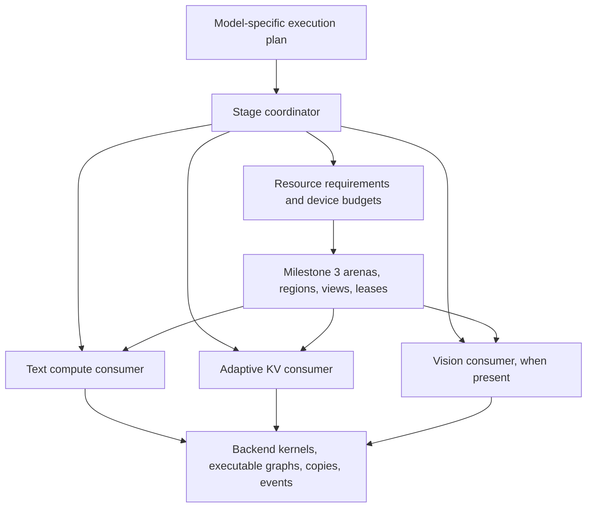

- Keep device allocation classes explicit. Model weights may use UVM while the shared compute/KV arena remains device-local.
- Keep the parent allocation stable across stage transitions where possible.
- Keep adaptive resident/ring repartition inside one leased KV region. No common-arena transaction, lease lookup, or mutex per page/token.
- Preserve the optimized transfer pipeline, quantized attention, scratch sizing, and asynchronous slot reuse.
- A lease protects ownership but does not automatically track in-flight work or captured device pointers.
- Drain affected work and invalidate stale executable graphs before reusing storage.
- Distinguish graph descriptions, captured executable graphs, tensor workspace, and backend scratch. Releasing one does not imply releasing the others.
- Preserve all live conversation state, including recurrent state outside the streamed KV implementation.
- Keep image embeddings alive until their final consumer finishes. The current host embedding handoff is a useful initial boundary.
- Use explicit stage signals. A one-token prompt is not necessarily generation.
- The coordinator controls stage transitions and total grants; consumers retain specialized internal allocation and execution policies.
- Layout rollback is not inference-state rollback. Device failures after mutable state changes can require session invalidation.

## Source review findings and integration requirements

This review read core implementations and relevant tests at the milestone 3, adaptive KV, and phase-arena checkpoints. It did not run new tests or establish an exhaustive correctness proof. These requirements refine existing stages without renumbering them or marking implementation complete.

### Milestone 3 contracts

- Layout commits update region metadata; they do not move bytes. Consumers must explicitly preserve or reconstruct data when addresses change.
- `ggml_backend_memory_arena_quiesce()` closes admission but does not wait for GPU work. Drain affected compute and copy execution before releasing leases.
- Active leases can survive a commit only for persistent regions unchanged in ID, offset, size, alignment, and flags. Do not require all persistent leases to disappear or the whole arena to become QUIESCENT on every transition.
- A surviving persistent lease retains its acquisition generation after the arena generation increases. A generation mismatch alone does not invalidate that lease.
- Scheduler slots with the same buffer type share allocator storage and lease references. Preserve this aliasing through attachment and detachment.
- The current text consumer reserves maximum workspace across measured phases. It does not reclaim prefill capacity during generation.
- Backend views preserve ownership and native buffer conventions, but do not automatically invalidate captured graphs that refer to reassigned storage.

Sources at `79e25c139`: `ggml/src/ggml-backend-memory.cpp`, `ggml/src/ggml-alloc.c`, `ggml/src/ggml-backend.cpp`, and `src/llama-context-workspace.cpp`. Relevant cases in `tests/test-backend-memory.cpp` cover persistent lease transitions, failed commits, concurrent admission, scheduler detachment, and shared slots.

### Adaptive KV production behavior to preserve

- Prefill uses uniform residency. Decode can concentrate the streamed deficit into selected layers, leaving other layers fully resident to provide prefetch windows. Concentration is bounded by ring size and each layer's active capacity; small rings support multiple waves.
- Resident K and V occupy separate contiguous token-major planes. Ring transfers also use separate K/V planes. A slot is not necessarily a self-contained interleaved K/V byte block.
- Boundary changes can move layer bases and V-plane offsets. The reference invalidates resident metadata and reloads from host when necessary; it does not guarantee non-disruptive device-page migration.
- Preserve batched uploads, resident spans, cross-layer scheduling, producer-ready/consumed event ordering, and slot reuse after the final consuming query tile. Wide micro-batches must not multiply H2D uploads for the same span.
- The real cross-layer queue lives in CUDA's `fattn.cu`. Early helpers `llama_kv_stream_plan_make`, `llama_kv_stream_regions_make`, `llama_kv_stream_extent_make`, and `llama_kv_stream_prefetch_dispatch` have test callers but no production callers in the reviewed adaptive branch. Port from actual execution paths; retain reference helpers only where useful.
- Eligible all-resident decode graphs support CUDA capture. Graphs requiring streamed KV disable capture in the reference. Preserve both paths and their eligibility checks.
- KV-runtime generation covers internal layout changes and authoritative cache replacement. Keep it distinct from arena-layout generation; either can invalidate cached execution assumptions independently.
- Copy-busy feedback extrapolates sampled CUDA copy timing over an evaluation. It is not measured PCIe throughput divided by theoretical bandwidth. Preserve its meaning in policy and diagnostics.

Sources at `d873e5db9`: `src/llama-kv-cache.cpp`, `src/llama-kv-stream-plan.cpp`, `ggml/src/ggml-cuda/fattn.cu`, `ggml/src/ggml-cuda/ggml-cuda.cu`, `ggml/src/ggml-cuda/set-rows.cu`, and `ggml/src/ggml-cuda/kv-stream-span-tuner.h`. Inspect reference branches with `git show <commit>:<path>` without switching the working branch.

### Gaps the new consumers must address

- Host KV buffers retain a runtime that also owns device resources. Current construction requires nonzero staging/resident capacity and offers no complete device-suspension lifecycle. Separate host-cache ownership from device-region binding so host KV can survive without an active device lease.
- Attention partials/accumulators and staged SET_ROWS scratch use CUDA's `ctx.pool()` outside the shared arena. GGML workspace measurements alone do not describe peak memory. Account for overlapping lifetimes and retained backing capacity; explicitly identify what is reclaimed and what remains outside the grant.
- The old phase arena synchronizes, resets CUDA executable state, recreates the scheduler, and substitutes a custom compute buffer type. Replace bespoke ownership with generic leases while preserving required ordering. Partial failure recovery in the old switch is not a complete transactional inference-state guarantee.
- The reviewed integration is restricted to `LLM_ARCH_QWEN35`, the target context, one sequence, and one CUDA device. Attention also checks 256-wide Q/V heads, token-major strides, mask format, and no attention sinks. Runtime pages are 256 tokens, and the phase-arena constructor checks uniform layer page geometry. Broader quantization support does not imply arbitrary model support.
- Storage, online KV writes, direct attention, and conversion fallback are separate capabilities. Validate the entire requested type/shape path before enabling streaming.

Sources for phase transitions at `ae09597ff`: `src/llama-context.cpp`, `src/llama-kv-stream-config.cpp`, and `ggml/src/ggml-cuda/ggml-cuda.cu`.

Existing tests cover all-resident attention, authoritative cache replacement, dirty-row mirroring, batched uploads, cross-layer prefetch, concentrated/multi-wave layouts, wide micro-batches, and phase-arena overlap/lifetime rules. Extend these with delayed execution, complete suspension, and coordinated failure recovery; historical tests do not validate these new lifecycles.

## Development and validation rules

- Write a failing behavioral test before implementation.
- Cover successful operation, invalid input, and meaningful failure/recovery paths.
- Keep each commit buildable and runnable.
- Run focused tests per stage and broader regression checks at milestone boundaries.
- Preserve existing behavior when new functionality is disabled.
- Reuse existing algorithms and tests where suitable; adapt ownership instead of gratuitously rewriting kernels.
- Treat commit-sized stages as reviewable dependent changes, not necessarily independent PRs.
- Keep performance claims proportional to evidence. Existing A/B results are encouraging but include reduced samples, incomplete cells, and a SYCL VMM-fix confounder.
- Use targeted performance checks before broad sweeps: all-resident, streaming onset, moderate streaming, and bandwidth-limited operation.

## Commit sizing and dependency rules

The split below preserves milestones 4-8 and all existing parent stage scopes. It separates independently testable contracts, device execution, integration, failure recovery, and performance changes. It does not add another milestone or mark existing plans as completed.

| Milestone | Commit units | Main reason for subdivision |
| --- | --- | --- |
| 4 | 11 | Separate planning, asynchronous lifetimes, recovery, and the first real consumer. |
| 5 | Original units through 5.6f; stages 5.7-5.9 are non-gating follow-ups | Establish exact bounded streaming, server/cache integration, and backend-neutral producer overlap. |
| 6 | 13 | Separate measurement, accounting, KV growth/shrink, fixed-parent integration, phase activation, recovery, and budget probing. |
| 7 | 14 | Separate embedding lifetime, multimodal KV positions, live serial ownership, KV suspension, projector reload, server wiring, and embedded MTP qualification. |
| 8 | 9, including conditional 8.2b | Separate real model adapters, capability coverage, and sustained lifecycle validation. |

These are planned review units, not a guarantee of final diff size or a fixed number of mandatory code commits. The real cross-attention adapter in 8.2b is conditional; a documented deferral is not an implemented adapter. Do not create empty commits just to satisfy a count. If a substage still contains two independently risky changes, name an additional subdivision before implementing it and preserve completed identifiers.

- The dependency column lists immediate prerequisites. `M3` is the existing checkpoint; `M4` through `M7` mean the preceding milestone has passed its full acceptance gate.
- Tables group work by parent scope, not strict execution order. In milestone 4, implement 4.4a before 4.3b. In milestone 5, implement 5.4a before 5.3c; the host-write baseline does not depend on batched write optimization.
- Define capability rejection at the first affected consumer. Stage 8.3 consolidates and validates those contracts; it is not the first safety gate.
- For code substages, record a failing behavioral test, implement, rerun focused tests, and check existing paths. Documentation/qualification commits instead reproduce their commands and record evidence; do not manufacture a failing test for prose.
- Keep unfinished consumers opt-in or test-only until their integration stage passes. Preserve a runnable baseline at each commit; do not leave production dispatch calling half-ported kernels.
- Use one generic geometry/quant contract from 5.1a onward. Early execution tests can cover a subset while bringing up the pipeline, but must not establish a permanent Q8/Q4 special allocation path.
- Before optimization substages 5.3c and 5.4f-5.4k, retain a targeted result from the preceding working revision. Check numerical correctness, transfer bytes/submissions, and representative latency after each change. Isolate and explain regressions before proceeding.
- Freeze model, quantization, context, b/ub, UVM mode, and pool size for kernel A/B checks. Use separately labeled maximum-allocatable-pool comparisons for phase-sharing gains.
- Save test commands, outcomes, hardware/tool availability, and remaining limitations with each ledger entry. A skipped backend is not a pass; passing tests provide evidence, not a proof that no bug exists.

### Implementation checkpoints within milestone 5

1. Through 5.4a: authoritative host state, leased resident mirrors, and correct all-resident execution.
2. Through 5.4e: correct bounded block streaming and supported quant dispatch, without relying on asynchronous overlap.
3. Through 5.4k: optimized copy/prefetch pipeline, wide micro-batches, feedback, and resident capture.
4. Through 5.5c: real serial server/cache integration and fixed-pool reference-performance qualification.
5. Through 5.6f: backend-neutral asynchronous K/V publication with qualified synchronous fallbacks and native adapters. This is the milestone 5 checkpoint.
6. Stages 5.7-5.9 retain their identifiers as non-gating graph, strict-prefill, and documentation follow-ups after phase-sharing behavior is established.

Do not enable phase-dependent grants before the fixed-pool gate passes. Do not attempt full vision eviction until text phase transitions and host/device KV separation are validated.

## Milestone 4: execution stages and resource coordination

Outcome: multiple consumers can safely share an arena through explicit dependencies. Text behavior remains equivalent to milestone 3.

| Commit unit | Prerequisites | Implementation boundary | Required tests / evidence |
| --- | --- | --- | --- |
| 4.1a | M3 | Resource contracts: IDs, memory domain/allocation class, minimum/preferred bytes, access, preservation, and reconstruction; define explicit unsupported-capability results. | Missing/duplicate IDs, invalid sizes/domains, and a resource surviving an inactive stage. |
| 4.1b | 4.1a | Execution-plan validation: dependencies, last use, and conflicting access; keep model semantics above GGML. | Cycles, missing producers, empty plans, read/write conflicts, and preserved but unread resources. |
| 4.2a | 4.1b | Pure minimum-layout planning with fixed persistent extents and checked alignment/accounting. | Exact fit, overflow, insufficient capacity, persistent overlap, and unchanged persistent region identity. |
| 4.2b | 4.2a | Deterministic elastic grants after minimum requirements; report unused capacity without allocating storage. | Competing preferred sizes, alignment gaps, deterministic ties, and total grants within budget. |
| 4.3a | 4.2b | Transition preparation and admission state machine using fake consumers; no device rebinding yet. | Preparation failure leaves active state usable; cancellation, reentrancy rejection, and no-op transitions. |
| 4.3b | 4.3a, 4.4a | Drain affected execution, invalidate affected executables, release changed leases, commit layout, bind, then activate; preserve unchanged persistent leases. | Delayed compute/copies, admission closure, no reuse before completion, persistent leases surviving a commit, and bind ordering. |
| 4.3c | 4.3b | Failure recovery for transition boundaries; distinguish restorable metadata/bindings from a poisoned inference session. | Injected release/commit/view/bind failures, cancellation after drain, failed recovery, and safe destruction; never claim mutable-state rollback. |
| 4.4a | 4.1a | Executor lifetime contract plus fake executor: affected resources, explicit drain/invalidation, and separate arena/content/executable validity. | Captured stale addresses rejected, unchanged persistent lease remains valid across arena generations, and no-op executable preservation. |
| 4.4b | 4.3c, 4.4a | CUDA adapter for the executor contract using existing capture lifecycle mechanisms. | Real captured replay before/after rebinding, invalidation before storage reuse, no-op capture reuse, and backend-disabled builds. |
| 4.5a | 4.3c | Text workspace consumer: register maximum workspace and attach coordinated leases without phase reclamation. | Create/reserve/detach/destroy, same-buffer-type aliased scheduler slots, failed attachment, and existing backend fallback. |
| 4.5b | 4.5a, 4.4b | Text execution integration and milestone qualification; retain milestone 3 allocation behavior. | Numerical and lifecycle checks on available CPU/CUDA/OpenCL/SYCL/Vulkan/Meta paths; targeted no-op/steady-state overhead comparison. |

Acceptance:

- Fake consumers demonstrate safe sharing and failure recovery.
- Existing text inference passes across available backends.
- No phase-dependent reclamation is enabled yet.
- Coordinator placement remains reusable by text and vision without making GGML image- or server-aware.

## Milestone 5: adaptive KV streaming using leased memory

Outcome: fixed-budget adaptive streaming runs on milestone 3, independently of phase-switching complexity.

| Commit unit | Prerequisites | Implementation boundary | Required tests / evidence |
| --- | --- | --- | --- |
| 5.1a | M4 | Production KV geometry and capability checks with checked quant-aware sizes; audit which reference helpers have real callers. | Independent K/V storage/write/attention/conversion support, unequal row sizes, page tails, overflow, unsupported heads/strides/masks/sinks, and model/sequence limits. |
| 5.1b | 5.1a | Pure resident/ring layout and adaptation policy from production: uniform prefill, concentrated decode, multi-wave capacity, feedback, and hysteresis. | Exact boundaries, short contexts, concentrated deficit, tiny feasible rings, feedback resets, and bounded grants. |
| 5.2a | 5.1a | Device-local CUDA allocation adapter for KV arena storage regardless of weight-UVM setting. | Actual allocation class with UVM on/off, allocation failure, device identity, and teardown. |
| 5.2b | 5.2a, 5.1b | KV runtime borrows one coarse region lease; separate host-cache identity from device binding and cache base/capacity outside token loops. | Undersized/misaligned/wrong-device leases, shared ownership, detach ordering, and no per-page arena transactions. |
| 5.3a | 5.1a | Authoritative host KV storage and pinned-memory lifetime, preserving reference Windows behavior. | Allocation failure, pin/register/unregister ownership, supported quant layouts, and host lifetime independent of device binding; record unavailable OS coverage. |
| 5.3b | 5.3a, 5.2b | Cache writes, dirty rows, mutable tails, and content generation; use a correctness-first synchronized mirror update where needed. | Partial rows/pages, overwrites, cache replacement with unchanged arena generation, pending-write cancellation, and host/device agreement. |
| 5.3c | 5.3b, 5.4a | Batched prefill SET_ROWS/write staging and bounded scratch, replacing the baseline write submission policy. | Quantized batched writes, partial batches, staging reuse after completion, scratch peak, and fewer submissions without changed bytes. |
| 5.4a | 5.3b | Resident K/V planes and ordinary all-resident attention using the leased mirror; no asynchronous streamed execution yet. | Plane offsets, dirty-tail mirror, all-resident numerical equivalence, and existing ordinary attention dispatch. |
| 5.4b | 5.1a | Partial-attention result and stable merge contract; establish reference tests before device integration. | Unequal blocks, masked/empty blocks, causal tails, extreme logits, and tolerance-based comparison with unsplit attention. |
| 5.4c | 5.4a, 5.4b | One explicitly staged KV block and streamed partial-attention integration; start with ordered copy/compute. | Resident plus streamed merge, K/V plane bounds, mutable last block, minimum scratch, and out-of-bounds guards. |
| 5.4d | 5.4c, 5.1b | Multiple streamed blocks with bounded ring-slot reuse and correct concentrated/multi-wave traversal. | Ring wraparound, more blocks than slots, partially filled final block, per-layer bounds, and no premature slot overwrite. |
| 5.4e | 5.4d | Complete supported quant dispatch and bounded F16 conversion fallback through one generic layout contract. | Supported K/V pairs, unequal bytes, direct/fallback agreement, unsupported combinations rejected before allocation, and conversion scratch bounds. |
| 5.4f | 5.4e | Dedicated copy stream and producer-ready/final-consumer events; overlap copies without changing attention semantics. | Artificially delayed producer/consumer, slot reuse hazards, pending-copy teardown, cancellation, and sanitizer-capable host bookkeeping. |
| 5.4g | 5.4f, 5.3c | Contiguous attention spans and batched K/V uploads preserving separate planes. | Partial spans, wraparound, exact transfer bytes, fewer H2D calls, and targeted comparison with the prior commit. |
| 5.4h | 5.4g | Actual cross-layer prefetch queue, bounded lookahead, and immediate safe slot reuse; no fixed three-layer assumption. | Delayed and out-of-order readiness, concentrated/multi-wave schedules, no deadlock, and lookahead constrained by free slots. |
| 5.4i | 5.4h | Wide micro-batch query tiling with slot lifetime extending to the final consuming tile. | b/ub combinations, causal masks, partial query tiles, and no duplicate H2D upload per query tile; preserve 256/256 performance. |
| 5.4j | 5.4i | Runtime miss/copy timing feedback and span tuning connected to the pure policy. | Every consumed span can detect readiness misses, feedback reset, hysteresis, bounded repartitions, and copy-busy units distinct from PCIe utilization. |
| 5.4j.1 | 5.4j | Bound copy timing to one sample per execution, independently of deadline probes. | Exact sampled versus total bytes, empty/reset/reuse/tail cases, two timing events independent of ring/context size, and isolated latency comparison. |
| 5.4j.2 | 5.4j.1 | Deferred completed-feedback collection without a measurement-only wait or mandatory immediate counter readback. | Pending/ready/reused snapshots, cancellation and teardown, no stale epochs, bounded retained storage, and latency comparison. Preserve existing correctness fences. |
| 5.4j.3 | 5.4j.2 | Restore decode-phase and producer-constrained-tail filtering for repartition feedback. | TG1 versus prefill, immutable history versus demand-produced tails, mixed spans, and no false demotion from missing eligible feedback. |
| 5.4j.4 | 5.4j.3 | Qualify batch-level deadline/publication optimization while retaining ticket-based reuse safety. | Every eligible upload batch covered, fallback/subspan reuse, delayed publication and consumption, unchanged outputs, and isolated overhead comparison. Do not change the broader attention synchronization contract here. |
| 5.4k | 5.4j.4 | Capture eligibility and invalidation for the completed KV runtime: enable eligible resident replay and gate streamed capture. | Resident replay, resident-to-streamed-to-resident transitions, content/layout generation changes, and no stale captured pointers. |
| 5.5a | 5.4k | Opt-in text-context integration, serial execution gating, and hybrid recurrent-state preservation. | Real-model prefill/decode, context limits, unsupported model/device/sequence rejection, and feature-disabled equivalence. |
| 5.5a.1 | 5.4k | Disjoint leased producer workspace and atomic K/V publication during live historical prefetch. | Workspace retention/alias rejection, completed GPU producer rows, tiled batches, resident/tail boundaries, post-submission failure and retry. |
| 5.5a.2 | 5.5a.1 | Session ownership of host content, device grant, writer/partial workspace and accepted live policy transitions; no public enablement yet. | Full grant accounting, bind/repartition/capture retirement ordering, append continuity, failure cleanup and unchanged recurrent ownership. |
| 5.5a.3 | 5.5a.2 | Model-graph producer/attention bridge over the session, including resident execution and streamed segmentation. | Real graph dependencies, producer completion before tail use, no accidental source recomputation or full-cache H2D, retained workspace/capture lifetime. |
| 5.5a.4 | 5.5a.3 | Public opt-in context integration, serial/model/device gates and real hybrid-model qualification. | Original 5.5a acceptance tests: prefill/decode, b/ub splitting, context limits, unsupported configurations and feature-disabled/recurrent-state equivalence. |
| 5.5b | 5.5a | Serial request/reset/cancellation and prompt-cache save/restore integration. | Different content/lengths, reused prefixes, cache replacement, abort followed by another request, and recurrent state equivalence. |
| 5.5c | 5.5b | Qualify fixed-pool performance and add only diagnostics needed to explain differences. | All-resident, streaming onset, moderate streaming, and bandwidth-limited comparisons against the fixed-pool reference; transfer volume and sufficient decode length. |
| 5.6 | 5.5c | Backend-neutral asynchronous K/V publication, separating accelerator consumption from durable host visibility. | Complete only after 5.6a-5.6f pass; preserve synchronous behavior as the fallback rather than duplicating the publication algorithm per backend. |
| 5.6a | 5.5c | Common publication tickets, reserved/device-ready/host-ready/committed frontiers, reference-counted parent and lease retention, cancellation, and failure closure; no backend execution change. | Red-first fake-completion tests for ordered and out-of-order completion, atomic K/V visibility, invalid transitions, retained ownership, counter exhaustion, cancellation, and bytes beyond the committed frontier remaining invisible. |
| 5.6b | 5.6a | Migrate the writer/session to a synchronous adapter over the common protocol without changing submission or drain behavior. | CPU, event-less backend, prompt-cache, restore, cancellation, injected K-only/V-only failure, and real-model equivalence; freeze latency and submission counts before async changes. |
| 5.6c | 5.6b | Generic completion wrapper over existing `ggml_backend_event_t`, with event capability discovery, backend waits, explicit host waits, safe teardown, and synchronous fallback; do not expose native event handles. | Fake event backend plus supported real events; record/wait ordering, unsupported event creation, cross-device rejection, teardown after partial submission, and no wrapper-added host wait beyond the backend's event behavior. |
| 5.6d | 5.6c | Connect asynchronous tickets to the writer/session with distinct device and host completions, deferred atomic K/V commit, and retained plan/source ownership across graph replacement. | Device attention can consume a completed pair while host publication remains pending; save/restore and host-driven repartition wait for host readiness; graph rebuild, retry, cancellation, and malformed completion remain closed. |
| 5.6e | 5.6d | CUDA producer adapter: queue bounded SET_ROWS production, resident-tail publication, and direct pinned-host mirror writes; replace per-tile/per-layer drains with event dependencies. | Real CUDA delayed producer/consumer tests, mutable tail, resident/ring boundaries, multiple tiles/layers, cache save during pending D2H, capture invalidation, memcheck, unchanged logits/recurrent state, and matched performance points. |
| 5.6f | 5.6e | Cross-backend conformance for the common protocol on CPU, SYCL, Vulkan, OpenCL, and Meta; use the synchronous fallback where native async capability is absent. | Available-backend matrix, mixed completion/failure, aliased Meta buffers, exact outputs, no leaks, explicit capability reporting, and no performance claim for a fallback or unavailable backend. |
| 5.7 | Deferred follow-up after 6.3c | Reduce managed graph segmentation through planned execution islands while preserving publication tickets, lease retention, and invalidation. | Compare graph submissions, capture reuse, failure closure, and steady-state latency after phase transitions establish the final graph lifecycle. |
| 5.8 | Deferred follow-up after 6.3c | Replace strict full-layer prefill gathering with bounded native-state continuation or another numerically qualified streaming method. | Preserve the strict gather as a control until local and recurrent-model errors and performance pass against the shared-budget lifecycle. |
| 5.9 | Deferred follow-up after 6.5c | Document supported configurations, fixed/shared-budget semantics, asynchronous-publication capability/fallback behavior, limitations, and reproducible focused tests. | Verify documented invocations and capability matrix; no broad model/backend claim from producer-only, attention-only, or quant-only coverage. |

Stage 5.5a retains its original scope and is complete only after 5.5a.1-5.5a.4 pass. The integration review found independently risky producer, ownership and graph-dispatch boundaries: the existing writer used ring storage and could not run while cross-layer prefetch owned that storage. These explicit subdivisions follow the commit-sizing rule above; they do not renumber completed stages 5.5b-5.5c. Remaining optimization and documentation work is assigned to stages 5.6-5.9. The original milestone commit counts are planning estimates, not fixed totals after subdivisions.

Acceptance:

- Fixed-pool streaming is correct.
- Targeted comparisons with `feature/adaptive-kv-stream` show comparable performance and transfer volume.
- The KV runtime owns resident/ring subdivision within a coarse lease.
- Concentrated decode layouts and all-resident capture have execution coverage, not just standalone policy tests.
- No broad sweep is required unless representative points reveal an unexplained difference.
- K/V publication uses one common transaction/frontier contract across backends; native events stay inside backend adapters.
- Device consumers can depend on device-ready K/V without forcing host publication, while host-visible state advances only after both K and V complete.
- Event-capable adapters avoid a device-wide host synchronization on the steady producer path; unsupported adapters preserve correctness through the synchronous fallback.
- Publication tickets retain all referenced storage and execution plans until completion, cancellation, or explicit retirement.

## Milestone 6: prefill/decode memory sharing

Outcome: compute and KV share one stable device-local parent budget; decode receives space reclaimed from larger prefill-only resources.

The configured batch size, micro-batch size, output policy, attention mode, and admitted graph variants determine phase requirements. Do not replan from the instantaneous request or infer generation from a one-token batch. Weights may use managed allocation, but the shared compute/KV arena remains device-local on the initial CUDA path.

The internal budget contract is fixed in 6.1b before shared allocation begins. It includes scheduler tensor workspace, the KV resident/ring pool, KV attention workspace, controllable writer/conversion/accumulator scratch, and alignment gaps. Model weights, authoritative host KV, output buffers, driver allocations, event metadata, executable metadata, and backend allocations that cannot borrow arena views are reported separately.

| Commit unit | Prerequisites | Implementation boundary | Required tests / evidence |
| --- | --- | --- | --- |
| 6.1a | M5 | Preserve separate aligned prefill/decode workspace requirements for configured b/ub and admitted output/attention graph variants; keep the conservative maximum live. | Partial and zero-size phases, TG1-shaped measurements, multiple size matrices, aliased slots, malformed measurements, budget fitting only one phase, and unchanged fixed-maximum execution. |
| 6.1b | 6.1a | Inventory/account for backend scratch, retained ctx.pool() backing, captures, transition peaks, and every included/excluded allocation; define the stable parent budget contract. | Direct/conversion partials, accumulator/write scratch, overlapping lifetimes, allocation-class checks, measured peaks versus declared accounting, and managed weights with a device-local shared arena. |
| 6.2a | 6.1b | KV growth/rebind from an external coarse lease using authoritative host data; rebuild K/V planes and recompute resident/ring split instead of only growing the ring. | Changed layer/V-plane bases, increased residency, lazy reload correctness, and separate arena/KV validity generations. |
| 6.2b | 6.2a | KV shrink/rebind and pending-copy drain; invalidate moved mirrors and bounded scratch safely. | Minimum feasible capacity, concentrated layouts, ring remap, dirty tails, delayed work, and logical cache preservation. |
| 6.2c | 6.2b | Rebind failure handling without relying on simultaneous old/new full-budget allocation. | Rejected resize, failed view/binding creation, recoverable reactivation, poisoned-session rejection, metadata rollback distinct from content reconstruction, and host KV retained. |
| 6.3a | 6.1a | Explicit text-prefill/text-decode stage signals, with no reclamation enabled yet. | Single-token prompt versus generation, final short prompt batch, TG1, repeated notifications, serial-request boundaries, and speculative execution rejection. |
| 6.3b | 6.3a, 6.2c | Integrate compute and KV under one stable physical parent with fixed grants equivalent to current behavior; do not reclaim by phase yet. | One parent allocation, fixed base address, exact grant accounting, legacy-option equivalence, fallback rejection, unchanged logits/state, and matched memory/performance. |
| 6.3c | 6.3b | Activate prefill-to-decode sharing: drain/invalidate, release changed workspace, repartition grants, bind, and rebuild only affected execution. | Real reclaimed bytes, captured-pointer safety, no-op transition, parent identity unchanged, no per-token coordinator work, and measured decode-pool increase. |
| 6.4a | 6.3c | Return from expanded decode KV to prefill for serial requests and changed requirements. | Long decode then short/long prompts, repeated alternation, shrink/reload correctness, resident reload cost, and numerical equivalence. |
| 6.4b | 6.4a | Prompt reuse, cache restoration, cancellation, and interrupted phase transitions. | Cached prefixes, restored host KV/recurrent state, cancellation at each boundary, and subsequent request or explicit invalid-session outcome. |
| 6.5a | 6.4b | Generalized shared-budget CLI/API option and deliberate compatibility with existing fixed-pool options. | Parsing, mutually exclusive/conflicting options, old-option behavior, and clear included/excluded allocations. |
| 6.5b | 6.5a | Adapt maximum-budget probing to both phases and transition peaks, using the existing sweep harness. | Startup-only false fits rejected, next-granule OOM boundary, successful decode/return-to-prefill, one stable parent, and no arbitrary new safety reserve. |
| 6.5c | 6.5b | Transition/accounting diagnostics and qualification against the phase-arena reference. | Effective phase grants, decode KV bytes, streaming onset, reclaimed workspace versus capture storage, resident reload latency separated from steady-state speed, and representative fixed-model A/B points. |

Recommended implementation order is 6.1a, 6.1b, 6.3a, 6.2a-6.2c, 6.3b-6.3c, 6.4a-6.4b, then 6.5a-6.5c. Stage numbers describe ownership boundaries, not a requirement to implement the table strictly top to bottom.

Acceptance:

- One parent device allocation and base address remain stable across phase transitions; only internal region grants change.
- Reclaimed prefill workspace measurably increases decode KV capacity and delays streaming when additional capacity permits.
- Managed model weights remain compatible with a physically device-local shared compute/KV arena.
- No common-arena transaction, phase classification, or new device-wide synchronization occurs on ordinary steady-state tokens.
- Arena-layout, KV-layout, content, and executable generations remain separate and stale captures are invalidated before address reuse.
- Transition failure never requires simultaneous old/new full-budget allocations; authoritative host KV remains the reconstruction source.
- Transition cost and throughput are comparable to `feature/kv-stream-phase-arena`.
- The budget reports compute, KV, scratch, weights, host state, driver allocations, alignment gaps, and excluded allocations explicitly.
- Executable-graph destruction and tensor-workspace reclamation are validated separately.
- Report resident reload cost separately from steady-state throughput; do not assume repartition preserves device pages.

## Milestone 7: separate vision encoder integration

Outcome: a Qwen-style vision encoder and language model safely share phase-specific memory, including the current embedded MTP mode after a no-MTP baseline passes.

Before real-model qualification, obtain a matching mmproj and record its weight bytes, actual image/batch graph workspace, transient output, text/recurrent state, and the configured image-token and mtmd batch-token limits. The local Qwen3.8 GGUF snapshot does not include mmproj. Warmup graph size alone is not a bound for every dynamic image batch. Keep unsupported media requests and layouts rejected until their full lifecycle is qualified.

| Commit unit | Prerequisites | Implementation boundary | Required tests / evidence |
| --- | --- | --- | --- |
| 7.1a | M6 | Borrowed mtmd compute workspace consumer with explicit requirements and executable lifetime. Plan from the actual preprocessed image batch before attachment; do not treat the warmup reservation as a universal maximum. | Variable image sizes/batches, batch too large for the grant, checked scheduler reservation, attachment failure, and drain before release. |
| 7.1b | 7.1a | Handoff embedding ownership independent of reusable vision workspace; preserve the existing host boundary initially. A batch may encode images that appear later in the prompt. | Compatible/incompatible media batches, partial/chunked consumption in prompt order, embeddings alive until the final batch consumer after workspace release, and cancellation cleanup. |
| 7.2a | 7.1b | Session execution plan for ordered text/image chunks with batchable vision encoding and later embedding prefill; initially retain existing allocations and leave MTP disabled. | Text/image/text ordering, follow-up images with existing state, multiple images, and encoding failure without unsafe text execution. |
| 7.2b | 7.2a | Admit image-embedding prefill to adaptive KV. Keep sequential physical KV append indices distinct from Qwen M-RoPE model positions; retain cache-cell position metadata and explicit prefill intent. | Mixed text/image batches, overlapping/nonconsecutive image positions, later text positions, KV/recurrent state and generated output against ordinary mtmd, cache save/restore, and malformed-position rejection. |
| 7.2c | 7.2b | Generalize the live serial parent from its single MTP child to coordinated text, vision, and optional MTP consumers without concurrent use of aliased storage. | One active scheduler per parent, repeated handoffs, pending compute/copy drain, captured-pointer invalidation, cancellation, and failure recovery; fake three-consumer tests precede live wiring. |
| 7.3a | 7.2c | Full KV device suspension: drain authoritative writes/copies, release device binding, and preserve host/runtime identity; explicitly account for recurrent state. | Zero retained KV device lease/pool, dirty tails saved, unchanged host cache, suspended execution rejected, and state outside KV protected. |
| 7.3b | 7.3a | Resume suspended KV into a fresh grant and rebuild affected mirrors/executables. | Different grants/addresses, host content restored, stale capture rejection, and attention/recurrent-state equivalence. |
| 7.3c | 7.3b | Interrupted suspension/restoration and integration with vision-stage borrowing. | Allocation/rebind failure, cancellation before/after eviction, retry versus invalid-session rules, and repeated vision/text transitions. |
| 7.4a | 7.2a | Separate projector device-weight ownership from model metadata and host/reload source while keeping current eager residency. | Shared owners, tensor metadata lifetime, loading equivalence, and destruction without double release. |
| 7.4b | 7.4a | Explicit projector-weight unload/reload with executable invalidation and tensor rebinding. | Repeated new-address reload, stale tensor/capture rejection, drain before unload, and numerical equivalence. |
| 7.4c | 7.4b, 7.3c | Coordinate reloadable projector storage with phase grants and failure recovery; account for weights that stay outside the arena. | Budgets unable to hold both phase allocations, reload failure, no double-allocation assumption, and persistent conversation state. |
| 7.5a | 7.4c | Complete no-MTP multimodal server flow, image-related cache reuse, and serial session cleanup. Lift the streaming/mmproj server guard only for qualified configurations. | Real image/text requests, follow-up images, compatible and separate media batches, reused media prefixes, aborted requests, and handoff final-use ordering. |
| 7.5b | 7.5a | Qualify no-MTP memory savings, transition latency, and documented supported vision configuration. | Peak below simultaneous phase sum, batch-size-dependent workspace, expected post-request baseline, repeatable outputs, and separate projector reload versus KV reload costs. |
| 7.5c | 7.5b | Qualify the current serial embedded Qwen MTP mode across vision/text handoffs; preserve the no-MTP path as a fallback. | Image-embedding draft catch-up, M-RoPE position handling, target/MTP/vision scheduler ownership, ring-guard retirement, rejection replay, cancellation, long-context correctness and peak memory. |

Acceptance:

- A supported request fits a budget that cannot hold all phase-specific allocations at once.
- Subsequent generation remains correct.
- Projector weights are unloaded only through an explicit storage lifecycle.
- Existing KV and hybrid recurrent state survive vision execution.
- Host KV ownership does not force retention of the device pool during vision execution.
- Handoff embeddings remain available for all consumers, including later chunks from a media batch.
- Physical KV append order remains independent of image M-RoPE positions; subsequent text and prompt-cache operations preserve both.
- The documented production configuration works with embedded MTP after a separately qualified no-MTP vision baseline; unsupported speculation remains explicitly rejected.

## Milestone 8: encoder-free plans and integration hardening

Outcome: one coordinator supports separate encoders and shared multimodal transformers with explicit capability boundaries.

| Commit unit | Prerequisites | Implementation boundary | Required tests / evidence |
| --- | --- | --- | --- |
| 8.1a | M7 | Encoder-free execution-plan adapter for a supported model: lightweight preparation then shared multimodal prefill. | Model-derived dependencies, shared transformer weights never reclaimed as a separate projector, and absent encoder handled explicitly. |
| 8.1b | 8.1a | Real encoder-free inference integration and phase sharing; choose a model verified in the checkout and report streaming support separately. | Image/text output equivalence, prefill-to-decode reclamation, shared-weight lifetime, and safe fixed-layout/rejection when streaming geometry is unsupported. |
| 8.2a | 8.1b | Cross-attention-style persistent visual-resource contract using fake consumers. | Encoder workspace reclaim without dropping features/visual KV, repeated generation consumers, and last-use release. |
| 8.2b | 8.2a | Integrate a real cross-attention adapter only if a suitable supported model/backend is available; otherwise record a named deferred adapter and evidence of the limitation. | Actual model equivalence and lifetimes when implemented; fake tests are explicitly not production support. |
| 8.3a | 8.1b, 8.2a | Consolidate capability/fallback policy already introduced in milestones 4-7; do not defer safety checks until this stage. | Allocation, borrowing, executable invalidation, storage/write/attention streaming capability combinations, and no silent budget violation. |
| 8.3b | 8.3a | Validate existing CPU/CUDA/OpenCL/SYCL/Vulkan/Meta combinations and unsupported-path diagnostics. | Real available-device smoke/numerical tests, aliased Meta ownership, valid fixed-layout fallback, and explicit rejection where no budget-safe path exists. |
| 8.4a | 8.3b | Integrated session fault/lifetime matrix across transitions, caches, suspension, reload, and destruction. | Delayed compute/copy execution, injected failures at boundaries, repeated recovery/invalid-session outcomes, and no use after release. |
| 8.4b | 8.4a | Sustained reuse/leak and applicable sanitizer qualification, keeping host and device coverage distinct. | Repeated multimodal sessions, memory return to expected retained baseline, ASan/UBSan/TSan where supported, and recorded hardware/tool gaps. |
| 8.5 | 8.4b, 8.2b | Finalize architecture/support documentation, examples, and compact performance/memory comparisons using existing harnesses. | Reproducible text-only, separate-encoder, and encoder-free examples; deferred cross-attention support labeled; disabled-feature baseline preserved. |

Acceptance:

- Both real architecture families use the same coordinator.
- Existing backend paths retain their behavior.
- Unsupported streaming paths are explicitly identified.
- If no appropriate cross-attention model is supported locally, its real adapter is a named follow-up; contract tests do not count as production model support.

## Consumer CUDA compatibility workstream: planned

### Objective and scope

Support NVIDIA GTX 10-series hardware through an SM61/Pascal baseline, while preserving optimized execution on SM75/RTX 20-series, SM86/RTX 30-series, SM89/RTX 40-series and SM120/RTX 50-series. AMD RX hardware is not part of this CUDA workstream. Dedicated SM10.x data-center Blackwell implementation and qualification are excluded. SM70, SM80 and SM90 remain best-effort through existing compatible paths; do not reject a working device solely because it is outside the consumer priority list.

This work precedes the separate arena-size verification target. It provides the kernel-selection and exact workspace contract that the later verifier consumes. It does not itself claim complete startup verification of arbitrary text/vision requests or all external driver allocations.

Stock llama.cpp already adapts attention and other CUDA kernels to hardware and compiled architectures. This work connects those existing decisions to our different KV storage contract; it does not replace stock hardware adaptation with a new CUDA backend or duplicate per-generation kernel policies.

| Component | Change boundary |
| --- | --- |
| Stock weight/matmul kernels and other CUDA operators | Unchanged; no new quantized weight kernels or arithmetic modes. |
| Stock attention family selection and tuning | Reuse through a thin private adapter; do not copy the decision tree into a second selector. |
| Existing streamed vector/MMA paths | Correct wrapper admission, use stock configurations and report their actual workspace; preserve existing kernel arithmetic and pipelines. |
| Stock tile attention | Add only the missing span-addressing and safe accumulator-resume machinery, reusing stock tile arithmetic and configuration. This is the substantive new kernel work. |
| Strict gathered prefill | Keep its existing native execution initially; no new prefill streaming algorithm. |
| Common memory manager and scheduler | Keep ownership, leasing and phase coordination intact; expose/reuse backend-neutral requirements without putting CUDA-generation policy into these components. Comprehensive arena verification remains the next target. |

Stock tensors use base pointers and regular strides. Our resident prefix, ring suffix, wraparound and refill waves are not automatically handled by stock's hardware selection. Only this storage/execution gap needs a streamed counterpart. A missing streamed counterpart is a specific unsupported-operation reason, not proof that the GPU cannot run stock inference.

The initial full real-model qualification remains the existing serial Qwen35 target, Q8_0 K/Q4_0 V, current page/head geometry, optional single embedded MTP head with draft lengths 1-3, and the qualified F16 vision projector. Keep quantization geometry generic and preserve currently qualified modern combinations; this initial test configuration must not become another hardcoded allocation formula. Other type/geometry combinations are admitted only when their selected implementation, conversions and requirements are actually supported.

Architecture support does not guarantee that the production IQ4 model fits a GTX card. Standalone attention fixtures can qualify matching geometry without loading all model weights. Real-model tests require a compatible quantization that fits, or an explicitly labeled alternative device with the same instruction family. Do not quietly change the fork's all-GPU-layer requirement or use UVM to disguise a failed physical-memory test.

### Existing code and implementation gaps

- `ggml/src/ggml-cuda/kv-stream-attention-dispatch.h` has a small selector that accepts quantized TG1 on Ampere, Q8/Q4 TG2 MMA on Ampere and vector TG1/TG2 on Ada and newer. It returns `none` for Pascal and several operation/type combinations. This is not a universal CUDA storage restriction.
- `ggml/src/ggml-cuda/fattn.cu` already selects stock vector, tile and MMA kernels based on geometry, types, hardware and compiled architecture. Reuse that selection knowledge rather than maintain a second approximate CC threshold ladder.
- `fattn-vec.cuh` and generated `kv-stream-instance.cu.in` already have per-thread resumable vector accumulators for TG1/TG2. Their legacy instruction availability, occupancy, synchronization and reductions still need qualification.
- `fattn-tile.cuh` already has FP32-oriented and fast-FP16 configurations. There is no qualified streamed/span-aware tile execution path. Pascal TG3/TG4 requires this new path; the current MMA span launcher requires Turing-compatible MMA.
- `ggml-cuda.cu` deliberately disables CUDA graph capture below Volta. Preserve that initial policy; eager kernel execution is a supported baseline, not a startup rejection. Native-cache retirement interfaces must remain valid when there is nothing captured to retire.
- CUDA 13 cannot compile SM61. A CUDA 12.9-or-earlier toolkit and compatible host compiler/driver are required for the legacy build. Keep the current production CUDA installation, driver, kernel and default toolkit unchanged. A side-by-side toolkit or isolated development build is a later implementation prerequisite, not authorized by saving this plan.
- Existing storage views, fixed device-local parents, pinned host storage, DMA streams, events, publication and ring ownership should be reused. Tensor Cores, `cp.async`, PDL, VMM allocation and graph capture must not become baseline requirements where a valid ordinary implementation exists.

Hardware references: [legacy GPU capabilities](https://developer.nvidia.com/cuda/gpus/legacy), [CUDA 13 architecture removal](https://docs.nvidia.com/cuda/archive/13.0.0/cuda-toolkit-release-notes/index.html), [Pascal arithmetic/resource differences](https://docs.nvidia.com/cuda/pascal-tuning-guide/index.html), and [current GPU capabilities](https://developer.nvidia.com/cuda/gpus).

### Contract and invariants

1. Separate hardware support, compiled implementation availability, operation geometry and optimization preference. A known function pointer or high device CC alone is not proof that executable device code exists for the requested operation.
2. Reuse stock family selection before choosing its streamed counterpart or committing storage. The thin adapter's sizing query and execution must use the same selected family, conversion rules, split/tile ownership and scratch requirements; do not introduce an independent architecture preference policy.
3. Keep backend-specific kernel identity and launch details inside CUDA. The common memory manager receives backend-neutral byte sizes, alignment, lifetimes and alias restrictions, not CC thresholds or CUDA instructions.
4. Planning must work from operation metadata without allocating/uploading the full KV cache or requiring prototype data pointers to be live. Query actual compiled-kernel/resource limits where necessary; catch unsupported probes without a fatal CUDA assertion.
5. Describe output allocation extras, global conversion/resume/fixup scratch and device shared-memory requirements separately. Shared memory affects launch legality/occupancy, but is not another VRAM arena region. Do not double count aliases or hide full-layer conversions outside the declared grant.
6. A fallback with different requirements is re-planned and validated before execution. Do not silently gather an entire layer into a grant sized only for bounded streaming.
7. Span boundaries change storage addressing, not the numerical reduction topology. Preserve stock conversions, intermediate precision, logical tile order, accumulators and final reduction on the same device and execution mode. Never qualify TG4 by replacing it with four serial TG1 calls.
8. Resume boundaries occur only where producer/reader lifetimes and the stock calculation state permit them. Ring slots are released after the last actual read; optional early-launch features cannot bypass that ownership rule.
9. Preserve stock's existing optimized choices when their streamed counterparts are available; do not route modern GPUs through the slower baseline by default. Adding Pascal compatibility is not an instruction to make every GPU execute like Pascal or to retune all generations.
10. Requirements and dispatch are generation/shape sensitive. Cache a selected plan only across compatible device/build, graph intent, geometry, query width, active/padded context, types, strides and layout/executable identities. No new capability probe or memory-manager transaction on every steady-state token/page.

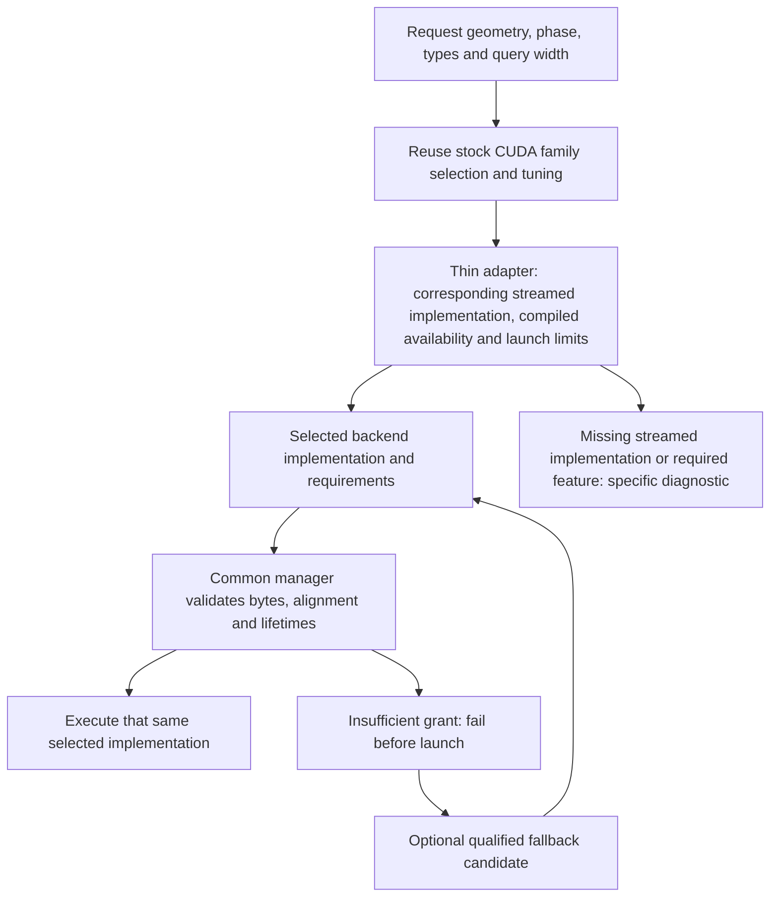

Extend existing private/versioned execution hooks only where necessary; do not introduce a parallel public execution framework. If the backend interface needs extension, retain explicit version checks and require full server/backend rebuilds before live qualification. Changing an interface is not permission to use stale server binaries against new libraries.

### Phase C1: thin stock-selection adapter without changing behavior

| Stage | Dependencies | Implementation boundary | Required TDD evidence |
| --- | --- | --- | --- |
| C1a | Completed M7 | Audit the existing stock selector and wrapper-only restrictions; define the minimal adapter metadata, selected-family/style description, requirements and unavailable reasons. First capture the existing modern dispatch, allocation and numerical baseline at `a0ddf8719`. | Host tests distinguish stock family selection from streamed-counterpart availability, hardware from compiled features, invalid metadata and missing pairs. Preserve current SM86/SM89/SM120 behavior; distinguish native output extras from external scratch. No new per-generation preference table. |
| C1b | C1a | Connect existing workspace queries and streamed launch dispatch to that stock-selected family through current private hooks. Keep kernel bodies, arithmetic, native entry points and stock tuning intact. | Size/launch agreement, exact-size and one-byte-short grants, stale shape/intent rejection, no unplanned allocation/fallback, and current TG1-TG4 stock comparisons. Full server rebuild and short live no-MTP/MTP/vision regression; no expected numerical or performance change. |

Checkpoint C1 is a behavior-preserving foundation, not newly advertised Pascal support. This checkpoint supplies the seam that the later comprehensive arena verifier will reuse.

#### C1a implementation and validation

Status: committed at `c24565acf`. Base is `a0ddf8719`; branch is `compat/various-arch-support-v2`.

- Added private host-only `ggml/src/ggml-cuda/kv-stream-attention-plan.h`. The constructor receives the stock-selected vector/tile/MMA family, native/spanned/resumable style, serial geometry, backend evidence and reported workspace requirements. It does not implement a CC preference table, probe a device, select another family, allocate memory or launch kernels. No production source includes it yet; C1b performs the runtime hookup.
- Dtype integers are range checked before GGML trait calls. Positive extents, grouped-head geometry, quant block divisibility, active/padded token consistency, alignment and output/scratch arithmetic are checked. Failures leave the previous descriptor unchanged. Kernel-specific live tensor, stride, mask and launch validation remains with the backend adapter; the descriptor is not proof that an arbitrary caller's supplied requirements are accurate.
- Native output-adjacent extras are distinct from separately allocated global scratch and per-block shared memory. Bounded spanned/resumable styles reject undeclared native output extras. Scratch byte counts remain exact rather than being rounded into an invented reserve; the allocator applies alignment later. Unknown requirements are rejected rather than treated as zero.
- Structured reasons distinguish invalid metadata, no stock family, missing native code, missing streamed code/pair, missing required device features, unsupported geometry/launch resources, missing or inconsistent requirements and arithmetic overflow. Hypothetical family/type support in host tests is supplied backend evidence, not a newly advertised hardware or quantization capability.
- TDD starts with `test-kv-stream-attention-plan.cpp` and its registered target failing because the contract header is absent; evidence is `/tmp/cuda-c1a-red.log` and `red-compile.log`. The implemented contract passes **9 tests / 535 assertions** in Release, CUDA-disabled ASan with leak checking, UBSan with halt-on-error, and CUDA-disabled TSan with process-local ASLR disabled (`setarch x86_64 -R`). No global ASLR setting is changed.
- Tests preserve the existing Q8/Q4 wrapper observations for SM86/SM89/SM120, including SM86 TG2 MMA and SM89/SM120 TG2 vector. Existing Pascal and unsupported-pair returns remain unchanged. Additional tests cover general native prefill query widths/head geometry, mixed quant metadata, unsupported backend evidence, invalid/removed type slots, zero/negative dimensions, invalid enum tags, overflow, snapshot ownership and native-vs-external workspace roles. The test is registered outside the Windows shared-library exclusion because it uses public GGML traits and no CUDA headers/runtime; Windows execution is not claimed.
- The focused Release regression selection passes **31 CTest targets**. The stock/native and existing streamed CUDA baseline on the SM120 RTX 5070 Ti, before adding this contract, passes **14 span tests / 559 assertions**, **6 allocation tests / 75 assertions**, and **1 short-prefill test / 52 assertions**. Existing kernel bodies and live dispatch are unchanged, so this stage introduces no production path overhead.
- Saved the existing Q8/Q4 span microbenchmark at 8K, 32K, 64K and approximately 128K histories, TG1/TG4, one/two/three spans. For example, at 131073 positions TG1 stock/three-span is 184.129/204.520 us; TG4 is 817.276/747.544 us. These are existing kernel-level reference timings, not new improvements, full-server throughput or performance evidence for other GPUs.

Artifacts are `/tmp/cuda-c1a-*`, including `baseline-spans.log`, `baseline-allocation.log`, `baseline-prefill.log`, `baseline-bench.log`, `final-test.log`, `regression.log` and each host sanitizer's configure/build/test logs. The production `llm-llmster` container was temporarily stopped only for baseline capture, then restored on its unchanged image/configuration and health checked. Unrelated benchmark files remain untouched. Only this stage's header, tests, registration and roadmap are staged; no assistant commit or push is made. C1b must build real backend evidence and connect sizing/dispatch to stock selection; C1a does not remove the Pascal guard or claim complete arena verification.

#### C1b implementation and validation

Status: committed at `7ed51795d`. Base is `c24565acf`; branch is `compat/various-arch-support-v2`.

- Added a thin stock-family adapter in `fattn.cu`; the existing `ggml_cuda_get_best_fattn_kernel` decision tree is unchanged. Native output-extra sizing and native dispatch can consume that selected family directly. Vector/tile/MMA arithmetic, conversion rules, launch tuning and reduction bodies are unchanged.
- Streamed sizing and dispatch use one internal description that carries the stock-selected family, validated metadata, caller-owned requirements and existing vector resume layout. No new architecture preference table is introduced. The old selector remains only a conservative admission gate until legacy qualification; Pascal and previously unqualified combinations are not newly enabled. Existing partial-export/merge operations remain a separate contract, not an ordinary stock attention dispatcher.
- A private registry query, `ggml_backend_cuda_kv_stream_attention_plan`, describes native or spanned/resumable workspace from operation/span metadata without reading tensor payloads or requiring a full physical KV allocation. It validates serial dimensions, grouped heads, output layout, logical span coverage, types, strides, masks and available compiled architecture before stock selection/resource probes. Live execution retains physical buffer-range and lease checks. Failed descriptions preserve the previous result.
- Shared-memory/occupancy probes used by planning return a failure rather than abort on unsupported resources. The MMA requirements query distinguishes geometry, device-feature and launch-resource failure. The checked C1a metadata/output arithmetic is reused before backend selection; no capability downgrade is inferred solely from a high CC or a function pointer.
- Requirement reporting distinguishes output-adjacent native extras, caller-owned global scratch and per-block shared memory. Streamed requirements report their complete caller-owned scratch and known shared usage. Native output sizing remains exact, while stock's separate backend-pool reduction temporaries and native shared usage are explicitly unknown through `backend_scratch_known`/`shared_bytes_known`; zero is not presented as a complete native-memory bound. Complete external/native inventory remains part of the later arena-verification work, not a false C1b guarantee.
- Native fallback admission now rejects a bounded-output declaration when stock requires output-adjacent conversion extras, and checks the whole output-plus-extras range against input regions. Backend-neutral resident/gather descriptors preserve the original execution-workspace hint instead of clearing it with arithmetic parameters. This closes an intra-parent overwrite path rather than silently using a larger native fallback inside a bounded declaration.
- TDD adds plan/sizing/launch agreement and a deliberate bounded-declaration canary regression before implementation. The original run fails **130 assertions**: the query is absent, native fallback succeeds despite the declaration, and conversion overwrites the canary. Final GPU tests pass **16 tests / 789 assertions**, including exact/one-byte-short TG1-TG4 scratch grants, unchanged outputs on rejected launches, metadata-only descriptions, stale query width and unsupported stride, native extras, known/unknown requirement flags and the canary. Existing GQA-six TG3/TG4 comparisons retain zero measured max error; TG2 retains the previous small unaligned-tail difference and aligned exact cases.
- The focused Release selection passes **34 CTest targets**. The host contract passes **9 tests / 535 assertions** under CUDA-disabled ASan with leak checking, UBSan, and process-local-ASLR-disabled TSan. These are host-contract checks, not GPU race proofs. GPU memcheck of all 16 CUDA tests exits normally with **ERROR SUMMARY: 0 errors**; handled API error reports are disabled while memory checking stays enabled.
- Full server/backend targets are rebuilt before live tests. Both no-MTP and MTP=3 eager/arena HTTP suites match all nine text/image/cache scenarios; the 64-token MTP run also passes chat, rejected drafts, cancellation, oversized-image recovery and subsequent text. A separate 39K-token, 128-decode-token MTP=3 run with a 1,024 MiB arena, 256/256 batches, 8 GiB test RAM cache and UVM disabled passes all cases and matches the retained pre-change `/tmp/vision-7.5c-stream-arena-mtp3/results.json` outputs. Production cache/checkpoint settings are not changed.
- Microbenchmarks retain the C1a 30-point TG1/TG4, 8K-approximately-128K, one/two/three-span reference. Concurrent compiler activity produced large timing outliers; quiet repetitions exposed a smaller short-context cost. Removing duplicated metadata validation within the same already-validated immutable launch preserves all checks and reduces that cost. The second final quiet repeat stays within approximately **1.3%** of the stored span baseline at all points; an isolated first-repeat 8K three-span outlier is not reproduced. At 131073 positions, final three-span TG1/TG4 is 205.536/749.605 us versus baseline 204.520/747.544 us. These are kernel measurements, not a new full-server performance sweep or evidence for SM61/SM75/SM86/SM89 hardware.

Artifacts are `/tmp/cuda-c1b-*`, especially `red.log`, `dedup-cuda.log`, `dedup-memcheck.log`, `dedup-bench1.log`, `dedup-bench2.log`, `accepted-ctest.log`, `vision-mtp3`, `vision-no-mtp`, `streaming-mtp3`, `dedup-http`, allocation/prefill checks and host sanitizer logs. The first integrated test fixture correctly could not create a resident node with its too-small resident partition; its final pool and generic four-KV-head stock reference are corrected without changing production policy. Temporary test servers are stopped and production is restored on its original image/configuration before handoff. Only C1b code, tests and roadmap were staged; unrelated benchmarks stayed untouched. No assistant commit or push was made. At C1b handoff the legacy toolkit was not installed and no older GPU support was advertised.

### Phase C2: legacy build and runtime prerequisites

| Stage | Dependencies | Implementation boundary | Required TDD evidence |
| --- | --- | --- | --- |
| C2a | C1 | Use existing CMake architecture/toolkit controls to document and qualify an isolated CUDA 12.9 SM61 build and accurate compiled-feature reporting. Add only missing guards/diagnostics; preserve modern CUDA 13 defaults. | Compile vector/tile/conversion/publication/copy sources for SM61; prove unavailable instruction families are guarded. Diagnose SM61 plus CUDA 13 explicitly. Check the supported host compiler and build options, including FA pair availability. Linux/Windows builds are recorded separately; unavailable jobs are not passes. |
| C2b | C2a | Audit existing allocation, pinned-host/DMA/events, retirement and eager scheduling without VMM, PDL, Tensor Cores or CUDA graph capture. Reuse valid stock fallbacks; do not rewrite these systems or re-enable Pascal capture without separate evidence. | Simulated missing-optional-feature tests, byte-boundary and lifetime tests, queue drain before reuse, and diagnostic distinctions between unsupported hardware, missing compiled kernels and insufficient resources. No missing optimization causes a false device rejection. |

Do not replace or downgrade the production driver/toolkit to perform this phase. Actual legacy hardware access is a qualification prerequisite, not a reason to stop development of host tests or the legacy build.

#### C2a implementation and validation

Status: committed at `86334e695`. Base is `7ed51795d`; branch is `compat/various-arch-support-v2`.

- Reused `CMAKE_CUDA_ARCHITECTURES`, toolkit discovery and existing stock feature guards. Added an early diagnostic for explicit pre-SM75 targets with CUDA 13: use CUDA 12.9 or earlier in a separate build directory, not a driver downgrade. Default/native/all target selection is unchanged; compiler-owned keywords and other invalid target strings remain the compiler's responsibility. No attention kernel, arithmetic, runtime admission, graph policy or architecture preference table changed.
- TDD first ran the host-only configuration fixture before the helper existed and observed failure. The final fixture passes 32 cases: bare, real and virtual legacy targets rejected by CUDA 13, the same targets allowed through to CUDA 12.9, mixed target lists and unchanged modern/default keywords. A fresh real CUDA 13.0.88 configure with explicit SM61 fails with the new actionable message before CUDA compiler identification. The same fixture is registered and passes in a CUDA-disabled CPU build.
- Added `test-cuda-compiled-features`, which copies the actual CUDA backend's post-normalization target list and build definitions. It checks device-pass feature guards and the stock host queries against 14 hypothetical device capabilities, without initializing a GPU. An SM61-only build reports `610`, slow FP16, no MMA and no `cp.async`, even for a hypothetical newer device. A CUDA 12.9 mixed-target probe (`61;75;86;89;120`, with stock's `120a` normalization) checks positive and negative gates and reports `610 750 860 890 1200`. A compiler without NVCC's architecture-list metadata explicitly skips this test; it is not recorded as a pass.
- Built an isolated SDK image from official `nvidia/cuda:12.9.1-devel-ubuntu24.04`, with NVCC 12.9.86, GCC 13.3, CMake 3.28.3 and Ninja. Source was mounted read-only, build output separately writable, network disabled for source compilation, and no GPU devices exposed. The complete Release `llama-server` and attention-plan test link with SM61 and `GGML_CUDA_FA_ALL_QUANTS=ON`; the library inventory contains 195 SM61 cubins. Vector/tile/conversion/SET_ROWS/publication/copy sources compile, while existing guards exclude unavailable instruction bodies. Full linking initially exposed the SDK-only driver's missing `libcuda.so.1` stub symlink; a build-local symlink and `-rpath-link` fixed the compile environment, not production or CUDA source.
- The final SM61 full-build profile passes all three focused CTest targets: toolkit/architecture configuration, compiled features and the C1 attention-plan contract. A separate SM61 backend build with `GGML_CUDA_FA_ALL_QUANTS=OFF` and its GPU-free feature/configuration tests also passes. Reduced FA-off/VMM-off/graphs-off options are separately exercised by the compile-only feature probe; this is not a full reduced-profile server or runtime qualification. Mixed Q8_0/Q4_0 direct vector compilation still requires `GGML_CUDA_FA_ALL_QUANTS=ON`.
- CUDA 13 SM120 full server rebuild succeeds, the new feature test reports `1200`, and all 33 selected memory/streaming host-contract CTest targets pass. No throughput or numerical claim is added by these compile/host-only tests; no kernel execution order changed. The production container remains running throughout and `/health` reports `ok` on its unchanged configuration.

Build instructions and the compile-only driver-stub workaround are in `docs/build.md`. Evidence is `/tmp/cuda-c2a-*`, including the initial red/green guard logs, actual CUDA-13/SM61 rejection, SDK-image build, full SM61 build/link qualification, final tests, reduced-pair backend build, optional-feature probe, mixed-target probe and modern/CPU regression logs; the SM61 cubin inventory is `build-cuda12.9-sm61/sm61-cubin-inventory.txt`. Only C2a implementation, tests and documentation are staged. No assistant commit or push is made; unrelated benchmark files remain untouched. No Windows/MSVC build or GTX 10-series hardware inference is available here, and the Pascal streamed admission guard is deliberately preserved. C2b's optional-feature runtime audit is next; C3/C4 still own legacy streamed vector/tile runtime enablement.

#### C2b implementation and validation

Status: committed at `8e8f77446`. Base is `86334e695`; branch is `compat/various-arch-support-v2`.

- Audited the fixed device-local parents, strict pinned/mapped host backing, copy streams, ready/final-consumer events, retirement hooks, ordinary launch wrapper and stock below-Volta capture policy. They do not impose VMM, Tensor Cores, PDL or captured-graph requirements on fundamental storage/DMA. Missing strict host pinning is a required-storage failure, not a performance option; pageable substitution remains rejected. `GGML_CUDA_GRAPH_OPT=1` remains intentionally excluded from the ownership adapter because its backend-wide experimental scheduling state is not owned by individual graph keys.
- Found a startup abort in optional VMM discovery: stock `CU_CHECK` was used for the capability and granularity queries. Added a small CUDA-local two-query helper, with callbacks only for host test injection. An absent/failed capability, failed granularity or zero granularity selects the existing ordinary pool without publishing a partial granularity. Native CUDA query failures warn with the actual driver code/message and name the `cudaMalloc` fallback. Fundamental device lookup and actual allocation errors retain their existing handling. HIP/MUSA probing is unchanged; no second hardware-selection framework, CC ladder, allocator or scheduling system is introduced.
- TDD first builds the new host fixture before its helper exists and records the expected failure. Final VMM-probe coverage passes **3 tests / 18 assertions**, including a failing query that writes a nonzero value, suppression of the second query when unsupported, and unchanged output on partial failure. CPU-only Debug and CUDA-disabled ASan/leak-check runs pass. Existing C1 plan tests retain separate missing stock code, missing streamed implementation, required-device-feature, geometry and launch-resource reasons; disabled optional acceleration is not substituted for one of those failures.
- Added `--cuda --queue-only` to the existing copy test. It skips attention execution but retains logical state, diagnostics, batched DMA, producer/final-consumer event ordering, queue drain, cancellation and pending destruction coverage. A new case retains exact host/device views after all caller references are dropped, rejects a V range extending one byte beyond the host view despite extra parent bytes, checks the last live token and zero padding, and verifies both device canaries. The ordinary allocation/host tests preserve impossible-allocation recovery, managed-vs-device-local identity, host registration ownership and strict no-pinning rejection.
- Built the complete server and selected tests with CUDA 12.9 SM61, `GGML_CUDA_NO_VMM=ON`, `GGML_CUDA_GRAPHS=OFF`, all FA quants and UVM disabled for GPU checks. The host profile passes its three focused targets. With the real driver exposed, **SM61 PTX forward-JIT on the RTX 5070 Ti** passes the eager scalar executor (**10 / 226**), device allocation/views/recovery (**10 / 1,055**), strict host mapping (**5 / 44**) and queue suite (**19 / 1,447** before final diagnostic warmup). PDL is left at its default for this forward-JIT process: the existing loaded-kernel target gate preserves ordinary launch behavior. This checks baseline code on newer hardware, not Pascal hardware or legacy attention admission.
- Built a separate CUDA 13 SM120 Release server with VMM/graphs disabled and ran with `GGML_CUDA_PDL=0`, without changing the production build defaults. All **7** selected CUDA configuration/feature/host/device CTest targets pass, including UVM compatibility for ordinary weights while device-local buffers remain device-local. Eager executor checks pass **10 / 226**; the full streamed-copy suite passes **26 / 3,277**, the KV capture-owner suite with no native capture passes **13 / 166**, and streamed attention/plan checks pass **16 / 789**, retaining their prior numerical qualifications. The ordinary modern VMM/capture-enabled build separately passes queue tests, captured retirement and runtime-disabled eager retirement; all **34** selected host contract CTest targets pass.
- The reduced-feature IQ4 real-server HTTP comparison uses an 8K context, 1,024 MiB arena, 256/256 batch sizes, Q8_0/Q4_0 target/draft KV, MTP=3 and no UVM. All nine text/image/cache scenarios match eager-stock token IDs, and chat, cancellation, oversized-image rejection/recovery and subsequent text checks pass. Production cache/checkpoint configuration is not changed. This is short correctness qualification, not a performance or maximum-arena sweep.
- Compute Sanitizer initially reports zero memory errors but an existing five-second readiness assertion times out while a consumer gate is closed; deadline feedback correctly reports that late transfer. Labeled assertions isolate the failure. Prewarming the diagnostic kernels through one ungated transfer/consume/drain cycle removes first-use instrumentation synchronization before the gate, without increasing the timeout or relaxing zero-miss expectations. Final ordinary and memcheck queue runs pass **19 tests / 1,460 assertions**, with **ERROR SUMMARY: 0 errors**. No production copy/sampling algorithm changes are made for instrumentation.
- A fresh unoptimized metadata-test build exposes another C2a test issue: unused static launch helpers retain unresolved private CUDA hook references. The GPU-free feature executable now supplies abort-only unreachable hooks and links the ordinary GGML base for assertion helpers; it still does not initialize a GPU or link the CUDA backend. A separate Debug build passes. Its output now states whether VMM, native graph caching and the kernel/environment-gated PDL wrapper were compiled.

Evidence is `/tmp/cuda-c2b-*`, including the initial red/green probe, CPU/ASan and 34-target host regressions, full SM61 and modern reduced-feature builds, forward-JIT GPU run, allocation/host/copy/executor/attention checks, initial/labeled/final memcheck logs, Debug metadata link regression and `/tmp/cuda-c2b-eager-http/results.json`. Earlier accepted results are preserved rather than rerun wholesale. Production was temporarily stopped only for GPU validation and restored on its original image/arguments after each test window; final `/health` is `ok`. Only C2b code, tests and documentation are staged, with no assistant commit/push. No actual Pascal, Windows/MSVC, AMD or other-generation hardware qualification is added; Pascal capture and streamed admission remain unchanged. C3a is the next stage after user commit.

### Phase C3: Pascal TG1/TG2 vector execution

| Stage | Dependencies | Implementation boundary | Required TDD evidence |
| --- | --- | --- | --- |
| C3a | C2 | Remove inappropriate streamed-wrapper restrictions for stock-selected quantized TG1 vector/resume execution on SM61. Reuse the existing vector body, per-thread accumulator state and final reduction. | All-resident, resident plus suffix, physical wraparound, partial page, multiple transfer waves, page boundaries, mask/tail handling and publication ordering. Same-device stock kernel comparison; declared resume requirements include every saved accumulator. |
| C3b | C3a | Admit and qualify the existing two-query vector/resume variant when stock selects it on SM61; retain modern TG2 choices. Only make kernel changes for demonstrated legacy incompatibilities. | Two-query causal masking, independent query outputs, rejection/catch-up boundaries, same stock split selection and numerical comparisons, stale plan rejection and bounded ring reuse. No TG2-to-two-TG1 substitution. |

Checkpoint C3 may describe qualified non-MTP TG1 compatibility, but must not advertise complete Pascal MTP support. TG3/TG4 and other stock tile-selected shapes remain explicitly unavailable until C4 passes. Avoid routing unsupported unquantized shapes into a vector family solely because a vector kernel can be compiled.

#### C3a implementation and validation

Status: committed at `f0b8ce2cb`. Base is `8e8f77446`; branch is `compat/various-arch-support-v2`. Actual Pascal hardware acceptance remains pending.

- Lowered the existing quantized TG1 wrapper gate from SM80 to the SM61/DP4A baseline. This is admission only: the C1 adapter still requires stock to select vector, and native/resumable pair availability, serial head-256 geometry, masks, physical spans and scratch checks remain mandatory. No stock decision tree, vector arithmetic, reduction, launch dimensions or kernel body is rewritten. Existing modern choices remain unchanged; stock tile-selected requests are not forced onto vector. The same corrected wrapper can admit stock-selected quantized TG1 on intervening generations, which remain separately hardware-unqualified.
- Resume sizing now uses the compiled architecture, not the newer physical GPU on which legacy PTX might run. Stock's below-Volta copy width is 8 bytes rather than 16. Consequently head-256 F16/BF16 values save 16 floats per thread instead of the modern 32; quantized values retain 8. The common bounded layout helper now accepts the existing kernel's valid 16-value representation, and launch validation reconstructs that same layout. Modern 8/32-value byte counts are unchanged. Failed plans preserve the previous result; no additional VRAM or new arithmetic precision is introduced.
- Fixed a backend-neutral TG1-only handoff gap: model construction already tries TG2 then TG1, while the session workspace query previously required TG2. Session reconstruction/phase transitions now apply the same fallback. This does not substitute two TG1 evaluations for TG2, enable speculative decoding on Pascal, or bypass later query-width launch checks.
- Moved absent native/resumable kernel rejection ahead of prototype row-size calculation. A newly added removed-type probe exits abnormally before this fix; after it, removed GGML type slots and missing pairs return failure without publishing a plan. Existing metadata-only family/requirement status distinctions are preserved.
- TDD records the missing packing helper compile failure, then actual red host tests for SM61 admission and the 16-value layout, followed by an SM61 GPU run rejecting the expected TG1 plans before implementation. Final host coverage preserves modern selector observations, rejects pre-SM61 and nonquantized legacy requests, keeps legacy TG2-TG4 closed, and checks exact 16-value offsets, invalid values and transactional failure. The focused host regression passes **36 CTest targets**; CUDA-disabled ASan/leak-check of the attention-plan and resume-layout fixtures passes.
- Added test-local CUDA metadata adapters to the existing vector-span fixture, with no production override or registry hook. `--cuda-pascal-tg1` requires an **SM61-only** binary, then synchronizes before temporarily setting that process's non-const host device-info CC to 610 and restoring it afterward. Mixed-target binaries are rejected because the driver could load a newer body than the simulated planner expects. The actual RTX 5070 Ti's SM/resource properties are not fabricated; this is forward-JIT/logic evidence, not Pascal occupancy, throughput or hardware qualification. Windows shared-library builds retain the existing exclusion for private-backend fixtures.
- The final SM61 CUDA 12.9 run on the RTX 5070 Ti passes **4 tests / 845 assertions** under memcheck, with **ERROR SUMMARY: 0 errors**. The matrix covers Q8_0/Q4_0, Q5_1/Q4_1, Q4_0/F16 and Q4_0/BF16, 24 query heads / 4 KV heads, two layers, 33/255/256/257/513/1024/1025/4097 live tokens, interior causal-mask holes and padded tails. A one-slot ring forces refill waves; a separate all-resident fixture supplies valid metadata for physically wrapped direct-span comparisons. Exact-size scratch, one-byte-short rejection, unchanged output on failure and both scratch canaries are checked. Resumed results show zero measured max error in this matrix; aligned cases also assert identical float bits. Direct-span tails retain stock-compatible small rounding differences, with worst observed absolute error **1.49e-8**. No tolerance is relaxed.
- The TG1-only model test confirms TG2 planning is rejected and its previous output is preserved, reports decode scratch equal to the TG1 plan, and moves decode/prefill/decode through the model's required abort/reset lifecycle with a 256-row prefill ceiling. Initial fixture mistakes called resident-only synchronization beyond its one-page capacity and attempted reuse after abort without reset; the final fixture respects those contracts instead of weakening production checks. SM61-compiled writer and producer/publication suites separately pass **10 / 609** and **10 / 588** under forward-JIT.
- Modern SM120 attention/span tests pass **17 / 1,603**, and the resume suite passes **11 / 328**. An older resume fixture mislabeled multi-query verification as prefill while reserving less than the mandatory strict-gather scratch; source inspection confirms that mismatch predates C3a. It now declares decode intent for TG1-TG4 and checks the existing TG1/TG2 resume launch counts, leaving prefill and production routing unchanged. An 8K IQ4, 1,024 MiB arena, 256/256, Q8_0/Q4_0, MTP=3 HTTP comparison matches eager-stock token IDs across all nine text/image/cache scenarios and passes chat, cancellation and oversized-image recovery checks. No performance or maximum-pool sweep is claimed.

Evidence is `/tmp/cuda-c3a-*`, especially host red/green and ASan logs, SM61 builds, simulated-CC red/qualified/final memcheck runs, removed-type red probe, modern span/resume regressions, forward-JIT publication and `/tmp/cuda-c3a-modern-http/results.json`. Production was temporarily stopped only for GPU tests and restored with its original image/arguments after each window; final `/health` is `ok`. Only C3a implementation, tests and documentation are staged, with no assistant commit/push. Actual SM61, Windows/MSVC and other-generation hardware validation remain pending. C3b owns legacy TG2; C4 owns tile/span integration and full legacy MTP functionality. C3b is next after user review/commit.

#### C3b implementation and validation

Status: committed at `3ec1b8841`. Base is `f0b8ce2cb`; branch is `compat/various-arch-support-v2`. Actual Pascal hardware acceptance remains pending.

- Extended the existing wrapper's quantized two-query gate only in the SM61-through-pre-Volta baseline range. Stock still chooses vector and must supply a compiled native/resumable pair with supported geometry and resources. SM75's previously unqualified TG2 MMA admission remains closed; SM86 Q8_0/Q4_0 still selects its existing MMA counterpart, and SM89/SM120 retain their vector choices. Unquantized legacy requests, TG3/TG4 and stock tile-selected shapes are not enabled. The production change is one admission condition; no kernel body, arithmetic, split calculation, launch dimensions or common memory API changes.
- TDD changes the host admission fixture first and observes **4 failing assertions**, then runs the SM61-only GPU fixture with host CC610 and observes the expected TG2 plan/replay rejection before the gate change. The existing two-query body is reused as one TG2 execution, not replaced by two TG1 evaluations. It keeps both query masks, maxima, sums and value accumulators separate, saves/restores their full state, and performs the stock final reduction once. For equal split counts its scratch is exactly twice TG1's; no additional weights, resident KV allocation or dedicated draft pool is added. The possible extra decode scratch was stated before implementation.
- Extended the existing fixture with `--cuda-pascal-tg2` and an ordinary-device `--cuda-tg2` control. The SM61-only/mixed-target safety check from C3a is preserved. Both widths share the same four-pair, 24/4-head, two-layer matrix at 33/255/256/257/513/1024/1025/4097 live tokens. Each TG2 mask has its own causal frontier and interior holes. The one-slot ring forces repeated reuse, while the separate resident control tests wrapped spans. Exact scratch, one-byte-short failure, unchanged output, both scratch canaries, independently different query outputs and exact two-query state/output byte accounting are checked.
- Stale TG1 span plans and resume plans are rejected against a TG2 operation without changing the previous size result or output. A separate page-boundary test changes the last token's canonical K/V and invalidates that suffix: the first query remains bit-identical, the second query changes, and both continue to match stock TG2. Restoring bytes, invalidating the rejected suffix, executing a TG1 catch-up at 256 tokens and replaying TG2 at 257 tokens reproduces the original result bit-for-bit. This qualifies KV suffix/catch-up ordering, not the future full Pascal MTP/recurrent rollback integration.
- Kept the C3a TG1-only session regression through a test-local, scoped registry adapter that masks TG2 planning while forwarding all other hooks and restoring the original interface before teardown. No production test override is added. An additional real-TG2 session test verifies that the model reserves the entire two-query decode plan, can use it for TG1, and restores strict-prefill scratch through the existing abort/reset lifecycle with a 256-row prefill ceiling.
- Final SM61 CUDA 12.9 forward-JIT and simulated CC610 validation on the RTX 5070 Ti passes **6 tests / 1,319 assertions** under memcheck, with **ERROR SUMMARY: 0 errors**. Resumed and replay cases show zero measured max error against stock in this matrix; aligned cases also require identical float bits. Direct wrapped/unaligned spans retain small existing rounding differences; the maximum observed absolute error across legacy and modern TG2 matrix checks is **9.31e-9**. No numerical tolerance is relaxed. The legacy TG1 regression separately passes **4 / 846**.
- Modern TG2 matrix/replay checks pass **4 / 1,291**, the full modern span suite passes **17 / 1,603**, and the resume suite passes **11 / 328**. The focused host regression passes **36 CTest targets**; the CUDA-disabled ASan/leak-check attention-plan and layout fixtures pass. A complete modern server rebuild precedes an 8K IQ4, 1,024 MiB arena, 256/256, Q8_0/Q4_0, MTP=3 HTTP comparison: all nine text/image/cache cases match eager-stock token IDs, and chat, cancellation and oversized-image recovery checks pass. No performance or maximum-arena claim is added by these short checks.

Evidence is `/tmp/cuda-c3b-*`, including host/GPU red logs, SM61/modern builds, matrix green and final memcheck, legacy TG1, modern TG2/span/resume checks, host/ASan regressions and `/tmp/cuda-c3b-modern-http/results.json`. Production is restored on its original image/arguments after each GPU window and final `/health` is `ok`; cache/checkpoint settings and unrelated benchmarks are untouched. Only C3b code, tests and documentation are staged, with no assistant commit/push. Actual Pascal, Windows/MSVC and intervening-generation hardware acceptance remains pending. C4a is next after user review/commit; tile-selected TG3/TG4 and complete legacy MTP still belong to C4.

### Phase C4: stock-compatible tile streaming baseline

This is the substantive new kernel implementation: a streamed counterpart for stock tile attention, not a replacement tile algorithm. First establish the unchanged stock arithmetic and tile-access contract, then introduce physical spans, then resumable execution. Keep native contiguous calls on their existing path and avoid broad stock-kernel refactoring.

| Stage | Dependencies | Implementation boundary | Required TDD evidence |
| --- | --- | --- | --- |
| C4a | C3 | Introduce the smallest reusable tile-access seam needed by the streamed variant. Reuse stock arithmetic and Pascal's FP32-oriented configuration; keep default contiguous access and native entry-point behavior unchanged. | Contiguous/all-resident TG1-TG4 where stock chooses tile, odd tails and supported masks/types. Compare outputs and intermediate precision with untouched stock on the same device. Check native performance/register use where a shared helper changes generated code; no new spans or resume scheduling in this step. |
| C4b | C4a | Read a complete logical layer through resident, ring suffix and optional wraparound spans. Convert encoded KV in bounded tile storage while reproducing stock conversion rounding. | One/two/three spans, boundaries inside/at tile edges, wraparound, unaligned logical tails, matching stock outputs, canaries around every grant and exact workspace reports. No full-context global F16 gather is introduced as a hidden decode allocation. |
| C4c | C4b | Save/restore stock tile accumulators at valid tile boundaries for multiple ring transfer waves, and perform the original final reduction once. | Splits crossing spans/refill waves, ordered tiles, masks and causal queries, resumed vs uninterrupted equivalence, slot reuse only after read completion, cancellation and partial-publication failures. Preserve native accumulator types/bit patterns during save/restore. |
| C4d | C4c | Integrate the qualified tile path into target verification, MTP catch-up/prediction and existing context dispatch. Keep prefill on its existing strict-gather/native path initially. | Real query widths 1-4 as applicable, draft lengths 1-3, rollback/replay, checkpoint and RAM cache restoration, serial requests and vision handoffs. Scope admission to supported geometry/pairs; missing conversions or larger fallback scratch cause an explicit pre-launch rejection. |

Unquantized and other supported KV pairs use the same geometry/access logic when their conversions and stock family are qualified. Q8/Q4 is the initial full-model qualification pair, not a separate allocation policy. Preserve existing modern pair support while older-device pairs are being qualified.

Checkpoint C4 establishes complete SM61 kernel functionality only after an actual SM61 run passes. Forced baseline execution on SM120 provides useful logic evidence but is not legacy-hardware qualification.

#### C4a implementation and validation

Status: committed at `386fee9dc`. Base is `3ec1b8841`; branch is `compat/various-arch-support-v2`. No span addressing or resume scheduling is enabled in this stage.

- Added `fattn-tile-access.cuh` with a native-path tag and an affine F16 row reader. Both tile loaders now have an optional compile-time reader and a three-argument custom-reader overload. The contract is `load<bytes>(destination_half2, row, half2_column, valid, zero_source)`; the existing lane distribution, copy width and FP16-to-FP32 conversion stay in the stock loader. Future encoded/span readers can fill the same bounded copy without implementing another attention algorithm. There are no virtual calls, runtime backend hooks or changes to public APIs, family selection, global kernel ABI, tiling configurations, KQ/VKQ order, softmax, reduction or native host dispatch.
- The default native specialization retains the original restricted pointer parameters, affine source expression and zero-array spelling. Custom readers alone explicitly initialize every zero-copy lane. An initial design routed native loads through a reader object: it passed modern outputs but changed legacy register usage and 32 long-context TG3/TG4 byte comparisons. The final design protects native statements behind the default compile-time tag, restoring the original resource records and every saved output rather than accepting drift or changing stock split selection.
- TDD first captures untouched C3b output files, native output-extra requirements, host-inclusive timings and compiler resource dumps with no tile source changes. A custom-reader test then fails compilation because no reader overload exists. After implementation its invalid-row cases expose an initialization/inlining problem in two half2-width-256 copies. The standalone stock zero spelling passes; custom-reader copies become deterministic with explicit per-lane zero initialization. Native zero handling and arithmetic remain unchanged, and no precision tolerance is relaxed.
- `test-cuda-tile-access` checks a counted custom reader that delegates actual copying to the affine reader. It covers packed F16 and converted FP32 tile intermediates, widths 40/64/256, seven destination rows, live row counts 0/1/5/7, strided input, leading/trailing canaries and untouched shared-tile padding. Inputs include signed zero, maximum finite half values and subnormals. It requires exact bits/rounding, exact valid-read counts, no invalid-row reads and zero-fill of absent rows. The final unit passes **2 tests / 193 assertions** on modern and SM61-compiled forward-JIT code; the legacy run under memcheck has **ERROR SUMMARY: 0 errors**. This qualifies the load boundary, not full-kernel accumulator snapshots or streamed execution.
- Added `test-kv-stream-tile --record/--compare <existing-directory> [--pascal]`. Native GGML allocation/conversion and the stock dispatcher are used, not a new forced tile implementation. Modern profiles exercise head sizes 40/72, F16/F16, BF16/F32 and F32/F16; the SM61 profile exercises heads 64/256 and adds Q8_0/Q4_0. Both use six query heads / two KV heads, TG1-TG4, 31/256/513/8192 stored rows, with and without causal masks containing interior holes. Missing masks and odd real storage extents exercise stock's no-GQA/out-of-bounds path; padded extents exercise applicable optimizations. Cases stock selects as vector are explicitly not tile passes, and comparison cannot silently discard a previously saved tile case.
- All **192 modern native tile cases** and **228 of 256 legacy cases selected as tile** match untouched output bytes exactly in repeated accepted comparison runs. The 28 remaining legacy cases are stock-vector selections, not tile qualification. Final modern/legacy comparison totals are **192 / 4,801** and **256 / 5,785**, including selection-stability assertions. Native stock KV-to-F16 conversions and output-adjacent extra sizes are unchanged. SM61 runs use the C3 test-only, single-process CC610 override with an SM61-only binary on the RTX 5070 Ti; its actual resources are not fabricated and actual Pascal acceptance remains pending.
- Compiler dumps show identical register, stack, shared/local and constant-memory resource records for all **310 tile symbols** in each modern/legacy profile. Initial mean per-case timing ratios against the saved baseline are approximately 1.006/1.008; a quiet repeat gives approximately **0.9997 modern / 1.0001 legacy**. The worst individual outliers change case between repeats. These are short, host-inclusive native operator timings with 16 measured repetitions, not a full-model throughput sweep or proof of an exact timing bound for every point. No stable overall regression or resource increase is observed; no speedup claim is made.
- The **36-target host contract regression** remains green, as do the existing modern span suite (**17 / 1,603**) and resume suite (**11 / 328**). The fully rebuilt modern server's 8K IQ4, 1,024 MiB arena, 256/256, Q8_0/Q4_0, MTP=3 HTTP comparison matches eager-stock token IDs in all nine text/image/cache scenarios and passes chat, cancellation and oversized-image recovery. No production memory budget, cache/checkpoint setting or backend-neutral ownership mechanism is changed.

Evidence is `/tmp/cuda-c4a-*`, including untouched snapshots in `/tmp/cuda-c4a-before-modern` and `/tmp/cuda-c4a-before-sm61`, resource dumps, reader compile-red/zero-fill diagnostics, rejected reader-object implementation logs, exact final comparisons/quiet repeats, unit memcheck and `/tmp/cuda-c4a-modern-http/results.json`. Earlier accepted evidence is retained. Production is restored on its original image/arguments after GPU windows and final `/health` is `ok`. Only C4a code/tests/docs are staged; no assistant commit/push is made, and unrelated benchmarks remain untouched. Windows/MSVC, HIP/MUSA and real Pascal hardware are unqualified; the shared header remains source-compatible with their existing native calls, but no build pass is inferred. C4b is next after user review/commit and will add bounded encoded/span access; C4c owns resume state and C4d the live integration.

#### C4b development ledger

Status: committed at `7b4d57390`. Base is `386fee9dc`; branch is `compat/various-arch-support-v2`. No live server dispatch or resumable waves are enabled in C4b; those remain C4d and C4c respectively. Actual Pascal hardware acceptance remains pending.

- Added a bounded, device-visible table for at most three ordered intervals. `ggml_cuda_fattn_tile_spans_make` translates existing span-plan views after checking supported types, geometry, exact logical coverage, alignment, buffer ranges and address overflow; failure preserves the previous output. The table borrows addresses and does not retain leases. The original plan/grants must remain alive through the read-completion fence.
- Typed readers support F16, BF16, F32, Q8_0, Q4_0, Q4_1, Q5_0 and Q5_1. They resolve token/head addresses and convert only the requested half2 fragment, reusing stock lane distribution and shared tile storage. Contiguous and strided Q4_0 conversion need separate expression-order/zero-sign policies; both are tested against the corresponding stock GPU converter. No global full-context F16 gather is allocated by the span variant.
- The existing tile kernel has an optional compile-time K/V reader. Native calls retain the original parameter list, pointer addressing and native arithmetic statements. The span specialization reads its device table through the K argument while keeping logical mask coordinates, tile order, split order and final stock reduction. A workspace helper reports the aligned table, stock split partials and metadata; for a fixed head/query/split geometry it has no context-length term. This is a primitive sizing helper, not live dispatch admission or a server-wide allocation guarantee.
- TDD first captures a compiler failure from the missing span-reader interface. Tests then expose the Q4_0 conversion distinction and compiler contraction changes in streamed arithmetic. Explicit half rescale/value-update rounding and sum-rescale FMA reproduce modern native results in the tested profiles. The modern complete-layer matrix covers 448 cases with TG1-TG4, heads 40/64/72/256, one/two/three spans, boundaries inside tiles, reversed physical placement, odd tails, masks and GQA groups 1/2/4/8. Conversion tests cover eight encodings and both F16/FP32 tile intermediates; every source grant and caller-owned output/scratch allocation has canary checks.
- Final cleanup evidence is `/tmp/cuda-c4b-final-modern.log`: **3 tests / 10,878 assertions**, with exact output comparisons in all 448 complete-layer cases. The 36-target host regression is green. Saved native output snapshots match all 192 modern and 228 tile-selected legacy cases; the full legacy selection matrix has 256 tests / 5,785 assertions and no failures. Normalized native resource records match all 310 saved symbols in each build. No caller-visible native allocation or family choice was changed.
- SM61-only CUDA 12.9 code runs through forward-JIT on the RTX 5070 Ti. Earlier strict evidence in `/tmp/cuda-c4b-final-legacy.log` preserves all **236 non-byte-identical comparisons** and their maximum absolute difference **7.45058e-09**. Traced scores, softmax weights, maxima and sums matched; per-update instrumentation changed generated arithmetic enough to make the traced case exact, so it was not treated as qualification of the ordinary kernel. Unsuccessful explicit FP32 arithmetic, non-inlined loaders, register barriers and identity operations were removed.
- The user approved accepting this rounding noise on **2026-10-05**. The final test policy allows only compiled CC610 outputs to satisfy both **maximum absolute error <= 1e-8** and **normalized L2 error <= 8 x FP32 epsilon** (approximately 9.537e-7). Other compiled architectures remain byte-exact. Conversion, signed-zero conversion handling, metadata and canaries are not relaxed. Nonfinite values, zero-reference/nonzero-output cases and shape mismatches fail. Policy TDD first observes one failing fixture under the old byte-only rule, then passes 14 positive/negative assertions with the scoped bound, including rejection of the same perturbation on CC600/860/1200 and independent absolute/relative-limit failures.
- Final approved runs `/tmp/cuda-c4b-approved-modern.log` and `/tmp/cuda-c4b-approved-legacy.log` each pass **4 tests / 11,204 assertions**. All **448 modern cases are byte-exact**; the legacy matrix has **236 nonexact cases**, maximum absolute error **7.4505806e-09** and maximum normalized L2 error **4.52464979e-08**, with byte-exact metadata. Legacy memcheck exits successfully with **ERROR SUMMARY: 0 errors**. The repeated 36-target host regression also passes. This is operator qualification for the tested geometry and inputs, not a universal bound on model logits or a guarantee of identical generated tokens for every prompt.
- Nsight inside the rootless SDK container encounters `ERR_NVGPUCTRPERM`; no counter trace is claimed. The driver's generated JIT code was instead recovered from a task-local CUDA cache under `/tmp/cuda-c4b-manual/jit-cache` and inspected read-only. No driver, kernel, package, production image/arguments or model/checkpoint cache configuration was changed. Production is restored after GPU windows. Diagnostic binaries and logs are retained under `/tmp/cuda-c4b-*`; temporary tracing hooks and unsuccessful arithmetic experiments are not kept in the source.

C4b code, tests and documentation are staged for user review; no assistant commit/push is made. Production is restored on the existing image/arguments and final `/health` is `ok`; unrelated benchmarks are untouched. C4c is next after user review/commit and owns resumable tile accumulators and transfer waves. Actual Pascal hardware, Windows/MSVC, HIP/MUSA and broader tile geometries remain unqualified.

#### C4c implementation and validation

Status: committed at `774d22244`. Base is `7b4d57390`; branch is `compat/various-arch-support-v2`. This adds private checkpoint/refill primitives, not live target/MTP/server dispatch; C4d owns that integration. Actual Pascal hardware acceptance remains pending.

- Reused the stock tile body with a compile-time resume reader. Native and ordinary C4b readers keep their original loop. The new variant retains global logical coordinates and cyclic split ownership across wave boundaries; a transfer boundary does not become a new attention split or a new out-of-bounds tail. The cursor uses 64-bit intermediate arithmetic to avoid overflow at large valid token counts. State restore follows the existing PDL dependency barrier.
- Checkpoint every thread's unreduced FP32 maxima/sums and native value accumulator representation before returning from a non-final wave. Half2 bytes remain half2 bytes; FP32 float2 bytes remain float2 bytes. Initialization defines every accumulator lane, including splits with no tile in the first wave. Query staging is rebuilt identically per wave. The original warp/cross-warp/split reductions and sink/output logic run only after the final wave.
- `fattn-tile-resume.h` reports bounded descriptor, state, split-output, metadata and private publication regions. For fixed launch geometry it has no context-sized KV plane. Four query heads, TG2 and three splits at head width 256 use 18 KiB of state on the modern 64-thread configuration and 60 KiB on the legacy 128-thread configuration; including partials and private final staging, their scratch is approximately 50.5 and 92.5 KiB respectively. Larger head/GQA/split configurations scale by the reported geometry. This scratch must be reserved explicitly by C4d; it is not a second KV pool or hidden global F16 gather.
- Extended the C4b bounded translator to exact logical subwindows, leaving the full-layer adapter as the full window. Resume admission checks geometry, global mask/query extents, tile boundaries, contiguous window coverage, stale/forged layout sizes, exact/one-byte-short scratch and scratch/source overlap. The source grants and workspace must remain alive through read completion. Format validation is not stock kernel selection: C4d must derive and verify the geometry and accumulator width against the selected compiled kernel.
- The host cursor reserves a wave without advancing committed progress, prevents overlapping submission or publication while a read is pending, and treats cancellation/discarded waves/failed publication as terminal for that cursor. Cancellation does not release an in-flight slot. `complete()` requires the caller to have confirmed retirement of every read; its failure flag represents discarded/failed work after that fence, not permission to reuse memory after an unsuccessful CUDA wait. No new backend-neutral memory manager or event ownership policy is introduced.
- Host TDD starts with a missing-interface compiler failure, then passes layout/window/cursor tests. A later negative test exposes an empty cursor incorrectly being publication-ready; invalid construction is now terminal. Final host fixture: **3 tests / 78 assertions**. Plain C++ inclusion also exposes and fixes C4b's missing self-contained initializer-list include.
- Device tests compare native, C4b complete-layer, single-wave resumable and multi-wave resumable execution. The original 448 C4b cases remain; **99 resume cases** cover TG1-TG4, heads 40/64/72/256, masks/causal queries and no-mask execution, odd tails, GQA 1/2/4/8, one/two/five-tile refill waves, splits crossing refill boundaries, reversed physical placement and source/output/scratch canaries. Only the current wave is copied into a reused bounded ring allocation. Non-final waves leave partial/reduction/public-output bytes untouched; source payloads remain byte-exact. First-wave state is poisoned beforehand to verify reset never consumes stale bytes.
- Real nonblocking CUDA streams are held behind a host callback that makes no CUDA calls. Tests observe `cudaErrorNotReady` and prohibit reuse, then cancel or inject a discarded-wave status only after the real read event retires. Publication failure is injected after private final reduction but before the public copy. Each failure leaves the public sentinel intact and replays correctly on the same scratch allocation, preserving stale state until reset and clearing only private publication regions. These are controlled status/failure injections, not a claim that a fatal CUDA/device error is recoverable.
- Final modern memcheck: **6 tests / 27,888 assertions**, all 547 attention cases and all 99 resumed results byte-exact with stock. Final SM61 forward-JIT memcheck: **6 tests / 33,964 assertions**, all 99 single-wave/multi-wave outputs and metadata byte-exact; 63 resumed results differ from stock within the unchanged C4b policy, maximum absolute error **7.4505806e-09** and normalized L2 error **4.06086624e-08**. Both memchecks report **ERROR SUMMARY: 0 errors**. No new numerical tolerance is introduced.
- **37 host contract targets** pass. The existing modern vector-span suite (**17 / 1,603**) and vector-resume suite (**11 / 328**) remain green. All 192 native modern snapshots and 228 tile-selected legacy snapshots still match untouched C3b bytes (legacy selection matrix **256 / 5,785**). Normalized resource records remain identical for all **310 native tile symbols** in both builds. No live pool budget, production image/arguments, model or checkpoint/cache configuration changes.

Evidence is `/tmp/cuda-c4c-*`, particularly host/compiler red logs, invalid-cursor red/green, first refill/fence runs, final memcheck logs and native resource/snapshot checks. Production was restored and `/health` was `ok`. The user committed C4c at `774d22244`; unrelated benchmarks were preserved. Actual Pascal hardware, Windows/MSVC, HIP/MUSA, broader tile geometries, live MTP/context lifecycle and full-model throughput were not qualified by this private-primitive checkpoint; C4d's live integration evidence follows below.

#### C4d implementation and validation

Status: committed at `40c2ce93d`. Base is `774d22244`; branch is `compat/various-arch-support-v2`. This connects the C4c primitives to existing target/MTP/session hooks. It is not actual Pascal hardware or Windows qualification, a new prefill algorithm, or complete startup arena-size verification.

- Added the private `kv-stream-tile` adapter and per-key generated instances for the existing registry's F16, BF16, Q4_0, Q4_1, Q5_0, Q5_1 and Q8_0 pairs. Mixed pairs require `GGML_CUDA_FA_ALL_QUANTS=ON`; otherwise only existing default matching pairs are compiled. Live scope remains head width 256, one sequence, masked TG1-TG4, canonical token-major KV, no sinks/bias/softcap. Unsupported geometry, missing pairs and insufficient grants are rejected before submitting attention. F32 and other geometries qualified by the C4b primitives are not newly advertised by this live adapter.
- Stock still selects vector, tile or MMA. The tile adapter matches stock's column grouping, compiled accumulator width, native occupancy-based split search and fixed global tile order. It checks that the streamed specialization can launch and reports its actual static shared memory. Its reader addresses encoded spans directly; descriptor, unreduced state, split partials/metadata and a private publication output all come from the caller's bounded scratch grant. No full-context F16 decode gather or new device allocation is hidden in this path.
- Registry version 10 extends the existing resume plan with backend-private configuration and a backend-neutral `resume_resident` property. The common session does not interpret CUDA geometry. A fully resident tile layer still uses this bounded path because native tile conversion extras may not exist beside the managed output. Modern optimized vector/MMA selection and strict native/gather prefill remain unchanged. Existing copy-engine read fences still control ring reuse; first-wave reset prevents failed/cancelled work from contaminating another attention evaluation.
- Version 10's `decode_workspace` reports the largest admitted TG1-TG4 grant, including the vector fast path's possible 128-token tail staging, before capture and phase transitions. Model/session owners cache this bound and preserve older version-9/TG1-only providers. Tile-capable target verification may use multiple refill waves instead of requiring the complete layer in the ring. Retained MTP catch-up/prediction uses its existing complete-layer grant and the same stock-selected span adapter; lease, tail-publication, truncation and rollback ownership are unchanged.
- Retained MTP spans stop at actual tokens, while stock sees a padded KV extent. The adapter keeps that padded launch/split extent, resolves only the retained physical rows and supplies zeros for absent padding under the caller's causal mask. Only the exact rounded terminal tail is admitted this way; internal holes, extra padding, non-tile wave boundaries and short/overlapping grants remain errors. Test-only prototypes must not use the all-resident view API when the logical context exceeds resident capacity.
- Scratch is bounded by launch geometry, not zero-cost. For this SM61 forward-JIT fixture's 24 query heads / 4 KV heads and 768-token capacity, reserving all supported widths needs approximately 4.96 MiB, more than the previous TG2-only bound. The native split search uses the actual device's SM count; this is not a footprint prediction for a GTX 10-series GPU. The bytes are explicitly budgeted and reused across layers, not multiplied by the model's attention-layer count.

TDD and accepted checks:

- Initial integration test failed because TG3/TG4 could not obtain a resume plan. The new `test-kv-stream-tile-dispatch --pascal` passes **5 tests / 586 assertions**: target TG1-TG4, all-resident and one-slot repeated ring refills at 513/4097 tokens, Q8/Q4, F16/F16 and Q5_1/Q4_1 representatives, unpadded retained MTP spans, exact/one-byte-short scratch, stale compiled/column/state/offset metadata, output/input aliases, and recovery after pre-launch rejection. Its SM61 stock comparisons retain max absolute <= 1e-8 and normalized L2 <= eight FP32 epsilons. CUDA memcheck reports **0 errors**. Modern registry/workspace checks pass **1 / 10**; host tile-window/cursor tests pass **4 / 88**. C4c's byte-exact refill qualification is not relaxed.
- Existing modern spans **17 / 1,603**, resume **11 / 328**, session **17 / 778**, and model/phase/MTP lifecycle **17 / 672** pass. The selected host contract matrix remains **37 / 37**. Legacy vector/TG1-only compatibility and expanded phase-workspace handoffs pass **6 / 1,321**; the TG1-only fixture deliberately models a version-9 provider rather than accidentally inheriting version 10's broader sizing callback.
- Real `UD-IQ4_XS`, Q8_0 K / Q4_0 V, SM61-only forward-JIT: streamed TG4 verification at 3,005 tokens matches stock logits exactly (**2 / 55**); target/MTP identity, TG1-TG4 catch-up, sequential prediction, acceptance/truncation and restoration pass (**2 / 246**), with measured stock-logit maximum error **0** for every reported width/prediction step. Resident/streamed checkpoint and prefill/decode device suspension/reconstruction pass **5 / 317**; restored first-batch/final logits have maximum error **0** and generated token IDs match. A red test assumed native graphs in the eager-only profile; the final test checks real compiled/environment graph availability and still asserts identical state/output and correct retirement.
- Untouched C3b native tile snapshots remain byte-exact: modern **192 / 4,801**, legacy **256 / 5,785** (228 tile-selected cases, 28 vector selections). The fully rebuilt modern server's 8K, 1,024 MiB arena, 256/256 IQ4/Q8/Q4 HTTP matrix passes separately for MTP draft lengths **1, 2 and 3**. All nine text/image/multiple-image/cache scenarios match stock token IDs at each matching draft length; chat, disconnect cancellation, oversized-image rejection and subsequent recovery pass. No claim is made that different draft lengths must match each other for every prompt.

Evidence is `/tmp/cuda-c4d-*`, including compiler/red tests, live dispatch memcheck, real-context logs, vector/workspace and eager-capture red/green checks, native snapshots and `/tmp/cuda-c4d-http-mtp-{1,2,3}/results.json`. Production is restored on its original image/arguments; final `/health` is `ok`. C4d code/tests/docs are staged without an assistant commit/push, and unrelated benchmarks remain untouched. C5 is next after user review/commit. Actual Pascal/Volta hardware, Windows/MSVC, HIP/MUSA, unsupported live geometries/pairs and generation-specific/full-context throughput remain unqualified; there is no new blanket support or performance claim.

### Phase C5: existing consumer-path qualification and regression protection

| Stage | Dependencies | Implementation boundary | Required TDD evidence |
| --- | --- | --- | --- |
| C5a | C4 | Audit and qualify existing SM75/SM86 vector/MMA wrappers against stock selection and launch limits. Preserve ordinary SM75 staging and the existing SM86 asynchronous pipeline; correct only demonstrated admission/compatibility gaps. | Compiled-feature and resource-limited fallback tests, same-device stock TG1-TG4 comparisons, full/streamed MTP cases and bounded scratch. Do not assume every tensor/quant pair has a compatible MMA implementation. Unsupported probes return a reason instead of aborting. |
| C5b | C5a | Verify that existing optimized SM89/SM120 paths remain selected and unchanged. Reuse test seams to force baseline/disable optional features, adding a narrow private seam only if necessary. Fix demonstrated regressions, not speculative per-generation tuning. | Fixed-budget A/B checks for standalone attention and live prefill/decode, no-ring/light/moderate/heavy streaming, and correct fallback requirement revalidation. Investigate reproducible modern regressions above 5% after controlling measurement noise; do not hide them with different pool sizes. |

Consumer tiers are feature/implementation selections, not five copies of the memory manager. Host-to-device DMA/prefetch overlap remains available in the baseline. `cp.async` improves global-to-shared movement inside the GPU, not PCIe bandwidth. Keep existing PDL use only where compiled and already qualified; new TMA, PDL scheduling changes, FP4 weight kernels and architecture-specific numerical shortcuts are outside this compatibility milestone.

The architecture optimization table discussed with the user is a map of stock features to preserve and qualify, not a mandate to implement new optimized kernels for every node. Existing stock tuning is the default source of truth; any additional performance project requires a separately named scope.

Do not force equal launch dimensions across generations: query actual SM resources and respect the stock family/configuration. Likewise, higher CC does not imply that every instruction used on a different GPU family exists on that device/build. No dedicated SM10.x work is added.

#### C5a implementation and validation

Status: committed at `081193bec`. Base is `40c2ce93d`; branch is `compat/various-arch-support-v2`. Actual SM75/SM86 hardware acceptance remains pending. This qualifies the existing kernel families and fixes demonstrated admission/resource gaps, not a new attention algorithm or generation-specific throughput project.

- The TG2 admission helper incorrectly required CC800 for the existing Q8_0/Q4_0 MMA path. Its baseline is now CC750, with stock selection and compiled-feature checks still authoritative. TG1 vector choices and other unsupported TG2 pairs remain unchanged; other KV pairs are not automatically declared compatible with the MMA span wrapper.
- MMA requirements and execution now resolve the same compiled streamed specialization. Preflight checks its static plus dynamic shared memory against the device's opt-in per-block limit, maximum threads, attribute setup and nonzero occupancy before descriptor upload or attention launch. Failed probes return `unsupported_launch_resources` and preserve the previous requirements/public output instead of reaching a late `CUDA_CHECK` on streamed-kernel attribute setup. Prototype padding, GQA-eligible strides and stock-family selection are also checked; nonpadded metadata sizing requests and unsupported pairs/geometries fail without silently selecting a different topology.
- Stock Stream-K block selection now queries the ordinary kernel with stock's ordinary shared-memory size. The streamed descriptor cache's extra shared bytes are reserved and validated separately. They may limit streamed occupancy, but must not redefine stock's block distribution or fixup arithmetic. A native fallback with F16 output-adjacent extras is still rejected for a managed output that declares bounded external scratch; rejection does not authorize a hidden gather or a larger unvalidated allocation.
- No vector/MMA kernel arithmetic, staging configuration, per-generation tuning, DMA policy or common memory ownership code changes. SM75 keeps ordinary global-to-shared staging; SM86 keeps stock's two-stage `cp.async` configuration. Metadata tests assert these facts in each compiled device pass and check the matching host configuration without initializing CUDA. The test target inherits backend CUDA compile options so its included device code is compiled consistently, including extended-lambda support; both Release and Debug metadata controls pass.
- The existing test-only CC override now supports strict single-target SM75/SM86 fixtures. Mixed-target or incompatible binaries skip rather than changing host metadata over different device code. Shared-memory-limit injection changes only process-local metadata, never driver settings. Actual SM count and launch resources remain those of the RTX 5070 Ti; these tests are not emulation of a smaller card's VRAM, occupancy or speed.

TDD and accepted evidence:

- The initial host test failed SM75 TG2 admission. The resource-limited GPU test failed five assertions because the old planner ignored a limit that could fit native shared storage but not the streamed descriptor cache. Both are green after the fixes. The resource test also checks transactional workspace reporting, unchanged public output, and rejection of an unvalidated native fallback; unsupported pair/GQA/padding probes preserve the caller's sentinel.
- Each CUDA 13 single-target SM75 and SM86 matrix passes **6 tests / 1,273 assertions**, including CUDA memcheck **0 errors**. It covers Q8/Q4 TG1-TG4 at 513/768/8191/8192 active tokens, GQA ratios 2/6/8, complete and physically wrapped prefix/suffix spans, exact/one-byte-short scratch and a context-capacity workspace bound. Four F16/F16 TG3/TG4 cases separately qualify ordinary/async staging and masked tails. All **76 MMA comparisons** per profile are byte-exact with stock. The unchanged optimized TG1 path distributes reductions across physical regions: six aligned complete-span cases are byte-exact, while the other 18 measure at most **7.45058e-9** absolute difference. The user accepted this measured scale and the new tests use a tighter **1e-8** regression guard, not the inherited fixed-span tests' 1e-7 limit. No claim is made of universal bit equality or that 1e-7 was a measured error.
- Real `UD-IQ4_XS` with Q8_0 K / Q4_0 V passes in both profiles: target/MTP identity, retained tail publication, TG1-TG4 catch-up, sequential predictions and truncation/restoration (**2 / 246**) report **zero stock-logit difference** at every measured width/step. The first MTP TG1 call includes a streamed suffix under the small prefill layout; the later all-resident decode layout and standalone wrapped TG2-TG4 matrices qualify the other placements. Streamed target TG4 at 3,005 tokens passes **2 / 55**, with **zero stock-logit difference**. Resident and streamed checkpoint/device-suspension recovery in prefill/decode passes **5 / 317** per profile: first-batch/final logits have **zero difference** and generated token IDs match. This is same-profile/same-device evidence, not cross-generation output equivalence.
- Existing modern span tests remain green (**17 / 1,603**). Host attention planning passes **12 / 603**, and the selected host regression matrix remains **37 / 37**. Compiled-feature/staging reports pass for both single-target builds and the normal SM120 Release/Debug metadata fixtures. Production is restored on its original image/arguments and `/health` is `ok`; checkpoint/cache configuration is not changed.

Artifacts are `/tmp/cuda-c5a-*`, including host/resource red and green logs, compiled-feature reports, tightened memcheck matrices, real MTP/target/resume logs and the final modern/host regressions. Build directories are `build-cuda-c5a-sm75`, `build-cuda-c5a-sm86` and the existing modern/Debug profiles, all using this same source checkout. C5a changes are staged for user review without an assistant commit/push; unrelated benchmarks are untouched. C5b is next after user review/commit. Actual Turing/Ampere hardware, Windows/MSVC, other live geometries/pairs and representative throughput qualification remain unqualified; those limits are not converted into passes by forward-JIT results.

#### C5b qualification resumed after shared-workspace hardening

Base is rebased C5a `e6beee78f`; branch remains `compat/various-arch-support-v2`. C5b is complete for user review, with the hardware limitations below. The original pre-C5a `40c2ce93d` SM120 and SM89 binaries are retained under `/tmp/cuda-c5b-before120-IPQJLA` and `/tmp/cuda-c5b-before89-NCUuS0` for standalone operator evidence; they lack the hardening fix and are not used for resumed live comparisons. The matched live baseline is rebased C4d `35bc9ea73`, built from this same source checkout in `build-cuda-c5b-before120-hardened`. Both live variants include `21ac0353c`. `LD_LIBRARY_PATH` and process-map checks isolate each binary's libraries; no second source worktree is created.

- Extended the single-target tests to SM89/SM120, retaining optimized TG1/TG2 vector and TG3/TG4 MMA selection, rather than routing modern requests onto tile. Both initial qualification matrices pass **6 / 1,285**. Unsupported `--cuda-sm...` names now fail rather than silently running only host tests. The corresponding compiled-feature reports pass; actual SM89 hardware remains unqualified.
- Two fixed-input SM120 standalone A/B runs cover TG1/TG4, one/two/three spans and 8K/32K/64K/128K plus a final-tail context. Median streamed operator timings differ approximately -0.7% to +1.93% versus the pre-C5a baseline; no >5% operator regression is observed. These are short, warmed, eager operator timings, not full-model throughput acceptance or a speed guarantee.
- The fixed-arena IQ4/Q8/Q4/MTP=3 8K live pilot fails during prefill at 7,424 tokens in both the baseline and current builds. This is not a C5a speed regression. Target compute occupies the first **79,978,752 bytes**, but the draft compute lease can occupy **84,172,928 bytes**. `pool_offset()` deliberately permits lending all bytes before the elastic KV pool, including attention and writer scratch. MTP prefill needs the attention scratch concurrently for its encoded KV gather. Native output/conversion storage therefore overlaps that live gather region; the existing CUDA range guard rejects input K before launching instead of permitting corruption. Temporary diagnostics established the range relation and were removed; the logs are retained under `/tmp/cuda-c5b-*-diagnostic-pilot`.

Named prerequisite **C5b.P1, serial compute-prefix capacity and live auxiliary-scratch separation**, is implemented and committed on V2 at `21ac0353c`, merged at `a44fc0e0c`. The compatibility rebase incorporates its disjoint graph/gather/writer grants, per-phase target/draft maxima, graph-binding revision tracking and fail-closed publication behavior. The original failed pilot is diagnostic history, not a performance sample. The matched A/B comparison now holds the hardening code, model, corpus, Q8/Q4 KV, 256/256 batch sizes, MTP=3, no-UVM mode, 2,240 MiB arena and 256 generated tokens constant. Representative planned contexts are 8K/96K/128K/160K; actual streaming/layout state must be recorded rather than assumed from the context label.

Accepted post-rebase qualification:

- Each single-target SM89/SM120 matrix passes **6 tests / 1,285 assertions**, including memcheck with **zero errors**. Stock selection remains vector for quantized TG1/TG2 and MMA for TG3/TG4. Aligned complete/wrapped TG2 vector cases and MMA cases require identical float bits; unaligned regional vector reductions retain the 1e-8 guard, with a measured maximum **7.45058e-9**. This extends coverage to an existing modern vector path; it does not change kernel arithmetic or promise byte equality for all vector partitions.
- Compiled-feature reports preserve the two-stage `cp.async` configuration for SM89 and SM120. The normal SM120 profile retains VMM/capture support; the eager SM89 build explicitly disables them, as in its retained operator baseline. SM89 execution and its scoped CC metadata override are on the RTX 5070 Ti, not actual Ada hardware. Unknown `--cuda-sm...` test names return 2 rather than silently passing host-only checks.
- Two SM89 standalone A/B runs compare 30 TG1/TG4, one/two/three-span cases at 8K/32K/64K/128K and a final tail. Median current/baseline timing changes range from **-0.51% to +2.29%**, with no >5% regression. The retained SM120 standalone evidence remains approximately **-0.7% to +1.93%**. These are warmed operator timings, not real older-GPU throughput claims.
- The rebuilt SM120 real-model borrowing/recovery/long-gather control passes **58 assertions** and preserves exact target logits/recurrent state. Host planning remains **12 / 603**. A complete server rebuild includes the implementation library, avoiding stale private API/ABI mixtures.

Matched live A/B: IQ4_XS, Q8_0/Q4_0 target/draft KV, MTP=3, 256/256 batches, matching context capacity, 2,240 MiB arena, UVM disabled, same repository article corpus, and 256 generated tokens. Baseline/current have the same hardening fix and compiler/toolkit; startup time is excluded. Each row is one sufficiently long measured pair; sub-percent changes are not claimed as improvements. No suspicious >5% regression required a repeat.

| Context capacity | Baseline prefill t/s | Current prefill t/s | Baseline decode t/s | Current decode t/s | Final resident pages/layer | Final ring slots |
| --- | --- | --- | --- | --- | --- | --- |
| 8,192 | 1,578.30 | 1,577.69 | 94.31 | 95.01 | 320 | 22 |
| 98,304 | 877.58 | 876.42 | 69.52 | 69.58 | 316 | 88 |
| 131,072 | 733.78 | 733.23 | 51.55 | 51.59 | 307 | 240 |
| 163,840 | 622.70 | 622.53 | 35.52 | 35.56 | 299 | 376 |

Every pair has identical **256 output token IDs**, prompt-token hash, MTP acceptance, actual decode KV pool and final partition layout. Prefill changes range **-0.14% to -0.03%**; decode changes **+0.08% to +0.75%**. The 8K run is all-resident despite reserved ring capacity; 96K/128K/160K have 383/511/639 active pages and actual streaming. These distinguish no/light/moderate/heavy ring pressure without increasing the pool to hide a regression. Actual SM89 hardware, Pascal/Volta/Turing/Ampere hardware, Windows/MSVC and other configurations remain unqualified; C6 still owns consolidated live acceptance and diagnostics.

Artifacts are `/tmp/cuda-c5b-hardened-*`, including numerical/feature reports, the SM89 operator pairs, `/tmp/cuda-c5b-hardened-live-sm120/context-*/repeat-0/{before,after}/results.jsonl`, logs and retained output IDs. The existing sweep performs requests; the temporary private A/B driver only selects its binary and retains outputs/library-map checks. No benchmark corpus, checkpoint/cache, arena policy or CUDA arithmetic changes are added in C5b. Production is restored on its original image/configuration. Only C5b tests and this roadmap are staged for user review; unrelated benchmark files and both saved C5b stashes are retained, and no assistant commit/push is made. The original compatibility head is recoverable as `backup/compat-before-hardening-20261006`.

### Phase C6: end-to-end acceptance and handoff

| Stage | Dependencies | Implementation boundary | Required TDD evidence |
| --- | --- | --- | --- |
| C6a | C5 | Qualify the full supported serial configuration and failures using the existing kernel, context, sweep and vision harnesses. Extend those harnesses only where required; retain accepted partial evidence. | Text/MTP/vision, native capacity plus sufficiently populated streamed histories, mutable tails, partition changes, cached short prefill, cancellation/error recovery, missing kernel/build features and under-sized grants. Distinguish host RAM, arena and external driver failures. Verify no-UVM physical-budget runs separately from UVM compatibility. |
| C6b | C6a | Record the hardware/build/support matrix, numerical and representative performance results, invocation guidance and remaining limits. Prepare the requirements handoff to the later arena-verification target. | Actual SM61/SM75/SM86/SM89/SM120 evidence or explicit unqualified entries. Modern optimized paths retain their prior behavior and throughput. The user reviews staged code/docs and creates commits/checkpoints; production is restored with its original configuration after each GPU test window. |

#### C6a implementation and consolidated qualification

Committed at `89e3d48fe`, based on `c04f4f41a`; branch is `compat/various-arch-support-v2`. Qualification uses actual SM120 and explicitly labeled forward-JIT evidence. It is not a blanket actual-device acceptance for Pascal/Volta/Turing/Ampere/Ada or Windows. C5's accepted numerical/operator and fixed-budget 256-token live measurements are retained rather than repeated as a full sweep.

**Startup admission and failure categories**

- A private streamed implementation could advertise Q8/Q4 support while the native prefill kernel was absent, as in the community `a0ddf8719` build using `GGML_CUDA_FA_QUANTS` instead of this fork's `GGML_CUDA_FA_ALL_QUANTS=ON`. Model construction now builds metadata-only native FA prototypes and queries the existing backend `supports_op` for every reachable query width from 1 through `min(max_batch_rows, context_tokens)`. Prototypes use the strict-gather 256-token padding and validate shape/stride arithmetic. No new backend interface, CC ladder, kernel, allocation policy or inference-time query is introduced.
- The optional `unavailable_queries` result distinguishes the first rejected native width from allocation/binding failures. The cache constructor reports K/V types, width, geometry/backend support and the CUDA all-quants build option before accepting an unusable context. Invalid metadata still rejects safely. This admission checks native backend support, not every possible live tensor stride or future CUDA driver allocation.
- Shared-arena failures identify an insufficient graph minimum or a phase/resource whose combined minima cannot fit the quota. Other layout failures remain separately labeled. Host KV allocation/registration, auxiliary-host storage, device-grant allocation/binding and host metadata allocation have distinct logs; actual CUDA allocator/driver diagnostics remain authoritative below them. This is categorical diagnostic hardening, not the later precise all-scenario arena verifier or an estimate of additional bytes needed.
- TDD first records **30 failed assertions** when missing native widths still allocated/constructed. Adding intermediate-width failures records **12 more failures** against sparse width probing; admission now checks all reachable widths. The final native suite passes **3 tests / 324 assertions**, including no physical KV allocations on missing code, padded metadata, reachable-width coverage and allocation failures not mislabeled as missing kernels. The real `FA_ALL_QUANTS=OFF` build passes **1 / 5**: mixed Q8/Q4 rejects without allocation, while Q8/Q8 remains usable. Its actual IQ4 server exits at startup with the actionable native-attention error, rather than becoming healthy and failing warmup. A real one-MiB arena exits with `requested=1048576`, `compute minimum=79978752` and the arena-quota category.

**Text, MTP, vision and cache lifecycle**

- The current modern model suite passes **26 tests / 3,063 assertions** under CUDA memcheck with **zero errors**. It includes producer publication, mutable tails, replan/recovery, minimum budgets, lease reuse and detach, host identity and phase changes. Streamed target TG4 at 3,005 tokens passes **55 assertions**, with zero maximum logit difference from stock. Resident/streamed checkpoint, device suspension and prefill/decode reconstruction pass **317 assertions**, with zero first-batch/final logit errors and identical continuations.
- The existing short HTTP harness runs IQ4_XS, 8K context, a 1,024 MiB arena, 256/256, matching Q8/Q4 target/draft KV and MTP=3. All **nine** text/image/uncached/cached/follow-up/changed-image/multiple-image/adjacent-image/restored-prompt outputs match the eager same-binary control for 64 tokens each. Only the eager control enables UVM when needed for its separate allocations; this is numerical/lifecycle qualification, not a matched-memory performance comparison. Chat, disconnect cancellation, oversized-image rejection and subsequent text recovery pass. All six unsupported startup configurations are rejected for their expected configuration reason, not an unrelated OOM.
- Native capacity uses **262,144 context**, **2,240 MiB arena**, UVM disabled and a 98,304-token synthetic text background. The initial image prompt processes **98,379 tokens**, confirms actual streaming (385 active pages), and finishes 64-token generation. The uncached replay reproduces its token IDs; the cached image repeat uses native **four-token prefill**, follow-up uses 11, and changed/restored images use short 256-token prefill. Multiple/adjacent-image cases, chat, disconnect cancellation and a clean next request pass. Vision logs show returned grants (`borrowed_after=0`, `suspended_after=0`) and the restored decode KV pool. This tests populated history at native capacity, not a full 262K prompt or an eager long-context speed comparison.
- Added explicit test-harness `--arena-uvm`, independent of `--stock-uvm`. The shared parent remains device-local; managed model weights are the intended compatibility path. Its test was red before environment handling existed. All **nine 64-token arena outputs** match the UVM-disabled arena run exactly, with cancellation/recovery intact. Host launch tests pass **6 / 6** and the existing measurement-parser tests pass. This does not claim driver eviction behavior on older cards.
- The isolated CUDA 12.9 SM61-only eager build links the complete updated server, then runs on the RTX 5070 Ti through forward-JIT. Native startup probing passes; embedded target/MTP identity, TG1-TG4 catch-up, sequential prediction and restoration pass **246 assertions**, with zero measured stock-logit errors. This is a code-path check on newer hardware, not a P40/V100 run. Earlier SM75/SM86/SM89 code-path evidence retains its explicit hardware limits.

Artifacts are `/tmp/cuda-c6a-*`, including native/intermediate red and green tests, reduced-feature build/startup logs, small-arena red/green diagnostics, model memcheck, target/resume controls, `/tmp/cuda-c6a-modern-http/results.json`, `/tmp/cuda-c6a-native-context-http/results.json`, `/tmp/cuda-c6a-uvm-http/results.json`, isolated SDK build/SM61 logs and host sanitizer/harness tests. CPU context/workspace/transition suites pass ASan and UBSan. Memcheck excludes handled CUDA API-error reports while retaining memory checking and its nonzero error exit code. Production is restored on its original image/configuration; no model/cache, driver, boot, container deployment or numerical-tolerance change is made. Only C6a implementation, tests/harness and this roadmap are staged; unrelated benchmark files are preserved. C6b still owns the public build/hardware/support documentation and the subsequent arena-verification handoff.

No mandatory full-context sweep after every tiny change. Start with targeted failing tests and short live regressions. Use representative all-resident/light/moderate/heavy ring contexts and at least 256 generated tokens for final live throughput comparisons; repeat suspicious regressions rather than repeating already accepted points. Hold model, prompt, execution mode, context, b/ub, UVM and memory budget constant for A/B. Label maximum-allocatable-arena sweeps separately.

#### C6b documentation and hardware handoff

Base is committed C6a `89e3d48fe`. This checkpoint changes documentation only; it adds no kernels, allocation/dispatch policy, tolerance or production configuration. The [README](README.md#cuda-compatibility-and-qualification) now states the actual serial IQ4_XS/Q8/Q4 text/MTP/vision scope and corrects its obsolete vision-plus-MTP warning. [Build instructions](docs/build.md#adaptive-kv-cuda-qualification-and-startup-errors) provide real-device commands, toolkit/all-quants prerequisites and failure categories. The [HTTP harness instructions](tools/server/tests/README.md#adaptive-kv-vision-qualification) distinguish native capacity from populated history and independent eager/arena UVM controls.

| Target | Toolkit/build evidence | Runtime evidence | Remaining acceptance |
| --- | --- | --- | --- |
| SM61 | Isolated CUDA 12.9.1, NVCC 12.9.86, GCC 13.3; complete server and eager/no-VMM profile | Vector/tile, native admission and real target/MTP/recovery through forward-JIT on SM120 | Actual GTX 10-series/P40; Windows/MSVC; device-specific resources and throughput |
| SM70 | Stock-selected legacy family; no dedicated SM70 runtime qualification | None claimed for this target | Actual V100 and dedicated build/runtime checks |
| SM75 | CUDA 13.0.88/GCC 13.3 single-target build; graph/VMM-disabled profile | Vector/MMA, target/MTP and recovery through forward-JIT on SM120 | Actual Turing resources, inference and throughput |
| SM86 | Same toolchain/profile; existing asynchronous tile pipeline retained | Same classes of checks through forward-JIT on SM120 | Actual Ampere resources, inference and throughput |
| SM89 | CUDA 13 single-target eager profile | Vector/MMA and standalone operator comparisons through forward-JIT on SM120 | Actual Ada resources, inference and throughput |
| SM120 | CUDA 13 optimized vector/MMA, normal VMM/capture and reduced-feature profiles | Actual RTX 5070 Ti: C5b fixed-budget throughput and C6a text/MTP/vision/cache/recovery qualification | Other cards, operating systems, models/geometries and untested configurations |

No extra runtime evidence is implied by publishing the table. In particular, the community's old P40/V100 failures precede this compatibility work and are not passes for it. Compiled target/selector checks, actual-device numerical/lifecycle checks and throughput measurements are separate gates. Modern operator changes remain within the retained approximately -0.7% to +2.29% range across the recorded profiles. The four matched SM120 live pairs above show no material regression; sub-percent throughput changes are not improvements. Regional vector cases retain the measured 7.45058e-9 maximum/1e-8 guard, accepted SM61 tile bounds are unchanged, and the qualified MMA cases remain byte-exact.

Public reproduction uses the existing feature, model and real-context fixtures, plus the HTTP harness, with no CC metadata override on a real device. Real IQ4 fixtures still require enough memory for their weights; the native admission fixture provides a model-free check. Collect the commit, actual card, toolkit/compiler, architecture list, build options, full command, skips/failures and numerical result before promoting an older-device entry. A successful inference run alone does not qualify all widths, recovery or capacity boundaries. Rebuild the complete server/library set together; old private ABI mixtures are not acceptable controls.

C6b validation: the existing host-only launch tests pass **6 / 6**, and measurement-parser tests pass **5 / 5**. Harness/sweep help and the rebuilt server help confirm the documented options; all four named build targets exist in the current build. The GPU-independent compiled-feature report passes. All **nine** added relative links/anchors resolve and `git diff --check` is clean. No inference benchmark or older-device run is repeated for this documentation-only stage; C5b/C6a evidence remains the runtime record. Production health is `ok` without stopping or redeploying it. Only the four documentation files are staged for user review.

#### Handoff: precise arena-size verification (next target, not implemented)

The compatibility work exposes the selected attention family and its scratch requirements and rejects absent native prefill widths. The next target should consume those existing requirements rather than introduce a parallel CC selector or a second allocator. The existing C6a startup errors are categorical checks; they do not yet prove every phase fits or report the exact additional bytes needed.

**Inputs and sources of truth**

- Freeze the model and projector metadata, device/backend/build features, context capacity, independent K/V types, b/ub, MTP configuration and allowed image/token limits. A configured maximum is not the same as a currently populated history.
- Use `llama_compute_workspace_plan_make` and scheduler graph measurements for compute workspace; `llama_kv_stream_model::memory_requirements` for pool/writer/attention minima; and `llama_context_memory::serial_workspace_target` plus `llama_memory_layout_elastic` for serial target/draft and per-phase fit.
- Use the stock-selected streamed attention requirements for resume/conversion/descriptor/output/fixup storage. If a resource-dependent fallback changes the requirements, validate that fallback before launch. A capability error must not become an unmeasured allocation path.
- Use `mtmd_batch_measure_vision_phase` for the actual image batch's projector-weight, device-compute and host-compute requirements. Where an input limit does not provide a proven worst-case geometry, admission must measure that batch before suspending text or modifying its history. Reject or revalidate inputs outside the admitted envelope.

**Accounting boundary**

| Charged to the shared device parent | Outside that parent; track separately |
| --- | --- |
| Phase compute workspace, resident/ring KV pool, KV writer, attention gather/conversion/resume scratch, shared target/draft compute, temporary vision weight/compute grants and alignment gaps | Target/MTP weights, persistent recurrent allocations and any rollback staging not borrowed from the parent, CUDA context/native graph/BLAS/driver allocations, pinned KV/rollback/checkpoints, RAM prompt cache, CPU image preprocessing/embeddings and other host memory |

Compute workspace means allocator-backed graph buffers, not CUDA driver's executable objects. Serial alternatives can share bytes, but concurrently live graph output, gather input, writer, pending transfer and retained lease resources cannot be aliased. Use the existing ownership/lifetime rules to derive maxima and sums; do not blindly add every phase or assume every phase can share everything.

**Required verifier behavior and TDD gate**

1. Build a checked, aligned allocation plan for initial reservation, target prefill, target verification, MTP catch-up/drafting, TG1-TG4 decode, vision borrowing and text/cache restoration. Account for complete-layer MTP admission and mutable tails as well as the target's multi-wave ring. Validate every enabled path and fallback, including cached short prefill widths.
2. For a rejected parent quota, name the phase and live components, their minimum sizes and padding, the configured budget, the exact minimum and additional bytes required. Distinguish that quota rejection from unavailable code/geometry, pinned/system RAM failures and external device/driver OOM.
3. An accepted plan must not expand hidden in-parent storage during an admitted request. Preserve generation checks, outstanding lease/fence pins, graph invalidation and fail-closed transition behavior. A preflight rejection must leave the previous usable text/cache state intact.
4. Test exact-fit and one-byte-short grants, arithmetic overflow, each supported quant pair and query shape, resource-limited fallback, prefill/decode/vision/MTP transitions, changed images, short cached prefills, cancellation and failure/recovery. Reuse the existing host fixtures, sanitizer suites and real CUDA model/HTTP controls; label unavailable hardware rather than treating skips as passes.

The user's desired no-mid-run-crash guarantee requires a defined scope. A proof for the shared parent cannot guarantee all process allocations or another process's VRAM usage. External driver/native-graph allocations need separate measurement/reservation or probing and recoverable failure handling; image and host-memory limits must also be explicit. Report the in-parent guarantee separately from remaining external risk rather than promising that a startup pass makes every later OOM impossible. C6b records this requirement; it does not claim to implement the verifier or start a new workstream.

### Post-C6: copy-resource error propagation and startup admission

The NVFP4 Quality-v2 MTP=3 auto-max sweep exposed a real late-allocation failure at 40 Ki context and a 1,072 MiB arena. A temporary CUDART tracer recorded `cudaStreamCreateWithFlags` returning `cudaErrorMemoryAllocation` and writing `0xffffffffffffffff` into its output. The copy queue adopted that failed output; constructor rollback called `cudaStreamSynchronize` on it and aborted with `invalid resource handle`, masking the OOM. These logs are not evidence of an attention arithmetic failure or a wrong encoded-page size.

- CUDA creation now writes into a temporary handle and transfers ownership only on success. Initialization logs preserve the operation, original status and numeric code before rollback. Queue/feedback partial-construction paths release only successful resources; host allocation and non-OOM CUDA failures remain distinct. Fully initialized queues still retire direct backend tensor users before releasing backing.
- Private copy-ops version 11 adds backend-neutral `prepare`, `free_prepared` and `create_prepared` hooks. A prepared bank owns transport streams, producer/ready/consumed events, bounded feedback storage/readback events and preloaded feedback kernels, but no KV views or arena leases. The model reserves capacity against its configured byte budget, and revalidates a larger finalized shared parent while unbound. Sessions retain the opaque owner through prefill/decode and image suspension/reconstruction.
- Serial candidate views borrow the same bank without creating new driver resources. An existing queue keeps exclusive ownership until retirement, including pending feedback readback; an idle candidate cannot overwrite its counters. Unsupported capacity or unprepared feedback rejects instead of silently allocating a fallback. Older providers retain their existing path and do not gain this admission guarantee merely from common code changes.
- This is actual allocation/retention at startup, not an arbitrary safety reserve or a guessed stream-memory formula. It prevents the observed late stream/event-creation OOM class. Native CUDA executable caches, unrelated backend allocations, host memory and other programs still require the broader verifier and recoverable error handling. No claim is made that all runtime OOMs are impossible.

TDD evidence is under `/tmp/kv-copy-init-debug-sZAeIm`: the initial null-output suite failed **23 assertions**, and a poisoned-output case reproduced the abort. New prepared-resource tests failed before version 11 was implemented. Creation/feedback failures, retry, preserved non-OOM errors, model-startup failure, serial replacement, capacity rejection and owner/borrower lifetime pass **8 tests / 263 assertions**; CUDA memcheck reports **zero errors and zero leaked bytes**. Existing model **26 / 3,063**, session **17 / 778**, resident **16 / 435**, block **20 / 656,887**, producer **10 / 588** and copy **26 / 3,290** suites pass. The selected CUDA-disabled consumers also rebuild and pass their applicable host checks; tests without CPU cases are not counted as backend acceptance.

Transition qualification found the test reading asynchronous output and host KV too early: it sometimes read its untouched `-77` sentinel. The checker now waits for each GPU output and compares host oracles only after the full append publishes. Legacy and prepared variants each pass **6 / 131**, with the original tolerance unchanged. The 40 Ki/1,072 MiB repro now completes **256 tokens at 77.36 t/s**; its stock-style output and acceptance match the previously fitting point. The IQ4 image/MTP HTTP harness matches all nine **64-token** outputs with eager control and passes cancellation, recovery and unsupported-startup checks. A warm footprint probe measured approximately **2 MiB** for 2,640/5,514-slot banks, with **42,320/88,304 bytes** of explicit device feedback storage; the first cold two-slot preparation measured **6 MiB**, including lazy loading. These samples are diagnostic deltas, not fixed cross-device costs.

The interrupted sweep and its **22 accepted measurements** remain untouched. Production is restored with its original image/configuration; this local source fix is staged for user review, not committed, pushed or deployed automatically. The broad sweep stays paused until the user resumes it.

### Acceptance gates and limitations

- Required consumer families: SM61, SM75, SM86, SM89 and SM120. A host selector test, successful build, forced baseline run or another family passing is not an actual-device pass.
- Q8_0/Q4_0 TG1-TG4 uses the appropriate stock-compatible family. Target/MTP numerical tests compare the same inputs and execution modes on the same hardware; cross-generation bit identity is not promised.
- Each selected implementation provides requirements sufficient for its real execution, including resume state, conversion, descriptors, output extras and final fixups. Insufficient storage is rejected before launching or mutating inference state.
- All-resident operation, multi-wave streaming, MTP rejection replay and vision/text/MTP lending remain correct. Optional acceleration can be absent without disabling fundamental storage or streaming functionality.
- Preserve serial scope, all-layer GPU placement and existing model/geometry admission. Do not quietly add parallelism, multi-GPU splitting, AMD support or new model/quant support claims.
- No global machine/driver/kernel changes, production deployment, automatic commits or pushes are part of this plan. Stage completed units and their evidence for user review; update this section after each completed unit. If kernel scope expands or numerical gates cannot be met, record a named extension and obtain direction instead of silently relaxing acceptance.

### Dependencies and immediate next step

`M7 -> C1 -> C2 -> C3 -> C4 -> C5 -> C6 -> arena-size verification`

The CUDA implementation sequence began with **C1a**, not removal of the Pascal guard or a rewrite of stock dispatch. C6b closes its documentation/handoff on the existing branch; the next implementation target is arena-size verification, after the user reviews this checkpoint and agrees its detailed stages. No new branch/checkpoint or verifier implementation is created by this documentation stage.

Implementation status: C1a-C6a are committed and rebased onto hardened V2, with C6a at `89e3d48fe`. C6b documentation/support matrix and arena-verification handoff are ready for user review. Implementation and available-machine checks are complete for this workstream; the actual older-hardware acceptance gate is not. SM61/SM75/SM86/SM89 forward-JIT checks on newer hardware are not older-GPU runtime qualification, and SM70 has no dedicated runtime qualification. Actual older-device access, or community testers who can run the provided fixtures, must be arranged before those devices are advertised as supported. Synthetic attention tests avoid requiring the production IQ4 weights to fit a smaller card; full-model limits are documented separately.

## Subsequent work, outside milestones 4-8

- Concurrent request execution and overlapping stages.
- Multi-GPU streaming and per-device capacity coordination.
- Other MTP/speculative execution layouts beyond the qualified serial embedded Qwen mode.
- General model-weight or MoE-expert eviction policies.
- Optimized streaming engines for ROCm, SYCL, Vulkan, OpenCL, and other accelerators.

The contracts should permit these additions without claiming they are implemented.

## Checkpoint meaning

| Milestone | Completed capability |
| --- | --- |
| 3 | Allocation and lifetime infrastructure |
| 4 | Safe execution-stage coordination |
| 5 | Fixed-budget adaptive KV streaming |
| 6 | Text prefill/decode reclamation |
| 7 | Separate vision/text sharing, reloadable projector storage, and current embedded MTP coexistence |
| 8 | Encoder-free integration and consolidated validation |

## Progress ledger

Record substage completion here only after the required validation succeeds. Expand the grouped planned rows as work proceeds; keep each completed substage's actual commit and evidence. Milestone 4 is checkpointed. Substages 5.1a and 5.1b are committed; 5.2a is committed at `4717474c3`. Stage 5.2b is committed at `0e3d5a0c0`. Stage 5.3a is committed at `7bfc17ac3`. Stage 5.3b is committed at `15d47eb72`. Stage 5.4a is committed at `ff4d3bdef`. Stage 5.3c is committed at `6c724dee1`, with its baseline/comparison recorded below. Stage 5.4b is committed at `6db00070d`. Stage 5.4c is committed at `28e7999a0`. Stage 5.4d is committed at `59591b6da`. Stage 5.4e is committed at `a92107200`. Stage 5.4f is committed at `d48a1faa8`. Stage 5.4g is committed at `f069590ef`. Stage 5.4h is committed at `5887c18a0`. Stage 5.4i is committed at `6f98b1276`. Stage 5.4j is committed at `17b92d321`. Follow-ups 5.4j.1-5.4j.4 are ready for review as one combined user commit.

| Stage | Status | Commit | Validation / limitations |
| --- | --- | --- | --- |
| Milestone 3 | Complete | 78e002404 | Original A/B evidence at 79e25c139 under benchmarks/server-ab/results/; prerequisite Meta ownership and view-factory exception fixes tested separately. |
| 4.1a | Complete | f78fba604 | 16 cases / 231 assertions; all five selected suites pass in debug, ASan/leak-checking, and UBSan after integration onto 9c6d4b06f. |
| 4.1b | Complete | 8a31bd381 | 16 cases / 259 assertions; all six selected memory suites pass in debug, ASan/leak-checking, and UBSan. |
| 4.2a | Complete | 0ed96420c | 18 cases / 276 assertions; all seven selected memory suites pass in debug, ASan/leak-checking, and UBSan. |
| 4.2b | Complete | 0949a7605 | Layout suite: 32 cases / 2,170 assertions, including 144 small configurations; all seven selected suites pass in debug, ASan/leak-checking, and UBSan. |
| 4.3a | Complete | 14ec534b6 | 19 cases / 809 assertions; all eight focused memory suites pass in debug, ASan/leak-checking, and UBSan. |
| 4.3b | Complete | 9a7fe0a69 | 16 cases / 232 assertions using real CPU arenas and fake execution; all ten selected suites pass in debug, ASan/leak-checking, and UBSan. |
| 4.3c | Complete | 722371ce9 | 18 cases / 514 assertions with real CPU arenas and fake execution; all eleven focused suites pass in debug, ASan/leak-checking, and UBSan. Recovery needs explicit consumer support; otherwise the session remains invalid and closed. |
| 4.4a | Complete | ac1436010 | 16 cases / 176 assertions using real CPU leases and fake execution; all nine selected suites pass in debug, ASan/leak-checking, and UBSan. |
| 4.4b | Complete | 079417191 | Native CUDA: 10 cases / 226 assertions, capture enabled and disabled; Compute Sanitizer: zero errors/leaks. Twelve focused suites pass in debug CPU/CUDA and CPU ASan/UBSan. Experimental GGML_CUDA_GRAPH_OPT=1 is explicitly rejected. |
| 4.5a | Complete | 6a2917143 | Workspace consumer: 16 cases / 390 assertions using real CPU schedulers and arena leases; all thirteen focused suites pass in debug, ASan/leak-checking, and UBSan. No production wiring or phase reclamation yet. |
| 4.5b | Complete | 2b3b27bc8 | Serial CPU/single-CUDA contexts use coordinated ownership; other configurations retain legacy arenas. Four CPU owner cases / 352 assertions, five CUDA cases / 376 assertions; fourteen focused suites pass in debug and CPU ASan/UBSan. Numerical/lifecycle compatibility passes on available CPU/CUDA/OpenCL/SYCL/Vulkan/Meta paths; HTTP CPU/CUDA smoke and paired dispatch-overhead checks pass. |
| Milestone 4 | Complete within declared scope | 2b3b27bc8 | Checkpoint branch created after the user committed 4.5b. |
| 5.1a | Complete | `fe2189418` | 18 cases / 1,205 assertions; 15 focused suites and existing CPU model regressions pass in debug, ASan/leak-checking, and UBSan. Reference production call paths audited; no streaming runtime is enabled. |
| 5.1b | Complete | `74b400abb` | 20 policy cases / 139,866 assertions; 16 focused suites and existing CPU model regressions pass in debug, ASan/leak-checking, and UBSan. Pure production-derived layout/adaptation policy; no streaming runtime enabled. |
| 5.2a | Complete | `4717474c3` | 10 CUDA cases / 1,055 assertions per UVM mode; actual device pointer attributes and zero memcheck errors/leaks. 18 CUDA-build and 16 CPU debug/ASan/UBSan suites pass; virtual-device identity and native capture checks pass. Opt-in factory only. |
| 5.2b | Complete | `0e3d5a0c0` | 15 CPU cases / 3,097 assertions; 16 real-CUDA cases / 3,108 assertions per UVM mode; virtual-device rejection passes. 17 focused suites pass in CPU/CUDA Debug and CPU ASan/UBSan; CUDA memcheck reports zero errors/leaks. Binding adapter only. |
| 5.3a | Complete | `7bfc17ac3` | 8 CPU owner cases / 386 assertions; 9 real-CUDA owner cases / 394 assertions; 5 CUDA pinning cases / 44 assertions. 18 CPU Debug/ASan/UBSan and 22 CUDA-build suites pass; memcheck has zero errors/leaks. Native Windows behavior preserved but not hardware-qualified. |
| 5.3b | Complete | `15d47eb72` | 14 CPU cases / 150,480 assertions; 15 real-CUDA cases / 150,503 assertions. 19 focused suites pass in CPU/CUDA Debug and CPU ASan/UBSan; CUDA memcheck is clean with UVM off/on. Synchronized byte-coherence baseline only. |
| 5.3c | Complete | `6c724dee1` | 10 CPU cases / 607 assertions; 10 CUDA cases / 609 assertions. 21 focused suites pass in CPU/CUDA Debug and CPU ASan/UBSan; CUDA memcheck clean with UVM off/on. Frozen producer baseline and post-change timings recorded; no server integration. |
| 5.4a | Complete | `ff4d3bdef` | 12 CPU cases / 131 assertions; 13 CUDA cases / 245 assertions, including mixed K/V and 257-query prefill. 20 focused suites pass in CPU/CUDA Debug and CPU ASan/UBSan; CUDA memcheck clean with UVM off/on. Ordinary all-resident test adapter; production unchanged. |
| 5.4b | Complete | `6db00070d` | 13 cases / 48,614 assertions; 22 focused CPU/CUDA Debug and CPU ASan/UBSan suites pass. Ordinary GGML attention comparison, CUDA metadata ABI check, and existing GPU regressions pass. Common format/CPU reference only; no new partial GPU kernel. |
| 5.4c | Complete | `28e7999a0` | 8 real-CUDA cases / 126 assertions; ordered resident-plus-one-block export and GPU merge, exact leased scratch, masked/dirty tails, malformed-payload atomicity, and UVM-off/on memcheck. 23 focused CPU/CUDA Debug and CPU ASan/UBSan suites pass. |
| 5.4d | Complete | `59591b6da` | 14 real-CUDA cases / 542 assertions; multi-wave ring reuse, concentrated/zero-resident layouts, incremental GPU folding, and late-block failure recovery. 23 focused suites pass in CPU/CUDA Debug and CPU ASan/UBSan; UVM-off/on memcheck clean. Merge-only racecheck clean; inherited vector-kernel warnings recorded below. |
| 5.4e | Complete | `a92107200` | 81 writable K/V pairs via selected native/fallback paths, plus all 81 forced through bounded F16 fallback; 19 CUDA cases / 656,795 assertions. Exact conversion bounds/values, capability admission, and native/fallback comparisons. 23 focused suites pass in four configurations; GPU memcheck and reduced-build probes recorded below. |
| 5.4f | Complete | `d48a1faa8` | Opt-in within-layer copy overlap; 8 CUDA cases / 1,565 assertions, all 81 pairs bitwise match ordered execution. Producer/consumer gates, cancellation, retained backing and host replacement pass. 24 focused Debug/CUDA-build/ASan/UBSan suites and GPU memcheck pass; targeted host-state TSan passes, broader TSan caveat below. Synthetic latency comparison retained. |
| 5.4g | Complete | `f069590ef` | Contiguous native attention and two-copy K/V batches; 12 CUDA cases / 2,290 assertions. All 81 pairs, arbitrary span ceilings, wrap boundaries, batch-wide event fences and failure recovery pass. 24 focused suites and GPU memcheck pass; targeted host TSan passes. Native latency gains and fallback tradeoffs recorded below. |
| 5.4h | Committed | 5887c18a0 | Bounded cross-layer FIFO reservations and explicit tail publication; 11 CUDA cases / 2,395 assertions. All 81 pairs, more-than-three-layer lookahead, out-of-order readiness, concentrated placement and cancellation pass. 25 focused suites, UVM-off/on memcheck and targeted host TSan pass. Mixed latency results and producer-integration limits recorded below. |
| 5.4i | Committed | 6f98b1276 | Bounded query launches inside each K/V span; 20 CUDA block cases / 656,887 assertions and 15 CUDA copy cases / 2,826 assertions. 25 focused suites pass in CPU/CUDA Debug, ASan and UBSan; UVM-off/on memcheck and targeted host TSan pass. Single-launch baseline preserved within measurement noise; wider-launch overhead and limitations documented below. |
| 5.4j | Committed | 17b92d321 | Opt-in GPU deadline probes, bounded sampled copy timing, process-unique feedback epochs, read-only policy proposals, and measured span trials. CUDA copy 18 cases / 2,978 assertions; runtime prefetch 12 / 2,803. Four 25-suite host matrices, targeted TSan, UVM-off/on copy memcheck and runtime memcheck pass. Default latency within about 1%; instrumentation costs 6-9% in the synthetic check. |
| 5.4j.1 | Committed | 5ee09b7e1 | One first-upload timing sample and two additional timing events per execution; every deadline probe retained. CUDA copy 19 cases / 3,075 assertions, runtime prefetch 12 / 2,803, four 25-suite host matrices and GPU memory checks pass. Instrumented latency improved 2.3-4.1% in the first pass; repeat results and residual overhead are recorded below. |
| 5.4j.2 | Committed | 5ee09b7e1 | Two bounded deferred counter snapshots, run identity, nonblocking polling, and no measurement-only wait. User requested one combined commit for 5.4j.1-5.4j.4. |
| 5.4j.3 | Committed | 5ee09b7e1 | Explicit decode intent/query count and immutable-history eligibility; unknown phase, prefill, one-token prompts, and producer-constrained tails do not train prefetch feedback. |
| 5.4j.4 | Committed | 5ee09b7e1 | One marker/probe per eligible upload batch, with safe partial consumption and first-slot reuse. Full bundle: four 25-suite matrices, CUDA copy 23 / 3,211, runtime-prefetch 14 / 3,048, targeted TSan and CUDA memory checks pass. |
| 5.4k | Committed | 6879fe81a | KV-aware resident replay over the existing CUDA executor; retained native roots and leases, fixed metadata admission, streamed-epoch invalidation, and active-capture rejection. 13 CUDA cases / 166 assertions; four 26-suite matrices, graph-disabled checks, targeted host TSan and UVM-off/on CUDA memcheck pass. Scope and measured guard cost below. |
| 5.5a | Committed | b72bcc9e6 | Opt-in text/server integration plus stock-equivalent prefill and bounded resumable native decode for eligible CUDA quantized paths. See the detailed substages and numerical follow-up below. |
| 5.5a.1-5.5a.4 | Committed | b72bcc9e6 | Producer workspace, session ownership, graph bridge, public gates, real-model qualification and resumable-decode extension were reviewed as one combined commit. |
| 5.5b | Committed | 10ec8902d | Host snapshot restore, dense-frontier validation, suffix truncation for recurrent checkpoints, malformed-state retry and serial cancellation recovery. |
| 5.5c | Committed | 123e76b44 | Matched Release fixed-pool sweep; PDL-safe asynchronous resumed spans, coalesced resident drains and layout-change-only H2D diagnostics. Remaining producer/prefill costs are explicitly recorded. |
| 5.6a | Committed | eff245203 | Common paired publication tickets and ordered reserved/device/host/committed frontiers; 10 cases / 133 assertions passed in Debug, ASan, UBSan, and a CUDA-enabled build. Seven focused existing regressions passed. |
| 5.6b | Committed | 04917421f | Synchronous adapter and session migration; publication 11/147, CUDA session 6/286, CUDA model 3/54, seven focused Debug suites, ASan, UBSan, and CUDA memcheck passed. Two-point Release performance remained within 0.6% of 5.5c with identical memory. |
| 5.6c | Committed | a53e3bf81 | Generic event-backed completion with synchronous fallback and tracked waiter teardown; fake/CPU 10/85 passed Debug, ASan, and UBSan, real CUDA 11/91 passed memcheck, and five focused regressions passed. |
| 5.6d | Committed | 9f2fe3aff | Completion-backed K/V pair bridge and synchronous session adapter; publication 16/199 CPU and 17/207 CUDA, session 6/286, model 3/54, ASan/UBSan, two CUDA memchecks, and eight focused regressions pass. Release performance and memory remain within noise of 5.6b. |
| 5.6e | Committed | d57288807 | Real CUDA completion-backed producer, direct pinned-host generation, resident-tail D2D, running-window producer fences and immutable per-tile plans. Focused CUDA, repeated session stress, ASan/UBSan, memcheck, exact Q3/IQ4 model equivalence and matched Release points pass. |
| 5.6f | Committed | dbd47c686 | One common executable passes exact aliased-view ordering and mixed-failure tests on CPU and OpenCL fallback, native SYCL and Vulkan events, and composed Meta fallback. CPU leak checking and CPU/Vulkan ASan/UBSan pass; the separately identified Vulkan driver/libdbus teardown leak remains external. |
| 5.7 | Deferred | - | Non-gating graph-segmentation follow-up after 6.3c establishes the final phase-transition graph lifecycle. |
| 5.8 | Deferred | - | Non-gating strict-prefill follow-up after 6.3c establishes shared-budget behavior. |
| 5.9 | Deferred | - | Final fixed/shared-budget support documentation follows 6.5c qualification. |
| 6.1a | Committed | 37b8ec387 | Phase-preserving aligned workspace requirements, exact per-stage consumer grants, zero-size detach/return, and conservative live allocation. CPU Debug, ASan/leak, and UBSan focused suites pass. |
| 6.1b | Committed | f1db07796 | Exact device-local shared-parent accounting; external device/host and managed-allocation reporting; alias validation; explicit transition peaks; opaque-residual reconciliation. Debug, ASan/leak, UBSan, CUDA-enabled compile, and broader regressions pass. |
| 6.2a | Committed | 546fdf67b | Growth-only rebind to a disjoint external device lease; current-frontier policy replan, monotonic KV revision, preserved host/publication state, lazy host reload, CUDA numerical validation, and memcheck pass. |
| 6.2b | Committed | 18dfa8f4d | Shrink/rebind to the minimum feasible pool, with old-work drain, concentrated layout/ring remap, dirty replacement mirrors, and preserved logical cache state. |
| 6.2c | Committed | 51444315c | Common transition-consumer lifecycle releases the old pool before same-parent commit, reconstructs from host KV, restores prior policy metadata after failures, and poisons terminal recovery failures. |
| 6.3a | Committed | 4b576eec7 | Explicit logical-batch text phase, repeated-notification no-op, serial return to prefill, speculative rejection, and one immutable phase across all ubatches. Debug, ASan/leak, UBSan, CUDA-enabled compile, and broader regressions pass. |
| 6.3b | Committed | 4bf33a5e3 | One physical device-local parent holds fixed compute, KV pool, writer, and maximum attention grants; private-to-shared handoff preserves host KV and scheduler rebuilds. |
| 6.3c | Committed | 7ad14ee86 | Prefill-to-decode transition shrinks compute and attention grants into a larger decode KV pool under the same parent; execution is retired and recaptured once per real phase change. |
| 6.4a | Committed | 5eb1088d2 | Populated-cache decode-to-prefill shrink, lazy resident reload, repeated alternation, and cleared short/long serial requests are qualified against stock execution. |
| 6.4b | Committed | 73a30439c | Prompt reuse, whole-cache restoration, cancellation at both phase boundaries, recoverable coordinator interruption, retry, and explicit terminal invalidation are qualified. |
| 6.5a | Ready for review (combined) | - | Exact shared-device parent API/CLI, phase-arena compatibility alias, legacy fixed-pool preservation, and order-independent conflict rejection. |
| 6.5b | Ready for review (combined) | - | Exact minimum KV bootstrap, all-phase startup validation, next-granule rejection, and phase-safe maximum-budget execution probing. |
| 6.5c | Ready for review (combined) | - | Parseable grant/transition/residency/copy diagnostics plus full-model numerical, memory, and representative phase-arena performance qualification. |
| 7.1a | Committed | dfed912b5 | Actual-batch mtmd workspace measurement, bounded borrowed execution, native-capture retirement and lease release. Its numerical fixture is corrected and requalified in 7.1b. |
| 7.1b | Committed | 09f566915 | Retained host embedding views, checked token slices, atomic result publication, cancellation cleanup and compatible/incompatible batch controls. CPU ownership and real CUDA lifetime/equivalence tests pass. |
| 7.2a | Committed | 9295ce06c | Backend-neutral ordered text/image session plan and ordinary mtmd baseline adapter. Initial/follow-up IQ4_XS logits and 16 continuation tokens match the legacy helper; failed images stop later prefill. |
| 7.2b prerequisite | Committed | a9c1f74cb | Pre-existing short-prefill dispatch bug isolated and fixed at the 7.2a checkpoint before restoring the ongoing embedding/position work. |
| 7.2b | Committed | 02d9f199c | Adaptive embedding admission separates dense physical KV rows from repeated/gapped M-RoPE positions; resident/ring image controls, checkpoint/suffix handling and numerical/memory regressions pass. |
| 7.2c | Committed | f47e08d3b | Multiple serial scheduler children, exclusive submission/reentry gates, bounded vision borrowing, and capture/copy retirement; CPU/CUDA three-consumer and live shared-image controls pass. |
| 7.3a | Committed | 74fc83338 | Zero-grant KV/graph suspension preserves the session, host frontiers and recurrent state while rejecting paused execution; resident/ring and auxiliary-cache qualifications pass. |
| 7.3b | Committed | 2b3432c74 | Fresh phase grants, reconstructed mirrors, gated graph reservation and unchanged host/recurrent state; resumed prefill/decode comparisons, warm-capture retirement and memory checks pass. |
| 7.3c | Committed | cace79b9b | Full-parent suspended-KV vision borrowing, exclusive restoration admission, interruption/retry and terminal recovery; real image equivalence and CPU/CUDA memory checks pass. |
| 7.4a | Committed | 0092cef1e | Separate file source, stable tensor metadata and shared eager weight bindings; original CPU/CUDA embedding equivalence, shared-owner teardown and memory checks pass. |
| 7.4b | Committed | d2d996604 | Explicit pinned weight unload/reload, native retirement, generation-safe rebinding and retry; CPU/CUDA equivalence, borrowed-workspace return and memory checks pass. |
| 7.4c | Committed | `b6b9b38e0` | Deferred projector startup, bounded weight/compute loans, phase cleanup/recovery and outside-budget accounting; combined image/text and lifetime qualifications pass. |
| 7.5a | Committed | `1c7d40879` | Serial no-MTP server admission, deferred projector startup, bounded image encoding, media/prompt-cache reuse and request cleanup qualified. |
| 7.5b | Committed | `b17fabc1a` | Repeated image-request memory sampling, phase/reload diagnostics, variable workspace accounting and no-MTP documentation qualified. |
| 7.5c | Complete | 143b3fd05 | Image-aware embedded MTP, physical/M-RoPE cache addressing, native short-prefill allocation contract, serial suspension and full M7 acceptance qualified on CUDA; merged at a0ddf8719. |
| 8.1a-8.5 | Planned | - | Real adapter 8.2b conditional; otherwise explicitly deferred. |

## Substage 4.1a implementation and validation

Implemented on 2026-09-10 in `src/llama-memory-requirements.h/.cpp`, with `tests/test-memory-requirements.cpp` registered through CMake.

- Internal declarations identify session-local placement domains and resources, exact allocation classes, content preservation/reconstruction policies, and per-stage capacities/access/capability requirements.
- The validator is read-only and makes no allocation or backend calls. It checks declaration structure before returning unsupported allocation/capability results, with the relevant domain/resource IDs.
- A resource can remain live with access NONE. These are declaration tests, not a claim that cross-stage byte preservation or GPU synchronization is implemented.
- Allocation classes are exact requirements, not preferences: managed storage does not satisfy a device-local request.
- Zero-byte declarations are allowed, but they do not create zero-byte arena regions. Planner capacity, stage dependencies, execution lifetimes, and actual hardware capabilities are outside 4.1a.
- Existing inference dispatch and allocation are unchanged. No production container or GPU configuration was changed.

TDD evidence: the new test compiled against a placeholder that returned success, then failed 91 assertions. After implementing validation, all 16 cases and 231 assertions passed.

| Configuration | Result |
| --- | --- |
| Existing debug CPU build | New contract test plus allocator, buffer, arena, and Meta tests: 5/5 pass. |
| ASan with leak detection | New contract test plus allocator, buffer, arena, and Meta tests: 5/5 pass on the fixed baseline. |
| UBSan with halt-on-error | New contract test plus allocator, buffer, arena, and Meta tests: 5/5 pass. |
| Strict compiler warnings | New validator passes `-Wall -Wextra -Werror -Wconversion -Wsign-conversion -pedantic`. |

Both sanitizer builds instrument the new llama source, not only GGML. TSan and hardware-specific backend tests were not run for this pure declaration/validation stage; no execution or synchronization implementation changed.

Reproduce the focused normal run from the repository root:

```sh
cmake -S . -B build-device-memory-infra
cmake --build build-device-memory-infra --target test-memory-requirements test-backend-memory test-backend-buffer test-backend-meta test-alloc -j 20
ctest --test-dir build-device-memory-infra -R '^test-(memory-requirements|backend-memory|backend-buffer|backend-meta|alloc)$' --output-on-failure
```

Sanitizer configurations used `-DLLAMA_SANITIZE_ADDRESS=ON` in `build-device-memory-infra-asan` and `-DLLAMA_SANITIZE_UNDEFINED=ON` in `build-device-memory-infra-ubsan`, with the same targets. Runs used `ASAN_OPTIONS=detect_leaks=1:halt_on_error=1` and `UBSAN_OPTIONS=halt_on_error=1:print_stacktrace=1`, respectively.

### Prerequisite Meta leak fix

Before the prerequisite fix, `test-backend-meta` reported 136 bytes in four leaked allocations originating from `ggml_backend_meta_device_get_buffer_type()` at `ggml/src/ggml-backend-meta.cpp:362` in `79e25c139`. The cached buffer-type contexts used raw ownership. The expanded cache regression reproduced 2,440 leaked bytes in 68 allocations.

The same leak was reproduced with the unchanged Meta test linked only to GGML; `readelf -d` confirms the reproducer does not load `libllama` or `libllama-common`, so it excludes the new contract code. The user committed the separate fix as `9c6d4b06f` on the infrastructure baseline before restoring 4.1a. Cached entries now own their contexts, with stable buffer-type addresses. No suppression was added; the standalone check below is expected to pass on the fixed baseline.

```sh
c++ -std=c++17 -g -fsanitize=address -fno-omit-frame-pointer -I ggml/include tests/test-backend-meta.cpp -L build-device-memory-infra-asan/bin -Wl,-rpath,"$PWD/build-device-memory-infra-asan/bin" -lggml -lggml-base -lggml-cpu -o build-device-memory-infra-asan/bin/test-backend-meta-ggml-only
ASAN_OPTIONS=detect_leaks=1:halt_on_error=1 build-device-memory-infra-asan/bin/test-backend-meta-ggml-only
```

## Substage 4.1b implementation and validation

Implemented in `src/llama-memory-plan.h/.cpp`, with `tests/test-memory-plan.cpp` registered through CMake. This stage reuses the 4.1a resource validator and adds no inference call site, allocator, backend call, or GPU work.

### Ordered serial plan contract

- The caller supplies stages in execution order. Dependencies must name earlier stages. This rules out self-dependencies and cycles without a recursive graph traversal or temporary graph allocation.
- An acyclic but incorrectly ordered list is also rejected; validation does not sort it. The serial order itself orders accesses between stages, even without explicit dependency edges.
- Stage IDs are labels, not positions. Every listed stage executes once; repeated decode or return-to-prefill uses another invocation, not a cycle inside one plan.
- Each stage declares at most one requirement per resource. Separate conflicting declarations are rejected by 4.1a; use READ_WRITE to express one stage consuming incoming contents and defining outgoing contents.
- Explicit inputs promise initialized contents at plan entry. READ and READ_WRITE need those inputs or a preceding writer. WRITE defines outgoing contents; NONE keeps a binding but cannot act as a producer. Internal scratch that is initialized by the stage declares WRITE.
- Explicit outputs extend content lifetime through the final stage, even if no stage reads them. A missing output producer is an error at the plan boundary.

### Preservation and limits

- Once initialized, preserved contents must have an explicit requirement in every stage through the last declared use/output, including a NONE requirement in an otherwise inactive stage.
- Preservation is conservative until the last declaration: a later overwrite does not implicitly waive the preservation policy. Reuse disposable scratch with a discardable resource instead.
- A missing binding discards discardable contents. A later read needs reinitialization; a later write can establish new contents.
- Reconstructible contents may cross a binding gap only after initialization. That property is a consumer promise of independent backing, not an implicit producer or an implemented reload operation.
- Validation is read-only and allocation-free. It checks resource-level declarations, not the initialization of individual byte ranges, correctness of reconstruction, device synchronization, available capacity, or actual execution.
- Single-stage structural errors and plan/lifetime errors are checked before returning an unsupported-capability result, so a malformed plan cannot silently select a fallback.
- Parallel execution, unordered DAG scheduling, conditional branches, and runtime transition recovery are not implemented in this substage.

### TDD evidence

The new test compiled against a success-only placeholder and failed 101 of 259 assertions across 16 cases. The implementation then passed all 259 assertions. Cases include empty plans, duplicate/missing IDs, dependencies and cycles, missing producers, preserved-but-unread contents, imported state, outputs and last use, discarded/reconstructible gaps, duplicate access declarations, and diagnostic precedence.

The six selected suites (`test-memory-plan`, `test-memory-requirements`, `test-alloc`, `test-backend-buffer`, `test-backend-memory`, and `test-backend-meta`) pass in the debug CPU, ASan with leak detection, and UBSan builds. Both sanitizer configurations instrument the new llama source. The new validator also passes `-Wall -Wextra -Werror -Wconversion -Wsign-conversion -pedantic`.

```sh
cmake -S . -B build-device-memory-infra
cmake --build build-device-memory-infra --target test-memory-plan test-memory-requirements test-alloc test-backend-buffer test-backend-memory test-backend-meta -j 20
ctest --test-dir build-device-memory-infra -R '^test-(memory-plan|memory-requirements|alloc|backend-buffer|backend-memory|backend-meta)$' --output-on-failure
```

For sanitizers, use the existing `build-device-memory-infra-asan` and `build-device-memory-infra-ubsan` configurations with the same target list and selection. ASan uses `ASAN_OPTIONS=detect_leaks=1:halt_on_error=1`; UBSan uses `UBSAN_OPTIONS=halt_on_error=1:print_stacktrace=1`. TSan and GPU-specific tests were not run for this non-executing, non-concurrent validation stage.

## Substage 4.2a implementation and validation

Implemented in `src/llama-memory-layout.h/.cpp`, with `tests/test-memory-layout.cpp` registered through CMake. The planner validates the complete 4.1b plan, selects one stage, and reuses the milestone 3 `ggml_backend_memory_planner_*` metadata allocator.

### Minimum-layout contract

- Budgets are identified by the exact placement domain and allocation class. A managed-memory budget cannot satisfy a device-local requirement, and duplicate budgets for the same pair are rejected.
- Budget indices identify the arenas in fixed-region snapshots and in the output. They are not GPU ordinals. Independent arenas have independent offset spaces.
- Caller-supplied persistent regions are placed first and retain their ID, offset, size, alignment, and flags exactly. Their current stage must declare the resource; NONE access is sufficient.
- A fixed region must already satisfy the minimum size and alignment. It can exceed the current preferred size; preserving a lease never silently shrinks or relabels its region.
- Content preservation does not automatically imply a fixed address. New placements use non-persistent flags; deciding which new bindings must remain pinned belongs to coordination before lease admission.
- New regions receive exact minimum byte sizes, with offsets aligned to the larger of the budget and requirement alignments. Preferred capacity is deliberately not granted until 4.2b.
- Zero minima create no new region and need no budget. A supplied fixed region still occupies its full extent even when its current minimum becomes zero.
- Regions in each output arena are address-sorted. Used bytes, high-water position, and unused bytes are reported separately; unused includes alignment holes and is not a guarantee of contiguous free space.
- Placement uses deterministic first-fit in requirement order after reserving fixed extents. This is not an optimal packing solver and can reject a fragmented budget despite sufficient total free bytes.

### Safety and scope

Fixed extents are checked for overlap, identity conflicts, allocation-class/domain mismatch, invalid flags, alignment, undersizing, and bounds before metadata planning starts. Byte-range checks use subtraction to avoid overflow. Temporary planners and result vectors are private to the call; the previous output remains unchanged on failure, including failure after another arena or region has been planned.

This stage allocates only small host-side planning metadata. It does not allocate backend storage, inspect VRAM availability, acquire leases, commit a live arena, synchronize devices, or move bytes. Relative offset alignment is a planning constraint; the later binding adapter must verify that the actual parent buffer can satisfy the requested absolute/native alignment. Supplied budgets and fixed-region snapshots are not proof of physical availability or current lease validity.

GGML's boolean reserve API does not distinguish an unavailable aligned interval from an internal metadata-allocation failure, so both are reported as `placement_failed`. Detected planner-construction failures and caught host `std::bad_alloc` exceptions return `allocation_failed`. No status here means a GPU allocation was attempted.

### TDD evidence

The initial 18 cases failed against a success-only placeholder with 109 failed assertions. After implementation, all 276 assertions pass; the higher executed assertion count includes layout checks that were guarded when the placeholder did not return a usable layout.

Coverage includes exact fits, minimum versus preferred capacity, unrounded byte sizes and alignment holes, stronger parent alignment, persistent identity and overlap, zero minima, missing/empty budgets, independent domains/classes, preserved-but-unread bindings, fragmentation, deterministic repeated planning, and unchanged output on failures. A successful `SIZE_MAX`-capacity metadata plan followed by a rejected additional placement exercises range limits without allocating that amount of storage.

All seven selected suites pass in the debug CPU, ASan/leak-checking, and UBSan builds, with sanitizer instrumentation enabled for the new llama source. Strict warnings also pass with `-Wall -Wextra -Werror -Wconversion -Wsign-conversion -pedantic -I ggml/include`. Host metadata OOM was not fault-injected, and no GPU-specific or TSan run was required for this local, non-executing planner.

```sh
cmake -S . -B build-device-memory-infra
cmake --build build-device-memory-infra --target test-memory-layout test-memory-plan test-memory-requirements test-alloc test-backend-buffer test-backend-memory test-backend-meta -j 20
ctest --test-dir build-device-memory-infra -R '^test-(memory-layout|memory-plan|memory-requirements|alloc|backend-buffer|backend-memory|backend-meta)$' --output-on-failure
```

Use the same targets and selection for `build-device-memory-infra-asan` with `ASAN_OPTIONS=detect_leaks=1:halt_on_error=1` and `build-device-memory-infra-ubsan` with `UBSAN_OPTIONS=halt_on_error=1:print_stacktrace=1`. No production service or model configuration was changed.

## Substage 4.2b implementation and validation

Added `llama_memory_layout_elastic()` to `src/llama-memory-layout.h/.cpp` and extended `tests/test-memory-layout.cpp`. The minimum-only entry point remains unchanged.

### Grant policy

1. First obtain a valid minimum layout using 4.2a. Required minima must fit before any preferences are considered.
2. Handle each arena independently. Preserve every fixed persistent region exactly; fixed regions do not participate in growth, even if their preferred size differs.
3. Give each movable consumer the same extra-byte level above its own minimum, capped by its preferred size. Consumers already at their preference stop taking additional bytes.
4. Assign remaining usable capacity in increasing resource-ID order. This step can give more than one byte to a consumer because alignment can leave a larger remainder.
5. Validate/materialize the final region metadata through the existing GGML planner and publish only after all arenas succeed.

For example, minima of 64 and 32 bytes, preferences of 128 and 96 bytes, and a 128-byte arena with unit alignment yield grants of 80 and 48 bytes. With 129 bytes, the lower resource ID receives the extra byte. Alignment can change the distribution; this is capped equal-extra growth followed by deterministic remainder allocation, not a claim of exact fairness under all packing constraints.

Movable regions retain their address order from the minimum layout but can move forward around fixed regions. Optional consumers with zero minima append in declaration order. A zero-minimum consumer without a matching budget remains unallocated rather than borrowing from another allocation class. Zero preferred size remains absent; zero-capacity arenas remain empty.

### Why ordered packing is explicit

General first-fit repacking can change hole assignments as sizes change, so its fit result need not be monotonic. The elastic size search instead packs forward in a fixed movable-resource order around address-sorted fixed obstacles. Increasing a grant can only move subsequent placements forward, making the fit predicate suitable for bounded binary searches. Upper-midpoint and alignment calculations avoid overflow at `SIZE_MAX`.

After the common-level search, each eligible resource receives its largest fitting remainder in stable ID order while other grants stay fixed. Alignment holes that cannot be consumed within this order remain reported as unused. This is not an optimal packing solver: it does not reorder movable resources to find a globally larger grant or change fixed extents.

### Safety and validation

- Minima, allocation domains/classes, fixed identity, bounds, and failure-output atomicity retain their 4.2a semantics.
- No grant exceeds its preference except an already-fixed region whose retained size was explicitly supplied.
- Only host-side metadata is allocated; binary-search probes make no backend-storage allocation or per-byte loop.
- The result is not attached to a live arena. Actual rebinding, capture invalidation, data movement, and device synchronization remain later stages.
- Byte grants do not imply a consumer can use every byte as a whole KV page; consumers retain responsibility for their internal geometry.

TDD began with an elastic entry point delegating to the minimum-only planner. The 31-case suite then failed 39 assertions while the existing minimum tests stayed green. After implementation and an independent exhaustive-growth test, the suite passes 32 cases and 2,170 assertions.

The independent test enumerates 144 small budget/alignment/fixed-obstacle configurations. For feasible minima, a separate brute-force offset enumerator checks that the final grants fit and that no individual grant below its preference can grow by one byte while the others remain fixed in the chosen order. Additional tests cover equal extras, preference caps, resource-ID remainders, unpinned workspace relocation, fixed regions above/below preferences, zero minima, missing optional budgets, independent allocation classes, large alignment remainders, fixed obstacles, repeated planning, failures, and `SIZE_MAX` bounds.

All seven focused suites pass in debug CPU, ASan/leak-checking, and UBSan builds. Strict compiler warnings also pass for the planner. As in 4.2a, host metadata OOM is handled but was not fault-injected. No GPU execution benchmark or TSan run was performed for this non-executing planner; production was not changed.

```sh
cmake --build build-device-memory-infra --target test-memory-layout test-memory-plan test-memory-requirements test-alloc test-backend-buffer test-backend-memory test-backend-meta -j 20
ctest --test-dir build-device-memory-infra -R '^test-(memory-layout|memory-plan|memory-requirements|alloc|backend-buffer|backend-memory|backend-meta)$' --output-on-failure
```

The sanitizer runs use the same targets and selection in `build-device-memory-infra-asan` with `ASAN_OPTIONS=detect_leaks=1:halt_on_error=1` and `build-device-memory-infra-ubsan` with `UBSAN_OPTIONS=halt_on_error=1:print_stacktrace=1`.

## Substage 4.3a implementation and validation

Added `src/llama-memory-transition.h/.cpp` and `tests/test-memory-transition.cpp`. The transition gate copies a target snapshot, invokes the 4.2b planner, and prepares registered consumers in order. It does not activate a target, change a live arena, or rebind device memory.

### Admission and preparation

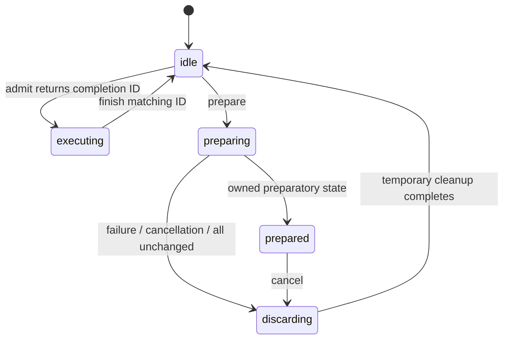

The diagram describes logical host admission, not GPU execution. Admission is rejected in every non-idle state. Nonzero completion IDs do not repeat; stale, duplicate, and mismatched completions cannot reopen admission for a newer operation or pending transition. Counter wrap is rejected.

This is an owner-thread-only state machine. Callbacks may reenter admission, prepare, finish, or cancel according to the gate rules, but must not destroy the transition object. External cancellation must be marshalled to the owner thread. `finish()` only finishes the admitted host operation; it is not a backend completion fence and does not close or drain GGML arena leases.

### Consumer and rollback contract

- The caller supplies a nonempty complete participant list. Null and duplicate registrations are rejected before callbacks. Consumers are borrowed and must outlive the transition and their preparations.
- The target and computed layout are owned snapshots. Caller mutation/destruction of the request cannot change a prepared target.
- A consumer must not mutate active state or submit device work during preparation. It may return an owned preparation, or return success with no preparation to confirm that no transition is needed for its state.
- No-op classification is negotiated with every consumer, not inferred from stage IDs or layout equality. The consumer must consider its external/runtime state too.
- Returned preparations, including a failing consumer's partial output, are destroyed in reverse registration order. Snapshot metadata stays valid throughout their destruction.
- Cleanup keeps admission closed and rejects reentrant prepare/finish/cancel attempts. Preparation destructors must not throw.
- Cancellation from within a prepare callback sets a flag; it cannot destroy that callback's parameters or output slot. Cleanup happens after the callback returns, before any later consumer is called.
- Cancellation takes precedence over a normal returned failure or no-op. Thrown exceptions remain reported, including their original `exception_ptr`; cancellation does not hide them.
- A successful non-no-op remains prepared with admission closed. There is deliberately no activation API yet. Cancelling or destroying the transition discards only preparatory state.
- The framework guarantees temporary-state cleanup, not rollback of arbitrary consumer side effects. Keeping old state usable depends on consumers honoring the non-mutating preparation contract.

### TDD evidence and scope

The initial 17 cases failed against placeholders with 256 failed assertions. After implementing the gate and adding cancellation-precedence coverage, all 19 cases and 809 assertions pass. Checks cover overlap and stale completion IDs, reentrant callbacks, partial failure at different consumer positions, reverse cleanup, consumer and allocation exceptions, deferred cancellation, no-op negotiation, invalid registration/layout, owned snapshots, pending destruction, and repeated failure/no-op/cancel cycles.

Fake preparations hold references to their target/layout and inspect them during destruction, so ASan also checks the snapshot-versus-token destruction order. Fake consumers retain unchanged active values throughout failed or cancelled preparation. A simulated consumer `std::bad_alloc` tests partial-output cleanup; allocator failures in every metadata-allocation site were not individually injected.

All eight focused suites pass in debug CPU, ASan/leak-checking, and UBSan builds, with the new llama code instrumented. Strict warnings pass with `-Wall -Wextra -Werror -Wconversion -Wsign-conversion -pedantic -I ggml/include`. This is not a thread-safety claim: TSan and cross-thread cancellation were not tested because concurrent calls are outside the contract. No production or GPU configuration was changed.

```sh
cmake -S . -B build-device-memory-infra
cmake --build build-device-memory-infra --target test-memory-transition test-memory-layout test-memory-plan test-memory-requirements test-alloc test-backend-buffer test-backend-memory test-backend-meta -j 20
ctest --test-dir build-device-memory-infra -R '^test-(memory-transition|memory-layout|memory-plan|memory-requirements|alloc|backend-buffer|backend-memory|backend-meta)$' --output-on-failure
```

The sanitizer runs use the same targets and selection in `build-device-memory-infra-asan` with `ASAN_OPTIONS=detect_leaks=1:halt_on_error=1` and `build-device-memory-infra-ubsan` with `UBSAN_OPTIONS=halt_on_error=1:print_stacktrace=1`. Implement 4.4a before adding the 4.3b drain/invalidate/release/commit/bind/activate path.

## Substage 4.4a implementation and validation

Added `src/llama-memory-executor.h/.cpp` and `tests/test-memory-executor.cpp`. This is the common capture-dependency and execution-lifetime contract plus fake-executor validation, not a CUDA adapter or an inference integration.

### Capture identity and ownership

- An executor adopts an idle native executable only after retaining its complete leased dependency set. Rejected adoption leaves the caller's executable ownership unchanged.
- Dependency identity uses the actual buffer-view handle and the region's ID, offset, size, alignment, and flags. Input order and exact aliases do not change the key; conflicting IDs and invalid leases are rejected.
- A separate caller-supplied runtime revision covers captured consumer assumptions. It is not the arena generation and should not advance for ordinary tensor writes that leave captured assumptions unchanged.
- Neither arena generation nor lease acquisition generation is used as a staleness test. A fresh lease for the same surviving persistent view can match a capture that still owns an older lease.
- A stale key or closed executor cannot issue an execution pin. The adapter must obtain a pin before submitting work and retain it until all related compute/copies have completed.
- Dependencies without arena leases must be owned by the native executable itself or otherwise kept alive by its backend. Empty leased sets are supported, but still require correct runtime revisions and completion pin lifetimes.

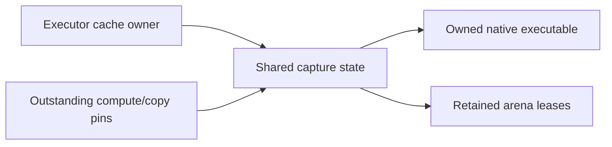

Pins are move-only and retain the same capture snapshot. Destroying the executor owner does not destroy a snapshot still held by backend work. The snapshot destroys the native executable before releasing its leases, including when the last execution pin is its final owner.

### Explicit retirement

Retirement closes launch admission before asking the backend to drain. If draining fails or throws, the capture and leases remain retained and admission stays closed. If the backend reports completion but any pins remain, retirement reports pending and does not invalidate the native executable.

Once draining succeeds and all pins are returned, retirement destroys the native executable and then releases the captured leases. Reentrant retirement during the drain callback is rejected. A resource-change list that does not intersect captured dependencies is a no-op: it does not drain, destroy, or reopen a previously closed executor.

The tests check that real arena commits cannot resize a captured region before retirement, and can do so afterward. They also change an unrelated region while an older persistent lease survives, acquire a fresh lease at the new generation, and replay the same fake capture successfully without unnecessary invalidation.

### Limits and TDD evidence

This is an owner-thread-only contract. A pin release is the backend's promise of completion, not an automatic GPU fence. Queues, backend contexts, and the code needed to destroy native artifacts must remain alive until their pins are released. Lease retention does not serialize arbitrary tensor writes or verify that the supplied runtime revision is truthful. The adapter must obey these rules; real backend synchronization and integration remain in 4.4b and 4.3b respectively.

TDD began with 13 cases against placeholder methods; 12 assertions failed before implementation. After implementing the contract and adding boundary cases, all 16 cases and 176 assertions pass. Cases include capture adoption, stale runtime/buffer identities, normalized aliases, persistent leases across arena generations, no-op invalidation, delayed compute/copy pins, blocked storage reuse, failed/exceptional/incomplete drains, ownership surviving executor and arena-owner destruction, replacement, empty dependency sets, reserved IDs, and fail-closed retry behavior.

The fake backend records completion and native destruction order and reads from real CPU-backed arena storage. Native destructors assert that the arena lease still exists. ASan exercises the case where the original executor and arena owner disappear before queued work completes; this is not a real CUDA execution test.

All nine focused suites pass in debug CPU, ASan/leak-checking, and UBSan builds. Strict warnings pass with `-Wall -Wextra -Werror -Wconversion -Wsign-conversion -pedantic -I ggml/include`. Host allocation failure during capture adoption is handled but was not fault-injected. TSan and real GPU execution were not tested for this owner-thread contract. No production service or model configuration changed.

```sh
cmake -S . -B build-device-memory-infra
cmake --build build-device-memory-infra --target test-memory-executor test-memory-transition test-memory-layout test-memory-plan test-memory-requirements test-alloc test-backend-buffer test-backend-memory test-backend-meta -j 20
ctest --test-dir build-device-memory-infra -R '^test-(memory-executor|memory-transition|memory-layout|memory-plan|memory-requirements|alloc|backend-buffer|backend-memory|backend-meta)$' --output-on-failure
```

The sanitizer runs use the same target list and selection in `build-device-memory-infra-asan` with `ASAN_OPTIONS=detect_leaks=1:halt_on_error=1` and `build-device-memory-infra-ubsan` with `UBSAN_OPTIONS=halt_on_error=1:print_stacktrace=1`.

## Substage 4.3b implementation and validation

Extended `llama_memory_transition` with an activation protocol and added `tests/test-memory-activation.cpp`. The integration uses real CPU arenas/leases and fake native execution. It is not wired into llama-server or a CUDA adapter yet.

The small supporting additions are `llama_memory_executor::quiesce()`, which closes submission without destroying captures, and `ggml_backend_memory_arena_get_region_at()`, which copies address-ordered committed metadata under the arena lock.

### Ordered activation

```mermaid
flowchart LR
    P["Validate live arenas"] --> Q["Close affected admission"]
    Q --> D["Drain all affected work"]
    D --> I["Invalidate affected captures"]
    I --> R["Release changed bindings"]
    R --> C["Commit changed layouts"]
    C --> B["Acquire staging leases and bind"]
    B --> A["Activate all consumers"]
    A --> O["Publish snapshot and reopen"]
```

- Every applicable consumer completes each protocol phase before the next phase begins. Default preparation hooks reject activation, so old preparation-only consumers cannot silently participate.
- The coordinator verifies arena count, caller-supplied placement/allocation labels, capacity, native alignment, existing gate state, generation consistency, and fixed-region snapshots before changing state. Aliased parent entries are rejected.
- After the first successful activation, physical parent mappings remain stable by domain/allocation class; this stage does not silently substitute another parent or add allocation groups.
- A parent can have more capacity than the logical budget, but grants remain inside that budget. For now, region alignment must equal the parent's reported native alignment. Stronger unreported alignment is rejected rather than guessed.
- Allocation-class labels are caller-supplied provenance, not hardware probes. The caller owns the complete participant list and exclusive arena mutation during activation.
- Closing an arena gate is not a GPU wait. Consumer quiesce/drain hooks close their affected executor paths and explicitly finish affected compute/copies.
- An unchanged whole-arena layout skips commit. If an arena does change, all non-persistent views count as affected even when their individual geometry is unchanged, because milestone 3 recreates them on commit.
- Exact unchanged persistent regions can retain their original leases and captured executables across a commit. The coordinator never requires those leases to disappear or the whole arena to become QUIESCENT.
- Consumers must account for shared-arena view changes when deciding whether to return a preparation. A consumer that owns an affected non-persistent view cannot claim a no-op based only on its tensor shape.
- New lease acquisition temporarily requires OPEN arena admission. The host execution gate stays closed, staging leases are acquired, and arena gates are closed again before consumer binding.
- Bind callbacks retain candidate leases without publishing them. Activate callbacks publish bound state without submitting new execution. Consumer-specific data preservation/reconstruction remains their responsibility.
- After all activation callbacks and temporary cleanup finish, arena admission reopens and the new logical snapshot is published. Coordinator-owned staging leases are then unnecessary; consumers retain their own active leases.

### Errors and deliberate limits

Invalid parent/preflight input leaves the proposal prepared and cancellable without running lifecycle callbacks. Once quiescing starts, callback failure, incomplete draining, cancellation, commit failure, or binding failure enters a failed state. Host admission remains closed, touched arena gates remain closed, and the target, arena metadata snapshots, and remaining temporary state are retained.

Commits across multiple arenas are sequential, not an atomic hardware transaction. A later failure can leave an earlier arena committed. Likewise, a later activation callback can fail after an earlier consumer has published state. Neither case reopens execution or replaces the coordinator's last-successful active snapshot. That logical snapshot is not proof that physical state was rolled back.

Stage 4.3c will add recoverable restoration and session invalidation. This stage does not silently cancel a failed activation back to idle. Destruction cleans owned temporary state, but is not a recovery operation. Captured/in-flight leases still enforce storage lifetime independently.

Generation checks here detect out-of-band arena mutation during the transaction; they do not mark an older surviving persistent lease stale. No new persistence-placement policy is introduced: this stage preserves caller-established persistent regions rather than automatically pinning all preserved content.

### TDD evidence

The initial 12 integration cases failed against placeholder activation/quiesce/enumeration methods with 69 failed assertions. After implementation and boundary coverage, all 16 cases and 232 assertions pass. A boundary test initially mixed cleanup events from a preceding cancelled proposal into its next preflight check; its event log was reset between those independent attempts, and all configurations were rebuilt and rerun.

Coverage includes callback ordering, real metadata enumeration, stale fixed snapshots, native-alignment/capacity/gate rejection, stable parent identity, delayed compute/copy completion, persistent lease/capture survival at an older generation, recreation of unchanged non-persistent views, no-op arena commits with internal runtime changes, external leases blocking commit, callback failures/exceptions/cancellation, partial activation, and partial multi-arena commit.

All ten focused suites pass in debug CPU, ASan/leak-checking, and UBSan builds. Strict warnings pass for the transition/executor code with `-Wall -Wextra -Werror -Wconversion -Wsign-conversion -pedantic -I ggml/include`. The code is still owner-thread-only; TSan and real GPU execution were not tested. Per-site host allocation and backend view-creation fault injection remain part of the recovery work rather than a claim of exhaustive failure coverage here.

```sh
cmake -S . -B build-device-memory-infra
cmake --build build-device-memory-infra --target test-memory-activation test-memory-executor test-memory-transition test-memory-layout test-memory-plan test-memory-requirements test-alloc test-backend-buffer test-backend-memory test-backend-meta -j 20
ctest --test-dir build-device-memory-infra -R '^test-(memory-activation|memory-executor|memory-transition|memory-layout|memory-plan|memory-requirements|alloc|backend-buffer|backend-memory|backend-meta)$' --output-on-failure
```

The sanitizer runs use the same target list and selection in `build-device-memory-infra-asan` with `ASAN_OPTIONS=detect_leaks=1:halt_on_error=1` and `build-device-memory-infra-ubsan` with `UBSAN_OPTIONS=halt_on_error=1:print_stacktrace=1`. Production services and model configuration were not changed.

## Substage 4.3c implementation and validation

Extended `llama_memory_transition` with explicit recovery and terminal session invalidation. Activation and recovery now share the real-CPU-arena/fake-executor fixture in `tests/memory-transition-test.h`; the original activation cases remain intact.

### Recovery contract

`llama_memory_preparation::prepare_recovery()` is opt-in and rejects by default. A consumer returns a reverse preparation only when it can restore both its old bindings and its data/runtime state after the partial forward operation. Returning true with no reverse preparation promises that this consumer needs no restoration. The reverse preparation may borrow its forward preparation; reverse objects are always destroyed before forward objects.

The coordinator does not infer data recoverability from arena metadata. A consumer must retain a valid backup, reconstruct its state, prove that nothing changed, or refuse recovery. In the test consumer, backups are taken only after affected outstanding writes finish. These fake integer backups demonstrate the contract; they are not an implementation of KV or model-state recovery.

`recover()` runs only from a failed activation. Admission remains closed throughout, including reentrant callbacks; cancellation during recovery is rejected. Its successful path is:

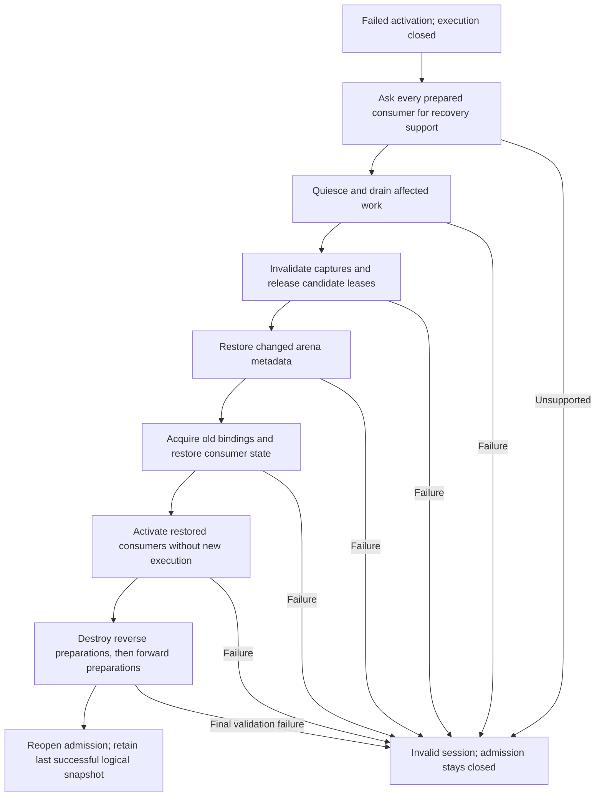

- Every consumer completes a given reverse lifecycle phase before the next phase begins. Draining precedes any capture destruction or changed storage release.
- Coordinator-held candidate leases are dropped only after consumers release their candidate bindings. Old staging leases are then acquired for rebinding.
- Arena restoration uses the retained pre-transition region snapshots. An arena whose committed metadata never changed is not recommitted; this preserves its original views and any surviving external leases.
- Exact persistent views can survive both forward and restoration commits. A new arena generation does not by itself invalidate such a lease or its capture.
- Multiple arenas still commit sequentially. A failed later forward commit can be recovered by restoring the earlier changed arenas and leaving the unchanged arenas alone.
- Generation mismatches reject out-of-band committed arena mutation without overwriting it. Exclusive owner-thread mutation remains a caller obligation, including while recovering.
- `last_failure()` preserves the original activation failure, including its exception, while the recovery result separately describes a recovery failure. Successful recovery discards the pending failure and returns `recovered`.
- Unsupported restoration, failed recovery, or a late forward failure after backup descriptors were already discarded leaves an invalid session. It cannot be reopened by cancel/admit or retried through recover; the caller must recreate it.
- Destruction releases owned preparations and leases; it is not a rollback or a substitute for backend completion. Consumer/backend lifetimes and in-flight execution pins retain their existing requirements.

### Prerequisite infrastructure fix and rebase

View-factory fault injection exposed an infrastructure exception-safety bug: when a later backend view factory threw, an earlier temporary view and any temporarily retained persistent views were not released. The user committed the separate fix on `feature/device-memory-infra` as `78e002404`. The arena now frees temporary views and rolls back staged metadata; allocation exceptions return false, while other exceptions propagate after cleanup.

The low-level regression failed at the temporary-view free-count assertion before the fix and passes with it, including persistent-view reuse and a later successful commit. All four focused infrastructure suites passed in debug, ASan/leak-checking, and UBSan before the fix was committed. Milestone 3 was then advanced to that commit and the seven consumer commits rebased on top. `git range-diff` confirmed that all seven replayed patches were unchanged. The earlier stage hashes in the progress ledger now identify those rebased commits.

### TDD evidence and limits

The initial recovery contract tests failed against placeholder recovery methods (14 cases, 37 failed assertions). After implementation and additional boundary coverage, the recovery suite passes 18 cases and 514 assertions.

Coverage includes each forward callback boundary; delayed completion before backup; changed consumer data and runtime revisions; retained active snapshots and successful retry; surviving persistent captures; unsupported recovery; failure of every reverse lifecycle phase; reverse preparation/callback exceptions; foreign committed metadata; partial native view creation returning null or throwing; view failure during restoration; external leases blocking restoration; cancellation after drain; reentrant operations; reverse-before-forward destruction; and recovery after a partial multi-arena commit.

All eleven selected suites pass on the rebased code in debug CPU, ASan with leak checking, and UBSan. Strict transition-code warnings pass with `-Wall -Wextra -Werror -Wconversion -Wsign-conversion -pedantic -I ggml/include`. This covers real arena/lease operations with simulated execution, not CUDA capture replay, TSan, production inference, or exhaustive fault injection at every host allocation site. CUDA adapter qualification remains substage 4.4b.

```sh
cmake -S . -B build-device-memory-infra
cmake --build build-device-memory-infra --target test-memory-recovery test-memory-activation test-memory-executor test-memory-transition test-memory-layout test-memory-plan test-memory-requirements test-alloc test-backend-buffer test-backend-memory test-backend-meta -j 20
ctest --test-dir build-device-memory-infra -R '^test-(memory-recovery|memory-activation|memory-executor|memory-transition|memory-layout|memory-plan|memory-requirements|alloc|backend-buffer|backend-memory|backend-meta)$' --output-on-failure
```

The sanitizer runs use the same targets and selection in `build-device-memory-infra-asan` with `ASAN_OPTIONS=detect_leaks=1:halt_on_error=1` and `build-device-memory-infra-ubsan` with `UBSAN_OPTIONS=halt_on_error=1:print_stacktrace=1`. Production services and model configuration were not changed.

## Substage 4.4b implementation and validation

Added `llama_memory_cuda_executor` in `src/llama-memory-executor-cuda.h/.cpp`, two internal CUDA registry hooks declared in `ggml/src/ggml-cuda-graph.h`, and `tests/test-memory-executor-cuda.cpp`. This adapts the common executor lifetime contract to the existing native CUDA capture cache; it does not replace CUDA graph evaluation, attention kernels, or scheduler allocation policy.

### Ownership and submission

The adapter borrows one backend and one fixed GGML graph. The backend, graph/tensor metadata, and any dependencies not represented by supplied leases must outlive the adapter. The caller supplies the complete leased dependency set and runtime revision, with exclusive ownership of submissions and cache mutation for that graph key. Other graph keys on the backend can have their own adapters.

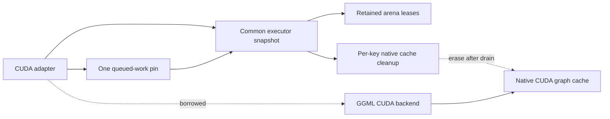

- `bind()` validates and retains the leased dependency set before adopting its cleanup descriptor. Invalid bindings or replacement of a live attachment are rejected without retiring the existing capture.
- Successful attachment synchronizes the backend and clears any old entry for that first-node key. This prevents reused tensor addresses or graph UIDs from preserving an older binding's capture.
- Native capture remains lazy. Existing CUDA warmup, property checks, replay, and idle cache eviction remain backend-owned. An attached executable can be ready even when no native CUDA graph instance exists.
- `compute_async()` checks the current binding identities and runtime revision through the common executor, then retains a pin before invoking GGML. One pin covers the entire queued sequence until explicit drain; it does not accumulate one allocation or vector entry per token.
- A failed status or exception after partial submission closes admission and retains the pin. It does not assume that an unsuccessful call queued no GPU work.
- `drain()` waits on the backend's primary stream, including work and copies joined into that stream, before dropping the queued pin. This is backend-wide synchronization, not fine-grained per-capture event polling; it can also wait for other graph keys on that backend.
- `retire()` uses the common drain-before-destroy protocol. The cleanup descriptor erases only its native cache key before the common snapshot releases its final leases.
- `retire_if_affected()` is a no-op for unrelated resource IDs: no drain, cache invalidation, or pin release. Exact surviving persistent leases can keep captures valid across arena generations.
- Adapter destruction drains and retires while its borrowed backend still exists. It must not silently free dependencies after unsuccessful draining.

The native release hook assumes completion has already been established; it does not independently synchronize. The query hook inspects whether a native instance exists without creating an entry or exposing a CUDA handle. Both are discovered through the existing registry extension mechanism, so the common llama library does not gain a link dependency on the CUDA runtime.

### Supported scope and deliberate limits

- This is still an owner-thread-only, fixed-graph adapter. The graph's topology and tensor bindings must not be mutated under an attached executable; retire, update/rebind, and attach a new revision instead.
- Ordinary tensor-content writes do not invalidate the runtime revision. Storage identity or capture assumptions do.
- Other streams/backends must join their work into the guarded backend's completion path before relying on this adapter to release shared storage. Arbitrary external CUDA launches are not tracked.
- Optional `GGML_CUDA_GRAPH_OPT=1` is explicitly rejected by withholding these hooks. Its experimental concurrent-stream scheduling metadata is backend-wide and is not retired by erasing one cache entry. Supporting its ownership needs separate work rather than silently clearing metadata needed by sibling graphs. Environment configuration must be fixed before backend initialization.
- CPU and backends without the hooks are rejected without allocation or launch. ROCm/MUSA do not advertise this new CUDA-specific contract; no support is inferred from shared implementation files.
- `GGML_CUDA_DISABLE_GRAPHS=1` is supported: direct CUDA execution still receives the same lease/pin protection. The hooks also have graph-compiled-out implementations, but a separate CUDA build with `GGML_CUDA_GRAPHS=OFF` was not run in this stage.
- Fatal CUDA driver failures still follow the backend's existing `CUDA_CHECK` behavior. The adapter does not convert process-aborting CUDA faults into recoverable transition errors.
- Production llama-context/llama-server does not use the adapter yet. Text-consumer attachment and integration remain stages 4.5a and 4.5b. No prefill/decode memory reclamation, streaming implementation, or performance improvement is claimed here.

### TDD evidence

The initial seven-case suite ran against placeholder adapter methods and failed seven assertions. After implementation, the native CUDA suite passes ten cases and 226 assertions. A separate experimental-optimizer rejection test failed before its capability gate was added and now passes (two cases / 15 assertions including CPU/null-backend checks).

Native tests exercise lazy capture and replay, data updates, stale revisions/dependencies, rejected reattachment preserving capture, no-op invalidation with outstanding work, 32 queued replays sharing one pin, storage reuse blocked until retirement, rebinding at a different arena offset, persistent-view survival across generations, destructor cleanup, independent graph-cache entries on one backend, asynchronous output-copy completion, and injected failure/exception after actual CUDA submission.

Validation on the RTX 5070 Ti with the existing CUDA 13.0 toolkit build, architecture 120a:

- Native suite passes with captures enabled and with `GGML_CUDA_DISABLE_GRAPHS=1`.
- Compute Sanitizer memcheck with full leak checking reports zero errors and zero leaked device allocations for the native suite.
- CPU-referenced CUDA SCALE operator validation passes all four cases using `test-backend-ops`.
- All twelve focused memory suites pass in debug CPU-only and CUDA-enabled builds.
- All twelve focused suites pass in CPU-only ASan/leak-checking and UBSan builds. Their adapter case covers unsupported-backend behavior; these are not host-sanitized CUDA builds.
- Strict adapter warnings pass with `-Wall -Wextra -Werror -Wconversion -Wsign-conversion -pedantic -I ggml/include`.
- `readelf -d` confirms the CPU-only `libllama.so` does not depend on CUDA libraries. TSan, other accelerator adapters, optimized multi-stream graph execution, and full-model performance are not qualified by this stage.

The native fixture uses a small scale graph and a 64 KiB arena. Production stayed running and its configuration was not changed.

```sh
cmake -S . -B build-device-memory-infra-cuda -DGGML_CUDA=ON -DCMAKE_CUDA_ARCHITECTURES=120
cmake --build build-device-memory-infra-cuda --target test-memory-executor-cuda test-backend-ops -j 20
build-device-memory-infra-cuda/bin/test-memory-executor-cuda --cuda
GGML_CUDA_DISABLE_GRAPHS=1 build-device-memory-infra-cuda/bin/test-memory-executor-cuda --cuda --no-graphs
GGML_CUDA_GRAPH_OPT=1 build-device-memory-infra-cuda/bin/test-memory-executor-cuda --cuda --unsupported
compute-sanitizer --tool memcheck --leak-check full --error-exitcode 99 build-device-memory-infra-cuda/bin/test-memory-executor-cuda --cuda
build-device-memory-infra-cuda/bin/test-backend-ops test -b CUDA0 -o SCALE
```

The architecture above is the tested GPU; use the architecture appropriate for another machine. Without `--cuda`, the new test runs only the CPU/null-backend rejection checks, so the explicit native invocation is required to qualify CUDA behavior. Run the twelve-suite selection by adding `memory-executor-cuda` to the 4.3c target list and CTest expression. Use the same CPU sanitizer configurations and environment flags recorded for 4.3c.

## Substage 4.5a implementation and validation

Added `llama_memory_workspace` in `src/llama-memory-workspace.h/.cpp` and `tests/test-memory-workspace.cpp`. This is a coordinator consumer for the text scheduler's existing maximum-sized workspace groups. The production `llama_context` allocation helper is unchanged; adoption and execution integration remain stage 4.5b.

### Registration and allocation boundary

The caller supplies canonical groups produced by `ggml_backend_memory_plan_workspace_groups`, assigns session-unique resource/domain IDs, and selects groups with verified buffer-view support. The consumer checks each selected group against the actual scheduler buffer type and canonical first slot. Duplicate resource IDs, duplicate buffer types, invalid slots, incompatible alignment, and non-discardable content are rejected.

`register_resources()` appends one resource per selected buffer-type group and a WRITE requirement to each requested stage. Both minimum and preferred bytes equal the measured phase maximum. Registration is transactional with respect to the plan; missing/duplicate stages, catalog collisions, or validation failure leave it unchanged.

Registration and preparation allocate only host bookkeeping. They neither allocate physical parent buffers nor discover free VRAM. Parent arenas, domain/allocation labels, and capability probing remain caller responsibilities. Allocation-class labels are not inferred from pointer values.

Aliased scheduler slots receive a single group lease through the existing scheduler attachment API. GGML intentionally reports those shared bytes only on the first slot; a zero size reported on another alias does not mean it lacks workspace.

### Lifecycle

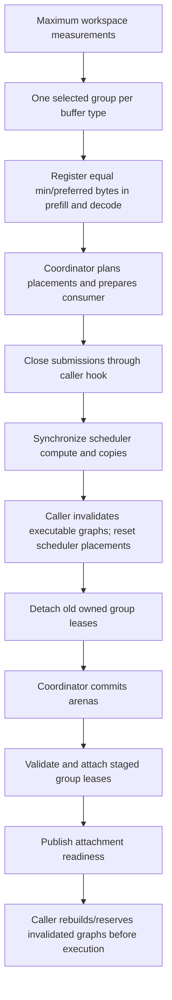

- Two mandatory, idempotent hooks cover submission quiescing and executable invalidation for the entire scheduler, including its fallback groups. A caller without native captures can explicitly provide the corresponding no-op, but absent hooks are not silently accepted.
- The consumer synchronizes the scheduler before invalidation. Invalidation must retire native captures and mark caller-owned graph bindings for reconstruction before leases are detached.
- Any affected workspace group conservatively invalidates this scheduler's executable bindings. This avoids resetting shared scheduler placement metadata underneath an otherwise unaccounted executable.
- If all workspace placements and views are unchanged, activation preserves the existing attachments without quiescing, invalidating, or detaching. Moving from prefill to decode alone does not shrink the grant or force an arena commit.
- Bind validates every selected lease's actual region metadata and buffer type before attaching any. It marks workspace views as COMPUTE, retains its own lease references, and attaches one lease for every shared buffer-type group.
- A failed later attachment detaches only earlier attachments made by this consumer. It does not clear a foreign borrowed range that caused the failure.
- Preparation/cancellation does not touch the active scheduler. Concurrent or reentrant preparations, close while a preparation exists, and reentrant close are rejected.
- `ready()` describes logical attachment readiness, not global execution admission or a rebuilt graph. The caller must obey the coordinator's gate and reconstruct invalidated tensor bindings before using them.
- Explicit close and destruction use quiesce/synchronize/invalidate/detach ordering. Remaining ownership is retained if close fails; destruction asserts successful teardown rather than freeing storage while its use is unproven. Scheduler/backend/hook lifetimes must extend through consumer teardown.

### Recovery and fallback

Workspace resources are explicitly discardable scratch. The consumer's recovery preparation saves placement metadata without retaining old leases that would prevent repartition. After a failed transition, it can detach candidates and reattach restored arena regions; graph reconstruction remains required. It does not copy scratch bytes back or claim rollback of KV/recurrent state, live outputs, or vision handoff data. Such state must remain outside this discardable workspace contract.

Saved arena indices are remapped to the current target's budget order by workspace group. Arena indices are positions in one target layout, not stable resource identities. This matters when recovery follows a transition that reordered budget entries.

Unsupported groups are omitted from the coordinated set and remain on the scheduler's existing allocation path. The consumer does not turn managed-group attachment/allocation failures into silent fallback. The mixed test uses a real CPU buffer type with view support withheld and confirms that the omitted group's scheduler allocation remains usable and is not detached by closing the managed groups.

### TDD evidence and scope

The initial ten cases failed twelve assertions against placeholder methods. After implementation and boundary coverage, the workspace suite passes sixteen cases and 390 assertions.

Additional regressions exposed missing canonical-slot/buffer-type validation and a recovery error when arena budgets were reordered. Both were demonstrated failing before their fixes. An initial alias-size assertion was corrected after checking the existing allocator and shared-lease test: accounting intentionally counts shared storage only once.

Coverage includes phase-maximum registration, transactional registration rejection, real scheduler reserve/allocate/compute, aliased slots, unchanged decode activation, cancellation, partial attachment rollback while preserving a foreign range, relocation recovery after a later consumer fails, failed/throwing invalidation, view-unsupported fallback, destruction, invalid group metadata, missing execution hooks, incorrect grants, sixteen repeated create/compute/detach cycles, and recovery after budget reordering.

All thirteen focused suites pass in debug CPU, ASan with leak checking, and UBSan. Strict workspace-source warnings pass with `-Wall -Wextra -Werror -Wconversion -Wsign-conversion -pedantic -I ggml/include`. No GGML allocator, scheduler, backend kernel, or production context implementation changed in this stage.

This is not full-model, accelerator-consumer, TSan, or performance qualification. The next stage must wire the consumer into actual context ownership, supply correct native-executor invalidation/rebuild hooks, preserve fallback behavior, and run the planned backend/numerical/steady-state qualification. No new arena budgeting, prefill/decode reclamation, or KV streaming is enabled here. Production services and configuration were untouched.

```sh
cmake -S . -B build-device-memory-infra
cmake --build build-device-memory-infra --target test-memory-workspace test-memory-executor-cuda test-memory-recovery test-memory-activation test-memory-executor test-memory-transition test-memory-layout test-memory-plan test-memory-requirements test-alloc test-backend-buffer test-backend-memory test-backend-meta -j 20
ctest --test-dir build-device-memory-infra -R '^test-(memory-workspace|memory-executor-cuda|memory-recovery|memory-activation|memory-executor|memory-transition|memory-layout|memory-plan|memory-requirements|alloc|backend-buffer|backend-memory|backend-meta)$' --output-on-failure
```

Use the same targets and selection with `build-device-memory-infra-asan` and `ASAN_OPTIONS=detect_leaks=1:halt_on_error=1`, or `build-device-memory-infra-ubsan` and `UBSAN_OPTIONS=halt_on_error=1:print_stacktrace=1`.

## Substage 4.5b implementation and qualification

Added `llama_context_memory` in `src/llama-context-memory.h/.cpp` and wired it into `llama_context` reserve, dispatch, synchronization, and teardown. It composes the stage-4 workspace consumer, transition gate, and executor-lifetime guard. There is no per-token layout planning and no phase-dependent workspace shrinking.

### Why the integration guards a scheduler lifetime

The scheduler owns and rebuilds backend graph splits. The 4.4b fixed-graph adapter cannot safely borrow one split descriptor as though it were an immutable context graph. This integration instead guards the complete scheduler workspace lifetime and its backend-native cache domain.

A new optional CUDA registry hook, `ggml_backend_cuda_graph_release_all`, erases that backend instance's graph cache after completion. It does not modify ordinary capture/update/replay code or touch another context's backend instance. The existing per-key adapter remains available for fixed-graph consumers.

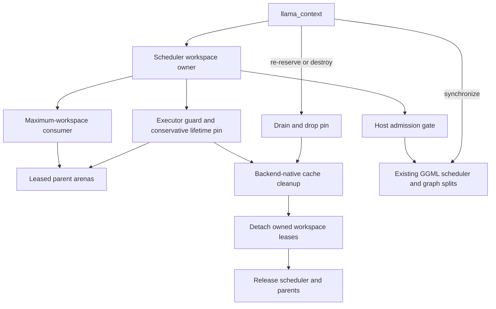

- Parent buffers use the same factories and exact measured group maxima as milestone 3. View-unsupported groups remain scheduler-allocated. Managed-group failures are errors, not silent fallback.
- Workspace metadata uses the supported CPU/CUDA factories' existing host, pinned-host, device-local, or managed allocation policy. UVM allocation behavior is not changed; environment configuration must be fixed before initialization.
- Initial setup registers both fixed-maximum text-stage requirements, activates the workspace consumer, and captures its complete leased workspace set. Weights, KV/recurrent state, and other non-workspace dependencies remain context/model-owned.
- Dispatch uses the existing scheduler unchanged. A small host admission gate encloses submission; GPU completion is handled separately.
- One conservative execution pin is acquired for this immutable scheduler lifetime. Normal synchronization waits for work but retains the pin, avoiding repeated validation/locking of the same lease set on each token.
- Actual retirement drains the scheduler and releases that pin, then destroys native captures before releasing guarded leases. Holding the pin after completed work is conservative; it is never released before completion.
- The owner is declared after the scheduler and reset before every scheduler destruction/replacement site. This also gives safe member cleanup during constructor failure.
- Failed/aborted dispatch closes the guard and invalidates scheduler reservation so a subsequent request rebuilds the guarded workspace. The CPU abort-and-next-request numerical regression covers this path; this is not a promise of arbitrary mutable-state rollback after every exception.
- `uses_memory_coordinator()` distinguishes this integration from the legacy arena path. `uses_compute_arenas()` continues to report arena use for either path, preserving existing memory-accounting tests.

### Capability boundary

Coordinated context integration is enabled only for serial contexts with one sequence, no pipeline parallelism, and a verified backend set consisting of CPU plus at most one CUDA backend. CPU needs no native graph-cache destruction; CUDA must advertise the new whole-cache hook.

OpenCL, SYCL, Vulkan, Meta, unverified accelerator backends, multiple CUDA backends, parallel-sequence contexts, and experimental `GGML_CUDA_GRAPH_OPT=1` retain the existing milestone-3 arena path. They are not silently treated as having verified capture invalidation. Their text-inference compatibility was checked below, but coordinated native-lifetime adapters for those backends remain future extensions.

No public context parameter, CLI switch, CUDA kernel, checkpoint, or prompt-cache policy changed. No adaptive KV streaming or prefill/decode/mmproj reclamation is enabled by this milestone.

### TDD and correctness evidence

The scheduler-owner tests first failed three assertions against placeholder methods. A separate real-context assertion then failed before the context wiring was added. The final owner suite passes four CPU cases / 352 assertions and five CUDA cases / 376 assertions.

Coverage includes invalid inputs and the single-CUDA-backend limit, exact maximum capacity, real scheduler compute/output completion, repeated graph reconstruction, queued work at teardown, repeated workspace recreation, foreign attachment preservation after failed creation, allocation failure followed by retry, and clearing real scheduler-created CUDA captures.

The repeated-replay fixture initially allowed in-place input reuse; it now marks the input as preserved output as well as input. The CUDA fixture also restores explicit device assignment after scheduler reservation, which resets assignment metadata. These fixture corrections did not change allocator or kernel behavior.

The existing synthetic LLAMA dense/MoE tests were extended to assert real coordinator use for eligible CPU contexts and verify abort followed by another request. They also exercise prefill, TG1, repeated causal-attention re-reservation, workspace memory accounting, no-allocation contexts, and serialization where supported. Seed: 1234; numerical acceptance threshold: NMSE <= 1e-4.

| Backend path | Context ownership path | Dense / MoE NMSE versus CPU | Result |
| --- | --- | --- | --- |
| CPU | Coordinated | 0 / 0 | Pass |
| CUDA RTX 5070 Ti | Coordinated | 9.34e-8 / 9.39e-8 | Pass |
| OpenCL UHD 770 | Legacy arenas | 1.04e-13 / 1.01e-13 | Pass |
| SYCL UHD 770 | Legacy arenas | 3.26e-12 / 3.27e-12 | Pass |
| Vulkan RTX 5070 Ti and UHD 770 | Legacy arenas | 9.34e-8 / 9.39e-8 | Pass |
| Meta over the available accelerator configurations | Legacy arenas | Within the same 1e-4 threshold | Pass |

Meta serialization roundtrip remains the existing test's explicit skip; it is not reported as passing. CPU-only Meta with no accelerator device list is also an existing skip. SYCL reported its existing unavailable-free-memory warning; it did not prevent these tests from passing.

All fourteen focused suites pass in debug CPU/CUDA builds and CPU-only ASan/leak-checking and UBSan builds. The synthetic CPU model test also passes under both sanitizers after the final pin change. CUDA Compute Sanitizer memcheck with full leak checking reports zero errors and zero leaked device allocations. CUDA managed-allocation owner tests, graph-disabled model tests, and experimental-optimizer legacy-fallback model tests pass. Strict warnings pass for the new owner source.

### Steady-state overhead and HTTP smoke

The optional `test-context-memory --bench` mode compares the new owner with the unchanged legacy arena helper in the same binary, using identical tiny graphs and group capacities. It runs legacy/coordinated/coordinated/legacy order with 10,000 measured graph dispatches per sample, both queued and synchronized after every graph. Logging is disabled for timing; construction and teardown are outside the timed interval.

An initial implementation dropped and reacquired its pin after each synchronization. The measured synchronized overhead was about 0.36 us on CPU and 0.50 us on CUDA. Retaining one pin until retirement reduced that cost without adding a new fast-path executor API.

Final paired means from the Debug-build diagnostic, in microseconds per tiny graph:

| Backend / mode | Legacy | Coordinated | Added time |
| --- | ---: | ---: | ---: |
| CPU queued | 0.331 | 0.427 | 0.096 |
| CPU synchronized | 0.355 | 0.467 | 0.112 |
| CUDA queued | 2.049 | 2.049 | 0.000 |
| CUDA synchronized | 5.161 | 5.328 | 0.167 |

This is a dispatch microbenchmark, not a model tokens/second comparison or a statistically rigorous production performance claim. The relative percentage is large for an extremely small CPU graph; the absolute increment is sub-microsecond. No full production-model throughput improvement or absence of throughput regression is inferred from these numbers.

The complete `llama-server` target was rebuilt, including server implementation libraries. The existing HTTP harness then loaded `stories15M-q4_0.gguf` on CPU and CUDA, processed a 16-token prompt, and generated 32 tokens for two serial measured requests per backend after warmup. All four requests passed the harness checks, including no reused prompt tokens. This was a functionality smoke test, not an A/B throughput claim. Temporary configuration/results are under `/tmp/device-memory-m4-smoke.61YMk3/`; existing benchmark data was not modified or staged.

Production remained running throughout; no production container, model, or compose configuration was changed.

### Reproduction and milestone gate

```sh
cmake --build build-device-memory-infra --target test-context-memory test-llama-archs -j 20
build-device-memory-infra/bin/test-context-memory --bench
build-device-memory-infra/bin/test-llama-archs -a llama -s 1234

cmake --build build-device-memory-infra-cuda --target test-context-memory test-llama-archs -j 20
build-device-memory-infra-cuda/bin/test-context-memory --cuda --bench
build-device-memory-infra-cuda/bin/test-llama-archs -a llama -s 1234
compute-sanitizer --tool memcheck --leak-check full --error-exitcode 99 build-device-memory-infra-cuda/bin/test-context-memory --cuda
```

Build/run `test-llama-archs -a llama -s 1234` with the OpenCL, SYCL, and Vulkan configurations to reproduce their compatibility checks; SYCL needs the installed oneAPI environment. Add `context-memory` to the 4.5a focused target/CTest selection for the fourteen-suite run. Use the previously recorded ASan/UBSan environment flags. Enable `LLAMA_BUILD_SERVER=ON` when building the server smoke target.

The milestone-4 acceptance gate is met for the declared initial integration scope: safe common transitions/executor lifetimes, coordinated serial CPU/CUDA text execution, existing text-inference compatibility across available backends, and no phase reclamation. The user should review and commit this stage before creating a checkpoint or starting 5.1a. Broader coordinated backend adapters and a full production-model performance sweep are explicitly not claimed by this gate.

## Substage 5.1a: reference audit, geometry, and capability contract

Reviewed the fixed-pool implementation at `d873e5db9` and relevant phase-arena integration at `ae09597ff` before writing the new contract. The milestone-4 branch/checkpoint was not changed. The work remains on the existing consumer branch and does not modify production containers, model files, or runtime configuration.

### Why the original implementation succeeds

The reference avoids relying on demand paging for KV access. It keeps authoritative host KV and a bounded device mirror, retaining useful pages and transferring only the nonresident portion. Its performance depends on several mechanisms together:

| Mechanism to preserve | Actual reference code | Why it matters |
| --- | --- | --- |
| Separate contiguous K/V planes and token-major rows | `fattn.cu`: resident layout and `kv_stream_graph_upload[_batch]` | Adjacent pages become one K copy plus one V copy, instead of many per-head/per-page operations. |
| Ordinary attention for eligible resident work | `ggml_cuda_flash_attn_ext_streamed` resident/single-span path | Avoids unnecessary partial-result merging and retains the fast nonstreamed path. |
| Stable partial-attention accumulation | `kv_stream_accumulate_chunk_results`, `kv_stream_normalize_chunk_results` | Rescales partial numerators/denominators by their maxima before final normalization; it does not average independently normalized chunk outputs. |
| Uniform prefill and concentrated decode layouts | `kv_stream_resident_cache_layout` plus `llama_kv_cache::kv_stream_adapt` | Limits split-attention overhead and leaves fully resident layers as prefetch opportunities; very small rings can still use multiple waves. |
| Real cross-layer request queue | `kv_stream_graph_fill_free_slots`, `kv_stream_graph_release` | Reuses consumed slots promptly, with lookahead bounded by ring capacity rather than a fixed three-layer window. |
| Producer/ready/consumed ordering | `fattn.cu` upload and consumption paths | Prevents reading stale mutable tails or overwriting a slot before its GPU consumers finish. |
| Wide-query tiling around one staged span | `ggml_cuda_flash_attn_ext_streamed` | Reuses the same H2D upload for all query tiles; slots are released only after the final consuming tile. |
| Feedback and span tuning | `llama-kv-cache.cpp`, `kv-stream-span-tuner.h` | Bounds repartition churn and chooses span behavior using measured outcomes. Copy-busy is sampled/extrapolated copy time, not PCIe utilization divided by theoretical bandwidth. |

The memory infrastructure does not replace these algorithms or their internal event ordering. A coarse arena lease protects the allocation lifetime; it does not by itself protect individual ring slots from premature reuse.

The reference can invalidate resident metadata and reload from host when layer bases or V offsets move. Non-disruptive repartition is not assumed. Internal KV content/layout generations remain distinct from arena generations.

### Production-call audit

The production `llama-kv-cache.cpp` resolves CUDA type-pair support, page-size, and conversion-size hooks before constructing the runtime. Its controller calls `llama_kv_stream_partition_adapt`; the real layer assignment and copy queue live in CUDA `fattn.cu`.

By contrast, the earlier `llama_kv_stream_plan_make`, `llama_kv_stream_regions_make`, `llama_kv_stream_extent_make`, and `llama_kv_stream_prefetch_dispatch` have test callers but no production callers in the reviewed fixed-pool reference. They were not copied as if they implemented the successful runtime. Stage 5.1b extracts the actual resident/concentrated/multi-wave policy (documented below); 5.4h must preserve the real queue.

The reference type table was checked against `set-rows.cu`, the native partial-attention resolver, and `convert.cu`. Nine destination types have online-write paths in the reference: F32, F16, BF16, Q8_0, Q5_0, Q5_1, Q4_0, Q4_1, and IQ4_NL. The seven types other than F32/IQ4_NL have the reference's native partial-attention matrix with all-quant instantiations enabled. Other encodings may have storage and/or F16 conversion but no online KV writer. Q8_1 and Q8_K are auxiliary formats, not supported KV storage here. SET_ROWS producer dtype/layout and any required initialization remain part of the backend's write-capability proof, not a consequence of destination type alone.

### New implementation and layering

Added `ggml/src/ggml-kv-stream.h/.cpp` for backend-independent metadata calculations and `src/llama-kv-stream-config.h/.cpp` for the initial model/runtime gate. The lower layer has no dependency on llama model architecture or CUDA; the upper layer supplies the current target restrictions.

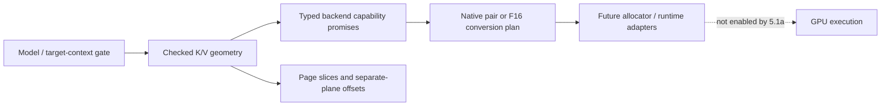

- Row bytes are calculated independently for K and V from GGML block metadata. Head dimensions must contain whole quant blocks; blocks cannot silently straddle heads.
- Block count is divided first, then multiplied with overflow checks. This avoids overflowing an intermediate `type_size * head_dim` even when the final quantized row fits.
- Every product, combined size, and alignment addition is checked. Failure leaves caller output unchanged.
- Layout returns one K plane followed by an aligned V offset for the entire span. The allocation base must satisfy the stated alignment. It is not an array of interleaved K+V page records.
- Page slices return offsets relative to the separate source planes and copy only live rows in a partial last page. Empty caches have zero pages. Padding initialization/masking remains a responsibility of later write/attention stages.
- Capability records carry integer GGML type codes, so invalid or unknown values can be rejected before converting to `ggml_type`. Removed enum entries and auxiliary/non-KV types are rejected without calling asserting size helpers on invalid input.
- Execution resolution requires storage and online writes independently for K and V. A native pair needs both per-type direct support and pair support. Otherwise both conversion paths and F16 attention must exist.
- Conversion size is calculated for the requested span using F16 K/V planes. It explicitly excludes attention partials, accumulators, staged SET_ROWS scratch, graph workspace, and backend pool capacity.
- Attention validation checks ordinary GGML output axes, matching Q/K widths, KV head agreement and GQA divisibility, batch bounds, key padding, token-major K/V strides, supported Q ordering, F16 masks, no sinks, and bounded query-row arithmetic. It reads metadata only, not tensor data or device pointers.
- The model gate remains restricted to the reference `LLM_ARCH_QWEN35` target context, one sequence, one reported CUDA device, offloaded attention layers, Flash Attention, 256-wide K/V heads, 256-token pages, and 128-byte plane alignment.
- The layer list represents full-attention layers only, not recurrent state. IDs must be unique; geometry and execution mode must be uniform. Equal combined page bytes are insufficient: swapping Q8/Q4 to Q4/Q8 changes plane offsets and is rejected.
- Context capacity is padded safely to a full page and constrained to the initial runtime's index range. Total layer storage is checked separately from per-page/per-layer sizes. These byte counts are KV payload/layout estimates, not total host RAM or VRAM requirements.

For example, D=256 with four KV heads and Q8_0 K / Q4_0 V produces 272-byte K rows and 144-byte V rows per head. A 256-token page is 425,984 bytes (416 KiB). At 262,144 padded tokens and 16 full-attention layers, the paired KV planes total 6,979,321,856 bytes (6.5 GiB), excluding recurrent state and all other allocations.

The test capability profiles are expectations copied from the reviewed reference, not registrations of working streamed kernels in this branch. A future backend adapter must populate capabilities from real compiled/initialized implementations. This stage does not enable the server feature, allocate a device pool, or claim that any quant pair already runs in a new streaming kernel.

### TDD and validation

The initial 14 tests failed 78 assertions against placeholders. Boundary coverage grew to 18 cases and 1,205 assertions, including 81 online-type pairs under both direct-enabled and conversion-only capability profiles, all current type-code entries plus invalid values, independent K/V failures, compact plane layout, tail coverage, intermediate/aggregate overflow, tensor masks/strides/head limits, model scope, and uniformity.

UBSan caught an invalid enum load while testing a negative type code. The new contract was corrected to validate integer codes before casting; no sanitizer suppression was added. Another regression demonstrated that oversized head counts could pass byte sizing but exceed the initial runtime's signed index range; the model gate now rejects them before narrowing.

All 15 focused suites pass in debug CPU, ASan with leak checking, and UBSan. Existing synthetic CPU LLAMA dense/MoE, re-reservation, and abort/retry regressions also pass in all three configurations. Strict warnings pass for both new implementation files using `-Wall -Wextra -Werror -Wconversion -Wsign-conversion -pedantic -I ggml/include`.

The CUDA-enabled build also succeeds, and all four existing CPU-referenced CUDA SCALE cases pass. This is an unchanged-operator smoke check, not streamed-attention execution. Streaming GPU execution, Windows pinning, 32-bit execution, device sanitizer checks, and streaming performance were not qualified in this metadata-only stage. Tests include size-dependent guards for 32-bit builds, but that is not a 32-bit qualification claim. The following stages must prove actual writes, conversion, partial-attention numerics, asynchronous slot safety, and representative performance before streaming is enabled.

```sh
cmake -S . -B build-device-memory-infra
cmake --build build-device-memory-infra --target test-kv-stream-geometry test-context-memory test-memory-workspace test-memory-executor-cuda test-memory-recovery test-memory-activation test-memory-executor test-memory-transition test-memory-layout test-memory-plan test-memory-requirements test-alloc test-backend-buffer test-backend-memory test-backend-meta test-llama-archs -j 20
ctest --test-dir build-device-memory-infra -R '^test-(kv-stream-geometry|context-memory|memory-workspace|memory-executor-cuda|memory-recovery|memory-activation|memory-executor|memory-transition|memory-layout|memory-plan|memory-requirements|alloc|backend-buffer|backend-memory|backend-meta)$' --output-on-failure
build-device-memory-infra/bin/test-llama-archs -a llama -s 1234
cmake --build build-device-memory-infra-cuda --target test-backend-ops -j 20
build-device-memory-infra-cuda/bin/test-backend-ops test -b CUDA0 -o SCALE
```

Repeat the target list and selection with the existing ASan/UBSan configurations and their recorded environment flags. Stage **5.1b**, documented below, builds on this geometry contract rather than skipping ahead to copies or kernel refactoring.

## Substage 5.1b: pure resident/ring layout and adaptation policy

Added `src/llama-kv-stream-policy.h/.cpp` and `tests/test-kv-stream-policy.cpp`. This stage extracts the production policy, not the earlier test-only planners. The immutable reference is `d873e5db9`: `llama_kv_stream_partition_adapt` in `src/llama-kv-stream-plan.cpp`, `kv_stream_resident_cache_layout` in CUDA `fattn.cu`, `llama_kv_cache::kv_stream_adapt`, and the CUDA runtime's pool/conversion reservation. No runtime caller, kernel, CLI flag, or environment-variable lookup is added.

### Budget and layout invariants

The geometry/capability contract resolves native K/V page bytes and any required conversion span first. Whole usable pages are the remaining pool bytes divided by page bytes. There is no added safety reserve. Page accounting requires aligned, linear separate K/V planes; nonlinear per-page padding is rejected rather than silently undercounted.

Let P be usable pages, L the number of full-attention layers in execution order, A active pages per layer, r the balanced resident quota, and R ring slots. Every accepted state conserves exactly:

`r * L + R = P`

Initialization requires at least one resident page per layer plus one ring slot. The automatic ring hint is at most eight slots; integer-division remainder also goes to the ring. The actual initial ring, not merely the hint, becomes the controller's minimum. Later adaptation may demote all residents to zero. Short contexts retain capacity: reserved resident pages need not all contain live KV.

The ring occupies the front of the region, followed by each layer's separate contiguous K/V planes. Conversion storage follows the whole-page region, with any unusable byte tail last. Compared with the reference's tail-positioned conversion area, this preserves the same page budget while keeping conversion aligned even for arbitrary byte-sized grants.

For query counts up to 32, a pressured layout concentrates the deficit onto selected layers; larger query counts use uniform placement. With D = (A - r) * L, the selected-layer count is:

`S = max(min(L, ceil(D / R)), ceil(D / A))`

The deficit is split evenly over S layers, selected at execution ordinals `floor(j * L / S)`. The second bound prevents assigning more streamed pages to a layer than it owns. Very small rings remain valid: a layer can require multiple waves. The ring is shared, not duplicated per layer. A fixed-ring setting freezes the quota, not context-dependent layer placement.

The materialized layout reports capacity, live resident pages, streamed pages, wave counts, and checked plane offsets independently. When copying a partial final page, clipping live rows must **not** change reserved slot strides or global K/V plane boundaries.

### Adaptation and publication

The default overlap target is the largest resident quota whose ring covers 1.10 times the balanced per-layer deficit. The controller preserves the production defaults: miss threshold 1%, copy saturation threshold 80%, light copy/occupancy thresholds 50%, growth hysteresis three evaluations, shrink hysteresis eight, and cooldown 64. These are heuristics, not a claim of global optimality. Copy-busy means the reference's sampled/extrapolated copy time; it is not measured PCIe throughput divided by theoretical bandwidth.

Entering decode can immediately reach the geometric overlap target. Saturation blocks extra feedback-driven demotion, but does not block repairing a ring below that target. Extra feedback growth is bounded to one balanced demotion round beyond the target. An oversized ring can recover resident capacity after cooldown.

The descending reference target search is replaced by a bounded binary search using the same direct floating-point predicate. The no-solution case still permits an all-streamed, multi-wave layout. This avoids work proportional to billions of metadata pages.

`step` proposes state without allocating per-layer vectors; materialization is separate and O(L). Failure leaves output unchanged. A future runtime adapter must publish the proposed state only after accepting the associated layout. It must not consume feedback/repartition history by committing a proposal whose device reconfiguration failed.

The following explicit safety refinements are covered by tests:

- First feedback snapshots and epoch changes establish a baseline, without learning from an unknown prior history.
- Missing or repeated snapshots do not invent evaluations. Backward counters, impossible deltas/totals, and invalid copy metrics reset learning safely.
- Hysteresis and cooldown counters saturate instead of wrapping.
- The decode extent tag is normalized after quota changes.
- `layout_changed` compares physical per-layer capacities/address layouts, not merely a changing active-context tag. It says nothing about content freshness, prefetch validity, or capture eligibility.
- A changed grant/geometry requires reinitialization rather than accepting stale budget metadata.

Repartition may move resident layer bases and V offsets. This stage does **not** implement non-disruptive migration or authorize retaining stale device mirrors. Future adapters must invalidate/reload safely. Feedback epochs, internal KV content/layout generations, and arena generations remain distinct.

### TDD evidence and remaining scope

The initial 15 policy cases failed against placeholders before implementation. The final suite has **20 cases and 139,866 assertions**, including:

- 4,080 small configurations checked against an independent forward layer-assignment oracle, with exact page conservation, live coverage, plane bounds, tails, and multi-wave traversal.
- 6,912 overlap targets compared with the reference descending predicate, including extreme overlap ratios.
- A near-UINT32_MAX-page metadata-only case, guarded by a 30-second test timeout; no corresponding KV storage is allocated.
- 25 K/V combinations from Q4_0, Q5_0, Q8_0, F16, and F32; equivalent page budgets produce equivalent policies without quant-specific allocation logic.
- Startup and zero-residency boundaries, conversion/tail accounting, q32/q33 behavior, feedback reset/epoch/counter anomalies, saturation, cooldown, recovery, invalid state, and unchanged outputs on failure.

All 16 focused suites pass in debug CPU, ASan with leak checking, and UBSan. Existing CPU LLAMA dense/MoE, re-reservation, and abort/retry regressions pass in all three configurations. Strict `-Wall -Wextra -Werror -Wconversion -Wsign-conversion -pedantic` checking passes for the policy implementation.

Reproduce the policy check with:

```sh
cmake --build build-device-memory-infra --target test-kv-stream-policy -j 20
ctest --test-dir build-device-memory-infra -R '^test-kv-stream-policy$' --output-on-failure
```

The focused regression selection is `^test-(kv-stream-policy|kv-stream-geometry|context-memory|memory-workspace|memory-executor-cuda|memory-recovery|memory-activation|memory-executor|memory-transition|memory-layout|memory-plan|memory-requirements|backend-meta|backend-memory|backend-buffer|alloc)$`. Repeat it in the ASan/UBSan builds with `ASAN_OPTIONS=detect_leaks=1:halt_on_error=1` and `UBSAN_OPTIONS=halt_on_error=1:print_stacktrace=1`, respectively.

No CUDA streaming runtime, device event ordering, performance, Windows, 32-bit, or TSan qualification is claimed by this metadata-only stage. Production services/configuration and unrelated working-tree files remain untouched.

Stage **5.2a**, documented below, adds the explicit device-local CUDA allocation factory. Actual copies, kernels, and queue integration remain in their separately identified later stages.

## Substage 5.2a: explicit device-local CUDA arena allocation

Added `ggml_backend_cuda_device_buffer_type(int device)` in `ggml-cuda.h`, also discoverable through the CUDA backend registry under the same name and signature. The ordinal is a GGML CUDA device index, not a raw physical CUDA index. Negative and out-of-range ordinals return null. Factory identity is stable per device and distinct from the ordinary buffer type.

This uses the existing memory infrastructure directly: pass the returned buffer type to `ggml_backend_memory_arena_new(buft, capacity)`. There is no second arena owner, raw-pointer allocator wrapper, process-wide environment mutation, or per-page allocation path. Future consumers must reject an unavailable factory rather than label a default managed allocation as device-local.

### Allocation and compatibility contract

- Nonempty allocations use `cudaMalloc` directly. They ignore `GGML_CUDA_ENABLE_UNIFIED_MEMORY` and have no managed/host fallback on failure.
- The default `ggml_backend_cuda_buffer_type` remains environment-controlled. Weights and other default buffers still use managed allocation when UVM is enabled.
- Device-local names have a `_Device` suffix; alignment, quantized tensor padding, tensor callbacks, view callbacks, and buffer ownership reuse the existing CUDA implementation.
- Buffer types retain the correct GGML device identity, including virtual devices mapped onto one physical GPU. A different GGML device does not accept the type merely because it shares that physical GPU.
- Allocation failure returns null, clears the CUDA error, and leaves the factory reusable. Common zero-sized buffers still contain no device allocation; zero-capacity arenas are rejected by existing infrastructure.
- Existing buffer reference counts, views, and arena leases govern lifetime. No additional reference-counting or free path was introduced.
- Device-local denotes the CUDA allocation class, not an OS-independent physical-page pinning guarantee.

The graph and async tensor I/O paths had six checks that accepted only the exact default buffer-type identity. The tests reproduced aborts in both graph execution and async writes. These checks now accept a CUDA buffer type belonging to the correct GGML device, preserving integrated-GPU host-buffer exceptions. This does not weaken device ownership checks or alter tensor layout, kernel dispatch, or scheduling.

### TDD and validation

Before implementation, both UVM-off and UVM-on tests failed because the factory was absent. After the allocator was added, real graph execution and then explicit async I/O exposed the default-type assumptions before those checks were corrected.

The final dedicated suite contains **10 cases / 1,055 assertions per UVM mode** on the RTX 5070 Ti. It checks actual `cudaPointerGetAttributes` results for parents and interior lease pointers, ordinary UVM behavior, invalid ordinals, stable identity, device support, alignment, synchronous/async/2D tensor I/O, numerical SCALE execution, copies across allocation classes, quantized padding, bounded view clearing, retained lease lifetime, zero sizes, and allocation failure/recovery.

An impossible SIZE_MAX request exercises CUDA's out-of-memory return without consuming available VRAM. The test checks this both directly and through arena creation, then verifies a small allocation still succeeds. The UVM test runs in a separate process; it does not change environment variables around live allocations.

Additional evidence:

- Both UVM modes pass Compute Sanitizer memcheck: **zero errors and zero bytes leaked**. API-error reporting is disabled only because the test deliberately requests failing allocations; memory-error and leak detection remain enabled.
- `GGML_CUDA_DEVICES=2` with UVM enabled passes **18 cases / 2,108 assertions**, covering distinct virtual identities on the single physical GPU. This is not physical multi-GPU qualification.
- All **18 focused CUDA-build suites** pass, including the two new process configurations.
- All **16 focused CPU suites** pass in debug, ASan with leak checking, and UBSan.
- The existing CUDA executor is explicitly run with `--cuda` in both UVM modes: **10 cases / 226 assertions**, including actual capture/replay and retirement. Its default CTest invocation alone does not exercise native CUDA capture.
- All four existing CPU-referenced CUDA SCALE operator cases pass.

Reproduction commands (using the existing CUDA build):

```sh
cmake --build build-device-memory-infra-cuda --target test-cuda-device-buffer test-memory-executor-cuda test-backend-ops -j 20
ctest --test-dir build-device-memory-infra-cuda -R '^test-cuda-device-buffer' --output-on-failure
GGML_CUDA_DEVICES=2 GGML_CUDA_ENABLE_UNIFIED_MEMORY=1 build-device-memory-infra-cuda/bin/test-cuda-device-buffer
GGML_CUDA_ENABLE_UNIFIED_MEMORY=1 compute-sanitizer --tool memcheck --leak-check full --report-api-errors no --error-exitcode 99 build-device-memory-infra-cuda/bin/test-cuda-device-buffer
build-device-memory-infra-cuda/bin/test-memory-executor-cuda --cuda
GGML_CUDA_ENABLE_UNIFIED_MEMORY=1 build-device-memory-infra-cuda/bin/test-memory-executor-cuda --cuda
build-device-memory-infra-cuda/bin/test-backend-ops test -b CUDA0 -o SCALE
```

The CTest registrations explicitly unset UVM for one process and set it for the other. They are compiled only in CUDA builds and report a skip if no CUDA device is available. Repeat memcheck without the UVM variable to check the other allocation mode.

This stage does not select the new type for a production context, add streaming execution, reclaim graph workspace, or change model/compose configuration. Production remained running. HIP/MUSA source reuse, Windows, separate physical GPUs, host-allocation failure injection, and performance are not qualified by these tests.

Stage **5.2b**, documented below, adds the coarse region-lease binding and detach lifetime. Host-cache identity remains independent of device storage.

## Substage 5.2b: coarse KV region-lease binding

Added `src/llama-kv-stream-binding.h/.cpp` and `tests/test-kv-stream-binding.cpp`. This is the ownership/binding adapter for the future streaming runtime, not a port of its copy queue or kernels. The reference `d873e5db9` runtime allocated its own staging pool and destroyed ring/resident metadata before freeing that allocation. The new adapter replaces that ownership pattern with one retained arena-region lease and the existing common execution guard.

### Admission and allocation contracts

`llama_kv_stream_device_buffer_type(device)` resolves the explicit CUDA device-local factory through the backend registry using the correct registry-local ordinal. It verifies the returned device identity and rejects host/default fallback. The common binding accepts a trusted expected buffer type; CPU types are used for lifecycle tests, not advertised as a working CPU streaming-attention backend.

Before native construction, `bind()` validates the lease, exact buffer-type identity, region/view size agreement, requested capacity, checked policy geometry, actual base alignment, and address-range arithmetic. The view base already includes the arena region offset; it must not be offset again. The policy includes conversion reservation. A grant larger than the requested pool does not silently enlarge the pool; callers wanting the entire grant must explicitly set that capacity.

The native factory receives a validated snapshot with the base, capacity, config, initial policy, cache ID, and binding revision. It must copy metadata needed after the call, construct idle resources, and own any required host-cache dependencies. It must not free the borrowed device region or submit asynchronous work during construction/failure cleanup.

A temporary lease reference protects factory callbacks and cleanup. The common executor retains the final dependency before the binding publishes its snapshot. Invalid input, a null result, or allocation failure leaves the binding unchanged; other construction exceptions propagate with ownership and callback admission restored. Live bindings cannot be replaced without detach.

### Independent identities and steady-state behavior

The caller supplies a nonzero, session-unique cache ID. Detaching or moving device storage does not replace it. A separate binding revision advances only after successful attachment; it is neither the arena generation nor a KV-content generation.

This identity does not prove host contents, model geometry compatibility, or cache freshness. Actual authoritative host storage and dirty/content generations remain stages 5.3a/5.3b. Native resources must retain their host dependencies for queued work; the adapter does not create host KV itself.

Base, capacity, and initial policy are cached once per binding. Acquiring an execution pin reuses the one-element dependency list and the common guard; it performs no base-address lookup, KV allocation, or arena transaction. It does not add another region lease object per token/page. The common guard still compares immutable lease metadata. This is lifetime protection, not a data-race lock or global server admission gate.

### Detach and failure ordering

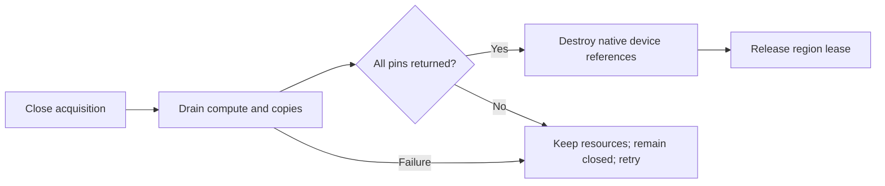

A failed/throwing drain or an outstanding pin retains the executable and lease and leaves acquisition closed. Reentrant binding/retirement callbacks are rejected. Successful detach destroys native resources before releasing the lease; repeated detach is a no-op. Quiesce closes acquisition without itself synchronizing or releasing anything.

Destruction does not implicitly synchronize a backend. Normal coordinated shutdown must call detach. If the binding owner disappears first, queued users must keep their common execution pins until completion; those pins retain both native resources and their leased storage. The executable owns any host dependencies it needs during that interval.

### TDD and validation

The initial stub produced nine failed assertions across eight cases before implementation. The final CPU suite passes **15 cases / 3,097 assertions**. Coverage includes undersized and mismatched grants, absent/misaligned/overflowing addresses, invalid geometry, construction failure/exception, temporary retention when a factory releases the caller handle, reentrancy, quiesce, failed-drain retry, pending pins, destruction order, rebinding, and independent host identity/lifetime.

Two steady-state checks verify 1,000 acquisitions without creating additional region leases or changing arena generation, and 1,000 acquisitions with exactly one total base-address lookup (at bind).

Real CUDA runs pass **16 cases / 3,108 assertions** with UVM disabled and enabled. They reject the ordinary CUDA type, bind the explicit device-local lease, issue real asynchronous H2D/D2H work, and verify completion before native destruction and final lease release. Two virtual devices on the same GPU pass **17 cases / 3,111 assertions**, including wrong-device rejection.

All **17 focused suites** pass in CPU Debug, CUDA Debug, CPU ASan with leak checking, and CPU UBSan. Both UVM modes pass Compute Sanitizer memcheck with zero errors and zero bytes leaked. Strict `-Wall -Wextra -Werror -Wconversion -Wsign-conversion -pedantic` checking passes for the new implementation.

```sh
cmake --build build-device-memory-infra --target test-kv-stream-binding -j 20
ctest --test-dir build-device-memory-infra -R '^test-kv-stream-binding$' --output-on-failure
cmake --build build-device-memory-infra-cuda --target test-kv-stream-binding -j 20
build-device-memory-infra-cuda/bin/test-kv-stream-binding --cuda
GGML_CUDA_ENABLE_UNIFIED_MEMORY=1 build-device-memory-infra-cuda/bin/test-kv-stream-binding --cuda
GGML_CUDA_DEVICES=2 GGML_CUDA_ENABLE_UNIFIED_MEMORY=1 build-device-memory-infra-cuda/bin/test-kv-stream-binding --cuda
GGML_CUDA_ENABLE_UNIFIED_MEMORY=1 compute-sanitizer --tool memcheck --leak-check full --error-exitcode 99 build-device-memory-infra-cuda/bin/test-kv-stream-binding --cuda
```

Explicit `--cuda` is required to execute the hardware portion; the default test uses CPU/fake-native lifecycle fixtures. Repeat memcheck with UVM unset for the other mode. No physical multi-GPU, Windows, TSan, long-context throughput, real host-KV storage, or streamed-attention qualification is claimed here.

Production services and configuration remain untouched. Stage **5.3a**, documented below, adds independent authoritative host storage and pinned-memory lifetime.

## Substage 5.3a: authoritative host storage and strict pinned-memory ownership

Added `src/llama-kv-stream-host.h/.cpp`, the optional CUDA KV-host registry adapters, and dedicated host-owner/backend tests. The owner contains canonical host bytes, not device pool storage or an arena lease. Device-side executables can retain its shared ownership through stage 5.2b without tying host lifetime to an arena generation or device-binding revision.

### Checked storage layout

The owner validates the independent K/V storage/write/attention capability contract before allocation. Context capacity is padded to whole pages with checked arithmetic. Each full-attention execution ordinal has one contiguous K plane followed by an aligned V plane; each layer's stride is aligned separately, including cases where the plane byte counts are not alignment multiples. Aggregate layer storage and alignment additions are overflow-checked.

Creation allocates and zeros the canonical storage span. Import retains an exact-type host buffer and preserves its bytes. Both reject missing/undersized storage and out-of-range address arithmetic; creation also rejects a backend that silently returns a different fallback buffer type.

The allocator request includes at most alignment-minus-one bytes beyond the canonical span so even a host allocator with weaker base alignment can supply aligned planes. `bytes()` reports canonical storage including inter-layer padding, while the backing buffer reports the full allocation. This is host-address alignment slack, not a VRAM safety reserve or a larger device KV pool.

The original context capacity, padded layout, shape, and caller-assigned nonzero cache ID remain with the host owner. Layer lookup returns bounded host pointers without allocating. Raw access is deliberately not yet a dirty-tracking or synchronization API: writes must be serialized against readers/copies until stage 5.3b adds content bookkeeping. Initialization to zero does not mark context tokens logically valid.

### CUDA allocation and registration contracts

The historical runtime at `d873e5db9` uses mapped pinned host allocation, with write-combining omitted under `_WIN32` because mapped write-combined decode writes had faulted under WDDM. The new strict allocator preserves that choice. The existing generic helpers are unchanged: their pageable-allocation fallback and read-only registration policy are not appropriate substitutes for mutable KV backing.

| Storage origin | Admission | Final cleanup |
| --- | --- | --- |
| New CUDA KV backing | `cudaHostAllocMapped`; additionally `cudaHostAllocWriteCombined` outside native Windows | `cudaFreeHost` |
| Caller-owned host buffer | A new writable `cudaHostRegisterMapped` registration; retain the owner | `cudaHostUnregister`, then release owner |
| Buffer view | Borrow bytes and retain the parent through existing GGML view ownership | Release the view/parent reference; do not independently free/unregister |

The private registry hooks are `ggml_backend_cuda_kv_host_buffer_type(int)` and `ggml_backend_cuda_kv_host_buffer_register(int, ggml_backend_buffer_t)`. Their caller-side resolvers verify device and exact buffer-type identity without linking llama to CUDA. Only the native CUDA adapter is enabled; no HIP/MUSA registration behavior is claimed.

Both allocation and registration fail explicitly when pinning is unavailable or `GGML_CUDA_NO_PINNED` is set. They do not use the generic `GGML_CUDA_REGISTER_HOST` opt-in/read-only path, do not fall back to pageable memory, and do not use UVM. A duplicate/existing registration is rejected without adopting or undoing it. Callers must not externally unregister a successful wrapper, and their owner buffer must keep its bytes alive.

Mapping is checked before publication. Host pointers and mapped GPU aliases are not assumed equal: future CUDA kernels must obtain the device alias rather than blindly use a CPU address. Imported storage inherits the caller's cache policy; this adapter does not add a write-combining hint to registration.

CPU tensor-copy callbacks are reused, with buffer base, clear, view, and destruction callbacks adjusted for the allocation/registration owner. Views clear only their bounded spans. Temporary native ownership handles allocation/registration failure cleanup, and successful registrations release their owner only after unregistering.

### Lifetime separation

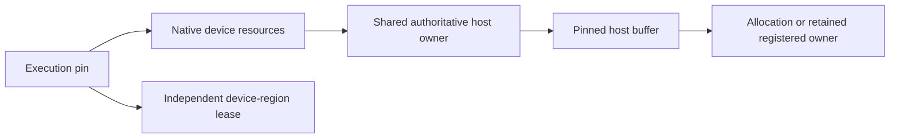

The host owner does not capture a particular device lease. A queued native executable must retain the host owner until completion, just as it retains device storage through the execution guard. The tests exercise pending detach with live pins and final release after completion. No implicit device synchronization is added to the host destructor.

### TDD evidence and limitations

The initial host stub failed 86 assertions; CUDA tests separately failed because the strict allocation/registration hooks did not exist. Final results:

- **8 CPU host-owner cases / 386 assertions**, including all 81 pairs of the nine online KV storage types, invalid/overflowing geometry before allocation, injected null/throwing allocators, exact-type fallback rejection, preserved imported contents, non-page-aligned unequal planes, and device-independent lifetime.
- **9 real-CUDA host-owner cases / 394 assertions**, adding pinned owner integration, registration-adapter import, and retained contents after caller handles are released.
- **5 CUDA backend cases / 44 assertions**, covering actual mapping flags and GPU writes, retained views, duplicate registration/allocation ownership, re-registration after cleanup, and recoverable impossible-size allocation failure. The separate disabled-pinning process also passes.
- All **18 focused CPU suites** pass in Debug, ASan with leak checking, and UBSan. All **22 selected CUDA-build suites** pass, including both new pinning modes and the existing device-local/UVM allocator tests.
- Compute Sanitizer reports zero errors and zero bytes leaked for both the backend and host-owner hardware suites. API-error reporting is disabled only for the backend suite's deliberate OOM/duplicate-registration calls; memory-error and leak detection remain active.
- All four CPU-referenced CUDA SCALE cases pass. Strict warning checking passes for the host-owner implementation.

```sh
cmake --build build-device-memory-infra --target test-kv-stream-host -j 20
ctest --test-dir build-device-memory-infra -R '^test-kv-stream-host$' --output-on-failure
cmake --build build-device-memory-infra-cuda --target test-kv-stream-host test-cuda-kv-host -j 20
ctest --test-dir build-device-memory-infra-cuda -R '^test-cuda-kv-host' --output-on-failure
build-device-memory-infra-cuda/bin/test-kv-stream-host --cuda
compute-sanitizer --tool memcheck --leak-check full --report-api-errors no --error-exitcode 99 build-device-memory-infra-cuda/bin/test-cuda-kv-host
compute-sanitizer --tool memcheck --leak-check full --error-exitcode 99 build-device-memory-infra-cuda/bin/test-kv-stream-host --cuda
```

The 81-pair tests validate storage geometry, not execution of 81 attention kernels. Native Windows flag selection is preserved and the hardware test has a Windows-specific expectation, but Windows execution was unavailable. Physical multi-GPU, HIP/MUSA/SYCL/Vulkan mapping, TSan, and long-context performance are not qualified here.

Production services, models, and compose configuration remain unchanged. Stage **5.3b**, documented below, adds writes, dirty rows, mutable tails, and content generations with synchronized mirror updates.

## Substage 5.3b: encoded writes, dirty rows, and content generations

Added `src/llama-kv-stream-content.h/.cpp` and `tests/test-kv-stream-content.cpp`. This is a correctness-first coherence layer over the independent host owner and coarse device binding. It does not add SET_ROWS kernels, graph construction, streamed attention, or asynchronous prefetch.

The reviewed reference distinguishes tracked dirty rows from full invalidation: its direct host set/memset/clear callbacks reset resident metadata and advance the runtime generation. The new layer preserves that distinction while separating content identity from arena placement. Explicit encoded writes dirty only intersecting rows; external restores/replacement invalidate the whole mirror.

### Transactional encoded writes

A write span selects a layer, K or V, and a byte range in that encoded plane. The API neither quantizes floating-point inputs nor interprets partial quant blocks as complete values. It bounds every range against the validated plane layout.

`prepare()` validates the entire batch and snapshots all sources before mutation, including sources aliasing the destination cache. The move-only ticket retains its originating state and content generation. Invalid batches/allocation failures preserve an existing output ticket. Cancellation or destruction releases the snapshot without changing host bytes.

`commit()` rejects cancelled, foreign, or stale tickets. A valid batch applies overlapping patches in input order and advances content generation once. Every token row intersecting a changed byte becomes dirty in that layer/plane; a row includes all KV heads. K and V have independently derived encoded row sizes. Empty batches are no-ops. Large checkpoint restores must use bounded batches because staging duplicates the submitted encoded payload.

Only one tracker may be the mutation authority for a backing allocation. Independent trackers over aliased host bytes are not coherent. Raw writes through existing host pointers must be externally serialized and reported through `invalidate()`; zero-filled storage and dirty marks do not establish logical token validity.

### Compact mirror bookkeeping

The bitmap stores one dirty bit per token row per K/V plane. For 16 attention layers at 262,144 padded tokens this is 1 MiB, rather than a per-row 64-bit generation table. Initial rows are dirty until explicitly copied. Partial-page selections do not force uploads of unrelated rows or another plane.

Updates handle partial first/last bitmap words and skip clean/full words when finding dirty runs. The implementation does not allocate an arena region or a bitmap entry for each page operation. There is still a bitmap scan over requested ranges; no steady-state speedup is claimed without the later runtime benchmarks.

| Event | Content generation | Mirror epoch | Effect |
| --- | --- | --- | --- |
| Committed nonempty encoded batch | Advance | Unchanged | Dirty intersecting K/V rows |
| External completed host change: `invalidate()` | Advance | Unchanged | Dirty all rows; supersede pending writes |
| Replace backing, even with the same cache ID | Advance | Advance | Prepare fresh bitmap, preserve supplied bytes, reject old tickets |
| Device rebind/repartition: `reset_mirror()` | Unchanged | Advance | Dirty all rows; pending host writes remain valid |

These counters are independent of arena generations and binding revisions. Counter exhaustion is rejected rather than wrapped. Replacement prepares metadata before publication and releases old backing after the new metadata is consistent.

The tracker represents one logical mirror, not arbitrary ring-slot/page-location coherence. A caller must reset it on every relevant device mapping change, even if pointer values or arena generations match. If replacement changes geometry, the caller must also rebuild or validate the device mapping; replacing a host object does not make an old destination layout compatible. Ring-slot identity and event ordering remain responsibilities of later runtime stages.

### Synchronized mirror update baseline

`flush()` validates all requested ranges before copying and emits contiguous dirty source runs only. The callback receives layer/plane coordinates, source bytes, cache ID, content generation, and mirror epoch. Destination mapping belongs to the adapter. Overlapping requested ranges may repeat copies; callers should supply disjoint ranges when that duplication is unnecessary.

Tracked writes, replacement, invalidation, and reentrant flush are blocked during callbacks. Every callback must finish all accesses before returning or throwing, including its failure path. The actual CUDA test uses synchronous GGML tensor writes. An asynchronous callback that merely enqueues DMA would violate this interface; asynchronous readiness/consumption comes later.

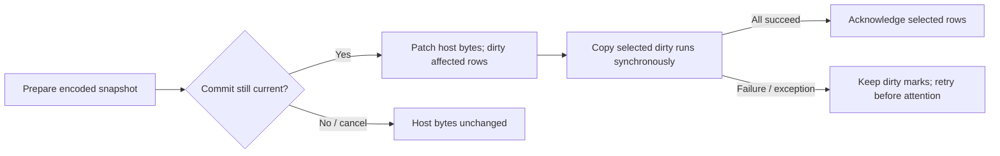

Acknowledgement occurs only after all requested copies succeed. Partial device writes can occur before failure, but all relevant dirty marks are retained; those ranges must not be consumed as a valid mirror until retry succeeds. Readiness does not replace the coordinator's global admission gate. The caller must retain host/device dependencies for any other in-flight compute or mapped-host access.

### TDD and validation

The initial ten cases failed 25 assertions against stubs. The final suite has **14 CPU cases / 150,480 assertions** and **15 real-CUDA cases / 150,503 assertions**.

Coverage includes partial rows across page boundaries, K/V independence, cancelled/moved/stale/foreign tickets, invalid-batch atomicity, aliasing/overlapping writes, empty ranges, same-ID and same-backing replacement/restoration, copy failure/exception, reentrancy, and retained ownership after the tracker owner disappears. An independent row-by-row oracle checks 136 write/flush cycles across four planes and 136 padded rows, including 64-bit word boundaries and failed-copy retries. All 81 online K/V pairs use independent GGML row-size expectations for encoded copy lengths; this is byte-coherence testing, not 81 attention-kernel or model-quality tests.

The CUDA test allocates pinned authoritative host storage and a real device-local arena region, binds it through stage 5.2b, and holds an execution pin across the copies. It compares all canonical bytes after a partial-row patch and after an external restore with unchanged arena generation and binding revision. This is a flat leased test mirror; production resident/ring plane placement and attention integration remain stage 5.4a and later.

All **19 focused suites** pass in CPU Debug, CUDA Debug, CPU ASan/leak checking, and CPU UBSan. Compute Sanitizer reports **zero errors and zero bytes leaked** for the CUDA test with UVM disabled and enabled. Strict warning checking passes for the implementation.

```sh
cmake --build build-device-memory-infra --target test-kv-stream-content -j 20
ctest --test-dir build-device-memory-infra -R '^test-kv-stream-content$' --output-on-failure
cmake --build build-device-memory-infra-cuda --target test-kv-stream-content -j 20
build-device-memory-infra-cuda/bin/test-kv-stream-content --cuda
GGML_CUDA_ENABLE_UNIFIED_MEMORY=1 build-device-memory-infra-cuda/bin/test-kv-stream-content --cuda
compute-sanitizer --tool memcheck --leak-check full --error-exitcode 99 build-device-memory-infra-cuda/bin/test-kv-stream-content --cuda
```

No Windows, physical multi-GPU, TSan, asynchronous event ordering, model-output accuracy, or throughput qualification is claimed by this stage. Production services/configuration and existing checkpoint/cache data remain unchanged.

Stage **5.4a**, documented below, adds resident planes and ordinary all-resident attention before the 5.3c write optimization, following the roadmap's explicit dependency order.

## Substage 5.4a: leased resident planes and ordinary attention

Added `src/llama-kv-stream-resident.h/.cpp` and `tests/test-kv-stream-resident.cpp`. This native resource object is created through the stage-5.2b binding factory and retains the stage-5.3b content owner. It provides ordinary `GGML_OP_FLASH_ATTN_EXT` nodes over policy-derived resident K/V views. No new attention kernel or production dispatch path is introduced.

The reviewed reference at `d873e5db9` keeps the ring at the front of the pool, computes each resident layer's base from its capacity, and uses token-major head strides. When all required chunks are resident, it avoids streamed partial-attention work. This stage reproduces those storage and ordinary-dispatch properties with leased memory rather than allocating a second KV pool.

### Exact plane binding

The factory checks the cache ID, shape, layer count, fixed budget, backend buffer compatibility, and direct-attention policy. It materializes the initial resident/ring layout from 5.1b. Each layer's K/V offsets come from that layout, including the reserved ring and capacity-sized K plane; they are not copied from the host allocation's layer stride or current live length.

The backing tensors are flat typed roots. This matters for CUDA: allocating a quantized root whose first dimension is merely the head dimension can request additional matrix-row padding. Flat roots naturally satisfy the relevant padding for the supported page geometry. The adapter verifies that the backend's allocation size equals the exact plane size before binding, so it cannot silently consume bytes from V, the next layer, or scratch.

The roots borrow the leased buffer. Graph views expose `[head_dim, padded_keys, kv_heads, 1]` with token stride equal to all heads' encoded row bytes and head stride equal to one encoded row. K and V sizes/strides are independent. The factory constructs only metadata and borrowed bindings; it does not upload, clear, or allocate KV device storage.

### Synchronization and ordinary dispatch

`synchronize(active_tokens)` rejects zero/out-of-host-capacity contexts and any extent whose padded keys exceed a resident plane. It currently uses 256-key padding and requires compatible page geometry. No adaptive repartition or partial-resident fallback is attempted.

Before overwriting resident inputs it synchronizes the backend. On first use it resets mirror bookkeeping, then flushes only dirty runs through synchronous GGML tensor writes into the correct K/V roots. Upload byte/call counters report completed transfers for that attempt. Clean repeated synchronization uploads zero bytes. A changed V row refreshes only that row, not the full page or K plane.

Readiness requires successful synchronization for the requested active length and matching content generation/mirror epoch. Failed validation or copy leaves readiness closed; copy exceptions propagate with admission restored and dirty marks retained for retry. Compatible replacement can refresh existing roots; changed encoding/geometry requires a new binding and is rejected.

`attention()` validates stack descriptors before calling GGML constructors, so malformed Q/mask metadata is rejected before asserting constructors run. It checks the generic attention contract and the actual backend's ordinary attention support, then creates leased K/V views and a standard Flash Attention node. Q, mask, and output workspace remain caller-owned.

The initial interface uses F32 queries, a finite positive scale, no sinks/ALiBi/softcap arguments, and one sequence. A supplied mask must hide padded/future keys; no-mask attention is accepted only when the active length needs no padding. This adapter checks mask metadata, not the device-resident mask values. The caller must gate execution on readiness for the graph's active extent.

Conversion-only configurations, contexts needing streamed pages, and unsupported native type pairs are rejected. They are not silently routed to an unimplemented fallback. Conversion/streamed partial attention remains in its later substages.

### Ownership and graph lifetime

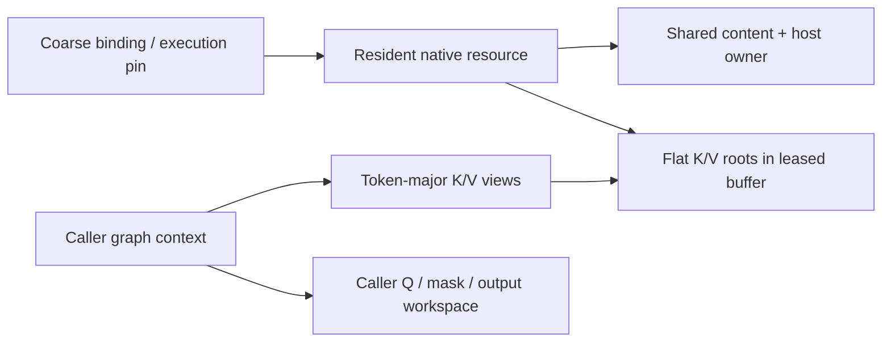

The backend must outlive these native resources. External graphs, including captures, must hold a binding execution pin for their entire usable lifetime and retire their native captures before returning that pin. A separate CUDA executor guard in the tests retains the same lease and retires its graph entries before graph metadata is freed. The outer binding cannot destroy resident roots while an external graph pin remains outstanding.

This is still an owner-thread-only, single-logical-mirror adapter. It is not an automatic scheduler of host mutations, multiple mirrors, graph rebuilds, or producer dependencies. New SET_ROWS producers and server graph integration must respect the existing synchronization and admission contracts.

### TDD and numerical evidence

An ordinary head-major attention control first passed an independent scalar causal-softmax oracle. The resident tests then failed against stubs. Final results are **12 CPU cases / 131 assertions** and **13 CUDA cases / 245 assertions**.

The oracle dequantizes the actual encoded cache values and computes scores/softmax in double precision. It does not assume that quantization preserved the original floats. The same-backend ordinary head-major allocation and leased token-major paths are each compared with this oracle using a maximum absolute error threshold of 1e-3.

Coverage includes:

- F16 CPU/CUDA decode and prefill with 1, 8, 33, and 257 queries, causal masks, GQA, and different attention layers.
- 129/257-token contexts and 769 active tokens padded to 1,024 keys, exactly filling resident capacity.
- CUDA Q8_0/Q4_0, Q4_0/Q8_0, and Q5_1/Q4_1 pairs through ordinary and resident paths.
- Exact policy offsets, no extra quant-root padding, and untouched ring bytes.
- Dirty-tail numerical changes, one-row V upload accounting, and zero-byte clean refresh.
- Copy-exception retry, smaller-context replacement without rebinding, mirror reset, stale geometry, malformed queries/masks, insufficient residency, and conversion rejection.
- External graph pins preventing native destruction and three repeated CUDA dispatches per numerical evaluation through the executor guard.

All **20 focused suites** pass in CPU Debug, CUDA Debug, CPU ASan/leak checking, and CPU UBSan. Compute Sanitizer reports **zero errors and zero bytes leaked** with UVM disabled and enabled. Strict warning checking passes for the new implementation.

The experimental CUDA build originally had `GGML_CUDA_FA_ALL_QUANTS=OFF`, which makes ordinary CUDA attention reject mixed K/V types. It was rebuilt with that option enabled for these tests. This reuses existing CUDA support; it is not a new mixed-quant kernel implementation and did not change production images or flags.

```sh
cmake --build build-device-memory-infra --target test-kv-stream-resident -j 20
ctest --test-dir build-device-memory-infra -R '^test-kv-stream-resident$' --output-on-failure
cmake -S . -B build-device-memory-infra-cuda -DGGML_CUDA_FA_ALL_QUANTS=ON
cmake --build build-device-memory-infra-cuda --target test-kv-stream-resident -j 20
build-device-memory-infra-cuda/bin/test-kv-stream-resident --cuda
GGML_CUDA_ENABLE_UNIFIED_MEMORY=1 build-device-memory-infra-cuda/bin/test-kv-stream-resident --cuda
compute-sanitizer --tool memcheck --leak-check full --error-exitcode 99 build-device-memory-infra-cuda/bin/test-kv-stream-resident --cuda
```

This establishes the first milestone-5 implementation checkpoint for the tested scope: authoritative host state, leased resident mirrors, and correct ordinary all-resident attention execution. It does not establish whole-model quality, long-context throughput, Windows/physical multi-GPU support, or all quant/backend combinations. The CLI/server remains unchanged; streamed attention and asynchronous overlap are not enabled.

Stage **5.3c**, documented below, adds bounded batched SET_ROWS/write staging after capturing the required ff4d3bdef baseline. No new checkpoint branch is created automatically.

## Substage 5.3c: bounded batched SET_ROWS production

Added `src/llama-kv-stream-writer.h/.cpp`, resident writer configuration/publication methods, generated transactional payload support, and `tests/test-kv-stream-writer.cpp`. No CUDA quantization kernel was modified.

The production reference at `d873e5db9` quantizes a consecutive row range into GPU scratch, then copies the encoded batch to authoritative host storage and, when available, its resident mirror. The new implementation uses ordinary `GGML_OP_SET_ROWS` with relative indices `0..tile_rows-1` to achieve that contiguous staging without a new destination-base variant of the quantization kernel. The host/resident destination offset is applied separately.

### Frozen baseline before library changes

A benchmark harness was added and run against committed library code **ff4d3bdef**, before changing `src/` or GGML library code. Both controls use the same ordinary GPU SET_ROWS quantization:

- Coalesced control: one encoded D2H download, existing content prepare/commit, then resident H2D refresh.
- Row-wise control: one D2H download per encoded row, followed by the same batched host commit and coalesced resident refresh.

This is a synthetic K-plane producer benchmark, not a model prefill/decode benchmark. Fixed parameters: RTX 5070 Ti, F32 source already on GPU, head dimension 256, four KV heads, Q8_0 K / Q4_0 V, one cache layer, context capacity 1,024, pool **6,815,744 bytes**, UVM disabled, CUDA FA all-quants test build enabled. Each mode uses 10 warmups and 100 measured calls; source pointer and shape remain stable. Setup, initial input/index uploads, graph construction warmup, and producer-source changes are excluded. Production was not stopped, so these are indicative local timings, not isolated latency guarantees.

Frozen ff4d3bdef results, in microseconds:

| Rows | Encoded bytes | Coalesced median / p95 | Row-wise median / p95 |
| --- | --- | --- | --- |
| 32 | 34,816 | 35.844 / 44.649 | 168.303 / 191.261 |
| 256 | 278,528 | 78.674 / 92.751 | 1,174.280 / 1,240.520 |
| 512 | 557,056 | 135.893 / 150.588 | 2,342.680 / 2,408.150 |

These controls transferred the encoded byte count once D2H and once H2D. Row-wise D2H call counts were 32/256/512; coalesced D2H and H2D each used one call.

### Scratch, source, and cache contracts

`configure_writes(max_batch_rows)` takes the caller's physical micro-batch ceiling (for example, ub), not a hardcoded 256-row limit. It places encoded scratch and aligned I64 relative indices in the already-leased unused ring region. Actual backend quantized allocation padding is included when choosing capacity. If the configured batch is larger than the ring tile capacity, generation uses multiple tiles; it never enlarges the device pool.

The initial writer admits completed dense F32 `[head_dim * heads, rows]` sources and consecutive destination rows within both host and resident capacity. It rejects wrong devices/layouts, oversized batches, invalid layer/operand/ranges, and unsupported SET_ROWS dispatch. Sparse/duplicate indices, F16 sources, and writes beyond resident capacity are not silently reinterpreted as this fast path; callers must retain a supported baseline or later adapter path.

Each source is represented by an independent data-only leaf alias. Building the quantization graph must not traverse and recompute the original model graph. A regression test gives the completed source producer metadata and verifies that its existing values are used unchanged.

One cached writer graph bounds metadata and retained-source ownership. Shape/type/source changes replace that graph rather than accumulating variants. `release_write_workspace()` retires it and releases its retained input buffer before a future phase transition reclaims prefill workspace. It does not free the KV pool. Callers must coordinate any source-workspace leases and invoke this hook while quiescent; this stage is not yet registered with the phase-transition/server graph consumer.

Reported device scratch covers encoded staging plus relative indices. The private host payload is bounded by the configured physical batch and encoded row size. Source activation storage, metadata, CUDA graph/driver allocations, and the authoritative cache are separate from those counters. The test source/control buffers are present in all benchmark modes. No VRAM safety reserve or additional KV device allocation is introduced.

### Ordered production and atomic host publication

`prepare_generated()` shares the existing transaction validation and ownership machinery, but lets a synchronous producer fill private ticket bytes directly. Input data pointers must be null. Failure preserves existing tickets and authoritative host bytes; cancellation discards the generated payload.

For each tile, SET_ROWS, D2H download, and D2D resident publication are ordered on the existing backend stream. The tile drains before scratch reuse and before the generated callback can return. The API therefore remains synchronous even though its copy submissions use async backend calls. This does not implement a dedicated copy stream, cross-layer lookahead, or the later producer/consumer event pipeline.

The host payload is cacheable transaction storage, followed by a CPU copy at commit. Unlike the reference's direct D2H into authoritative host bytes, this retains the 5.3b atomic/cancellable host-publication contract. No redundant H2D refresh is needed for rows already published D2D.

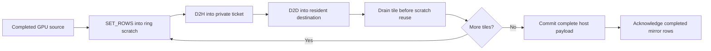

D2D writes are speculative until the complete host batch commits. If a later tile fails, all queued accesses are drained before the private payload is freed. Host bytes remain unchanged before commit, resident readiness stays closed, and mirror bookkeeping is invalidated so the next synchronization restores canonical bytes. If mirror invalidation cannot advance its epoch, the resident object stays poisoned and requires rebinding. Post-commit acknowledgement failure also leaves the mirror invalid rather than admitting stale attention.

The caller holds a binding pin and source ownership until return, then calls `synchronize(active_tokens)` before attention. Other dirty/padded rows can still require synchronization uploads; zero H2D applies to the completed D2D row ranges, not every possible cache state. Failure counters are diagnostic, not a complete hardware trace of partially submitted operations.

### Measured optimization and regression check

The first staged version improved 256/512-row writes but was about 5% slower at 32 rows. Removing an upfront drain reduced that overhead, but a small difference remained. The final refinement queues the quantization and both transfers behind one tile completion wait. A queued-reader test confirms that earlier backend work reads old resident values before they are overwritten.

Post-refinement measurements, same parameters, in microseconds:

| Rows | Coalesced median / p95 | Staged median / p95 | Interpretation |
| --- | --- | --- | --- |
| 32 | 35.835 / 42.798 | 35.417 / 36.656 | Roughly equal at this scale |
| 256 | 78.372 / 85.047 | 67.769 / 71.013 | About 14% lower median |
| 512 | 135.248 / 147.735 | 125.124 / 128.811 | About 7-8% lower median |

The contemporaneous row-wise medians were 167.558, 1,176.490, and 2,345.490 microseconds. Staged calls in this ample-ring benchmark used one quantization graph submission, one D2H copy, one D2D copy, and **zero H2D refresh bytes/calls**. A tight ring can require multiple tiles and submissions. Counts describe explicit encoded transfers, not driver-internal PCIe packets or UVM migrations.

The existing coalesced control remained close to its frozen baseline. These figures do not establish full-model prefill gains, cold/source-changing graph costs, every quant's performance, or improvement at every batch size.

### TDD and qualification

The original producer control passed before new library code was added. Generated-ticket and staged-writer tests then failed against stubs. Final results: **10 CPU cases / 607 assertions** and **10 CUDA cases / 609 assertions**.

Coverage includes all nine online destination encodings across six K/V pairs, both planes, and batches of 1, 7, 256, 257, and 512 rows; encoded output is compared byte-for-byte with ordinary SET_ROWS on the same backend. Tests also cover scratch bounds/reuse, smaller final tiles, invalid input/configuration, content-generation preservation, queued-reader ordering, source-graph isolation, and explicit cached-source release.

A failure injected after the second tile's real copy verifies that queued DMA completes before ticket teardown, host data stays unchanged, and the mirror is restored from canonical bytes before retry. The CPU test targets its actual host-copy callback; the CUDA test targets the queued native copy hook.

All **21 focused suites** pass in CPU/CUDA Debug and CPU ASan/leak checking/UBSan. CUDA memcheck reports **zero errors and zero bytes leaked** with UVM disabled and enabled. Strict warning checking passes for the writer, resident adapter, and content implementation. No quantization kernel or ordinary SET_ROWS operator was changed.

```sh
cmake --build build-device-memory-infra --target test-kv-stream-writer -j 20
ctest --test-dir build-device-memory-infra -R '^test-kv-stream-writer$' --output-on-failure
cmake --build build-device-memory-infra-cuda --target test-kv-stream-writer -j 20
build-device-memory-infra-cuda/bin/test-kv-stream-writer --cuda
env -u GGML_CUDA_ENABLE_UNIFIED_MEMORY build-device-memory-infra-cuda/bin/test-kv-stream-writer --bench
compute-sanitizer --tool memcheck --leak-check full --error-exitcode 99 build-device-memory-infra-cuda/bin/test-kv-stream-writer --cuda
```

`--bench-baseline` runs only the row-wise/coalesced controls; `--bench` includes the staged implementation. The frozen measurements above preserve the pre-change reference independently of later recompilation.

This remains a synchronous, test-only producer boundary, not an in-graph SET_ROWS interception or server integration. The caller must provide completed activation tensors; invoking this nested graph executor inside an active backend capture is not supported. Native Windows, other accelerator backends, physical multi-GPU, TSan, and full-model throughput are unqualified. Producer encoding coverage does not imply native attention support for every tested type.

Production services, model/checkpoint/cache data, and compose configuration remain unchanged. Stage **5.4b**, documented below, adds the partial-result and stable merge contract before streamed device integration.

## Substage 5.4b: common partial-attention result and stable merge contract

Added `ggml/src/ggml-kv-stream-partial.h/.cpp` and `tests/test-kv-stream-partial.cpp`. The common GGML layer now defines checked partial-result layout, a host-readable representation, and CPU reference merge/normalization. It does not launch a partial-attention or merge kernel.

### Production reference audit

The reviewed production code is `d873e5db9`: `kv_stream_accumulate_chunk_results`, `kv_stream_normalize_chunk_results`, the vector partial exporter, and the MMA partial exporter. Their representation is an **unnormalized** weighted-value vector plus a maximum and normalization sum, not a normalized attention output for each block.

The older `src/llama-kv-stream-softmax.cpp` helper was also inspected, but not treated as the production implementation. In particular, it rejects empty contributions and does not check every FP32 narrowing result. The new reference explicitly defines those cases.

The CUDA vector kernel divides by its sum and omits partial metadata when its split grid dimension is one. The reference caller restricts vector splits to 2/4/8/16. A future adapter must not feed that single-split ordinary output into this merge contract. The MMA exporter has a distinct explicit partial-output mode and can produce one partial. **One part is valid in the common representation; it is not proof that every kernel exports a partial with a one-split launch.**

Both reviewed producer paths and the production merge use natural-exponential rescaling. Any backend using a different internal exponent convention must convert/export consistent metadata.

### Packed layout and meaning

For each logical row and disjoint contribution, the producer exports:

```text
m = local maximum in the score's natural-exponential coordinates
L = sum(exp(score - m))
U = sum(exp(score - m) * V)       # unnormalized vector
```

Scores must already include the appropriate scale, causal/padding masks, and supported bias/softcap treatment. The merge cannot infer missing masks or detect duplicated/missing KV contributions. Producers must agree on row identity and supply the intended disjoint coverage.

| Plane | Index | Representation |
| --- | --- | --- |
| Numerator | `(row * parts + part) * width + channel` | FP32 |
| Metadata | `row * parts + part` | `max_logit`, `normalizer`: two FP32 values |
| Merged accumulator | Same indexing with `parts = 1` | Still unnormalized |
| Final value | `row * width + channel` | Normalize only after accumulation |

For ordinary single-sequence GGML attention, `row = query * query_heads + head`. The metadata record is eight bytes with eight-byte alignment; size, alignment, and field offsets were checked against the installed CUDA 13.0 `float2` header.

The layout helper checks dimensions, products, alignment rounding, and metadata-tail addition before publishing offsets. Metadata follows the numerator plane at the requested power-of-two alignment, at least eight bytes. Raw views can point to separate planes and provide larger capacities, but only the declared prefix is read. Null, short, misaligned, and address-wrapping views are rejected before dereferencing. These checks do not prove that arbitrary caller-supplied pointers are readable, that device launch dimensions fit a particular kernel, or that the memory is actually allocated.

### Stable accumulation and empty rows

Choose M from **nonempty** contributions, then compute:

```text
M = max(m_i)
L = sum(exp(m_i - M) * L_i)
U = sum(exp(m_i - M) * U_i)
output = U / L
```

The same weights rescale both numerator and denominator. Averaging separately normalized block outputs loses their relative mass and is incorrect, especially for unequal blocks.

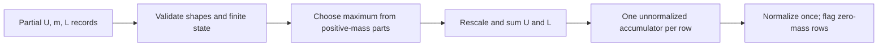

Zero mass is an identity only when its numerator is zero. Finite or negative-infinity empty maxima are accepted, including the reference CUDA finite sentinels, but ignored during maximum selection. Merged empty rows are canonicalized to negative-infinity maximum, zero mass, and zero numerator. This avoids both an empty sentinel dominating a real negative-logit block and `-infinity - -infinity`.

Normalization requires a one-part accumulator. An all-empty/all-masked row produces zero values and an explicit empty flag, rather than dividing zero by zero. A valid zero-valued attention result has the flag clear. This is the new contract's explicit empty-row policy; equivalence to ordinary GGML attention is tested on rows with visible keys, not by assuming ordinary all-masked behavior.

Nonempty metadata and all numerators must be finite, with positive mass. NaN/infinite/negative mass, invalid maxima, and inconsistent empty numerators are rejected with input/row/part diagnostics. FP64 reference intermediates are checked before FP32 publication; representational overflow is rejected even if a final normalized quotient could otherwise be finite. Underflow is allowed. This is a high-precision host reference, not a claim of bitwise equivalence to FP32 GPU summation or every floating-point environment.

Merge inputs may have different part counts but must share row/value dimensions. A previously merged accumulator can be included in the next merge. Temporary outputs make merge and normalization alias-safe and failure-atomic, including failure after some rows have been computed. The CPU reference allocates host vectors and validates payloads; it is not intended as the GPU hot path.

### TDD and validation

The initial stub failed 199 assertions before implementation. The final suite passes **13 cases / 48,614 assertions**:

- 160 partition configurations across row counts 1/6, token counts 1/7/33/257, and value widths 1/7/64/256, including unequal chunks, explicit empty chunks, causal tails, and fully masked rows.
- Independent unsplit stable-softmax comparison, and a separately executed ordinary GGML F16 attention graph checking query/head output order.
- Reverse/hierarchical merging with accumulator aliasing, plus 1,024 incremental block merges over 4,096 tokens.
- Extreme finite maxima, positive subnormal mass, valid zero results, canonical empty rows, and FP32 publication overflow.
- Checked byte/alignment overflow, prefix capacities, malformed raw views/partials, normalization preconditions, and unchanged output payloads on failure.

Pure reference comparisons use a 2e-5 absolute tolerance; the long incremental FP32-publication case uses 1e-4. The ordinary GGML attention comparison uses 1e-3 to account for its arithmetic path.

All **22 focused suites** pass in CPU Debug, CUDA Debug, CPU ASan/leak checking, and CPU UBSan. Strict warning checking passes for the new common implementation. Existing real-CUDA resident attention regressions pass (**13 cases / 245 assertions**), as do all four CPU-referenced CUDA SCALE cases. The CUDA-header ABI check is a compile-time layout check, not execution of a new partial kernel.

```sh
cmake --build build-device-memory-infra --target test-kv-stream-partial -j 20
ctest --test-dir build-device-memory-infra -R '^test-kv-stream-partial$' --output-on-failure
cmake --build build-device-memory-infra-cuda --target test-kv-stream-partial test-kv-stream-resident test-backend-ops -j 20
build-device-memory-infra-cuda/bin/test-kv-stream-partial
build-device-memory-infra-cuda/bin/test-kv-stream-resident --cuda
build-device-memory-infra-cuda/bin/test-backend-ops test -b CUDA0 -o SCALE
```

No new GPU partial/merge execution, GPU overflow diagnostics, asynchronous event ordering, Windows/other accelerator runtime support, TSan, or model throughput/quality qualification is claimed here. Later kernels must implement and test this contract rather than blindly copy the old unguarded empty-row division.

Production services, model/checkpoint/cache data, and compose configuration remain unchanged. Stage **5.4c**, documented below, integrates one explicitly staged block with ordered copy/compute.

## Substage 5.4c: one staged block and CUDA partial/merge execution

**Status:** committed at `28e7999a0`, following 5.4b (`6db00070d`). It is an opt-in consumer method, not server enablement or a throughput optimization.

### Execution and ownership

`llama_kv_stream_resident::compute_one_block` computes attention over a resident prefix and one nonresident tail block. It does not change the ordinary all-resident attention path or allocate a second full KV cache.

1. Validate both attention descriptions, the complete mask row pitch, tensor bounds, and workspace/pool aliases.
2. Refresh dirty resident rows through the existing content owner. Retire the cached writer before reusing its ring scratch.
3. Export resident-prefix partials with the existing CUDA F16 vector kernel.
4. Copy the live host tail into one bounded packed K/V block at the start of the ring. Zero padded rows so stale NaNs cannot contaminate masked attention.
5. Export tail partials with the same kernel and the correctly offset, row-strided causal mask.
6. Rescale and merge on the GPU; normalize once. Publish the staged result only after validation succeeds.

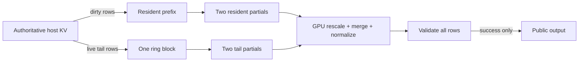

The caller holds the binding execution pin and keeps Q, mask, and output alive. The method retains a separate caller-owned partial-workspace lease until all operations complete. The registry extension is backend-neutral; its v1 CUDA adapter is synchronous and must be called outside active capture. Layout/numerical rejection returns false; CUDA execution errors retain the backend's existing error handling.

The ring contains only one staged KV block in this stage. Partial exports, normalized staging output, and the validation flag use a separate explicit device-local lease. This preserves a one-slot minimum ring and makes partial scratch part of caller budgeting, rather than hiding allocations in the CUDA pool. For four rows of width 256, the exact workspace is 20,740 bytes. The common layout helper checks dimensions, alignment, additions, and products before publishing offsets.

The authoritative host tail is uploaded on every call; it is not marked as persistent resident content. This handles updates to the last token without stale ring reuse. Upload statistics count actual host K/V payload bytes, excluding zero fills, merge traffic, and the four-byte validation readback.

### Native kernel integration and numerical contract

The adapter reuses `flash_attn_ext_vec<256,1,F16,F16,false>` with two splits for each range. Split count one is deliberately avoided because it produces already-normalized output. The two exported planes retain the 5.4b row/part/channel layout, and the metadata record is checked against CUDA's `float2`.

One detail found during integration: the native kernel shifts its maximum by `FATTN_KQ_MAX_OFFSET`. It is a valid exponential reference coordinate, not necessarily the literal maximum score. Numerator and normalizer use the same shift, so the existing stable merge remains correct; tests compare actual exported device partials with the CPU merge/normalization reference.

The correctness-first GPU merge uses FP64 intermediates across four contributions. It handles empty/all-masked rows as zero, ignores empty maxima when selecting the common reference, and checks malformed metadata, nonfinite numerators, inconsistent empty parts, and FP32 publication overflow. A separate normalized staging plane prevents partial public-output writes when a later row fails. This baseline intentionally includes synchronization and a four-byte device-to-host validation result; it makes no performance claim.

### TDD and validation

The initial stubs failed ten assertions while the ordinary attention control passed. Additional adversarial tests then exposed a full-mask row-pitch validation gap; the regression test failed before the validation was corrected.

The final real-CUDA suite passes **8 cases / 126 assertions**:

- One-slot ring with 256- and 512-token resident prefixes; tails of 1, 255, and 256 live tokens; query batches of 1, 8, 33, and 257.
- Independent scalar attention comparison, plus CPU merging of the actual GPU-exported partials.
- Exact-sized workspace at a nonzero parent offset; rejection of one-byte-short scratch, pool aliases, output/input aliases, unsupported quant pairs, extra tail blocks, oversized metadata, and malformed mask pitch.
- Fully masked output, initially NaN-filled ring storage, mutable last-row refresh, and exact live-tail upload counts.
- GPU merge rejection after earlier rows have been computed: invalid mass/maxima/numerators, inconsistent empty records, accumulation overflow, normalization overflow, and unchanged public output. Empty sentinels with large maxima do not dominate valid negative-score contributions.

All **23 focused suites** pass in CPU Debug, CUDA Debug, CPU ASan with leak checking, and CPU UBSan. Existing real-CUDA resident attention passes **13 cases / 245 assertions**, and the four CPU-referenced CUDA SCALE cases pass. Compute Sanitizer memcheck reports **zero errors and zero leaked bytes** for the expanded block suite with UVM disabled and enabled. The new CUDA translation unit also compiles with flash attention disabled; the optional getter returns null in that configuration. That is a translation-unit compatibility check, not a separate full no-FA build/runtime qualification.

```sh
cmake --build build-device-memory-infra-cuda --target test-kv-stream-block test-kv-stream-resident test-backend-ops -j 20
build-device-memory-infra-cuda/bin/test-kv-stream-block --cuda
build-device-memory-infra-cuda/bin/test-kv-stream-resident --cuda
build-device-memory-infra-cuda/bin/test-backend-ops test -b CUDA0 -o SCALE
env -u GGML_CUDA_ENABLE_UNIFIED_MEMORY compute-sanitizer --tool memcheck --leak-check full --error-exitcode 99 build-device-memory-infra-cuda/bin/test-kv-stream-block --cuda
GGML_CUDA_ENABLE_UNIFIED_MEMORY=1 compute-sanitizer --tool memcheck --leak-check full --error-exitcode 99 build-device-memory-infra-cuda/bin/test-kv-stream-block --cuda
```

### Deliberate boundary

This adapter supports F16/F16 K/V, F32 Q/output, head size 256, one sequence, a supplied padded mask, and no attention sinks, bias, or softcap. Other pairs are rejected, not silently converted. Generic quant dispatch remains **5.4e**. No ROCm/SYCL/OpenCL/Vulkan adapter, asynchronous overlap, multi-block traversal, capture integration, model benchmark, or production-server enablement is claimed.

Production services, model/checkpoint/cache data, and compose configuration remain unchanged. Stage **5.4d**, documented below, extends this baseline to bounded multi-block traversal.

## Substage 5.4d: bounded multi-block traversal and incremental accumulation

**Status:** committed at `59591b6da`, following 5.4c (`28e7999a0`).

### Bounded storage and ordered execution

`compute_streamed` traverses any number of nonresident blocks. It uses the selected layer's actual capacity, rounded active extent, and the existing policy's ring slot count. A layer can be fully resident, partially resident, or entirely streamed. The earlier `compute_one_block` remains a narrow admission wrapper over this implementation.

Ring storage now follows the complete policy-derived planes: all K slots first, then the aligned V plane. Slot `i` selects `i * page.k_bytes` in K and `ring.v_offset + i * page.v_bytes` in V. It does not treat each slot as a packed K+V record; this preserves contiguous same-operand storage for later batched copies.

Blocks use `block_index % ring_slots`. Each native attention call completes all query work before returning, and each intermediate fold completes before the next block is admitted. Consequently a wrapped slot cannot be overwritten while a query still reads it. This is a synchronous correctness baseline, not an asynchronous prefetch queue.

The backend extension is version 2, appending empty-initialization and unnormalized-fold operations. After an intermediate block, the first export holds one accumulated `(m,L,U)` record per row plus an empty second split. The second export is overwritten by the next block. Only the last block triggers normalization and publication. Both exports and staging output retain the exact 5.4c workspace layout: scratch depends on query rows and head width, not context length, number of blocks, or ring size.

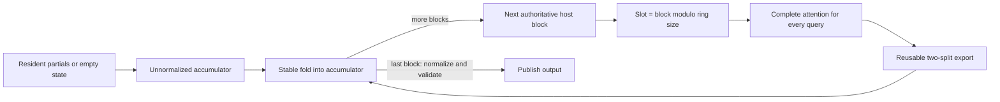

The implementation always uploads the live tail bytes for this invocation and clears padded rows in the last slot. It does not retain a cross-request ring content cache. Tests inspect the final bytes of each used K/V slot, not just output numerics, and verify that H2D volume does not multiply with query batch width.

### Placement and ownership

The idle factory accepts an optional validated policy snapshot. This makes concentrated placement executable without introducing live repartitioning. Capacities are fixed until the owner constructs another executable; evaluating a shorter or longer active context does not reinterpret those capacities or implicitly change the policy.

Zero-capacity layers keep tensor metadata but allocate no resident tensor storage. Resident refresh uses `min(active_padded_tokens, layer_capacity)` independently for each layer. The existing all-resident synchronization API still rejects a context that does not fit every layer. Policy startup minima remain unchanged; ring-only execution is tested using a valid post-adaptation snapshot rather than weakening initial admission.

This snapshot is local to the executable. It is not a publication of live policy changes into the binding or transition coordinator; that integration remains later work. Binding pins, retained workspace leases, backend completion, and cached-writer retirement retain the 5.4c ownership rules. Intermediate fold failure may invalidate scratch but never publishes public output; a retry reinitializes it from resident data or an empty contribution.

### Numerical hardening found by TDD

The initial multi-block stub failed 24 assertions. The expanded tests then exercised incremental folds whose intermediate normalized quotient would overflow even though their unnormalized values remain representable and later normalization succeeds. Folding must not normalize early.

These tests exposed fast-math `cvt.ftz.f64.f32` instructions in the emitted CUDA PTX: tiny positive FP32 masses were being flushed to zero during promotion. The merge adapter now uses explicit non-FTZ conversion instructions for widening inputs and rounding published FP32 accumulators/results. The native attention kernel's fast-math compilation is unchanged. This preserves the reference contract for subnormal payloads and avoids mistaking a positive-mass contribution for an empty one.

### Validation and remaining caveat

The final real-CUDA suite passes **14 cases / 542 assertions**, including:

- One, two, and three ring slots with more blocks than slots, repeated wraparound, exact slot payload checks, partial final blocks, and sequential execution of different layers/context lengths.
- Concentrated placements with unequal per-layer capacities, fully resident layers, zero-resident layers, and an entirely streamed fixed layout.
- Query batches of 1, 33, and 257 over multiple waves. Six tail blocks always use twelve K/V uploads, independent of query count.
- Independent scalar attention comparison and 37 incremental GPU folds compared with the CPU partial-result reference.
- Empty contributions, extreme reference coordinates, subnormal mass, malformed intermediate payloads, overflowing accumulators, deferred normalization, final-block failure, and successful retry without stale accumulator state.
- CPU-testable placement validation, rejection of inconsistent snapshots, and zero-resident metadata construction.

All **23 focused suites** pass in CPU Debug, CUDA Debug, CPU ASan/leak checking, and CPU UBSan. Existing real-CUDA resident attention passes **13 cases / 245 assertions**, the writer suite passes **10 cases / 609 assertions**, and all four CPU-referenced CUDA SCALE cases pass. UVM-disabled and UVM-enabled memcheck runs report **zero errors and zero leaked bytes**.

The isolated changed merge kernel passes racecheck with **zero hazards, errors, or warnings**. The unfiltered suite reports **19 vector-attention warning groups, zero errors**; the existing resident/ordinary-attention control also reports warnings in the unchanged `flash_attn_ext_vec` kernel (**36 groups, zero errors**). This is not a clean whole-suite racecheck result, nor proof that those inherited warnings are harmless. The vector-kernel warning needs separate investigation before broad kernel/performance qualification; no native attention-kernel synchronization change is included in this stage.

```sh
cmake --build build-device-memory-infra-cuda --target test-kv-stream-block test-kv-stream-resident test-kv-stream-writer test-backend-ops -j 20
build-device-memory-infra-cuda/bin/test-kv-stream-block --cuda
env -u GGML_CUDA_ENABLE_UNIFIED_MEMORY compute-sanitizer --tool memcheck --leak-check full --error-exitcode 99 build-device-memory-infra-cuda/bin/test-kv-stream-block --cuda
GGML_CUDA_ENABLE_UNIFIED_MEMORY=1 compute-sanitizer --tool memcheck --leak-check full --error-exitcode 99 build-device-memory-infra-cuda/bin/test-kv-stream-block --cuda
compute-sanitizer --tool racecheck --kernel-name kns=merge_kernel --error-exitcode 99 build-device-memory-infra-cuda/bin/test-kv-stream-block --cuda
compute-sanitizer --tool racecheck --error-exitcode 99 build-device-memory-infra-cuda/bin/test-kv-stream-resident --cuda
```

No asynchronous overlap, cross-layer prefetch queue, live policy transition, server enablement, throughput improvement, or broader backend/quant support is claimed. The device adapter remains F16/F16, head size 256, one sequence, a supplied padded mask, and no sinks/bias/softcap. Production services, compose files, models, and checkpoints remain unchanged.

Stage **5.4e**, documented below, adds supported quant dispatch and bounded F16 conversion. Dedicated copy-stream/event overlap remains **5.4f**.

## Substage 5.4e: generic quant dispatch and bounded F16 fallback

**Status:** committed at `a92107200`, following 5.4d (`59591b6da`).

### Capability admission and compiled dispatch

Version 3 of the optional backend extension adds capability discovery and validated, synchronous conversion into caller-supplied F16 planes. Query the backend before resolving the execution path and planning the pool. The capability query checks storage geometry, the actual CUDA SET_ROWS admission, compiled native kernel availability, and the existing F16 converter. A GGUF weight format having a dequantizer does not mean it supports online KV writes.

The current CUDA writer admits nine cache storage types: **F32, F16, BF16, Q4_0, Q4_1, Q5_0, Q5_1, Q8_0, IQ4_NL**. All 81 ordered K/V combinations can use the native or bounded-conversion path in the tested build. K and V are selected independently; there is no special Q8_0/Q4_0 allocation or dispatch path.

| Build configuration | Native pairs | Other writable pairs |
| --- | --- | --- |
| FA enabled, `GGML_CUDA_FA_ALL_QUANTS=ON` | All 49 combinations of F16/BF16/Q4_0/Q4_1/Q5_0/Q5_1/Q8_0 | 32 pairs use bounded F16 conversion |
| FA enabled, all-quants option OFF | F16/F16, BF16/BF16, Q4_0/Q4_0, Q8_0/Q8_0 | 77 pairs resolve to bounded F16 conversion |
| FA disabled | No streamed attention kernels | Optional adapter getter returns null |

Seven generated translation units, one per K type, expose the existing head-256, one-column vector kernel for compiled V types. This keeps compilation parallel without modifying the stock attention kernel, stock generated instances, or ordinary dispatch. Reduced-build guards omit unavailable instantiations entirely; a probe caught an NVCC discarded-branch template warning, which was fixed with preprocessor guards rather than suppressing diagnostics.

Cache planning still uses `ggml_kv_stream_resolve` and the quant-aware policy layout. The idle factory verifies the proposed path against actual backend capabilities before constructing tensor bindings. It rejects a fabricated native declaration for a fallback-only pair instead of silently using conversion space that the caller did not budget. Unknown, auxiliary, and non-writable weight-only types remain rejected.

### Memory layout and bounded execution

| Path | Resident and ring storage | Conversion storage | Partial workspace |
| --- | --- | --- | --- |
| Native | Original K/V encodings, with independent row/plane sizes | None | Existing caller-owned, query-sized lease |
| F16 fallback | Original K/V encodings, with independent row/plane sizes | One F16 K page and one F16 V page inside the pool's reserved conversion range | Same layout as native |

The device range validator now counts quant blocks along dimension zero, not scalar elements, and checks the alignment needed by vectorized accesses. K/V allocation, copy offsets, slot strides, and conversion destinations remain derived independently from the common geometry.

Fallback uses the existing CUDA converters, or D2D copying for an already-F16 operand. It does not allocate a conversion graph, use the CUDA temporary pool, or round-trip KV through the CPU. Converted values are consumed before that one-page workspace is reused.

Resident prefixes also become page-sized attention spans on the fallback path. Converting the whole prefix would violate the fixed conversion quota even if the encoded prefix fits in VRAM. Each converted resident/streamed page exports partials into the existing bounded accumulator, and normalization occurs only once at the end. Native resident spans retain the previous direct path.

For the test geometry (head dimensions 256, two KV heads, 256 tokens per page), the conversion quota is exactly **524,288 bytes**, regardless of context length or ring size. This number is a test expectation, not an allocation constant in the implementation. The quota is included in `pool_bytes` and reserved before splitting the remaining encoded page budget.

Fallback explicitly rounds/dequantizes values to F16. It is not bitwise equivalent to native attention and does not preserve the full exponent range of F32/BF16; the existing partial/merge checks reject invalid resulting numerical state. The ordinary attention API still refuses a policy requiring conversion, preventing accidental unbudgeted whole-context conversion through that API.

### TDD and validation

The initial matrix failed **52 assertions**: 48 newly requested native pairs and four fallback cases. The implementation fixed the F16-only admission, block-aware span validation, and missing bounded conversion path. Legacy tests that assumed fallback binding was unavailable were updated to verify the new admission boundary; the writer fixture now discovers actual capabilities and reserves conversion space rather than advertising every pair as native.

The final real-CUDA suite passes **19 cases / 656,795 assertions**:

- All 81 writable K/V pairs through the discovered path: 49 native and 32 converted in the all-quants build.
- The same 81 pairs forced through fallback, including one-slot ring reuse and a partial last page.
- Multi-page resident-prefix conversion, streamed-tail conversion, and direct-versus-fallback attention comparisons.
- Exact-size and one-byte-short F16 destination planes; alias, alignment, and stride rejection.
- 655,360 converted values checked against CPU F16 rounding for F32, BF16, Q8_0, Q4_1, and IQ4_NL sources.
- Invalid/auxiliary/non-writable type rejection and prevention of fabricated native capability bypassing the conversion quota.
- Existing concentrated placement, wide-query, dirty-tail, failure-atomicity, and incremental-merge regressions.

Attention comparisons use a **2e-4 absolute tolerance** for the new quant matrix and native/fallback comparisons; native quantized-K kernels may quantize Q differently from the scalar reference. Conversion-value checks compare encoded F16 values directly. These are deterministic correctness tests, not model perplexity, long-response quality, or throughput qualification.

All **23 focused suites** pass in CPU Debug, CUDA Debug, CPU ASan/leak checking, and CPU UBSan. The existing real-CUDA resident suite passes **13 cases / 246 assertions**, the writer suite **10 cases / 609 assertions**, and the four CPU-referenced CUDA SCALE cases pass. Full GPU memcheck runs with UVM off and on report **zero errors and zero leaked bytes**.

Standalone compiled dispatch probes check all 49 native-table entries with all-quants disabled (four available pairs) and FA disabled (zero pairs). These are dispatch compilation/link/execution checks, not full alternate-flag llama-server builds. The main all-quants build separately exercises every pair through conversion. The inherited vector-kernel racecheck warnings recorded in 5.4d remain unresolved; this stage makes no whole-kernel race-clean claim.

```sh
cmake --build build-device-memory-infra-cuda --target test-kv-stream-block test-kv-stream-resident test-kv-stream-writer test-backend-ops -j 20
build-device-memory-infra-cuda/bin/test-kv-stream-block --cuda
build-device-memory-infra-cuda/bin/test-kv-stream-resident --cuda
build-device-memory-infra-cuda/bin/test-kv-stream-writer --cuda
build-device-memory-infra-cuda/bin/test-backend-ops test -b CUDA0 -o SCALE
env -u GGML_CUDA_ENABLE_UNIFIED_MEMORY compute-sanitizer --tool memcheck --leak-check full --error-exitcode 99 build-device-memory-infra-cuda/bin/test-kv-stream-block --cuda
GGML_CUDA_ENABLE_UNIFIED_MEMORY=1 compute-sanitizer --tool memcheck --leak-check full --error-exitcode 99 build-device-memory-infra-cuda/bin/test-kv-stream-block --cuda
```

The streamed device adapter still requires head size 256, one sequence, a supplied padded mask, and no sinks/bias/softcap. No new accelerator backend, live repartition, asynchronous overlap, server enablement, or model benchmark is included. Production services, compose configuration, models, checkpoints, and caches remain unchanged.

Stage **5.4f**, documented below, adds copy-stream overlap. The synchronous baseline remains its correctness control.

## Substage 5.4f: dedicated copy stream and event-driven slot reuse

**Status:** committed at `d48a1faa8`, following 5.4e (`a92107200`).

### Execution boundary

`compute_streamed(..., workspace, true)` opts into copy overlap. The default remains ordered execution, and the complete method still finishes before returning. No production server configuration or model integration is enabled by this stage.

One cached queue per executable owns a nonblocking CUDA copy stream, one initial producer-ready event, and ready/consumed events for each ring slot. It retains the explicit device-local buffer and pinned host buffer without allocating additional KV storage. Event/stream bookkeeping is created on first use and reused; a changed authoritative host buffer retires and recreates the queue. No three-layer lookahead constant is introduced.

The prefetch window is confined to the current layer and bounded by the existing ring capacity. The first available slots are submitted before resident-prefix attention. Consumed slots are immediately scheduled for their next block, with a GPU-side dependency preventing overwrite before the old consumer finishes. The same shared ring is reused across layer calls; cross-layer queuing remains 5.4h.

| Dependency | Purpose |
| --- | --- |
| Compute producer-ready event -> copy stream | Fence earlier backend work before touching the ring |
| Slot copy-ready event -> compute stream | Prevent attention/conversion from reading incomplete K/V copies |
| Slot final-consumer event -> next copy into that slot | Prevent wrapped slots from overwriting live inputs |
| Both streams drained -> reset/free | Retire outstanding accesses before resetting ownership or releasing backing |

Native attention is the final encoded-slot consumer. In fallback mode, conversion of both operands is the final encoded-slot consumer; subsequent attention reads the separate F16 workspace. This permits earlier encoded-slot reuse without overwriting converted inputs. K and V remain separate transfers in separate contiguous planes, and padded tails are zeroed on the copy stream before readiness is recorded.

Partial/convert/fold operations retain their existing synchronous completion contract. Copies already queued on the separate stream can progress while these compute calls run. This stage does not convert the entire compute pipeline into asynchronous submissions or batch multiple pages into one attention/copy span.

### Ownership, cancellation, and validation

The backend-neutral slot state tracks `empty -> queued -> acquired -> released`; a released slot can be queued again only with the backend's final-consumer dependency. These are owner-thread admission states, not GPU completion indicators. `ready()` is a non-owning observation; it never replaces the mandatory event wait or serves as a lifetime fence for all host content.

The caller holds the coarse device lease/execution pin and keeps authoritative host content immutable until the method completes. The method retains its partial-workspace lease through a scoped queue drain on success, failure, or exception. Queue destruction also drains before destroying events and releasing retained device/pinned-host buffers. Cached writer resources are retired before the ring is reused.

Cancellation here means abandoning logical slots after already-submitted work drains, not retracting an in-flight DMA operation or implementing server request cancellation. Admission checks reject invalid slot transitions, short/wrapping source ranges, insufficient ring capacity, non-device-local destinations, and pageable host buffers. Opting into overlap with unsupported backing fails; it does not silently claim overlap while using pageable copies. Calls remain owner-thread-only and outside active CUDA capture.

### TDD and lifecycle evidence

The initial state-machine/registry stubs failed **503 assertions**. The final copy suite passes **8 CUDA cases / 1,565 assertions**, including:

- One hundred state-machine reuse rounds, invalid transitions, bounds, and drain/restart behavior.
- Ordered-versus-overlapped bitwise equality for all 81 writable K/V pairs.
- One, two, and three slots with native and fallback attention and query batches of 1, 33, and 257.
- Artificially blocked GPU producers and consumers. The test proves that a copy remains blocked until producer readiness and that the old slot contents survive a pending consumer even after the next copy is submitted.
- Cancellation with queued and acquired slots, invalid source spans, finite partial-tail padding, and readiness reset.
- Dropping caller-owned buffer references while a copy is gated, followed by destruction with pending work; retained backing and teardown complete safely.
- Failed attention with prefetch in flight, unchanged public output, successful retry, and authoritative-host replacement with queue rebinding.

All **24 focused suites** pass in CPU Debug, CUDA-build Debug, CPU ASan/leak checking, and CPU UBSan. The actual GPU copy suite passes memcheck with **zero errors and zero leaked bytes**, both with UVM disabled and enabled. Existing GPU controls pass: block attention **19 cases / 656,795 assertions**, resident attention **13 / 246**, writer **10 / 609**, and all four CPU-referenced CUDA SCALE cases.

The new host-state test passes TSan (**908 assertions**), both within the attempted sweep and in a targeted `setarch x86_64 -R` run. The broader TSan sweep is **not clean**: most failures are runtime `unexpected memory mapping` startup errors, and the existing CPU/OpenMP graph path also emits race reports. Those CPU paths were not modified or resolved in this stage; this is not a clean whole-repository TSan claim or CUDA-runtime TSan qualification. Process-local ASLR was changed only for the targeted child process, not through system settings. The vector-attention racecheck warning recorded in 5.4d also remains unresolved.

### Targeted comparison against 5.4e

Before changing execution, the benchmark captured revision `a92107200`'s synchronous path. It uses Q8_0/Q4_0, head size 256, two KV heads, four query heads, two layers, a four-page encoded pool (one resident page per layer and two ring slots), and UVM disabled. Each point has three warmups and twenty measured calls; the table shows medians, with ranges across two post-change runs.

| Active tokens | Query rows | 5.4e baseline ms | Post-change ordered ms | Opt-in overlap ms |
| ---: | ---: | ---: | ---: | ---: |
| 1,025 | 1 | 0.1976 | 0.1881-0.1994 | 0.1495-0.1521 |
| 1,025 | 33 | 0.2486 | 0.2507-0.2567 | 0.2078-0.2081 |
| 8,193 | 1 | 1.3121 | 1.3055-1.3928 | 1.1007-1.1021 |
| 8,193 | 33 | 1.7169 | 1.7164-1.7251 | 1.3925-1.4227 |
| 32,769 | 1 | 5.2702 | 5.1701-5.4077 | 4.3530-4.3701 |
| 32,769 | 33 | 6.8229 | 6.7509-6.8460 | 5.4674-5.5289 |

Overlap reduced observed wall latency by roughly **16-24%** relative to the original baseline. Ordered controls show run-to-run variation, including about 6% on one point; these are not clock-locked production benchmarks. The gain combines asynchronous submission and transfer/compute overlap, not an isolated measurement of PCIe latency hiding.

All checksums and transfer counts are identical. The three context sizes upload respectively **639,808 / 6,603,584 / 27,050,816 bytes** in **8 / 64 / 256 K/V copy calls**, independent of query count. Fewer copy calls are explicitly left to 5.4g. These synthetic attention-call latencies are not llama-server token throughput or a full-model performance forecast.

```sh
cmake --build build-device-memory-infra-cuda --target test-kv-stream-copy -j 20
build-device-memory-infra-cuda/bin/test-kv-stream-copy --cuda
env -u GGML_CUDA_ENABLE_UNIFIED_MEMORY build-device-memory-infra-cuda/bin/test-kv-stream-copy --bench-ordered
env -u GGML_CUDA_ENABLE_UNIFIED_MEMORY build-device-memory-infra-cuda/bin/test-kv-stream-copy --bench
env -u GGML_CUDA_ENABLE_UNIFIED_MEMORY compute-sanitizer --tool memcheck --leak-check full --error-exitcode 99 build-device-memory-infra-cuda/bin/test-kv-stream-copy --cuda
GGML_CUDA_ENABLE_UNIFIED_MEMORY=1 compute-sanitizer --tool memcheck --leak-check full --error-exitcode 99 build-device-memory-infra-cuda/bin/test-kv-stream-copy --cuda
setarch x86_64 -R build-device-memory-infra-tsan/bin/test-kv-stream-copy
```

No Windows/other-accelerator runtime qualification, allocation-failure injection for every driver event/stream call, live repartition, cross-layer scheduling, server cancellation, or production throughput claim is included. Production services, compose configuration, models, checkpoints, and caches remain unchanged.

Stage **5.4g**, documented below, adds contiguous spans and batched uploads. Cross-layer bounded lookahead remains **5.4h**.

## Substage 5.4g: contiguous attention spans and batched K/V uploads

**Status:** committed at `f069590ef`, following 5.4f (`d48a1faa8`).

### Span selection and bounded memory

The streamed consumer now accepts a positive `span_pages` ceiling, defaulting to **one**. A pure helper clamps each span to the remaining logical pages, the physical end of the ring, and that ceiling. A request wider than the ring is safely clamped; zero is rejected. There is no power-of-two requirement or implicit pool enlargement.

For a five-slot ring with a three-page ceiling, the physical groups repeat as `[0,1,2]`, `[3,4]`, then wrap to `[0,1,2]`. The last logical group may be shorter. This same grouping is used for admission, transfer, attention, and refill, so an uneven ring does not create mismatched ownership boundaries.

The backend copy extension is version 2. `enqueue_span` validates every covered slot and both complete source ranges before submitting any operation. It waits for each covered slot's previous final consumer, sends **one contiguous K copy and one contiguous V copy**, fills only the padded tail, then records readiness for every covered slot. The v1 single-page enqueue entry retains its original admission boundary. A batch never crosses the physical ring end or combines K and V into an interleaved record.

Slot admission is atomic: a busy member or an invalid range leaves every slot unchanged. A released prefix is not enough to submit a DMA batch whose remaining destination slots still have readers. Refilling a group therefore waits until all its members are reusable; this is a batching tradeoff, not a promise of immediate one-page refill at every span width.

### Native attention and F16 fallback

Native attention consumes a contiguous span in one partial-attention call. The existing vector kernel accepts its runtime key length, so no new span-specific kernels or attention mathematics are introduced. Stable accumulation and final normalization retain the existing bounded workspace.

Fallback shares the batched encoded K/V transfer but converts and computes **one page at a time**. Its one-page F16 conversion quota is unchanged. Each encoded page's final consumer remains its conversion; the next batch can be submitted after the group's final conversion, while subsequent attention reads the separate F16 planes. Ordered and overlapped copy modes both support spans.

Changing native partition boundaries changes floating-point reduction order. Tests use a 1e-6 absolute comparison with the qualified page control rather than asserting bitwise identity. This is not a full-model quality/perplexity qualification.

The copy adapter exposes actual submitted payload bytes and CUDA memcpy-call counts, excluding padding fills. The consumer exposes completed partial-attention call counts. These distinguish fewer transfer submissions from fewer compute submissions; they are not PCIe packet counts, measured bandwidth, or copy-engine utilization.

### TDD and validation

The initial span/helper stubs failed **14 assertions**. The final copy/span suite passes **12 CUDA cases / 2,290 assertions**, covering:

- Checked wrap/ceiling arithmetic, including SIZE_MAX boundaries, zero limits, and atomic rejection of partly busy spans.
- Three- and five-slot rings with ceilings of two, three, and SIZE_MAX; partial final groups and multiple waves in ordered and overlapped modes.
- All 81 writable K/V pairs through two-page spans, compared with page-at-a-time results and unchanged payload bytes.
- Fewer native partial-attention calls, while fallback retains page-sized compute and its existing conversion quota.
- A deliberately delayed consumer of the last slot in a batch. The next batch cannot overwrite either slot early, and old/new payloads and padding are checked separately.
- Actual backend copy counts, invalid wrapping batches, intermediate/final numerical failure, unchanged public output, and successful retry after draining partially consumed batches.
- Existing producer fences, retained backing, host replacement, cancellation, and wide-query regressions.

All **24 focused suites** pass in CPU Debug, CUDA-build Debug, CPU ASan/leak checking, and CPU UBSan. Targeted host-state TSan passes **922 assertions** with process-local ASLR disabled. GPU memcheck reports **zero errors and zero leaked bytes** with UVM disabled and enabled. Existing GPU controls also pass: block attention **19 cases / 656,795 assertions**, resident attention **13 / 246**, writer **10 / 609**, and four CPU-referenced CUDA SCALE cases.

The broader TSan startup/CPU-OpenMP issues and inherited vector-kernel racecheck warnings recorded in earlier stages remain unresolved. No clean whole-repository TSan or whole-kernel racecheck claim is made here.

### Targeted performance comparison

The pre-change control was captured at `d48a1faa8`. Tests use the same synthetic Q8_0/Q4_0 setup as 5.4f, with UVM off, three warmups, and twenty measured calls per point. Comparisons below use matched pool/ring sizes. These are attention-call medians, not llama-server token throughput.

| Active tokens | Query rows | Pre-change page ms | Post-change page ms (two runs) | Two-page span ms (two runs) |
| ---: | ---: | ---: | ---: | ---: |
| 1,025 | 1 | 0.1500 | 0.1542-0.1555 | 0.0995-0.1010 |
| 1,025 | 33 | 0.2103 | 0.2086-0.2140 | 0.1390-0.1390 |
| 8,193 | 1 | 1.1385 | 1.1082-1.1416 | 0.6670-0.6691 |
| 8,193 | 33 | 1.3997 | 1.4012-1.4305 | 0.9045-0.9057 |
| 32,769 | 1 | 4.3615 | 4.3591-4.3681 | 2.6077-2.6161 |
| 32,769 | 33 | 5.4885 | 5.4590-5.4741 | 3.5408-3.5420 |

With two ring slots, native two-page spans reduce observed latency by roughly **33-41%** relative to the pre-change page control. Copy calls fall from **8/64/256 to 4/32/128**, and partial-attention calls from **5/33/129 to 3/17/65**. Payload bytes remain **639,808 / 6,603,584 / 27,050,816**. Small checksum differences are expected from the changed native reduction partition; numerical tests pass the stated tolerance.

A separate matched five-slot comparison with a three-page ceiling also improves every sampled native point. At 32,769 tokens, page versus span medians are **4.3607 -> 2.2061 ms** for one query and **5.5138 -> 3.1202 ms** for 33 queries. Copy calls fall from 256 to 102, and partial calls from 129 to 52; physical wrap prevents treating every group as three pages.

**Fallback is not a universal speedup.** Forced Q8_0/Q4_0-to-F16 tests halve copy calls but leave partial-attention counts at 5/33/129, with two converters per page as before. Two-slot results are broadly flat, with small improvements and regressions across runs; the long 33-query case is about 1% slower with batching. A five-slot probe also shows mixed results, including approximately 4% slower at that point. Batching delays refill until a whole group is reusable and does not remove fallback compute submissions; these results are consistent with that tradeoff, but are not an isolated GPU timing attribution for every difference. Larger copy batches are therefore not recommended automatically for fallback. The one-page default preserves the established behavior; measured span selection remains 5.4j.

```sh
cmake --build build-device-memory-infra-cuda --target test-kv-stream-copy -j 20
build-device-memory-infra-cuda/bin/test-kv-stream-copy --cuda
env -u GGML_CUDA_ENABLE_UNIFIED_MEMORY build-device-memory-infra-cuda/bin/test-kv-stream-copy --bench
env -u GGML_CUDA_ENABLE_UNIFIED_MEMORY build-device-memory-infra-cuda/bin/test-kv-stream-copy --bench-span
env -u GGML_CUDA_ENABLE_UNIFIED_MEMORY build-device-memory-infra-cuda/bin/test-kv-stream-copy --bench 1 5
env -u GGML_CUDA_ENABLE_UNIFIED_MEMORY build-device-memory-infra-cuda/bin/test-kv-stream-copy --bench-span 3 5
env -u GGML_CUDA_ENABLE_UNIFIED_MEMORY build-device-memory-infra-cuda/bin/test-kv-stream-copy --bench-fallback 1 2
env -u GGML_CUDA_ENABLE_UNIFIED_MEMORY build-device-memory-infra-cuda/bin/test-kv-stream-copy --bench-fallback 2 2
compute-sanitizer --tool memcheck --leak-check full --error-exitcode 99 build-device-memory-infra-cuda/bin/test-kv-stream-copy --cuda
setarch x86_64 -R build-device-memory-infra-tsan/bin/test-kv-stream-copy
```

The benchmark accepts optional span ceiling and ring-slot count after its mode and appends the attention-call count after the original checksum column. Pool budgeting, conversion storage, head/sequence restrictions, and production configuration are unchanged. No automatic tuning, cross-layer queue, live repartition, new backend, or server enablement is included.

Stage **5.4h**, documented below, adds the actual cross-layer queue.

## Substage 5.4h: bounded cross-layer prefetch sessions

**Status:** implemented and ready for review; not committed by the implementation agent. This stage follows committed 5.4g (`f069590ef`).

### Queue and scheduling model

`begin_sequence(layers, active_tokens, span_pages, stable_tokens)` opens an opt-in serial attention session over an explicit, unique layer order. Existing single-layer calls remain the default control. A session supplies future K/V addresses without needing future Q tensors, retains queued transfers between layer calls, and ends automatically after the final valid layer. `cancel_sequence()` drains pending work between calls.

The planner stores per-layer capacities/readiness and at most one request record per ring slot: **O(layers + slots)** metadata, not O(context pages). Requests are generated incrementally. A circular record queue preserves demand order, while a physical occupancy map allows immediate reuse of consumed prefixes, including the first consumed page of a larger fallback span. Requests never cross a layer boundary or the physical end of the ring.

Lookahead is constrained by free ring slots, not a fixed layer count. Fully resident layers have no ring requests and are skipped by admission without skipping their attention execution. The eight-layer test queues data more than three layers ahead; concentrated layouts and multi-wave traversal use the same planner. Global ring placement can split spans differently from the single-layer control, so native comparisons use the established numerical tolerance rather than requiring bitwise identity.

### Stable history, mutable tails, and readiness

Future layers' newest K/V rows may not exist yet. The caller declares a stable prefix. Spans wholly inside it can be copied ahead; a boundary page containing mutable rows, and later mutable pages, remain reserved but unsubmitted until that layer is entered. A reserved demand tail occupies capacity, so later speculative copies cannot take the space needed to satisfy it. Later stable requests may finish first, but consumption still follows the FIFO demand head.

The default `stable_tokens=SIZE_MAX` means **all active rows are already ready and immutable**. It is suitable for a completed snapshot, not an implicit assumption for online decoding. Online callers must pass the actual immutable prefix and prepare each layer's remaining rows before computing it.

`publish_sequence_tail` accepts encoded host-row spans only within the mutable range of unconsumed layers. It validates all spans before using the existing atomic content-write mechanism and advances the session's expected generation. Stable history writes, writes to consumed layers, malformed row ranges, and unknown content-generation/epoch changes are rejected. Untracked raw writes still violate the host-content contract; generation counters are not a data-race cure.

The current boundary page is conservatively deferred in full, even if most of it is historical. Speculative partial-tail copies followed by row patching are not implemented here. Calling the current layer's compute method declares that its tail is ready. Its reserved copies are then submitted before consumption.

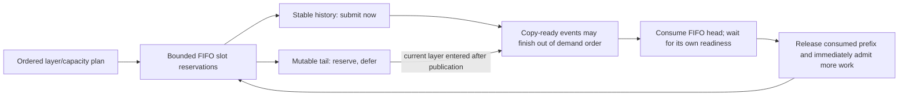

### Lifetime and integration boundaries

The caller holds the coarse binding execution pin and host-content contract through completion/cancellation. Each layer's Q, mask, output, and partial workspace are needed only until that layer call returns: future prefetch stores K/V references, not future graph/workspace pointers. Pending DMA is drained before a session is discarded, and backing buffers remain retained until their last GPU use.

The resident mirror is refreshed at session entry. Authorized publications track which resident tails need refreshing; unchanged layers do not repeatedly rescan every cache plane. Reentrant calls reject without cancelling the outer operation. A bad layer order, mismatched active/span settings, unknown mutation, or failed attention cancels pending prefetch without publishing that failed layer's new output. Earlier completed layer outputs and authoritative host writes are not rolled back; request-level recovery remains the server/context owner's responsibility.

The existing writer uses ring scratch and is therefore blocked while a session is active. This stage provides encoded-host tail publication, not the real-model GPU producer bridge. **5.5a must connect producer completion and provide non-conflicting writer workspace (or explicitly suspend/drain prefetch) before enabling sessions in a server.** Ordinary graph attention is also not a bypass around the session's layer-completion protocol.

The copy extension is version 3. `release_completed` is an explicit optimization for callers that already synchronized every encoded-slot reader. Current partial/conversion callbacks meet that contract, so sessions avoid redundant consumer-event submissions. Asynchronous consumers retain the original event-record/wait release path; tests verify that switching back from completed releases restores the queued fence. No caller may use completed release merely because a kernel was submitted.

### TDD and validation

The initial queue/session stubs failed **15 assertions**. Additional regressions caught an invalid-padding case that could admit a wholly empty source page. The completed-consumer optimization was separately introduced through a failing capability test.

The final cross-layer suite passes **11 CUDA cases / 2,395 assertions**, including:

- Bounded request/slot counts across many waves, partial-span consumption, and invalid padding/range rejection.
- Eight-layer lookahead, zero-resident and fully resident layers in concentrated placement, and arbitrary supplied layer order.
- All 81 writable K/V pairs across layer-boundary wrap and partial-slot reuse, compared with the qualified single-layer control.
- A future historical page observed ready on the GPU while the FIFO demand tail remains reserved and unsubmitted.
- Explicit mutable-tail publication, resident-tail refresh, rejection of stable/consumed-row mutations, and reentrant rejection without destroying the outer session.
- Invalid execution order, unknown content mutation, numerical failure, cancellation, and recovery with unchanged failed-call output.

All **25 focused suites** pass in CPU Debug, CUDA-build Debug, CPU ASan/leak checking, and CPU UBSan. Targeted host-planner TSan passes **1,121 assertions** with process-local ASLR disabled. Cross-layer memcheck reports **zero errors and zero leaked bytes** with UVM off and on; the copy suite also passes memcheck (**13 cases / 2,302 assertions**) including both release contracts. Existing GPU block/resident/writer controls remain required and are recorded in the final handoff evidence. Previously documented broad TSan and vector-kernel racecheck limitations remain unresolved; no whole-repository sanitizer claim is made.

### Targeted latency comparison and remaining overhead

Before implementation, `f069590ef` was measured with eight synthetic Q8_0/Q4_0 attention consumers, one resident page per layer, eight ring slots, two-page spans, and UVM off. Each point uses three warmups and twenty measured traversals. There are **no intervening model-weight computations** in this test, so it does not measure the main opportunity to hide future K/V traffic during other transformer work.

Initial session measurements regressed at longer points. The implementation removed duplicated page preflight, unnecessary readiness rescans, repeated resident-mirror checks, and redundant fences for explicitly completed consumers. Byte flags also avoid bit-proxy overhead in hot owner-thread bookkeeping. The final observed medians are:

| Active tokens | Query rows | Pre-change control ms | Matched post-change control ms | Cross-layer session ms |
| ---: | ---: | ---: | ---: | ---: |
| 257 | 1 | 0.4890 | 0.5016 | 0.4494 |
| 257 | 33 | 0.6235 | 0.6320 | 0.5846 |
| 2,049 | 1 | 1.3417 | 1.3767 | 1.4022 |
| 2,049 | 33 | 1.9440 | 1.9648 | 1.9633 |
| 8,193 | 1 | 5.0696 | 5.1438 | 5.2223 |
| 8,193 | 33 | 7.1858 | 7.1987 | 7.1714 |

Short cases improve; longer attention-only cases are near the matched control or modestly slower. Queue/setup work and the absence of intervening layer computation limit gains here. These Debug-build, non-clock-locked measurements are not a universal speedup or a llama-server token-rate prediction. Sessions remain explicit opt-in; real-model qualification is still 5.5c.

For these aligned test layouts, both paths transfer identical payloads (**6,656 / 11,934,208 / 52,828,672 bytes**) in **16 / 64 / 256** K/V copy calls, and their final checksums agree. Other layer/ring boundaries or deferred tails may split batches differently. The queue avoids duplicate payload copies but does not promise identical call counts for every layout.

```sh
cmake --build build-device-memory-infra-cuda --target test-kv-stream-prefetch test-kv-stream-copy -j 20
build-device-memory-infra-cuda/bin/test-kv-stream-prefetch --cuda
env -u GGML_CUDA_ENABLE_UNIFIED_MEMORY build-device-memory-infra-cuda/bin/test-kv-stream-prefetch --bench
env -u GGML_CUDA_ENABLE_UNIFIED_MEMORY build-device-memory-infra-cuda/bin/test-kv-stream-prefetch --bench-sequence
compute-sanitizer --tool memcheck --leak-check full --error-exitcode 99 build-device-memory-infra-cuda/bin/test-kv-stream-prefetch --cuda
GGML_CUDA_ENABLE_UNIFIED_MEMORY=1 compute-sanitizer --tool memcheck --leak-check full --error-exitcode 99 build-device-memory-infra-cuda/bin/test-kv-stream-prefetch --cuda
setarch x86_64 -R build-device-memory-infra-tsan/bin/test-kv-stream-prefetch
```

Readiness statistics are observations, not lifetime fences or copy-bandwidth estimates; layer distance refers to the supplied attention order. No feedback-driven tuning, capture replay, live repartition, multi-GPU/backend port, or server enablement is included. Production services, compose files, models, checkpoints, and caches remain unchanged.

Stage **5.4i**, documented below, adds query tiling while preserving that lifetime boundary.

## Substage 5.4i: wide micro-batch query tiling

The CUDA partial-attention callback now launches at most 256 queries per tile. A checked common helper derives the query count and accumulator-row range, including the final partial tile. Query and mask pointers advance using their actual row strides; output numerator and metadata pointers advance in the full-batch accumulator. GQA head indexing and the existing native attention arithmetic are unchanged.

Tiling is inside the K/V-span consumer, not outside the context scan:

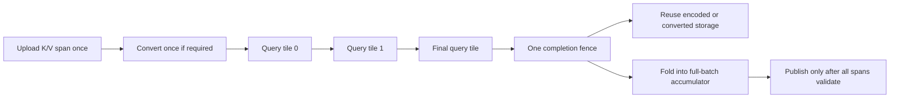

For native K/V, the ring slots cannot be recycled until every query tile finishes. For fallback, encoded slots may be recycled after conversion completes, but the converted K/V planes cannot be overwritten until the partial callback returns. All tile launches share the same stream and existing final synchronization. Cross-layer reservations and the bounded conversion tail require no extra allocation or new lifetime mechanism.

The full-query accumulator, normalized staging output, and whole-output publication check remain explicit in `ggml_kv_stream_block_layout_make`. Tiling bounds each kernel launch; it does **not** make the accumulator constant-sized or reduce its required lease size. No output is published if a late query or later K/V span is invalid. The callback ABI, pool geometry, quant-pair selection, and 256-query single-launch path remain unchanged. `last_attention_calls()` still counts K/V partial callbacks, not individual query-tile kernel launches.

### TDD and validation

The new boundary/overflow test first failed to compile because the query-tile contract did not exist. The implementation then passed coverage for 1/255/256/257/511/512/1,025 queries, exact coverage without overlapping rows, zero dimensions, exhausted ranges, and overflow with unchanged output metadata on rejection.

GPU coverage compares wide calls with independent calls of at most 128 queries using different tile boundaries. Tests cover head-major and token-major Q, causal masks with full-context row pitch, partial final tiles, native Q8_0/Q4_0 and forced F16 fallback, repeated three-slot ring reuse, cross-layer sequences, undersized workspace rejection, a NaN confined to the final query, retry after cancellation, and entirely masked batches. Scalar attention references check queries on both sides of a tile boundary and the last partial tile.

Final validation:

- All 25 focused suites pass in CPU Debug, CUDA-build Debug, ASan and UBSan. The default CTest runs are host tests; real GPU runs are listed separately.
- CUDA block: 20 cases / 656,887 assertions. CUDA copy: 15 cases / 2,826 assertions, including the new wide-query cases and existing all-81-pair transfer coverage.
- CUDA prefetch, resident and writer regression suites pass. `test-backend-ops test -b CUDA0 -o SCALE` passes all four CPU-reference comparisons.
- Compute Sanitizer memcheck of the final copy suite passes with UVM disabled and enabled: zero errors and zero leaked bytes in both runs.
- Targeted host TSan block suite passes 4 cases / 111 assertions using process-local `setarch x86_64 -R`. This is not a claim that the previously documented broader TSan or native-kernel racecheck limitations are resolved.
- Wide-call versus independently sliced-call results are bit-identical in the new tests; selected scalar-oracle errors are below 0.000023 (test tolerance 0.001).

These are physical micro-batch/consumer tests, not claims that a real server `-b/-ub` matrix already ran. Logical-batch splitting and the model/server bridge remain **5.5a**; realistic performance qualification remains **5.5c**. In particular, the existing 256/256 workload shape keeps a single query launch, but the synthetic measurements below are not full-model prefill rates.

### Pre-change comparison

Before changing CUDA execution, `test-kv-stream-copy --bench-wide 2 4` was added and run against the 5.4h implementation at `5887c18a0`. It uses Q8_0/Q4_0, four ring slots, two-page spans, three warmups and 20 measured calls per point. Values below are median milliseconds for one synthetic attention call in the existing Debug CUDA build, UVM disabled:

| Active tokens | Queries | Before ms | After ms | After repeat ms |
| ---: | ---: | ---: | ---: | ---: |
| 1,025 | 256 | 0.5347 | 0.5339 | 0.5380 |
| 1,025 | 512 | 0.9982 | 1.0008 | 1.0063 |
| 1,025 | 1,025 | 1.8942 | 1.9572 | 1.9623 |
| 8,193 | 256 | 3.6207 | 3.6136 | 3.6372 |
| 8,193 | 512 | 6.5909 | 6.6795 | 6.7015 |
| 8,193 | 1,025 | 12.7593 | 13.1001 | 13.1078 |
| 32,769 | 256 | 14.2004 | 14.2389 | 15.3427 |
| 32,769 | 512 | 26.0394 | 26.3704 | 28.3667 |
| 32,769 | 1,025 | 50.5529 | 51.9960 | 54.4041 |

For the first post-change pass, the 256-query cases stay within 0.3% of baseline. Wider batches have about 0.3-3.3% additional latency, consistent with extra launches; this stage is not a speedup claim. The repeat's longest cases also slow down in the unchanged single-launch control, so these non-clock-locked measurements do not isolate a small code effect from run-to-run drift. An initial run overlapping sanitizer activity was discarded; the tabulated GPU timings ran separately from GPU tests and instrumentation. Production was not stopped or reconfigured.

All query counts and both implementations transfer exactly **639,808 / 6,603,584 / 27,050,816 bytes**, using **4 / 32 / 128 K/V uploads** for the three active-token points. Output checksums are unchanged. This verifies no re-upload per query tile.

```sh
cmake --build build-device-memory-infra-cuda --target test-kv-stream-block test-kv-stream-copy -j 20
build-device-memory-infra-cuda/bin/test-kv-stream-block --cuda
build-device-memory-infra-cuda/bin/test-kv-stream-copy --cuda
env -u GGML_CUDA_ENABLE_UNIFIED_MEMORY build-device-memory-infra-cuda/bin/test-kv-stream-copy --bench-wide 2 4
compute-sanitizer --tool memcheck --leak-check full --error-exitcode 99 build-device-memory-infra-cuda/bin/test-kv-stream-copy --cuda
GGML_CUDA_ENABLE_UNIFIED_MEMORY=1 compute-sanitizer --tool memcheck --leak-check full --error-exitcode 99 build-device-memory-infra-cuda/bin/test-kv-stream-copy --cuda
```

Stage **5.4j**, documented below, adds opt-in feedback and span trials. No server opt-in, capture replay, live repartition, or backend port was added in 5.4i.

## Substage 5.4j: runtime feedback and measured span selection

This section records the baseline committed at `17b92d321`. Follow-ups 5.4j.1-5.4j.4 below refine its measurement strategy before capture integration; their changes supersede the corresponding baseline details.

The optional copy extension is now version 4. Existing callers retain their uninstrumented execution path. `configure_feedback(true, bounded_span_pages)` enables the new diagnostics while idle; the bounded candidate defaults to 32 pages and is clamped to the existing ring size. Disabling feedback frees its diagnostic allocation/events and clears its learning history. No KV storage is resized.

### GPU deadlines and copy timing

Each measured `acquire_span` submits one small probe on the consuming GPU stream, immediately before that span's mandatory ready-event waits. The probe checks **every page** in the consumed span. A sample is a consumed span, and a miss means at least one of its pages had not published the expected ready ticket when the probe executed. Fallback samples at the encoded-page/conversion boundary; native attention samples once for its combined span, not once per query tile.

The copy stream publishes a monotonically increasing ticket after both encoded planes and padding complete. Tickets distinguish successive occupants of a reused slot, avoiding a stale ready bit or a racing reset. Atomic ticket operations make the probe/publication access well-defined. Ticket observation never grants ownership: ready-event waits, final-reader ordering, and lease retention still establish correctness. Probing itself has overhead and can change the timing being observed.

```mermaid
sequenceDiagram
    participant H as Owner thread
    participant C as Copy stream
    participant G as Compute stream
    H->>C: Enqueue K/V span after prior consumer
    C->>C: Timed copy interval, then publish ticket
    H->>G: Probe every page's expected ticket
    G->>G: Increment sample; miss if any ticket is absent
    G->>C: Wait on the mandatory ready events
    G->>G: Consume encoded span or convert it
    G->>H: Complete final reader
    H->>H: Drain completed window, validate feedback
```

Measurement uses an explicit device-local diagnostic buffer requested at `8 * (ring_slots + 2)` bytes plus two timing events per ring slot. These resources are **outside the KV lease** and exist only when opted in; backend/driver allocation granularity and event overhead are additional implementation costs. The report exposes the buffer's reported allocation size. KV page geometry, weights, resident/ring grants, and conversion storage are unchanged.

Timing samples are bounded by ring size, not context length. Start/end events bracket copy-stream service after dependency waits, including K/V submissions and finite tail padding. Completed event pairs are harvested before reuse or at drain. If a timing pair is still pending, that upload is not sampled rather than blocking the stream or allocating an unbounded event list. Actual copied bytes and sampled bytes are reported separately.

The pure feedback adapter calculates:

`copy_busy_ratio = min(1, (sampled_copy_ms / copy_window_elapsed_ms) * (copied_bytes / sampled_bytes))`

This is a sampled/extrapolated **copy-stream interval ratio**, not physical copy-engine occupancy, PCIe throughput divided by 64 GB/s, or a measure of UVM migration. The denominator is the host window from copy-run begin through drain; the numerator excludes producer/final-consumer waits but can include command scheduling gaps. With full sample coverage no extrapolation is needed. Invalid, absent, nonfinite, zero-duration, inconsistent, or overflowing observations do not become light-load feedback.

Reports are unavailable while a run is active and are collected only after GPU completion. Cancellation can produce backend diagnostics, but the consumer discards them for learning. Readiness inspection via `sequence_stats()` remains a separate observation, not the GPU deadline counter.

### Policy proposals and span trials

Successful standalone overlap calls and complete cross-layer sequences feed cumulative sample/miss counters into the existing pure policy type. The runtime supplies process-unique feedback epochs so recreation cannot accidentally continue another instance's counters. Unknown content generation/mirror changes, page-extent changes, different query counts or layer orders, cancellation, failures, and runs with no streamed work reset learning. Authorized sequence-tail publications remain valid within their running window. Mixed query counts across one sequence do not train a timing trial. Cache-write continuity is intentionally conservative until the real producer bridge in 5.5a can identify authorized append history.

`recommend_policy(previous, active_tokens, query_tokens, decision)` connects completed feedback to `llama_kv_stream_policy_step`. It rejects in-flight recommendations and excludes old-context/query feedback. It does **not** publish `decision.next`, advance the caller's accepted cursor, or move device pointers. The existing pure policy retains its cooldown, hysteresis, saturation guard, and one-balanced-round feedback growth bound. A caller must accept the corresponding device layout before accepting a proposal; this stage does not implement live repartition or bypass the later context integration.

`suggested_span_pages()` exposes the timing trial's candidate. Callers explicitly pass it to the next `begin_sequence`/`compute_streamed`; explicit spans and the existing one-page default remain available. The tuner compares full-ring against bounded spans using whole successful execution latency, including validation/planning/refresh and all supplied layers. It uses one warmup and 16 measured samples per candidate, requires a 0.5% gain to choose the bounded candidate, and learns only TG1 samples matching the candidate actually being tested. No duplicate candidate is trained when the ring already fits the bounded ceiling. This is a resettable two-candidate heuristic, not a proof of globally optimal spans at every context.

### TDD and review findings

- The version-4 capability test first failed against version 3. Pure feedback/tuner tests then failed before their helper existed and passed after implementation.
- GPU tests cover queued-versus-completed reports, every-span sample counts, invalid/mixed-ticket admission, repeated slot reuse, reset/drain idempotence, and disabled measurement. A delayed compute gate proves that host submission timing is not used as the deadline: completed copies report zero misses when the GPU finally consumes them.
- A separate 256 MiB transfer test observed **3/3 GPU deadline misses** on this machine. The assertion permits zero misses on a different schedule: missing a deadline is an observed condition, not an outcome that every GPU must exhibit.
- The cold gated test exposed first-use CUDA kernel loading synchronizing behind a held gate. Diagnostic kernels are now resolved during idle measurement setup. The gated case intentionally runs before the large-transfer case so an earlier measured launch cannot hide that regression.
- Native and fallback session tests cover successful cumulative feedback, actual full-ring/bounded trials, read-only policy proposals, no-streamed-work reset, stale query rejection, unknown cache invalidation, cancellation, a failed final layer, and standalone overlap.
- A new behavioral test caught identical feedback epochs in two separate runtime instances. Runtime reset IDs now come from a relaxed atomic identity counter; policy/tuning arithmetic remains backend-neutral and locally owned.

Final validation:

- All 25 focused suites pass in CPU Debug, CUDA-build Debug, ASan, and UBSan. The default CTest runs exercise host contracts; the following results are separate real-GPU runs.
- CUDA copy/deadline suite: 18 cases / 2,978 assertions. CUDA prefetch/runtime suite: 12 cases / 2,803 assertions.
- CUDA block attention: 20 cases / 656,887 assertions; resident mirror: 13 / 246; writer: 10 / 609. CPU-reference CUDA SCALE passes all four comparisons.
- Compute Sanitizer memcheck passes the cold-load copy/deadline suite with UVM off and on, plus the final runtime-feedback suite: zero errors and zero leaked bytes in each run.
- Targeted TSan policy/tuner: 22 cases / 139,910 assertions; host prefetch planner: 3 / 1,121, using process-local `setarch x86_64 -R`. Previously documented broader TSan and native-attention racecheck limitations are not claimed resolved.
- `git diff --check` passes. Only this stage's source, tests, and roadmap are staged for user review; unrelated README/documentation/benchmark work is preserved.

### Targeted comparison

Baseline was captured at **6f98b1276** using the existing eight-layer Q8_0/Q4_0 synthetic benchmark, span ceiling 2, ring size 8, UVM disabled, three warmups and 20 measured runs. The post-change measurements keep that explicit span fixed to isolate instrumentation cost; they are not an adaptive-winner or real-model speedup claim.

| Active tokens | Queries | Before ms | Feedback off ms | Feedback on ms |
| ---: | ---: | ---: | ---: | ---: |
| 257 | 1 | 0.4531 | 0.4519 | 0.4912 |
| 257 | 33 | 0.5866 | 0.5903 | 0.6294 |
| 2,049 | 1 | 1.4138 | 1.4258 | 1.5549 |
| 2,049 | 33 | 1.9731 | 1.9733 | 2.0879 |
| 8,193 | 1 | 5.2346 | 5.2480 | 5.6624 |
| 8,193 | 33 | 7.2059 | 7.1888 | 7.6243 |

The uninstrumented cases remain within about 1% of the prior stage. Enabling every-span probes and timing adds approximately **6-9%** in this Debug synthetic benchmark, so instrumentation remains opt-in. The probes, readiness publications, timing events, and completed counter readback are real costs; no automatic production performance gain is claimed. GPU timings ran separately from sanitizer work and are not clock-locked.

Payloads remain **6,656 / 11,934,208 / 52,828,672 bytes** in **16 / 64 / 256 K/V uploads**, and output checksums agree. Diagnostic counter traffic is not counted as K/V payload traffic.

```sh
cmake --build build-device-memory-infra-cuda --target test-kv-stream-policy test-kv-stream-copy test-kv-stream-prefetch -j 20
build-device-memory-infra-cuda/bin/test-kv-stream-policy
build-device-memory-infra-cuda/bin/test-kv-stream-copy --cuda
build-device-memory-infra-cuda/bin/test-kv-stream-prefetch --cuda
env -u GGML_CUDA_ENABLE_UNIFIED_MEMORY build-device-memory-infra-cuda/bin/test-kv-stream-prefetch --bench-sequence
env -u GGML_CUDA_ENABLE_UNIFIED_MEMORY build-device-memory-infra-cuda/bin/test-kv-stream-prefetch --bench-feedback
compute-sanitizer --tool memcheck --leak-check full --error-exitcode 99 build-device-memory-infra-cuda/bin/test-kv-stream-copy --cuda
GGML_CUDA_ENABLE_UNIFIED_MEMORY=1 compute-sanitizer --tool memcheck --leak-check full --error-exitcode 99 build-device-memory-infra-cuda/bin/test-kv-stream-copy --cuda
```

The source comparison with `feature/adaptive-kv-stream` found avoidable measurement costs and different feedback eligibility. Complete the explicit follow-ups **5.4j.1-5.4j.4** before resuming **5.4k**. Server enablement and accepted live-layout transitions remain later integration work. Production services, compose files, models, checkpoints and prompt caches are unchanged.

## Follow-up 5.4j.1: bounded copy timing

This commit-sized optimization changes only copy-time sampling. One pair of timing events records the first successful upload of each copy execution. The pair is reused only after the execution drains. Empty runs never read unrecorded or previous-run timestamps, and rejected uploads do not consume the sample. `timed_bytes` records the first upload's actual live K/V payload, excluding padding; `bytes` still records every upload.

The previous implementation allocated two additional timing events per ring slot and repeatedly recorded, queried, and harvested them. The new implementation has **two additional timing events total**, records them once per nonempty execution, and reads their elapsed time once at drain. The upload loop no longer calls `cudaEventQuery` or `cudaEventElapsedTime` for timing. No optional ABI layout or callback signature changed.

This does not reduce deadline coverage: every consumed span still gets its GPU deadline probe and all expected tickets are checked. Ticket publication, actual K/V transfers, ready/final-consumer events, quant conversion, and output publication are unchanged. Device diagnostic flags and their host ticket metadata remain O(ring slots); only timing events and timing bookkeeping become constant-sized. The existing synchronous readback/drain, phase/tail eligibility, and per-span publication/probe strategy are deliberately left for 5.4j.2-5.4j.4 so their costs can be measured separately.

The existing byte-weighted estimate uses this smaller sample:

`copy_busy_ratio = min(1, (first_copy_ms / copy_window_elapsed_ms) * (total_live_bytes / first_live_bytes))`

This restores the old branch's first-batch sampling strategy while retaining explicit live-byte accounting. A single first sample can be noisy or unrepresentative, especially for a short padded tail followed by larger transfers. It is still a copy-stream activity estimate, not measured PCIe utilization. The tests verify accounting and lifecycle, not that every proposed partition will be optimal. Feedback filtering and real-model qualification remain necessary.

### TDD and validation

Changing the expected sampled-byte totals first produced **three failing assertions** against `17b92d321`: the old implementation timed all uploads in the repeated-slot and large-transfer tests. They pass after bounding the sample.

New tests cover an empty run before every measured run, rejection before the first valid copy, a one-token padded first upload, a full first upload followed by a short tail, nonzero ring offsets, event reuse across runs, and independent K/V sizes (Q8_0/Q4_0, F16/F16, IQ4_NL/F32). Existing cold-load/gated-readiness tests continue to count every deadline sample. The copy suite now has **19 cases / 3,075 assertions**; the native/fallback runtime-prefetch suite remains **12 / 2,803**.

Final checks:

- All 25 focused suites pass in CPU Debug, CUDA-build Debug, ASan and UBSan. These CTest matrices exercise host contracts; real GPU checks are listed separately.
- CUDA copy and runtime-prefetch suites pass with the counts above. Compute Sanitizer memcheck passes the copy suite with UVM off/on and the runtime-prefetch suite: zero errors and zero leaked bytes in all three runs.
- CUDA block attention passes 20 cases / 656,887 assertions, resident mirror 13 / 246, and writer 10 / 609. CUDA SCALE passes all four CPU-reference comparisons.
- `git diff --check` passes. Existing asynchronous ownership and capture limitations are unchanged; deferred collection is not part of this optimization.

### Isolated comparison

The baseline was captured from `17b92d321` before changing CUDA execution. Parameters remain eight synthetic Q8_0/Q4_0 attention layers, eight ring slots, two-page spans, UVM disabled, three warmups and 20 measured runs per point. Each cell is median milliseconds for the complete synthetic sequence, not tokens/second. Benchmarks ran sequentially without competing GPU tests or sanitizer work.

| Active tokens | Queries | Before, off | Before, on | After, off | After, on | Repeat, on |
| ---: | ---: | ---: | ---: | ---: | ---: | ---: |
| 257 | 1 | 0.4513 | 0.4926 | 0.4494 | 0.4769 | 0.4778 |
| 257 | 33 | 0.5835 | 0.6271 | 0.5857 | 0.6082 | 0.6190 |
| 2,049 | 1 | 1.4038 | 1.5520 | 1.4345 | 1.4881 | 1.4879 |
| 2,049 | 33 | 1.9584 | 2.0909 | 1.9586 | 2.0344 | 2.0400 |
| 8,193 | 1 | 5.2381 | 5.6773 | 5.2242 | 5.4650 | 5.4645 |
| 8,193 | 33 | 7.1920 | 7.6057 | 7.1766 | 7.4311 | 7.4178 |

Instrumented latency fell **2.3-4.1%** in the first pass and **1.3-4.1%** in the repeat. Remaining overhead relative to the corresponding uninstrumented runs is approximately **3-6%**; this stage does not eliminate instrumentation cost. Most off-path points are within 1% of baseline. The 2,049-token/TG1 off-path point was 2.2% slower in the first pass and 1.4% slower in the repeat (1.4228 ms); these non-clock-locked Debug samples do not isolate a small host-code effect from run-to-run variance. No extra GPU operations were added to the uninstrumented path.

All three implementations/runs preserve **6,656 / 11,934,208 / 52,828,672 K/V bytes**, **16 / 64 / 256 memcpy submissions**, and identical output checksums. Sampling uses only the first batch; those transfer counts still cover all K/V uploads.

```sh
cmake --build build-device-memory-infra-cuda --target test-kv-stream-copy test-kv-stream-prefetch -j 20
build-device-memory-infra-cuda/bin/test-kv-stream-copy --cuda
build-device-memory-infra-cuda/bin/test-kv-stream-prefetch --cuda
env -u GGML_CUDA_ENABLE_UNIFIED_MEMORY build-device-memory-infra-cuda/bin/test-kv-stream-prefetch --bench-sequence
env -u GGML_CUDA_ENABLE_UNIFIED_MEMORY build-device-memory-infra-cuda/bin/test-kv-stream-prefetch --bench-feedback
```

After review and commit, proceed to **5.4j.2: deferred completed-feedback collection**. Do not resume 5.4k until the remaining follow-ups have been reviewed and qualified. Production, model files, compose configuration, and user-owned unrelated edits remain untouched.

## Follow-up 5.4j.2: deferred completed-feedback collection

This follow-up was developed against the staged 5.4j.1 implementation on `17b92d321`. The user subsequently requested that 5.4j.1-5.4j.4 be committed together; their implementation and benchmark checkpoints remain documented separately within the combined change.

The copy extension is version 5. Its new `feedback_id()` identifies the current/latest measured window, and `poll_feedback()` delivers completed snapshots in FIFO order without waiting. Each snapshot carries its own ID and frozen copy statistics. The legacy version-4 `feedback()` getter remains compatible but may wait for the current snapshot's readback; the runtime no longer calls that getter.

### Bounded ownership and completion

Two snapshot slots each own a GPU flag/counter bank and a 16-byte slice of a pinned host buffer. After the existing copy/compute correctness drains, the adapter freezes timing metadata, queues an asynchronous counter readback on a separate nonblocking stream, records completion, and returns. Polling checks the oldest snapshot's event and reads host counters only after completion. Pending results never trigger a telemetry-only wait on the compute or KV-copy streams.

```mermaid
flowchart TD
    A["Inference and KV work"] --> B["Existing correctness drain"]
    B --> C["Queue counter readback into reserved snapshot slot"]
    C --> D["Continue next inference execution"]
    C --> E["Readback completion event"]
    E --> F["Nonblocking poll: return only if ready"]
    F --> G["Match run ID and feedback epoch"]
    G --> H["Accept original timing/span or discard stale result"]
    H --> I["Free snapshot slot for reuse"]
    D --> J["If both slots are retained, skip measurement instead of waiting"]
```

A completed but uncollected slot remains occupied. A later execution cannot overwrite it. If both slots are occupied, that execution still copies and computes normally but receives measurement ID zero and adds no deadline samples. IDs are never wrapped into a new history: ID exhaustion also suppresses measurement rather than failing inference. This is bounded, best-effort telemetry, not a requirement that every production execution be measured.

The two banks isolate subsequent flag initialization and counter updates from older DMA reads. Each measured window still uses one flag/counter clear and the 5.4j.1 first-upload timing sample. Requested diagnostic storage is `2 * (ring_slots + 2) * sizeof(uint64_t)` on the device and 32 bytes of pinned host counters, plus two completion events and one readback stream; allocation granularity and driver bookkeeping are additional costs. KV grants, encoded data storage, and conversion scratch do not change.

Disabling/reconfiguring measurement or freeing the queue can wait for its readback stream before freeing diagnostic buffers/events. That teardown wait is required for ownership safety and is not part of normal deferred collection. Existing KV correctness drains and synchronous partial-attention/merge contracts remain intact. The redundant second drain in the successful standalone measured path was removed; the required first drain remains.

### Runtime feedback identity

The runtime keeps at most two corresponding metadata records containing the window ID, process-unique feedback epoch, original span choice, query count, and whole-execution latency captured at completion. A delayed result uses those saved values, not the parameters of the execution running when it is collected. Backend copy-window elapsed time is also frozen at completion, so CPU polling delay cannot inflate it.

Pending collection does not reset valid learning history or create a zero-copy/light-load observation. Public feedback accessors can return the last accepted cumulative counters while a newer result is pending; callers must use the existing counter-delta/epoch contract rather than treating `available` as a new-sample notification. Repeated polls cannot train twice. Cancellation, cache changes, and feedback resets discard stale metadata; late backend snapshots may free their slots but cannot enter a new epoch. Newly created backend queues/configurations cannot reuse IDs against retained runtime metadata.

The backend polling interface is single-consumer and permits at most `ggml_kv_stream_feedback_slots::capacity` uncollected snapshots. Do not mix external legacy getter calls with the runtime's tracked polling, since the legacy getter consumes snapshots too. The old getter is retained for compatibility tests and direct old callers, not for the new inference path.

### TDD and validation

- The version-5 capability test failed against version 4, and pure slot tests failed before the bounded admission helper existed.
- Pure tests cover two occupied slots, skipped measurement with continued admission, strict FIFO retirement, reuse with a fresh ID, and ID exhaustion.
- CUDA tests retain two distinct uncollected windows, run a third unmeasured execution, collect while that later execution is active, and verify exact originating sample/byte counts. They also cover legacy-getter compatibility, pending teardown, and elapsed-time independence from delayed polling.
- A scoped test-only backend wrapper withholds snapshot delivery. The runtime continues generating identical output, never calls the blocking getter, drops only the third measurement under backpressure, and rejects old successful/failed snapshots after cancellation. Delayed full-ring/bounded trials retain their original span identity.
- A separate drain-count assertion failed with two standalone drains and passes after removing the redundant second drain. It does not remove any event or synchronization needed for KV lifetime safety.

The final CUDA copy suite has **21 cases / 3,146 assertions**, and runtime-prefetch has **13 / 2,984**. The benchmark explicitly waits outside its timed region to verify all 23 expected measured windows were collected at every point; a result with skipped windows is rejected instead of reported as a speedup.

### Targeted comparison

Baseline is the 5.4j.1 staged implementation on `17b92d321`, captured before deferred collection changes. Configuration remains eight synthetic Q8_0/Q4_0 attention layers, eight ring slots, two-page spans, UVM disabled, three warmups and 20 measured executions. Values are median milliseconds for a complete synthetic sequence. Instrumentation is enabled in all three columns; GPU timing runs are separate from sanitizer work.

| Active tokens | Queries | 5.4j.1 baseline | Deferred | Deferred repeat |
| ---: | ---: | ---: | ---: | ---: |
| 257 | 1 | 0.4764 | 0.4750 | 0.4746 |
| 257 | 33 | 0.6248 | 0.6173 | 0.6123 |
| 2,049 | 1 | 1.4855 | 1.4841 | 1.4926 |
| 2,049 | 33 | 2.0287 | 2.0288 | 2.0399 |
| 8,193 | 1 | 5.4667 | 5.4719 | 5.4905 |
| 8,193 | 33 | 7.4159 | 7.4160 | 7.4160 |

Performance is broadly flat: most differences are below 1%, with a roughly 1-2% improvement at the shortest 33-query point. These Debug, non-clock-locked measurements do not establish a general throughput gain. The meaningful change is nonblocking collection and bounded ownership, not an assumed speedup. All 23 windows were included; K/V traffic remains **6,656 / 11,934,208 / 52,828,672 bytes** in **16 / 64 / 256 memcpy submissions**, with identical output checksums.

```sh
cmake --build build-device-memory-infra-cuda --target test-kv-stream-copy test-kv-stream-prefetch -j 20
build-device-memory-infra-cuda/bin/test-kv-stream-copy --cuda
build-device-memory-infra-cuda/bin/test-kv-stream-prefetch --cuda
env -u GGML_CUDA_ENABLE_UNIFIED_MEMORY build-device-memory-infra-cuda/bin/test-kv-stream-prefetch --bench-feedback
compute-sanitizer --tool memcheck --leak-check full --error-exitcode 99 build-device-memory-infra-cuda/bin/test-kv-stream-copy --cuda
GGML_CUDA_ENABLE_UNIFIED_MEMORY=1 compute-sanitizer --tool memcheck --leak-check full --error-exitcode 99 build-device-memory-infra-cuda/bin/test-kv-stream-copy --cuda
```

Next is **5.4j.3: decode-phase and producer-constrained-tail filtering**, followed by 5.4j.4 before 5.4k. No production server, compose, model, checkpoint, or prompt-cache changes were made.

## Follow-up 5.4j.3: explicit decode and immutable-history filtering

The copy extension's version-6 callbacks allow the owner to declare measurement eligibility per execution and per upload. Version-7 batching below retains those callbacks. Disabling feedback for one execution neither reallocates diagnostic resources nor disables actual KV copies. Ineligible uploads keep their mandatory readiness/consumer fences but do not publish diagnostic tickets, record deadlines, or supply the first timing sample. Total copy bytes still include their traffic.

The consumer now requires **explicit decode intent and exactly one query** for feedback. A one-token prompt is not assumed to be decode. Profiled sequences pass `llama_kv_stream_feedback_context{1, true}` to `begin_sequence`; its default `{}` means unknown phase and remains unprofiled without breaking legacy inference calls. A declared nonzero query count must match actual layer inputs. Standalone `compute_streamed` calls and `recommend_policy` also require an explicit final `decode_feedback=true` argument to collect/use decode feedback. This prevents a one-token prompt from borrowing a previous decode's counters.

The existing prefetch planner supplies each upload's `stable` provenance. A page containing producer-constrained rows is excluded as a whole; immutable history remains eligible. The planner already splits requests at that boundary, so filtering does not change the transfer partition or payload. A known immutable partial final page can still be eligible: exclusion depends on provenance, not simply being the last page. Sequences with no prefetchable immutable history skip profiling entirely rather than feeding a false light-load observation to the policy.

```cpp
// Serial generation: immutable history is known before current-token producers run.
resident.begin_sequence(layers, active_tokens, span_pages, stable_tokens, {1, true});
// Prefill: declare its actual query count, but do not label it as generation.
resident.begin_sequence(layers, active_tokens, span_pages, stable_tokens, {query_tokens, false});
```

TDD added a failing version-6 capability test, then tests for per-run/per-upload eligibility with unchanged copied bytes. Runtime tests cover native and fallback paths with mixed immutable history and producer-constrained tails, tail-only work, multi-query prefill, unknown phase, one-token prompts, declared-query mismatch, and refusal to use decode feedback for an unlabelled one-token policy proposal.

The following isolated native Q8_0/Q4_0 benchmark compares 5.4j.2 with filtering. Setup remains eight layers, eight ring slots, two-page spans, UVM disabled, three warmups and 20 measured runs. Values are median milliseconds. The 33-query points are intentionally unprofiled after filtering, so their improvement is instrumentation removal, not faster attention mathematics.

| Active tokens | Queries | Before filtering | After filtering |
| ---: | ---: | ---: | ---: |
| 257 | 1 | 0.4750 | 0.4801 |
| 257 | 33 | 0.6173 | 0.5869 |
| 2,049 | 1 | 1.4841 | 1.4945 |
| 2,049 | 33 | 2.0288 | 1.9659 |
| 8,193 | 1 | 5.4719 | 5.5120 |
| 8,193 | 33 | 7.4160 | 7.1963 |

Decode points are approximately flat (within about 1.1% here); prefill loses its unnecessary profiling cost. This does not add server integration or automatically apply repartition proposals.

## Follow-up 5.4j.4: batch-level deadline markers

Version 7 changes the deadline unit to **one eligible upload batch at its first consumption**, matching the old branch's batch-level intent. A single atomic ticket published after both contiguous K/V plane copies and padding represents the whole batch. The first consumer checks that marker before its mandatory ready-event waits. Native whole-batch consumption needs one check; fallback or other partial consumers do not repeat the same check for every page.

CPU metadata records each slot's upload ticket, original batch range, eligibility, and whether that batch has already been sampled. On partial first consumption, every remaining batch member remembers that the probe was issued. Therefore the first physical slot can be released and reused by a newer upload without making an old remaining page check the newer marker. The whole-batch fast path avoids that extra marking loop because every member becomes acquired together and cannot be acquired again without a fresh upload. Actual GPU readiness and final-consumer events remain unchanged; this does not introduce batch-shared lifetime events or asynchronous attention/merge callbacks.

The new test first failed twice against per-span sampling. It checks both first-slot and out-of-order first consumption, reuses the consumed slot before consuming the old remaining page, verifies exactly two batch samples with no forced deadline miss, and downloads both K and V to verify the old/new payloads. Native/fallback runtime sample expectations now use actual eligible upload batches rather than fallback page counts. Every expected decode window is still verified outside benchmark timing; skipped telemetry cannot appear as a speedup.

Native Q8_0/Q4_0, same benchmark configuration as above:

| Active tokens | Queries | Before batching | After batching |
| ---: | ---: | ---: | ---: |
| 257 | 1 | 0.4801 | 0.4758 |
| 257 | 33 | 0.5869 | 0.5888 |
| 2,049 | 1 | 1.4945 | 1.4850 |
| 2,049 | 33 | 1.9659 | 1.9681 |
| 8,193 | 1 | 5.5120 | 5.4994 |
| 8,193 | 33 | 7.1963 | 7.2026 |

Forced Q8_0/Q4_0-to-F16 conversion uses the same 16 encoded-page budget plus its explicitly reserved conversion plane, not a smaller effective pool:

| Active tokens | Queries | Before batching | After batching |
| ---: | ---: | ---: | ---: |
| 257 | 1 | 0.7784 | 0.7751 |
| 257 | 33 | 0.9748 | 0.9725 |
| 2,049 | 1 | 3.3669 | 3.3825 |
| 2,049 | 33 | 4.1533 | 4.0578 |
| 8,193 | 1 | 12.2406 | 12.3654 |
| 8,193 | 33 | 15.0295 | 14.5077 |

These results are small or mixed and do not establish a general speedup for batching alone. In particular, 33-query work is already unprofiled, so changes there are not evidence of a deadline optimization. Immediate one-page fallback refill limits batching in this benchmark: decode samples fall from 8/64/256 pages to 8/60/252 upload batches. Only four probes are saved at each larger fallback point. The 8,193-token fallback decode point was about 1% slower in this run, within a comparison whose unaffected prefill controls also varied; do not claim a universal performance win.

Native traffic stays at 6,656 / 11,934,208 / 52,828,672 bytes in 16 / 64 / 256 memcpy submissions. Fallback traffic has the same bytes but 16 / 120 / 504 submissions because of its refill pattern. Before/after checksums agree within each path. The benchmark flags are `--bench-feedback` and `--bench-feedback-fallback`; the latter now accounts explicitly for conversion storage.

The user requested one combined review/commit for **5.4j.1-5.4j.4**. After this bundle is reviewed and committed, resume **5.4k**, not server enablement. Production services, compose configuration, model files, checkpoints, and prompt caches remain untouched.

### Final four-substage qualification

- All 25 focused suites pass in CPU Debug, CUDA-build Debug, ASan, and UBSan. Real CUDA checks are separate from the default CTest contract matrix.
- CUDA copy/deadline/snapshot suite: 23 cases / 3,211 assertions. Runtime-prefetch/eligibility suite: 14 / 3,048.
- CUDA block attention: 20 / 656,887; resident mirror: 13 / 246; writer: 10 / 609. CUDA SCALE passes all four CPU-reference comparisons.
- Compute Sanitizer memcheck passes the final batch-marker/snapshot suite with UVM disabled and enabled, and the final runtime suite: zero errors and zero leaked bytes in all runs.
- Targeted TSan passes snapshot/copy admission (3 / 946), host prefetch planning (3 / 1,121), and policy/tuning (22 / 139,910), using process-local `setarch x86_64 -R`. This does not resolve or claim coverage of previously documented broader TSan/native-kernel racecheck limitations.
- The first-upload timing change provides the clearest instrumented latency saving; prefill filtering removes profiling work from non-decode execution. Deferred collection and batch-level probes establish the intended low-interference contracts, but their individual timings are flat or mixed. The bundle does not make profiling free or prove full-model speedup.
- `git diff --check` passes. All four follow-ups are staged together for the user's commit; unrelated README/documentation/benchmark changes remain unstaged. No commit or push was created by the assistant.

## Substage 5.4k: resident capture eligibility and invalidation

This stage adds `llama_kv_stream_cuda_executor`, a KV-aware admission layer over the existing stage-4 `llama_memory_cuda_executor`. It reuses that executor's native CUDA graph cache, queued-execution pins, failure handling, and retirement ordering. It does not introduce another native cache or enable the production server path.

### Ownership and admission

- Bind only native, fully resident, TG1-shaped attention. Converted KV, multi-query prefill and streamed graphs remain outside this capture path. The entire bound resident consumer must fit its resident allocation, not just one layer.
- Move an authentic KV binding execution pin only after successful admission. Retain every supplied lease, including the explicit KV lease and all mutable graph workspace leases. Read-only, non-view WEIGHTS buffers may be unleased; retain their backing buffer handles separately.
- KV storage is read-only inside the captured graph. Producer writes and resident synchronization remain outside it. Reject writable outputs that overlap any byte of the KV region, including through a different buffer-view handle.
- Require attention K/V views to reference this consumer's actual native root tensors. Equal physical addresses and shapes do not prove metadata ownership: two consumers can bind the same lease but own different root tensors.
- The caller must keep the backend and fixed graph/context/tensor metadata alive. The retained binding pin owns resident root metadata; buffer retention does not own arbitrary caller-created tensor metadata. All submissions for one graph key must use this wrapper.

### Replay and retirement

Admission records buffer identity, binding revision, residency revision, host-mirror epoch and padded token extent. Before each replay, check these values plus graph node/leaf identity and tensor pointers, shapes, strides, operations, sources and view metadata. Tensor names and backend-owned `extra` fields are not replay keys.

Synchronized value updates at the same padded extent can reuse the graph. Exact context growth within that extent also works when the caller updates the mask contents. Dirty host data temporarily rejects replay without destroying the capture; after resident synchronization, it can replay again. A new padded extent, host replacement/reset, pointer/topology change or streamed epoch retires the old capture before releasing dependencies. Streaming followed by a return to the original resident extent cannot resurrect the old capture. An unrelated arena commit does not invalidate an unchanged persistent lease merely because the arena generation increased.

The backend exposes an internal active-capture query, including when automatic CUDA graphs are disabled. Host-driven resident updates, streaming entry points and raw partial/convert/combine submissions reject active capture before they allocate or synchronize. Rejection leaves the enclosing capture usable. Ordinary graph-disabled CUDA execution remains available through the same ownership path; the previously unsupported `GGML_CUDA_GRAPH_OPT=1` mode remains rejected. These are owner-thread APIs, not a concurrent scheduler.

Logical invalidation may leave a native cache entry allocated until replay admission or explicit retirement observes it. Leases stay pinned in that interval, so its addresses cannot be reassigned. `ready()` describes eligibility; `is_captured()` only describes native cache presence.

### TDD and qualification

The initial backend-hook test failed before implementation. Expanded tests then exposed two separate admission bugs: an alias handle concealed a write into KV storage, and an authentic pin for a second consumer did not own the first consumer's tensor roots. Each regression was observed failing before its fix, then passed with the implementation corrected.

- Capture suite: 13 cases / 166 assertions on CUDA, also passing with automatic graphs disabled. Coverage includes changed payloads, same-page growth, dirty data, wrong/missing owners and leases, aliased writes, same-address/different-owner roots, streaming-return invalidation, host replacement, padded extent changes, persistent leases, raw weight retention, queued replay and native retirement. Numerical results are checked against the CPU attention oracle.
- Compute Sanitizer memcheck: all capture cases pass with UVM off and on, with zero errors and zero leaked bytes. These tests qualify lifecycle/address safety, not a claim that all CUDA kernels are race-free.
- All 26 focused suites pass in CPU Debug, CUDA-build Debug, ASan and UBSan. Default CTest covers host contracts; actual GPU execution is checked separately.
- GPU regressions pass: resident 13 / 246; writer 10 / 609; block attention 20 / 656,887; copy 23 / 3,211; prefetch 14 / 3,048; reused CUDA executor 10 / 226, including failure after submission. CUDA SCALE passes all four CPU-reference comparisons.
- Targeted CPU TSan passes the unsupported-backend capture contract (1 / 4) and common executor ownership (16 / 176), using process-local `setarch x86_64 -R`. This does not expand coverage to CUDA execution or resolve the broader TSan/native racecheck limitations documented earlier.

### Performance qualification

RTX 5070 Ti, Q8_0/Q4_0, 256 active tokens, five warmups and 50 measured synchronized replays. Values are median milliseconds. Control and guarded runs use the same leased attention graphs; the control is the existing generic CUDA executor.

| Attention layers | Control | KV-guarded replay | Additional time |
| ---: | ---: | ---: | ---: |
| 1 | 0.012986 | 0.013631 | 0.645 us |
| 8 | 0.068074 | 0.068995 | 0.921 us |
| 16 | 0.130349 | 0.131805 | 1.456 us |

The checks are not free: approximately 5% on the smallest synthetic graph and 1-1.4% on the larger graphs in this run. This is not a full-model token/s estimate. Graph identity checks use contiguous metadata comparisons only when the struct layout has no padding, with a portable field-wise fallback otherwise. Checksums match the control. The committed-head pre-change control was 0.012968 / 0.068178 / 0.130180 ms, consistent with the post-change control above.

The existing streaming benchmark (`test-kv-stream-prefetch --bench-feedback`) also retains its prior transfer counts and checksums:

| Active tokens | Queries | Committed 5ee09b7e1 | After capture guards |
| ---: | ---: | ---: | ---: |
| 257 | 1 | 0.475754 | 0.477224 |
| 257 | 33 | 0.588761 | 0.586714 |
| 2,049 | 1 | 1.484998 | 1.485597 |
| 2,049 | 33 | 1.968067 | 1.965638 |
| 8,193 | 1 | 5.499386 | 5.473363 |
| 8,193 | 33 | 7.202582 | 7.201057 |

These differences are within about 0.5%; no material streaming regression or general speedup is established. H2D bytes remain 6,656 / 11,934,208 / 52,828,672 in 16 / 64 / 256 submissions. Capture-state queries are kept out of repeated partial-capability preflight; actual submission entry points still enforce capture safety.

Reproduce the new checks with `build-device-memory-infra-cuda/bin/test-kv-stream-capture --cuda`; use `GGML_CUDA_DISABLE_GRAPHS=1` with `--cuda --no-graphs` for eager execution, and `GGML_CUDA_GRAPH_OPT=1` with `--cuda --unsupported` for the unsupported-mode contract. The replay comparison uses `--bench` and `--bench-guarded`. Local validation logs are `/tmp/kv-54k-*.log` and are not repository artifacts.

After user review and commit, proceed to **5.5a: opt-in text-context integration, serial execution gating and hybrid recurrent-state preservation**. Full-model producer/writeback wiring remains there; this stage does not claim a captured complete decode graph. No production service, compose configuration, model, checkpoint or prompt cache was changed. Task files are staged for the user; unrelated README/documentation/benchmark edits remain untouched, and no commit or push was created.

## Substage 5.5a.1: producer workspace during live prefetch

The integration audit reread `llama_context::process_ubatch`, the ordinary graph's K/V producer and attention dependencies, `llama_kv_cache` allocation, `llama_memory_hybrid`, and the production reference at `d873e5db9`. The current components do not yet provide a complete model-graph bridge. In particular, the stage-5.3c writer borrowed ring storage, was retired at sequence entry, and could only publish rows that fit the resident plane. That cannot serve new GPU-produced tails while cross-layer historical copies own ring slots. Stage 5.5a is therefore split explicitly above; its original real-model acceptance criteria remain unchanged.

### Implementation

- `configure_writes(max_rows, workspace)` optionally accepts a separate coarse lease of the same device allocation type. Validate size, alignment, address overflow and physical disjointness from the entire KV region. Retain the lease until cached writer graphs retire and the workspace is explicitly released or the resident consumer is destroyed. The original no-workspace call still borrows the idle ring and is still retired before prefetch starts.
- A writer with external workspace survives sequence entry and layer execution. Scratch indices and encoded output remain outside the ring, so historical prefetch need not be cancelled to run a producer.
- `write_sequence_rows(layer, first, k, v)` accepts completed dense F32 K/V producer rows for an unconsumed layer. Both inputs must cover the complete declared mutable suffix `[stable_tokens, active_tokens)`. The existing quant-aware tiled SET_ROWS writer generates both planes into one private host-content transaction. Commit once, only after both planes and their downloads complete; then update the sequence's accepted content identity.
- Reuse the existing tail validation and resident-dirty bookkeeping for both encoded host publication and generated GPU publication. Resident portions refresh at layer entry; deferred ring tails become eligible at that layer's existing readiness boundary. Publishing a tail alone does not issue another historical H2D copy.
- The writer's D2D publication callback is optional. Sequence production performs private-host download only and reports zero D2D bytes/calls; the existing idle resident writer keeps its D2D fast path and byte accounting. Storage encoding still uses the generic K/V type contract, not a Q8/Q4 special case.
- Reject producer sources overlapping encoded scratch/indices. Also reject attention scratch and Q/mask/output ranges that alias the retained external writer region: attention must not overwrite index values needed by a later writer replay. Cache the writer range at configuration, rather than querying a lease for each page.
- Invalid producer inputs leave content and the sequence unchanged. Failure or exception after generation begins drains pending writer work and cancels historical prefetch before private payload memory disappears. Neither K nor V is committed on failure. This is producer transaction safety, not rollback of model recurrent state that may already have changed elsewhere.

The synchronous producer boundary is deliberate: this method returns after quantization and D2H completion, not after merely enqueueing work. Historical prefetch can remain active on its separate copy stream, but this stage does not claim fully asynchronous model execution or new throughput gains. Source tensor metadata/owners and the resident binding pin must remain alive for each call. Cached source buffer retention stays bounded by the existing single writer plan.

The external workspace is **additional explicitly granted storage**, not silently included in the KV pool. The tests provide a 32 KiB lease and exercise batches larger than its tile capacity. Session-level budget accounting and coordinated grant ownership belong to 5.5a.2; no production pool size or reserve was changed here. The partial-attention workspace remains a separate disjoint lease too.

### TDD and qualification

The initial external-lease and live-producer tests failed against rejecting stubs. After those passed, an additional test exposed attention scratch aliasing the retained writer indices: attention was incorrectly admitted, leaving the session active with overwritten scratch. The failing test was recorded before adding cached-range exclusions, then extended to aliased Q and output buffers.

- Producer suite: **9 CUDA cases / 515 assertions**. It covers retained workspace after caller release, KV/scratch/source aliases, undersized and wrong-type workspace, invalid producers, reentrancy, failure after the V download is submitted, retry, resident-boundary updates and teardown with pending historical copies.
- Real producer/attention matrix: F16/F16, Q8_0/Q4_0 and Q4_0/Q8_0 with 1, 33 and 257 producer rows across four layers. Encoded bytes match independent ordinary SET_ROWS output; streamed attention matches the scalar CPU oracle. A Q5_1/Q4_1 two-row update straddles the resident/streamed boundary and preserves previous rows.
- Every successful K/V pair advances content generation once. Exact historical-plus-tail H2D byte counts are checked; publication does not duplicate historical traffic. The tests use an intentionally constrained pool to keep streaming active, not maximum-pool benchmarking.
- All **27 focused suites** pass in CPU Debug, CUDA-build Debug, ASan and UBSan. Default CTest covers host contracts, not every native backend. The new CPU producer subset passes 3 cases / 16 assertions.
- CUDA Compute Sanitizer memcheck passes all 9 / 515 cases with UVM disabled and enabled: zero errors and zero leaked bytes. Automatic CUDA graphs disabled also passes 9 / 515.
- Existing native regressions pass: writer 10 / 609, cross-layer prefetch 14 / 3,048, resident capture 13 / 166, and all four CUDA SCALE CPU-reference comparisons. No CUDA kernel implementation changed in this substage.
- Targeted CPU TSan passes producer workspace contracts (3 / 16) and common executor ownership (16 / 176), using process-local `setarch x86_64 -R`. This does not qualify CUDA device races or remove the earlier broader TSan limitations.
- Reproduce with `build-device-memory-infra-cuda/bin/test-kv-stream-producer --cuda`; omit `--cuda` for CPU workspace tests. Set `GGML_CUDA_DISABLE_GRAPHS=1` for the eager path. Local build/test/sanitizer evidence is in `/tmp/kv-55a1-*.log` and is not committed.

This records the producer prerequisite in isolation. The user subsequently requested completing all of 5.5a before committing; the combined result follows. No full-model performance claim follows from these producer tests.

## Substages 5.5a.2-5.5a.4: session, model bridge and public integration

### Ownership and execution

- The session retains authoritative host content plus disjoint pool, writer and attention-workspace leases. It accepts one contiguous append in sequence zero, requires each layer's K/V production before attention, and commits the token frontier only after every attention layer completes. Recurrent state remains owned by the hybrid text context.
- A replacement policy is published only after native binding succeeds. Rejected candidate construction preserves the previous policy/revision. Failures after mutation close the session for safe teardown; this is not recurrent-state rollback. Explicit prefill intent keeps uniform residency even for short prompt tails; authorized tail writes preserve feedback continuity.
- The private execution-buffer wrapper retains stateless host storage but does not advertise CPU fallback. CUDA opts into owner-local SET_ROWS/attention dispatch; ordinary graph segments retain native fusion/capture. Mixed owners and unsupported operations are rejected. An atomic presence check avoids scanning ordinary graphs when no such buffers exist. No native buffer interface struct was enlarged.
- K/V roots point to authoritative host planes. A V producer carries an explicit dependency on the K source so the scheduler cannot reuse K's allocator slot early. Actual row indices are checked once per distinct input buffer per append. Device execution does not silently copy the entire host KV tensor to CUDA.
- Eligible all-resident TG1 attention uses the guarded capture executor from 5.4k. Captures retain root and compute-workspace leases and use owned leaf aliases. Captures and writer references retire before scheduler-workspace replacement. The context's memory owner now destructs before its backend objects, including constructor-unwind paths.
- Proxy byte I/O uses a detached backing alias with the same absolute data address. Leaving its original view source attached recursively routed state-save reads back into the proxy; the dedicated view test now covers that regression. Stateful-reset host backings are rejected.

### Stock arithmetic equivalence: deliberate integration change

The original reference and the low-level partial consumer split attention reductions. Traced real-model Q/K/V inputs were equal, but changed FP16 reduction order produced about 0.04% local attention difference, amplified by recurrent layers into roughly 1.9-4.3% relative state L2 error and 30-31/32 matching top tokens. The user explicitly selected **tighter stock equivalence**, not reference-like tolerance or maximum speed. Keeping native all-resident attention established an exact control.

The public model path therefore uses **strict native gather**:

1. Copy the resident encoded prefix of the current layer into its leased full-layer workspace with D2D copies.
2. Prefetch missing encoded pages through the existing shared ring and copy them into their logical positions in that workspace. A ring slot is reused only after its gather copy completes.
3. Run ordinary CUDA Flash Attention once over the complete logical layer. All-resident layers bypass gathering and use native resident tensors directly.

Authoritative host ownership, adaptive residency, shared-ring prefetch and cross-layer scheduling remain. Native Flash Attention kernels are unchanged; partial numerical reduction is no longer used by the public model bridge. Low-level partial tests remain as component coverage, not evidence of strict model-level equivalence for that alternative path.

**Memory/performance cost:** besides `--kv-stream-pool-mib`, the bridge explicitly grants 32 KiB writer scratch and one full encoded layer's KV workspace sized for the configured context. For the tested Qwen 27B Q8_0/Q4_0 geometry this workspace is **1.625 MiB at 1,024 tokens** and **416 MiB at 262,144 tokens**. It is not a second full multi-layer cache. Graph-allocator conversion/output workspace and native backend scratch are separate; this is not a bound on total VRAM consumption. Gathering adds D2D traffic and delays same-layer attention until the gather completes, reducing within-layer copy/compute overlap. Do not infer reference-branch throughput from the functional results.

**5.5c must explicitly measure this changed path**, including the extra workspace's effect on the maximum usable resident pool, D2D cost, attention launch shape, H2D volume, and all-resident/streaming-onset/moderate/saturated timings. Any future alternative must preserve the user's tighter numerical requirement or obtain approval for a different tradeoff. Full-layer workspace sizing limits scalability beyond the initially supported model; it is not a generic bounded-chunk solution for arbitrary architectures.

### Public controls and boundaries

- `llama_context_params.kv_stream_pool_bytes` defaults to zero. The CLI exposes `--kv-stream-pool-mib`; negative and overflowing values are rejected. `llama_set_kv_stream_decode()` provides explicit phase intent, and the single-slot server sets it from generation state rather than guessing from batch size.
- Initial opt-in requires an allocated Qwen35 dense target model, all layers on one non-Meta CUDA device, one sequence, explicit Flash Attention, KV offload, causal text generation, and fitting disabled. MTP/speculation, mmproj, embedding mode, shared/SWA caches, rollback contexts and unsupported geometry are rejected. Common memory infrastructure remains backend-agnostic; this bridge is CUDA-only.
- Physical host cells are padded to 256-token pages without relaxing the requested logical context limit. Decode checks append positions, sequence IDs and remaining capacity before preparing mutable hybrid state. Memory reporting separates authoritative host bytes from device grants.
- Full clear and fresh serial requests work. Partial rewind/removal, sequence copying/shifting/rescaling, device-native snapshots and state restoration are rejected before mutation. Host state save works. Prefix reuse, cancellation followed by reuse, and prompt-cache restoration remain **5.5b**; use fresh requests with `cache_prompt: false` and `--cache-ram 0` for this stage.

### TDD and real-model qualification

Tests were first red for session construction, head geometry, execution-buffer admission, model SET_ROWS mapping, stateful backing, short-prefill policy, authorized-append feedback continuity, proxy-view byte routing and lifecycle/capacity handling. Real-model comparisons remained red while the partial arithmetic drift was investigated; thresholds were not relaxed to hide it.

- Q3 `UD-Q3_K_XL` and IQ4 `UD-IQ4_XS`: context 1,024, logical batch 512, micro-batches 256 and 512, 640 prompt tokens plus 32 teacher-forced decode tokens, Q8_0/Q4_0 KV, and a constrained 16 MiB streaming pool. **Maximum logit error 0, recurrent relative L2 0 and 32/32 matching top tokens** for both model files and both micro-batches. This is measured equivalence for those cases, not a universal floating-point guarantee or a long-context benchmark.
- Q3 all-resident 64 MiB control: the same exact comparisons pass, including **16 actual resident attention captures**. Q3 constrained-pool UVM-on comparison also passes exactly. F16 native-attention controls were used to isolate reduction-order differences.
- Real-model lifecycle checks cover context overflow with preserved state, rejected partial mutation/restore/device snapshot, host state save, no-op control-vector update forcing workspace reconstruction, full clear and restart, and unsupported opt-in configurations.
- CPU Debug, CUDA-build Debug, ASan and UBSan each cover the **31 focused suites**. Default CTest is host-contract coverage, not an automatic GPU/model run. The native suites were run separately. Rebuild all test executables after private policy/ops layout changes; stale executables are not valid regression evidence.
- Native session: **5 cases / 168 assertions**; model graph: **1 / 37**; execution buffer including CUDA scheduling: **3 / 42**. CUDA Compute Sanitizer memcheck reports zero errors and zero leaked bytes for these, including the model graph with UVM off and on. The graph-disabled model path also passes. Earlier producer, writer, capture and prefetch controls remain recorded above.
- Targeted host TSan passes execution-buffer contracts (2 / 17), CPU session rejection (1 / 2), producer contracts (3 / 16) and common executor ownership (16 / 176), using process-local `setarch x86_64 -R`. This is not GPU race coverage and does not remove earlier broad TSan limitations.
- An isolated HTTP server passed health, fresh short and 640-token streamed completion, and chat returning `Paris`. Fresh serial request resets were exercised. The 640-token smoke timing was about 1,117 prompt tok/s and 43.9 decode tok/s for 32 generated tokens; these are functionality smoke timings, not 5.5c performance qualification.
- Production `llm-llmster` was temporarily stopped with permission and restored using its existing image/configuration. Its original port 1234 health endpoint returns `{"status":"ok"}`. No production build, compose, model, checkpoint or prompt-cache file was changed.

Reproduce native component tests with `build-device-memory-infra-cuda/bin/test-kv-stream-session --cuda`, `test-kv-stream-model --cuda` and `test-backend-execution --cuda`. Run `test-kv-stream-context --model /path/to/model.gguf` for the constrained-pool real-model comparison; add `--resident` for the captured all-resident control. A clean rebuild of `llama-server` and tests is required after public context/private ops changes. Local evidence is in `/tmp/kv-55a-*.log`, including Q3/IQ4/UVM/capture comparisons, HTTP, sanitizer and final matrix logs; these machine-local logs are not committed.

All of **5.5a.1-5.5a.4** are ready for the requested combined user review/commit. Task changes are staged; unrelated README/documentation/benchmark changes remain untouched. No assistant commit or push was made. Continue with **5.5b** only after review; **5.5c** performance and the later optimization/documentation stages are still required before the milestone-5 checkpoint.

## Numerical follow-up: resumable native accumulators (experiment, not integrated)

After 5.5a qualification, the user clarified that bounded adaptive streaming with minimal numerical difference is preferable to byte identity obtained through a full-layer gather. This follow-up tests that direction before replacing the staged strict control. It does not renumber or complete later roadmap stages.

The original d873e5db9 streaming branch was tested against its own ordinary-attention baseline using the same Q3/IQ4 model files, prompt640, context1024, forced decode32, Q8/Q4, pool16MiB and ub256/512. It also diverges: recurrent relative L2 is 2.34%/3.82% for Q3 and 1.78%/41.22% for IQ4. The IQ4 result reproduced; resident64MiB controls are exact. These are internal numerical metrics, not quality-loss percentages. The earlier synthetic per-attention tolerances did not establish full-model state equivalence. Evidence: `/tmp/kv-equivalence-20260913-results.md` and its referenced logs.

Further isolation found that the NVIDIA vector path already uses FP32 softmax/value accumulation, and the new outer fold already uses FP64 intermediates. Bounded F16 conversion improved error against a scalar high-precision oracle by about 25-78x on synthetic inputs, but did not reliably improve full-model stock equivalence. Strict prefill followed by independent chunked decode still drifted. These candidates were not accepted; their temporary source switches were removed. Evidence: `/tmp/kv-precision-investigation-20260913.md`.

### Resumable-vector hypothesis and mechanism

A temporary copy of the native vector kernel saves each thread's running maximum, exponential sum and weighted-value accumulators before its final warp/block reductions. The next ring chunk restores those FP32 values and resumes the same logical tile assignments. Native split count and tile ownership stay fixed throughout one attention evaluation; native reductions and normalization run only after the final chunk. The prototype is restricted to NVIDIA, head256, one query per block, and the tested types; it is not a generic new backend API.

Fixed-input tests compare an uninterrupted native vector launch with resumed launches using the same split count. They copy encoded data through two reused device slots, including chunk boundaries not aligned with split cycles and workers with no tile in a particular chunk. A deliberately broken reset-on-every-chunk control fails (max absolute error 2.05466). The resumable path matches both raw partial numerators and normalized outputs exactly in all 18 tested cases:

- Q8_0/Q4_0: active769, 4097, 1025, 32769 and131073; query counts1 and33; split counts1/2/3/7/16; chunk sizes256/768/1280/4096 as enumerated by the harness.
- F16/F16 and Q5_1/Q4_1: active769, query1, splits3, chunk256.
- CUDA memcheck passes the initial 16-case matrix with zero errors. The additional 32K/128K cases pass normally; they were not included in that memcheck run.

At a fixed split count, accumulator size is independent of context. Q8/Q4 with24 query heads uses 360KiB for3 splits and480KiB for4 splits at TG1. The32K and128K tests both use1.875MiB for16 splits, plus a13MiB two-slot ring with4096 tokens per slot. Query count, head count, type-dependent per-thread storage and chosen split count still affect state size. Full device KV allocations remain in the test process as the uninterrupted control; these figures describe candidate workspace, not measured total-server memory savings.

### Full-model decode qualification

A process-local test adapter replaces only the direct Q8/Q4 TG1 arithmetic, selects the native vector split count using its occupancy policy, and feeds the resumed kernel through a two-slot temporary D2D ring. Prefill remains strict/native. Importantly, this adapter still receives the existing full-layer gathered input: it validates arithmetic on real model tensors but does not remove the gather allocation, integrate host-prefetch scheduling, or establish production throughput.

| Model | Micro-batch | Forced decode length | Max logit error | Recurrent relative L2 | Matching top tokens |
| --- | ---: | ---: | ---: | ---: | ---: |
| Q3_K_XL | 256 | 192 | 0 | 0 | 192/192 |
| Q3_K_XL | 512 | 192 | 0 | 0 | 192/192 |
| IQ4_XS | 256 | 192 | 0 | 0 | 192/192 |
| IQ4_XS | 512 | 192 | 0 | 0 | 192/192 |

All four32-token preliminary cases also match exactly. The192-token runs cross from768 to1024 padded KV tokens and3 to4 native splits. Adapter counters confirm6144 resumed attention calls per model across both micro-batch tests. Resident64MiB controls and repeated ordinary baselines match exactly. Production was stopped with permission and restored unchanged; one30-second stop required Podman's SIGKILL fallback, and the later group used a60-second stop window. Final health on port1234 is OK.

### Interpretation and next work

This is positive evidence that preserving native tile ownership and per-thread accumulation across chunk boundaries can eliminate the tested decode drift without a context-sized accumulator. It does not isolate split-count matching from accumulator continuity as separate causes. It does not establish long-context full-model accuracy: the128K case is a fixed-input kernel test, while full-model tests use context1024. Prefill needs its own MMA/tile-continuation investigation; running many independent one-query vector blocks does not reproduce native prefill dispatch.

Before adopting this in5.5a, add proper resumable capability/lifetime contracts and tests, choose and retain the native layout for each evaluation, integrate leased bounded workspace and actual resident/ring spans, handle cancellation and layout changes, and remove the decode full-layer gather only after real-model tests pass. Investigate resumable native prefill separately. Then benchmark state traffic, launch overhead and copy/compute overlap: the temporary adapter allocates scratch per call and is not performance-ready. Preserve the existing strict path as a correctness control. Also update the stale native block-test version3 assertion for the version4 ops contract before relying on that suite; host-only CTest does not exercise it.

Prototype sources: `/tmp/kv-resume-kernel.cuh`, `/tmp/kv-resume-test.cu`, `/tmp/kv-resume-adapter.cu`, and `/tmp/kv-equivalence-resume-long.cpp`. Evidence: `/tmp/kv-resume-{red,green,memcheck,long-green}.log`, `/tmp/kv-resume-model-{Q3_K_XL,IQ4_XS}.log`, and `/tmp/kv-resume-model-long-{Q3_K_XL,IQ4_XS}.log`. These machine-local artifacts are not committed. No repository implementation was changed by this experiment; only this roadmap follow-up is added to the staged review.

## Resumable decode integration: ready for review

The user approved integrating the successful hypothesis and measuring memory/throughput. This section supersedes the experiment-only status above: the model now consumes actual resident and shared-ring spans during supported TG1 decode, without a full-layer decode gather. Strict native prefill remains unchanged. This extends the pending 5.5a review; it does not complete 5.5b request/cache integration or the wider 5.5c qualification matrix.

### Implementation and boundaries

- Ordinary and resumable vector kernels share one device implementation. The ordinary wrapper preserves its launch ABI and compile-time non-resumable path. The resumed wrapper saves per-thread FP32 state before native warp/block reductions and restores the same tile ownership on the next span. Quantized Q arithmetic, native split selection and final reduction order are preserved.
- Private backend ops version 5 adds checked TG1 split/workspace planning and span consumption. Workspace includes bounded per-thread state and final partials; no context-sized KV allocation or per-span device allocation is hidden in the callback. Invalid shapes, malformed plans, undersized/overlapping workspace, unsupported types/backends, capture and invalid boundaries are rejected.
- The initial resumed path is CUDA Ada-or-newer, head 256, one explicitly marked decode query, a compiled native K/V pair with at least one quantized side, and the existing serial model scope. Unquantized pairs whose native dispatch can switch to MMA, conversion-only pairs and unsupported hardware retain strict gather. This is not a claim of resumed MMA prefill or cross-backend support.
- Resident prefixes and queued ring spans feed the same evaluation state. The current callback synchronizes before its span is recycled; future-layer copies can continue on the existing copy stream. The independent partial-fold path remains for existing low-level consumers. Fully resident model attention retains ordinary native execution/capture.
- Pool/writer backing is persistent. Attention scratch now has a separate leased arena, so releasing its last lease actually frees the prefill gather allocation. At decode entry the model detaches idle scratch, releases its parent, and allocates the bounded workspace before accepting the append. Returning to prefill restores the full-layer workspace. Persistent host KV and recurrent state are not moved or discarded by this swap.
- Allocation failure after releasing reconstructible scratch leaves the token frontier/host owner intact and permits retry. Invalid/aliased grants and replacement during active execution are rejected. No whole-inference rollback is claimed after a device failure has already mutated model state.
- `--kv-stream-pool-mib` remains the fixed KV resident/ring budget; writer, attention and graph workspaces are additional. Released decode capacity is NOT automatically added to that pool. Existing prefill graph/compute workspace is not unloaded by this change, and startup/prefill still need their previous capacity.
- The internal diagnostic control `LLAMA_KV_STREAM_DECODE_GATHER=1` disables resumed decode when the model consumer is created, retaining strict gather for A/B tests. Unset it for default eligible resumed decode. It is not a new public context parameter or CLI flag. UVM remains optional; its supported coexistence is smoke-tested below.

### TDD and validation

The checked-layout test was first red against a rejecting stub. A second model-level test was red because decode had not released its prefill allocation; it passed after separating attention backing. Additional tests cover empty/malformed layout, aliases, invalid spans without output mutation, active replacement rejection, detach/reattach, scratch allocation failure and retry, and reset back to prefill. The stale native version 3 test assertion now checks the version 5 contract.

- Actual resident/ring execution matches ordinary CUDA output in the new tests for Q8_0/Q4_0, Q5_1/Q4_1 and Q4_0/F16 at 513/769/4097 active tokens, across two layers and a one-slot ring. These are real host-copy/ring tests, not the temporary gathered-input adapter.
- Full-model integration (no adapter or preload): Q3 and IQ4, context 1024, prompt 640, Q8/Q4, constrained 16 MiB and resident 64 MiB controls, ub256/512, **192 forced decode tokens**. Every case has max logit error 0, recurrent relative L2 error 0, and 192/192 matching top tokens. This includes page/split-count transitions. It is measured equivalence for these inputs, not a universal guarantee.
- **32 focused suites pass** in CPU Debug, CUDA-build Debug, ASan and UBSan after rebuilding all selected executables. Default CTest is host-contract coverage; native tests are separate.
- Native resume suite: **4 cases  / 110 assertions**. Model suite: **2 / 44**. Session suite: **5 / 178**. CUDA memcheck with full leak checking reports zero errors and zero leaked bytes for all three.
- The legacy native block/quantization suite passes **20 cases  / 656,887 assertions**, including the existing conversion and partial-fold controls after the shared native-kernel refactor.
- Q3 UVM-on context/lifecycle tests pass **4 / 446**, with exact logits/state for both micro-batches. This includes workspace reconstruction, rejected restore/partial mutation, full clear and restart. No new device-race or broad TSan qualification is claimed.

### HTTP memory and throughput comparison

Same rebuilt server binary, Q3_K_XL model, all layers on the 5070 Ti, UVM disabled, batch/micro-batch 256/256, one slot, **context 131072 and fixed 2048 MiB pool** for every point. Each server is fresh, prompt reuse/RAM cache is disabled, and each response produces 128 tokens. The existing HTTP stream/timing collector is reused. These are exploratory single runs, not clock-locked repeated statistical benchmarks or maximum-pool searches.

| Prompt tokens | Gather prefill tok/s | Resume prefill tok/s | Gather decode tok/s | Resume decode tok/s | Decode change |
| ---: | ---: | ---: | ---: | ---: | ---: |
| 65536 | 1072.81 | 1070.76 | 27.76 | 27.72 | -0.16% |
| 98304 | 894.40 | 895.54 | 21.79 | 23.23 | +6.58% |
| 130816 | 760.67 | 759.42 | 18.02 | 19.58 | +8.67% |

The 64K point fits resident KV; 96K and 130816 tokens require streaming with this fixed pool. Prefill is effectively unchanged in these runs. Steady decode GPU-memory samples are **14986 MiB for gather versus14782 MiB for resume**, a 204 MiB reduction at all three points. The context-sized 208 MiB attention allocation is replaced by roughly 4 MiB of bounded decode workspace. This is not a reduction in startup/prefill peak and does not demonstrate a larger allocatable initial pool.

The aggregate GPU peak at 64K and96K is 14986 MiB in both modes. The last resumed run briefly records 15287 MiB during prefill; a separate GPU PID with 296 MiB was observed around completion and then exited before identification. Because sampling was total-GPU rather than per-process, that peak is not a clean isolated server measurement. Do not attribute the extra 301 MiB conclusively to this implementation or claim a lower 128K peak; treat the last timing point as exploratory as well. No unrelated GPU process was stopped.

Benchmark artifacts: `/tmp/bench-kv-resume.py`, `/tmp/kv-resume-throughput.jsonl`, `/tmp/kv-resume-benchmark-progress.log`, and `/tmp/kv-resume-http-<prompt>-<mode>.log`. The script accepts model, pool, context, prompt points and output path. Native/model evidence is in `/tmp/kv-resume-integrated-*.log`, `/tmp/resume-final-*.log`, and the four `/tmp/resume-*-tests.log` matrices. Temporary measurement artifacts are not committed.

Production has been restored using its existing image/configuration; port 1234 health is OK. No compose/model/cache change or deployment was made. Implementation, tests and this roadmap are staged for the user; unrelated README/documentation/benchmark changes remain untouched. No assistant commit or push was made. Follow-up work remains resumed native prefill, broader type/model qualification, performance repeats with per-process telemetry, and the milestone-5 acceptance gates now detailed through stage 5.9.

## Stage 5.5b: serial request and prompt-cache lifecycle

Stage 5.5b is ready for user review. The implementation preserves the existing host state format and generic server checkpoint flow. It does not add a streaming-specific prompt-cache format or server API.

### Restore and mutation lifecycle

- Execution-buffer byte writes no longer recreate the streaming runtime once per tensor. The first external mutation drains and poisons the old execution session, advances authoritative content generation and leaves subsequent host writes admitted while no execution is active. Model execution stays closed until a validated restore publishes a new frontier.
- Host snapshot readers can explicitly flush deferred tensor writes. Streamed KV restoration calls this boundary after all K/V records parse and before adopting their logical frontier. Other readers keep the default no-op; the ordinary host reader remains destructor-flushed and clears its pending list after an explicit flush.
- A fresh session may adopt one restored frontier exactly once. It accepts only a token count within the configured logical context and a matching authoritative generation. Device mirror state remains dirty and is reconstructed lazily by the next prefill/decode.
- KV metadata must describe one contiguous sequence-zero prefix at physical cell zero with logical positions `[0, cell_count)`. Sparse, shifted, remapped or oversized snapshots are rejected. A zero-cell snapshot performs a full logical reset.
- A complete host sequence snapshot restores attention first and recurrent state second. If parsing or either component fails, the hybrid owner clears both components before returning failure. A valid snapshot can then be retried. This is coherent failure cleanup, not rollback to the state that existed before the failed restore.
- Host sequence and whole-context restoration are enabled. Device-native streamed snapshots remain explicitly rejected because their lifetime/address contract is not implemented.

### Prefix truncation and cancellation

- Streamed attention accepts suffix removal `[p0, end)` while idle. It retains authoritative host bytes, retires the old device session/mirror, invalidates residency and adopts `p0` as the new frontier. Later refreshes copy only logically live rows. Middle deletion, sequence copying, shifting and rescaling remain unsupported.
- Hybrid removal still asks recurrent memory first. For Qwen35 without recurrent rollback slots, the server classifies the context as full-removal-only and uses its existing recurrent checkpoints. Loading a `PARTIAL_ONLY` checkpoint restores recurrent state; the following suffix removal aligns attention to that checkpoint. This fixes the live-slot prefix-reuse abort at `memory_seq_rm`.
- A failed scratch allocation during truncation leaves the model in an explicitly closed external-mutation state; retrying frontier restore can reconstruct the runtime without losing authoritative host bytes.
- An aborted backend decode still poisons the in-flight execution session. Restoring a saved host checkpoint reconstructs both components and permits deterministic continuation. A client stream disconnect followed by a fresh serial request also succeeds in the server smoke test.

### TDD and qualification

The session restore contract was first a link-time red test. The initial real-model restore failed because host tensor writes were deferred beyond frontier adoption; the explicit reader flush fixed that ordering. The server A-prefix extension then reproduced a fatal suffix-removal rejection after a recurrent checkpoint loaded; suffix-only attention truncation fixed it. Allocation-failure, sparse-position and device-native rejection tests were added before final qualification.

- Session suite: **6 cases / 186 assertions**. It covers restored-frontier bounds, single adoption, active/poisoned rejection, append reopening and prior production failure behavior.
- Model suite: **3 / 54**. It covers batched producer/attention dispatch, prefill/decode scratch transitions, external mutation, suffix truncation without erasing host bytes, allocation failure and retry.
- Final Q3 real-model run: **4 / 483**. Q3 and IQ4 qualification before the final model-independent sparse/whole-context cases pass **4 / 472** each. Both ub256 and ub512 preserve exact next logits and recurrent tensors after save, one-token continuation, restore and replay. The ub256 case also round-trips a whole-context host snapshot with exact continuation/state. Truncated and sparse snapshots fail; the original snapshot retries successfully. Backend abort, restore and continuation also pass.
- Resident-capture qualification passes **4 / 474**; graph-disabled and UVM-on variants pass **4 / 472**. Device-native snapshot size/read/write remain rejected.
- All **32 focused suites** pass in CPU Debug, CUDA-build Debug, ASan and UBSan after rebuilding the affected targets. Default CTest remains host-contract coverage; native/model invocations are separate.
- CUDA memcheck with full leak checking passes session **6 / 186**, model **3 / 54**, and Q3 real context **4 / 472**, with zero errors and zero leaked bytes. The later sparse-position and whole-context assertions change only test coverage and pass normally; the full instrumented context run was not repeated solely for those added host-state cases.

### Server behavior

An isolated Q3 server used context 1024, batch 512, ubatch 256, one slot, Q8_0/Q4_0 KV, pool 16 MiB, UVM off and a 1024 MiB RAM prompt cache. Serial A -> B -> A requests prove actual cache replacement and restoration: the restored A output is identical to the original, reports `cache_n=596`, and evaluates only 4 of 600 prompt tokens. Extending A reports `cache_n=596`, evaluates 11 tokens and continues without partial-removal failure. A 512 MiB cache can hold only one observed 464.302 MiB entry, so the earlier two-entry attempt correctly evicted the oldest entry; that was configuration pressure, not restore failure.

A streaming completion was disconnected after its first content event. After the server processed cancellation, a fresh 320-token request completed with 8 output tokens. The direct real-context test separately verifies an actual backend abort return, saved-state restoration and exact continuation; the socket test alone does not prove interruption occurred inside a CUDA kernel.

Evidence is in `/tmp/kv-55b-*.log` and the temporary `/tmp/kv-55b-{http,prefix,cancel}.py` scripts/results; these machine-local files are not committed. Production `llm-llmster` was restored with its existing image/configuration and port 1234 health is OK. No compose, production image, model, checkpoint or prompt-cache file was changed.

Task implementation, tests and this roadmap are staged for the user. Unrelated README, infrastructure documentation and benchmark-tree changes remain untouched. No assistant commit or push was made. Next is **5.5c** fixed-pool performance qualification; final documentation now follows optimization in **5.9**.

## Stage 5.5c: fixed-pool performance qualification

Stage 5.5c is ready for user review. It qualifies the current memory-infrastructure implementation against the committed `feature/adaptive-kv-stream` reference at `d873e5db9`, fixes one synchronization/lifetime defect found by the benchmark, and records the remaining gaps. It does not claim performance parity.

### Matched setup

- Both servers are Release builds from their own source trees using GNU 13.3, shared libraries, `GGML_NATIVE=OFF`, CUDA architecture 120a, CUDA graphs, size compression and all-quant Flash Attention.
- Model: Qwen3.8-27B UD-Q3_K_XL; all model layers on the RTX 5070 Ti; Q8_0 K/Q4_0 V; UVM off; one slot; batch/ubatch 256/256; context 163840; fixed 2048 MiB KV pool. The reference uses `--kv-stream-stage-mib 2048`; current uses `--kv-stream-pool-mib 2048`.
- Each fresh server receives the same hashed token array, prompt reuse disabled, then generates 256 tokens with greedy sampling and EOS ignored. Server timings exclude model loading. Per-process VRAM is sampled every 200 ms.
- Variant order was alternated in the initial sweep. Reference 64K/96K/160K points were repeated and differ by at most 0.46% in decode speed. Current retained-source points were also repeated during optimization and were stable within ordinary run noise. The table uses reference medians where two runs exist and a retained-source current result; 80K/128K reference values have one run.

### Final retained-source results

| Prompt tokens | Reference prefill tok/s | Current prefill tok/s | Prefill delta | Reference decode tok/s | Current decode tok/s | Decode delta |
| ---: | ---: | ---: | ---: | ---: | ---: | ---: |
| 65,536 | 1,185.59 | 1,136.27 | -4.16% | 36.92 | 34.67 | -6.09% |
| 81,920 | 1,081.79 | 1,034.58 | -4.36% | 33.48 | 32.53 | -2.83% |
| 98,304 | 1,056.56 | 942.73 | -10.77% | 30.50 | 28.56 | -6.36% |
| 131,072 | 977.65 | 796.03 | -18.58% | 25.69 | 21.87 | -14.87% |
| 163,584 | 890.94 | 686.73 | -22.92% | 17.91 | 15.35 | -14.27% |

The first point is all-resident. The 81,920-token point is the initial concentrated decode boundary with the minimum ring. The remaining points cover moderate through bandwidth-limited streaming. The reference uses partitioned attention with its previously measured numerical drift; current keeps stock-equivalent strict prefill and resumable native decode. This is therefore a comparison of the intended quality/performance tradeoff, not identical arithmetic.

Current prefill peak is 15166 MiB versus 14896-14900 MiB for the reference because strict prefill retains one full encoded layer workspace. Current steady decode is 14910 MiB versus 14900 MiB for the reference because the context-sized prefill workspace is replaced by bounded resumed state. The fixed pool is identical; this stage does not search for a larger current pool.

### Transfer demand

For this Q8/Q4 geometry, one 256-token K/V page for one attention layer is 425,984 bytes. The pool contains 5,041 pages across 16 attention layers. The accepted geometric layouts match the reference policy: initial 314 resident pages/layer plus 17 ring slots, then 309/97 at 96K, 300/241 at 128K and 291/385 at 160K. Concentrated decode keeps most layers fully resident and places the total deficit in 7, 13, 15 and 15 streamed layers at the four pressure points.

The following live H2D demand excludes padding bytes in the final partial page. Calls are two per streamed layer when each layer fits one ring wave. Effective bandwidth is live demand multiplied by measured token rate; it is not a hardware-counter measurement.

| Prompt | Resident pages/layer | Ring slots | Streamed layers | Live H2D/token | H2D calls/token | Reference effective GiB/s | Current effective GiB/s |
| ---: | ---: | ---: | ---: | ---: | ---: | ---: | ---: |
| 65,536 | 314 | 17 | 0 | 0 | 0 | 0 | 0 |
| 81,920 | 314 | 17 | 7 | 42.67 MiB | 14 | 1.39 | 1.36 |
| 98,304 | 309 | 97 | 13 | 488.74 MiB | 26 | 14.56 | 13.63 |
| 131,072 | 300 | 241 | 15 | 1,378.43 MiB | 30 | 34.58 | 29.43 |
| 163,584 | 291 | 385 | 15 | 2,262.43 MiB | 30 | 39.57 | 33.92 |

The component suites already assert actual copy bytes/calls against independent geometry. New verbosity 3 logs report each accepted layout's revision, resident/ring/active page counts, padded H2D estimate, then actual completed copy bytes/calls and peak occupied ring pages. Logs occur only on layout changes, not every token. The synthetic session check reports 1.02 MiB in 12 calls and 1.63 MiB in 16 calls for its two accepted test layouts, matching its existing assertions.

### Synchronization optimization and TDD

The initial Release sweep was the red performance test: current decode was 4.7-14.7% behind the reference and prefill 4.7-23.0% behind. A delayed Nsight experiment that ended before request completion was discarded. A later trace containing real prefill and partial warm-prefix decode showed `cudaStreamSynchronize` consuming 94.6% of captured CUDA API time, with 117,400 calls; it is diagnostic evidence, not a complete-request timing record.

Resumed attention previously synchronized after every streamed span and then declared its ring slot completed. Removing the wait initially failed 6-10 of 84 cross-layer output assertions, while `CUDA_LAUNCH_BLOCKING=1` passed all cases. The kernel inherited an early `cudaTriggerProgrammaticLaunchCompletion()` call: its following consumed event could become eligible before the resumed kernel's final ring read. The fix disables early PDL completion only for resumable kernels. Their completion is triggered implicitly at kernel exit, so the consumed event fences the copy stream correctly. Ordinary attention kernels retain PDL.

The copy queue now records a consumed event after each queued resume launch and waits on it before overwriting that physical slot. Intermediate ordered layers may return after enqueue; the final layer drains the sequence. Five isolated cross-layer stress repetitions pass, including Q8/Q4, Q5_1/Q4_1 and Q4_0/F16 at 513/769/4097 active tokens. CUDA launch blocking is no longer required. CUDA memcheck is clean.

This change improves current decode from 31.89 to 32.53 tok/s at 80K and 26.61 to 28.56 tok/s at 96K. It is neutral within noise at 128K/160K, where transfer and attention dominate. Eligible all-resident captured attention also queues all layer graphs and drains once before releasing its binding pin, improving the 64K control from about 34.10 to 34.67 tok/s. Cached graph metadata and leases remain retained until that drain.

Two additional experiments were removed before review: asynchronous strict-gather copies improved prefill by less than 1%, and an asynchronous direct-attention hook produced no material gain. Keeping them would have expanded the backend contract without solving the bottleneck.

### Remaining bottlenecks and follow-up

- Producer publication is synchronous per attention layer. K and V are quantized and downloaded into a private transaction before authoritative host publication. This preserves atomic logical K/V visibility and failure cleanup, but splits the model graph and repeatedly drains writer executors. The old CUDA-integrated reference queues these operations within its main pipeline.
- Strict prefill assembles a full encoded layer and runs stock native attention. Its D2D traffic grows with context and explains the increasing prefill gap. Replacing it with independent partial attention would recover speed but reintroduce the model-level numerical drift rejected earlier.
- At 160K, unavoidable live H2D alone reaches 2.21 GiB/token. The reference achieves about 39.6 GiB/s effective transfer while current reaches 33.9 GiB/s. The remaining decode gap combines producer drains, backend graph segmentation and less complete copy/compute overlap.
- A future asynchronous producer design should write append-only K/V directly into retained pinned authoritative storage, publish K/V logically as one pair, fence mutable-tail use across streams, and preserve failure closure. It also needs bounded plan/source retention across graph rebuilds. This is a separate design/qualification stage, not a safe local change inside 5.5c.
- Exact high-throughput prefill requires resumable native MMA/tile state or another method that preserves acceptable numerical behavior without a context-sized gather. It is not implemented here.

### Final qualification

- Q3_K_XL and IQ4_XS remain exact against their ordinary controls through 192 forced decode tokens at ub256/512: max logit error 0, recurrent relative L2 error 0 and 192/192 matching top tokens.
- All 32 focused suites pass in CPU Debug, CUDA-build Debug, ASan and UBSan after the retained changes. The native resume suite passes repeatedly; session is 6/186 and model is 3/54.
- CUDA memcheck with full leak checking passes resume 4/110, session 6/186 and model 3/54 with zero errors and zero leaked bytes. The legacy 20-case/656,887-assertion native block suite passes after the shared-kernel PDL change.
- Production was stopped for isolated profiling/measurement and restored with its existing image/configuration; port 1234 health is OK. No compose, model, checkpoint or prompt-cache file was changed.

Benchmark inputs/results are in `/tmp/kv-55c-*.jsonl`, `/tmp/kv-55c-*-progress.log` and per-run `/tmp/kv-55c-{reference,current}-*.log`. Nsight reports and discarded-attempt notes are under `/tmp/kv-55c-*.nsys-rep` and corresponding stats files. These machine-local artifacts are not committed.

Task implementation and tests were committed by the user at `123e76b44`. Unrelated README, infrastructure documentation and benchmark-tree changes remain untouched. No assistant commit or push was made. Stage **5.6a** follows below.

## Stage 5.6: backend-neutral asynchronous K/V publication plan

Stage 5.6 removes the synchronous producer boundary found by 5.5c without moving publication policy into CUDA. The common layer owns the K/V transaction, visibility frontiers, failure state, and retained resources. Each backend adapter only submits work and supplies completion dependencies. A backend without the required asynchronous capabilities uses the same transaction through a synchronous adapter.

### Scope and success criteria

- Preserve atomic logical publication: no observer can see K without the matching V or see bytes beyond the contiguous committed frontier.
- Separate accelerator readiness from durable host visibility. Attention may consume a device-ready pair while its authoritative D2H mirror is still pending.
- Keep native stream, queue, event, semaphore, and command-buffer handles out of the KV session and memory manager.
- Retain source buffers, destinations, writer plans, arena leases, and their parent owners until every completion that can reference them is retired.
- Remove steady-state per-tile and per-layer host drains on event-capable backends without changing encoded bytes, cache state, logits, or recurrent state.
- Preserve a complete synchronous fallback with the same state machine and failure semantics.
- Prepare the execution boundary for stage 5.7, but do not combine graph-island or capture changes with 5.6.

### Common ownership and visibility model

One publication ticket represents one logical append range for both K and V. It records the cache content generation, layer and token range, K/V destinations, retained producer inputs and workspaces, device completion, host completion, and terminal failure or cancellation state. A ticket holds strong references to every parent owner behind its views or leases; a child completion cannot outlive the storage that it names.

The session maintains these distinct concepts:

- The reserved frontier is the highest range exclusively owned by admitted tickets. Reserved bytes are never observable cache state.
- Device readiness is tracked per ticket and as a contiguous device frontier. Device attention can wait on this completion through its own queue without synchronizing the host.
- Host readiness means both K and V authoritative transfers for a ticket completed successfully. It does not advance the public cache when an earlier ticket is incomplete.
- The committed frontier advances only across a contiguous sequence of host-ready K/V pairs whose content generation still matches. Save, restore, host-driven repartition, and external cache reads observe only this frontier.
- Retirement releases completion objects and retained storage only after no device or host operation can still reference them.

```mermaid
flowchart LR
    R["Reserve K/V pair"] --> S["Submit producer work"]
    S --> D["Device completion"]
    S --> H["Host mirror completion"]
    D --> A["Device attention may proceed"]
    H --> C["Ordered atomic host commit"]
    A --> T["Retire after final device use"]
    C --> T
    S --> F["Failure or cancellation"]
    F --> X["Drain or retire safely; do not publish"]
```

Device and host completion can become ready in either order. The common state machine must not infer host visibility from device readiness or infer device consumption from a completed D2H operation.

### Completion abstraction

Use the existing `ggml_backend_event_t` operations as the first generic device-completion mechanism. The common adapter must support event creation capability discovery, record-after-submission, queue-side wait, explicit host wait, and safe destruction. It must reject device/context mismatches instead of assuming that one backend can consume another backend's native event.

A nonblocking event query is useful but not required for stage 5.6. Ordinary device execution can enqueue a wait without involving the host. Operations that require authoritative host bytes can explicitly finish pending host publications. Opportunistic polling can be proposed later without changing the ticket contract.

The synchronous adapter implements the same interface by completing submitted work before returning a ready ticket. This is the required behavior for CPU and the initial fallback for any backend that lacks usable events, asynchronous tensor transfer, or stable retained host destinations.

### Backend adapter boundaries

| Backend family | Common behavior | Native completion mechanism | Stage 5.6 expectation |
| --- | --- | --- | --- |
| CPU | Same ticket/frontier protocol | Immediate or synchronized completion | Required synchronous conformance path |
| CUDA | Same protocol | CUDA streams and events behind `ggml_backend_event_t` | Full asynchronous producer path in 5.6e |
| ROCm/HIP | Same protocol | HIP streams and events through the corresponding backend implementation | Compile/contract compatibility; hardware qualification recorded when available |
| SYCL/Level Zero | Same protocol | SYCL event dependencies | Common conformance on the available Intel device in 5.6f; native async optimization can follow |
| Vulkan | Same protocol | Queue submission and timeline semaphore-backed backend events | Common conformance on available Intel/NVIDIA devices in 5.6f; native async optimization can follow |
| Metal and other event-capable backends | Same protocol | Existing backend event implementation | Build/contract preservation; hardware gaps recorded rather than claimed |
| OpenCL | Same protocol | Native command events are not yet exposed through the GGML event API | Qualify the synchronous fallback in 5.6f; native event exposure is a separate backend follow-up |
| Meta | Same protocol | Child backends can have different completion capabilities | Qualify composed fallback behavior in 5.6f; native aggregation is a separate backend follow-up |

Producer capability and streamed-attention capability remain independent. Passing asynchronous publication tests on SYCL or Vulkan does not claim that adaptive streamed attention kernels exist on those backends.

### Submission and dependency rules

1. Reserve one K/V pair and all retained resources before submitting either plane.
2. Submit K and V device production into bounded writer storage without advancing a visible frontier.
3. Publish or copy the device tail into its resident/ring destination and record device completion only after both planes are safe to consume.
4. Submit both authoritative host transfers into retained pinned or otherwise stable host storage and record host completion after both planes.
5. Return the pending ticket without a host drain when the backend supports the required dependencies.
6. Make attention wait on device completion through the backend queue. Do not wait for host completion solely to run attention.
7. Advance the committed host frontier in token order after host completion. Later ready tickets remain pending behind an earlier incomplete ticket.
8. Retire producer scratch after its final producer/copy dependency and retire device destinations only after their final consumer. These can be different completion points.

The first implementation can use separate device and host completion events. It must not force both onto one late event if that delays attention behind D2H work. An adapter may collapse them only when its queue semantics make them truly equivalent without adding a host synchronization.

### Failure and lifecycle contract

- Failure before submission releases the reservation without changing any visible frontier.
- Failure after only one K/V plane is submitted never publishes either plane. The session drains or safely retires submitted work before releasing retained storage.
- Failure after device readiness but before host readiness can allow already-admitted device consumption to finish, but the append is not durable and cannot advance the host frontier. The session becomes closed or poisoned unless a tested recovery path reconstructs the missing host pair.
- Cancellation does not revoke memory from pending operations. It closes admission, waits or retires all relevant completions, then discards unpublished tickets.
- Content replacement or restore invalidates pending tickets from the prior content generation after their physical work is safe to retire.
- Repartition can use the completed historical host frontier and the current device-ready tail. Any path that requires pending host bytes must first finish their host publication.
- Prompt-cache save and state serialization explicitly finish host-ready publication. They never serialize reserved or device-only bytes.
- Counter exhaustion, completion allocation failure, event record failure, and adapter teardown failure are explicit errors; generations and frontiers never wrap silently.

### TDD and review gates for each commit

Each 5.6 substage starts with a failing behavioral test and leaves the synchronous path runnable. Fake delayed completions provide deterministic host coverage before device work. Tests must inspect observable state and retained lifetime, not private timing assumptions.

- 5.6a proves the pure state machine, ordered atomic frontiers, reference-counted parent retention, and cancellation/failure retirement with fake completions and real arena views and leases.
- 5.6b migrates current execution through the synchronous adapter and establishes an exact functional and performance baseline before removing drains.
- 5.6c proves the generic completion wrapper independently of KV kernels, including event-backed waits whose host-blocking behavior remains an explicit backend property.
- 5.6d connects pending tickets to the writer/session and exercises save, restore, repartition, graph replacement, and retry while completion is delayed.
- 5.6e enables CUDA overlap only after all preceding generic tests pass, then runs real-model equivalence, repeated cross-layer stress, CUDA memcheck, and isolated synchronization/submission measurements.
- 5.6f runs the common conformance suite across available CPU, SYCL, Vulkan, OpenCL, and Meta paths, using the synchronous fallback where native async capability is absent.

### Performance qualification

Freeze model, K/V types, context, b/ub, UVM mode, pool size, prompt tokens, and decode length when comparing 5.5c with 5.6. Record prefill/decode throughput, writer graph submissions, backend/event waits, host/device synchronizations, D2H/D2D/H2D bytes and calls, peak retained ticket count, and steady/peak device memory.

The minimum CUDA success gate is removal of the writer's steady per-tile/per-layer drains with unchanged transfer volume and exact Q3_K_XL/IQ4_XS outputs at the existing ub256/512 qualification points. Measure all-resident, streaming onset, moderate streaming, and bandwidth-limited contexts. A speedup is expected near all-resident and onset; long-context results can remain bandwidth-bound. Investigate any regression outside run-to-run noise before enabling the asynchronous adapter by default.

For other backends, the first gate is semantic equivalence and no regression when the synchronous fallback is selected. Report unavailable toolchains or devices explicitly. Do not convert a compilation result into a performance or asynchronous-execution claim.

### Explicit non-goals

- Stage 5.6 does not reduce managed graph segmentation or capture K/V publication inside a larger executable graph; that is stage 5.7.
- Stage 5.6 does not replace strict full-layer prefill gathering or change attention arithmetic; that is stage 5.8.
- Stage 5.6 does not implement streamed-attention kernels for non-CUDA backends.
- Stage 5.6 does not add parallel requests, multi-GPU publication, MTP, or vision-phase overlap.
- Stage 5.6 does not require a new public API if the private execution/consumer interfaces can establish the contract. Any broader backend interface expansion requires a separate design review before implementation.

### Stage 5.6a implementation and validation

The first test was red because no publication API or implementation existed. The completed stage adds `llama-kv-stream-publication.h/.cpp`, registers it in the llama library, and adds `test-kv-stream-publication.cpp`. It does not modify `llama_kv_stream_content`, the writer, session, model graph bridge, backend events, or CUDA execution.

One move-only batch ticket covers a contiguous token range and one K/V pair per participating layer. Each K/V plane/domain submission receives its own move-only completion handle. Dropping an unfinished completion fails the batch. Device and host readiness advance independently, while committed visibility requires both domains for every pair and never jumps an earlier batch gap.

Tickets retain type-erased reference-counted parent owners and retained arena leases. Successful resources remain retained until explicit ticket retirement. Cancellation, failure, ticket abandonment, or publication-owner destruction closes admission and prevents frontier advancement, but submitted work keeps its resources until its final completion returns. This is owner-thread-only state; stage 5.6a does not claim concurrent callback safety.

The tests cover:

- Invalid and transactional reservation, capacity bounds, duplicate submission, invalid pair/domain/plane, and sequence exhaustion without wrap.
- Atomic K/V readiness, independent device/host frontiers, committed-frontier gating, and two batches completing out of order.
- Failure, idempotent cancellation, move assignment, premature retirement rejection, and unfinished-completion destruction.
- Real CPU-arena lease retention, arbitrary parent reference retention, ticket abandonment with submitted work, and publication-owner destruction before completion.

The publication suite passes 10 cases / 133 assertions in CPU Debug, ASan with leak detection, UBSan, and the CUDA-enabled Debug build. The existing `test-kv-stream-content`, `test-kv-stream-writer`, `test-kv-stream-producer`, `test-kv-stream-session`, `test-backend-memory`, and `test-memory-executor` focused regressions also pass in the Debug build, for seven focused suites including the new test. No throughput result is expected because 5.6a is not connected to production execution.

Stage 5.6a was committed by the user at `eff245203`. Its historical validation remains above; stage 5.6b follows below.

### Stage 5.6b implementation and validation

The synchronous-adapter test was first red because no adapter existed. The session integration assertions were also red because the session did not expose or own publication frontiers. The implementation adds `llama_kv_stream_publication_complete_sync()` and routes the existing synchronous writer/session path through the 5.6a contract without removing any backend drain.

The session owns one persistent publication queue and reserves one batch for each complete append. A batch contains one K/V pair per attention layer and retains the host-content owner plus the pool, writer, and attention-workspace leases. Restore constructs a fresh queue at the restored token frontier. Begin rejects a stale, failed, outstanding, or discontinuous publication state before accepting execution.

Each successful synchronous producer marks both K/V planes device-ready and host-ready for its layer. Attention requires that layer's device-ready pair. After the final producer, the publication frontier can reach the target while `session->tokens()` intentionally remains at the previous value. The visible inference frontier advances only after final attention succeeds and publication retirement completes. Abort and failure drain backend work, cancel unpublished state, and release the ticket without reopening the failed session.

Validation:

- Publication state and synchronous adapter: 11 cases / 147 assertions in CPU Debug, ASan with leak detection, UBSan, and CUDA-enabled Debug.
- CUDA session: 6 cases / 286 assertions, including repeated 256/32/224/1/256-token appends, policy rebinding, restore, abort, and failure after production.
- CUDA model bridge: 3 cases / 54 assertions, including ordinary graph dispatch, streamed attention, scratch replacement retry, and suffix truncation.
- Compute Sanitizer memcheck on the final CUDA session binary: zero errors and zero leaked bytes.
- Seven focused Debug suites pass: publication, content, writer, producer, session, backend memory, and memory executor.

Matched Release Q3_K_XL, Q8 K/Q4 V, UVM off, context 163840, 2 GiB pool, b/ub256, and 256 decode tokens produced these two-repetition averages:

| Prompt | 5.5c prefill | 5.6b prefill | Change | 5.5c decode | 5.6b decode | Change |
| ---: | ---: | ---: | ---: | ---: | ---: | ---: |
| 65,536 | 1136.27 | 1133.85 | -0.21% | 34.67 | 34.60 | -0.21% |
| 98,304 | 942.73 | 941.36 | -0.15% | 28.56 | 28.40 | -0.56% |

Both points retain the same 15166 MiB prefill peak and 14910 MiB steady decode allocation recorded by 5.5c. These differences are within run-to-run noise and do not establish a speedup; 5.6b deliberately preserves synchronous execution. Results are in `/tmp/kv-56b-fixed-pool.jsonl` and per-run `/tmp/kv-55c-current-{65536,98304}-r{0,1}.log`.

Stage 5.6b was committed by the user at `04917421f`. Its historical validation remains above; stage 5.6c follows below.

### Stage 5.6c implementation and validation

The first test was red because `llama-memory-completion.h` did not exist. The completed stage adds a reusable memory-infrastructure completion wrapper and its independent fake/real-backend test. It does not connect completions to publication tickets, writers, sessions, or model execution.

The wrapper is one-shot and move-only. `record()` either records a native `ggml_backend_event_t` after producer submission or synchronizes the producer immediately when the complete event interface is unavailable or event allocation fails. `wait()` admits only a backend on the same device and delegates to its event-wait implementation. `synchronize()` establishes logical host visibility exactly once. Native handles remain private.

The capability is named `event_backed()`, not `asynchronous()`: CUDA and Vulkan can enqueue device dependencies, while the current SYCL event wait blocks the host. The common wrapper adds no extra wait on the normal event-backed path, but it does not misrepresent backend behavior as universally nonblocking.

Every backend that waits on an event remains tracked until `release_waiter()` promises that all of its referencing operations completed. Destruction synchronizes the producer event and every unreleased waiter before freeing the event. A throwing backend wait remains tracked because it may have failed after partial queue submission. Move assignment safely retires the replaced event owner. The producer and registered waiters must outlive the wrapper.

Tests cover:

- Invalid creation, event-capability discovery, event-allocation failure, incomplete interfaces, and synchronous fallback.
- Record-before-wait ordering, duplicate record rejection, explicit host visibility, same-device admission, cross-device rejection, and missing consumer capability.
- Unreleased and explicitly released waiters, duplicate waits, throwing waits after possible partial submission, destruction before host synchronization, and move ownership.
- Real CPU fallback plus real CUDA record, same-device cross-backend wait, and host synchronization.

The fake/CPU suite passes 10 cases / 85 assertions in Debug, ASan with leak detection, and UBSan. The real-CUDA suite passes 11 cases / 91 assertions under Compute Sanitizer with zero errors and zero leaked bytes. `test-memory-executor`, `test-backend-memory`, `test-kv-stream-publication`, and `test-kv-stream-session` also pass with the completion test in the five-suite Debug regression set.

No throughput comparison is required because no production execution path constructs this wrapper in 5.6c. Production was restored with its existing configuration and port 1234 health is OK.

Stage 5.6c was committed by the user at `a53e3bf81`. Its historical validation remains above; stage 5.6d follows below.

### Stage 5.6d implementation and validation

The first tests were red because no completion-backed K/V pair bridge or already-completed backend dependency existed. The completed stage adds `llama_kv_stream_publication_pair`, four K/V device/host dependencies, an atomic host-publication callback, and `llama_memory_completion::completed()` for work whose synchronization already finished.

The pair bridge submits four logical completion handles to the 5.6a ticket. `wait_device()` establishes both K/V consumer dependencies before advancing device readiness. `publish_host()` explicitly synchronizes both host dependencies, invokes the atomic publication callback once, and only then advances host visibility. Host and device can complete in either order, but the ticket commits only after both domains complete. Callback failure or premature pair destruction fails the ticket without advancing host or committed frontiers.

Each event-backed device dependency tracks the waiting backend. Normal completion uses `release_device()` after the final consumer. Teardown with an unreleased K/V pair synchronizes their shared backend once, releases both waiter references, and then destroys the events. Already-completed dependencies allocate no native event, record no backend operation, and require no waiter synchronization.

The production session now owns one pair bridge per layer. Because the current writer still completes quantization, D2H, D2D, and host commit before returning, the session supplies already-completed dependencies and a no-op host callback. Attention still requires device-ready state and releases the pair after the layer finishes. Abort and failure drain before destroying the pair and publication ticket.

This is an intentional boundary: fake and real event tests prove device-before-host lifecycle semantics, but production does not defer authoritative host publication yet. Stage 5.6e must make the writer return real device/host completions and provide the mutable device tail required by attention before it can remove producer drains safely.

Validation:

- Publication and pair bridge: 16 cases / 199 assertions in CPU Debug, ASan with leak detection, and UBSan; real CUDA adds one case for 17 / 207.
- Generic completion remains 10 cases / 85 assertions in Debug, ASan, and UBSan.
- CUDA session remains 6 cases / 286 assertions and the CUDA model bridge remains 3 / 54.
- Compute Sanitizer memcheck reports zero errors and zero leaked bytes for both the real CUDA publication-pair suite and the migrated CUDA session.
- Eight focused Debug suites pass: memory completion/executor, backend memory, KV content/publication/writer/producer/session.

Matched Release Q3_K_XL, Q8 K/Q4 V, UVM off, context 163840, 2 GiB pool, b/ub256, and 256 decode tokens produced these two-repetition averages:

| Prompt | 5.6b prefill | 5.6d prefill | Change | 5.6b decode | 5.6d decode | Change |
| ---: | ---: | ---: | ---: | ---: | ---: | ---: |
| 65,536 | 1133.85 | 1135.04 | +0.11% | 34.60 | 34.81 | +0.62% |
| 98,304 | 941.36 | 943.15 | +0.19% | 28.40 | 28.56 | +0.56% |

Both points retain the same 15166 MiB prefill peak and 14910 MiB steady decode allocation. These small positive differences are ordinary run-to-run noise, not a speedup claim. Results are in `/tmp/kv-56d-fixed-pool.jsonl` and the corresponding `/tmp/kv-55c-current-{65536,98304}-r{0,1}.log` files.

Task files and this roadmap are staged for user review. Unrelated README, infrastructure documentation, and benchmark-tree changes remain untouched. Production was restored with its existing configuration and port 1234 health is OK. No assistant commit or push was made. Next after review is **5.6e**, the real CUDA producer adapter and removal of synchronous publication drains.

### Stage 5.6e implementation and validation

The initial real-session test was red in two distinct ways. First, device readiness advanced while host visibility remained pending, but resident tail rows were not available to attention. Second, once resident publication was added, later streamed layers failed intermittently because their copy window had inherited only the producer fence recorded at sequence start. Repeated CUDA tests exposed both ordering gaps before performance qualification.

The CUDA writer now provides real completion-backed submission. It queues every bounded SET_ROWS tile, D2H mirror transfer, and applicable resident-tail D2D copy without draining between tiles. One immutable cached graph/executor exists per K/V plane and tile: queued launches never observe tensor pointer or shape metadata rewritten for a later tile. A partial-submission failure synchronizes before returning storage and execution pins. The original synchronous API remains as a wrapper over the same path.

Generated bytes are written directly into retained pinned authoritative host storage. Their physical DMA destination remains alive through the pair, while content generation and dirty-row visibility stay unchanged until the atomic K/V host callback commits. Cancellation can leave bytes beyond the closed logical frontier physically changed, but no cache observer may admit them. Direct resident portions are copied from encoded writer scratch on the producer stream; only the actually resident range is acknowledged as mirrored after host publication.

The session retains all layer pairs through the final evaluation drain. `wait_device()` inserts CUDA event dependencies before attention, host publication advances only after both K/V host completions, and the logical token frontier still changes only after final attention and ticket retirement. The final backend synchronization releases every retained waiter and writer execution pin together instead of draining each tile or layer.

The copy adapter is version 8. A running historical-prefetch window can now record a later producer event on the compute stream and make its private copy stream wait before newly ready mutable-tail H2D submissions. First use continues through the existing `begin()` fence; already-running windows use `fence_producer()`. This hook is backend-neutral at the copy-ops boundary and CUDA-specific in implementation. Stage 5.6f must qualify or fall back on other backends.

TDD and fault coverage include:

- Direct generated tickets retain their host backing, defer generation/dirty visibility, commit K/V atomically, reject replaced backing, and leave cancelled rows logically invisible.
- A 257-row Q8/Q4 producer is forced through multiple tiles. Device readiness precedes host publication, exact encoded host bytes are checked, and streamed attention matches the independent oracle.
- Serial 256/32/224/1/256 appends cross resident/ring and policy-rebinding boundaries. Three consecutive CUDA runs pass with stable maximum error below 4.7e-5.
- Partial submission, second-plane failure, invalid shapes, workspace aliases, cancellation, restore, graph replacement, and teardown remain fail-closed.
- Producer, session, model, writer, content, and prefetch suites pass with 586, 326, 54, 609, 150503, and 3072 assertions respectively.
- Focused CPU ASan with leak checking and UBSan each pass six suites. Compute Sanitizer reports zero errors and zero leaked device bytes for CUDA session and producer.

Full-model Q3_K_XL and IQ4_XS qualification uses context 1024, prompt 640, Q8/Q4 KV, streamed 16 MiB and resident 64 MiB controls, ub256/512, and 192 teacher-forced decode tokens. Every case retains max logit error 0, recurrent relative L2 error 0, and 192/192 matching top tokens. Evidence is in `/tmp/kv-equivalence-56e-{Q3_K_XL,IQ4_XS}.log`.

Matched Release Q3_K_XL, UVM off, context 163840, 2 GiB pool, b/ub256, and 256 decode tokens produced:

| Prompt | 5.6d prefill | 5.6e prefill | Change | 5.6d decode | 5.6e decode | Change |
| ---: | ---: | ---: | ---: | ---: | ---: | ---: |
| 65,536 | 1135.04 | 1146.07 | +0.97% | 34.81 | 36.29 | +4.25% |
| 98,304 | 943.15 | 950.71 | +0.80% | 28.56 | 28.65 | +0.31% |

The 64K point confirms that removing producer drains improves the all-resident/onset path. At 96K the decode gain is within noise because streamed attention and transfer dominate. Prefill peak remains 15166 MiB; median decode is 14912 MiB at 64K and 14910 MiB at 96K. Results are in `/tmp/kv-56e-fixed-pool.jsonl`.

The device and host completions currently collapse onto the same late stream point because each tile reuses bounded encoded scratch after its D2H and optional D2D copies. Logical host publication remains deferred, but attention does not overtake that tile's D2H. Separating those completion times would require additional bounded device staging or another producer layout and is not claimed here. Graph segmentation and strict full-layer prefill gathering remain stages 5.7 and 5.8.

Task files and this roadmap are staged for user review. Unrelated README, infrastructure documentation, and benchmark-tree changes remain untouched. No assistant commit or push was made. Production is restored with its existing configuration. Next after review is **5.6f**, cross-backend conformance.


### Stage 5.6f implementation and validation

Stage 5.6f adds one backend-agnostic conformance executable and no production execution path. The same publication-pair protocol is exercised against every available backend instead of reproducing publication policy inside backend-specific tests. The default CTest invocation uses CPU; command-line device selection covers hardware backends and composed Meta devices.

Each direct-backend case submits a real aliased-view SCALE graph, records K/V device and host completion dependencies after producer submission, establishes the consumer dependency, and queues an asynchronous result read before host publication. The result must remain exact after host publication and consumer synchronization. The test also verifies ordered device/host/committed frontiers, retained-owner lifetime, safe retirement, and a mixed already-completed/real-dependency failure that advances device readiness without exposing host or committed state. Meta repeats the same contract over mirrored CPU/accelerator buffers.

The executable reports whether the selected path is `event-backed` or a `synchronous-fallback`. That is deliberately capability reporting, not an asynchronous-performance claim: the current SYCL event wait is backend-defined and host-blocking, while OpenCL and Meta do not expose a complete GGML event interface and therefore use the already-complete fallback.

| Path | Reported completion | Result |
| --- | --- | --- |
| CPU | Synchronous fallback | 2 cases / 26 assertions pass; exact alias output and mixed failure |
| Intel UHD 770 OpenCL | Synchronous fallback | Direct and Meta(CPU, OpenCL) each pass 2 / 26 |
| Intel UHD 770 SYCL/Level Zero | Event-backed direct; synchronous Meta fallback | Direct and Meta(CPU, SYCL) each pass 2 / 26 in separate processes |
| Intel UHD 770 Vulkan | Event-backed direct; synchronous Meta fallback | Direct and Meta(CPU, Vulkan) each pass 2 / 26 |
| Meta | Synchronous fallback | Mirrored aliased buffers preserve the same publication and failure semantics |

The focused CPU regression set passes `test-memory-completion-backends`, `test-memory-completion`, `test-kv-stream-publication`, and `test-backend-meta`. The new CPU test passes ASan with leak detection and UBSan. Vulkan direct and Meta tests pass ASan with external leak reporting disabled and UBSan; a separate leak-enabled run attributes 1,482 bytes in three teardown allocations to the Intel Vulkan driver/libdbus, with no llama.cpp or test frame, so no project suppression was added. SYCL direct and Meta tests run in separate processes to avoid the previously documented cumulative Level Zero backend-lifetime driver failure. The oneAPI environment must be sourced so the runtime libraries are available.

No non-CUDA backend gains native streamed-attention or asynchronous producer submission in this stage. No throughput comparison is claimed for a fallback, for SYCL's host-blocking event wait, or for a backend that is unavailable on this machine. Production remained running on the NVIDIA GPU while Vulkan was restricted to the Intel device.

Task files and this roadmap were committed by the user at `dbd47c686`. Parent stage **5.6** and milestone 5 are complete. Stages 5.7-5.9 remain non-gating follow-ups; milestone 6 begins below.


### Stage 6.1a implementation and validation

The first tests were red because workspace grouping collapsed every measured phase into one maximum and the workspace consumer had no phase-specific requirement metadata. The implementation now preserves an aligned size for every phase and canonical buffer-type group while retaining the maximum group size for parent-capacity planning. Invalid dimensions, overflow, unsupported buffer types, and allocation failures leave the previous output unchanged.

Workspace groups may now declare exact sizes by stage. Registration publishes those sizes into the common execution plan, preparation validates exact grants, and a zero-byte phase detaches the scheduler lease instead of requiring a fake region. Legacy groups without stage metadata still request the same maximum in every named stage.

Real context reservation passes the separately measured prompt-processing and TG measurements into the phase-aware plan. The context owner records a conservative maximum stage plus the distinct measured phases, but activates only the conservative stage in 6.1a. This deliberately preserves current inference behavior until explicit phase signals and shared-parent integration are implemented in 6.3.

TDD evidence:

- The initial build failed because the phase plan and stage metadata did not exist.
- `test-memory-workspace` passes 20 cases / 443 assertions, including aliased slots, alignment, malformed matrices, one-phase-only budget fits, zero-size detach/return, recovery, and existing scheduler behavior.
- `test-context-memory` passes 5 cases / 374 assertions, including repeated graph rebuild, creation failure cleanup, phase-plan validation, and conservative live grants.
- Both suites pass CPU Debug, ASan with leak detection, and UBSan. The CUDA-enabled tree builds both tests and `llama-server`, and both suites pass in CPU mode without consuming the production GPU's remaining VRAM.
- Eight broader memory requirement, plan, layout, transition, executor, workspace, context, and backend suites pass.
- The implementation adds no phase transition during inference, no shared KV allocation, no CLI option, and no performance claim.

Task files and this roadmap were committed by the user at `37b8ec387`. Stage **6.1a** preserves separate requirements while the conservative maximum remains live. Stage 6.1b follows below.


### Stage 6.1b implementation and validation

Stage 6.1b adds a pure memory-budget manifest and report. It allocates no backend storage and does not change context, KV, graph, or server execution. Each component has an identity, kind, location, allocation class, alignment, exactness, optional earlier-owner alias, and one explicit byte value for every steady or transition stage.

The accounting rules are:

- Shared-parent components must be exact and device-local. Their declaration order produces exact payload, alignment-gap, per-stage high-water, and minimum-parent values.
- External device-local and host bytes are reported as known requested bytes. Backend physical rounding is not invented.
- Managed weight allocation bytes are reported separately from device-local bytes. Their resident VRAM is dynamic, so managed residency remains an unknown device component even when the virtual allocation size is exact.
- Aliases must reference an exact earlier component with the same allocation class, sufficient alignment, and sufficient capacity in every stage. The KV graph workspace aliases the compute workspace and is not charged twice.
- Inexact backend scratch, executable/capture, and driver entries remain explicit lower bounds. They make device residency incomplete instead of becoming an arbitrary safety reserve.
- Transition bytes are an explicit stage. The planner never assumes that the transition peak is the maximum of prefill and decode.
- Peak reconciliation compares process-scoped observed device bytes with one already allocated stable parent plus known external device-local requests. Managed residency and opaque backend/driver bytes remain an unclassified residual.

The initial serial text manifest classifies current ownership as follows:

| Component | Future shared parent | Exact in 6.1b | Notes |
| --- | --- | --- | --- |
| Scheduler tensor workspace | Yes | Yes | Separate prefill/decode measurements from 6.1a |
| KV resident/ring pool | Yes | Yes | Coarse pool grant |
| KV writer workspace | Yes | Yes | Current dedicated 32 KiB grant |
| KV attention workspace | Yes | Yes | Full-layer prefill gather versus smaller resumed-decode workspace |
| KV graph workspace | Alias | Yes | Borrows scheduler workspace; no second charge |
| Authoritative host KV | No, host-pinned | Yes | Preserved reconstruction source |
| Output buffer | No | Yes | External device-local allocation |
| Model weights | No | Allocation size only for managed weights | Managed resident VRAM stays unknown |
| Backend `ctx.pool()` scratch | No | No | Retained/cached capacity is backend-owned |
| Executable/CUDA graph storage | No | No | Destroyed separately from tensor workspace |
| Driver/runtime allocation | No | No | Reported only through observed residuals |

TDD evidence:

- The first build failed because the budget contract did not exist.
- A second red test established the concrete text/KV inventory before its builder was implemented.
- A third red test established observed-peak reconciliation before that API was implemented.
- `test-memory-budget` passes 9 cases / 86 assertions in CPU Debug, ASan with leak detection, and UBSan.
- Coverage includes alignment gaps, distinct transition peaks, aliases, managed weights, unknown device/host ownership, invalid/missing stages, duplicate components, allocation classes, overflow, unchanged outputs on failure, and observed residuals.
- The CUDA-enabled tree builds the test and `llama-server`; the pure test passes without allocating production VRAM.
- Nine broader memory requirement, plan, layout, budget, transition, executor, workspace, context, and backend suites pass.

Actual shared-parent allocation and live phase measurements do not exist yet. The reconciliation API is ready for process-scoped observations; runtime diagnostics and representative hardware comparisons remain 6.5c. No allocation, inference, CLI, or performance behavior changes in 6.1b.

Task files and this roadmap were committed by the user at `f1db07796`. Stage **6.1b** defines accounting only; it changes no runtime allocation. Stage 6.3a follows below.


### Stage 6.3a implementation and validation

Stage 6.3a adds a backend-neutral text-phase tracker and connects it to the existing explicit KV phase hint. The tracker accepts only nonempty serial ordinary-text signals, rejects explicitly speculative execution, and records notifications separately from actual phase revisions. Repeated prefill or decode notifications are no-ops; decode-to-prefill is a valid next serial request.

The server already derives the experimental KV phase from slot generation state and calls `llama_set_kv_stream_decode()`. The context now snapshots that intent once per logical `llama_decode()` call after reservation. Every ubatch from that call receives the same immutable phase, so neither a one-token prompt nor a final one-token prompt ubatch is mistaken for TG1. A decode signal containing more than one token is classified as unsupported speculative execution before the KV session begins.

The context-memory owner records the signal but does not call the transition coordinator. It does not change the active stage, workspace size, leases, arena generation, executable generation, KV policy, or device allocation. A scheduler re-reservation creates a fresh owner and the next logical batch establishes its phase explicitly.

TDD evidence:

- The first tests failed because no phase tracker, signal result, or context-owner phase API existed.
- `test-memory-phase` passes 5 cases / 74 assertions covering one-token prefill versus TG1, large plus final-short prompt notifications, repeated decode, decode-to-prefill return, and fail-closed parallel/speculative/non-text/empty signals.
- `test-context-memory` passes 6 cases / 401 assertions and verifies that valid and rejected signals leave the conservative workspace grant unchanged and usable.
- Both suites pass CPU Debug, ASan with leak detection, and UBSan.
- The CUDA-enabled tree builds `test-memory-phase`, `test-context-memory`, the real `test-kv-stream-context` path, and `llama-server`; CPU-mode tests pass without allocating production VRAM.
- Eight broader phase, budget, transition, executor, workspace, context, KV session, and KV model suites pass.

The large real-model CUDA context test was compiled but not run because production occupied the GPU and this stage changes only control metadata. No reclamation, arena commit, synchronization, CLI, or performance behavior is added. Stage 6.2a follows with externally leased KV growth/rebind tests.

Task files and this roadmap were committed by the user at `4b576eec7`. Stage **6.3a** records phase intent only and leaves conservative grants active. Stage 6.2a follows below.


### Stage 6.2a implementation and validation

Stage 6.2a adds growth-only KV rebinding from a disjoint caller-supplied device-local lease. It reuses the existing coarse binding and executor lifetime contracts; no second binding abstraction or arena allocation policy was added.

The pure growth planner copies the current quant/model policy, requires a strictly larger byte budget, resets feedback/hysteresis through normal initialization, and recomputes concentrated decode or uniform prefill placement at the current committed token frontier. It materializes the complete ring/layer/conversion layout before any runtime state changes. Tests verify increased residency, changed layer/V-plane addresses, exact page conservation, and unchanged output on rejected growth.

The idle session path requires a complete committed publication frontier, unchanged authoritative-host generation, a larger same-device/same-type region, absolute alignment, and non-overlap with the old pool, writer scratch, and attention workspace. It constructs and fully configures the replacement resident binding before retiring the old one. Successful publication then swaps the retained pool lease, policy, grant accounting, and resident owner together.

Binding revisions now accept the prior revision seed, so replacement bindings and the session layout revision advance monotonically. Arena generation remains owned by the caller and does not become a KV validity signal. Cache identity, host-content generation, committed token frontier, and publication frontiers survive growth.

No old VRAM bytes are copied into the new pool. The replacement resident starts uninitialized; its first append resets mirror validity and lazily restores the required resident ranges from authoritative host KV before attention. The real CUDA test restores a 513-token host frontier, grows to a different device address, generates token 514, and matches the independent attention oracle across four layers with maximum absolute error below 1.6e-5.

TDD and validation evidence:

- The first build failed because the growth plan, session growth API, and binding snapshot did not exist.
- `test-kv-stream-policy` passes 23 cases / 139,924 assertions.
- CUDA `test-kv-stream-session` passes 7 cases / 370 assertions, including 44 growth-specific assertions for invalid grants, revision/address changes, grant totals, frontier preservation, lazy mirror refresh, exact output, and lease release.
- `test-kv-stream-binding` passes 15 cases / 3,097 assertions.
- Policy and binding suites pass CPU Debug, ASan with leak detection, and UBSan.
- Compute Sanitizer memcheck reports zero errors and zero leaked bytes for the complete CUDA session suite.
- Nine broader KV policy, binding, content, resident, capture, session, model, budget, and phase suites pass.
- Production was stopped only for CUDA tests and restored successfully; the server returned to listening on port 1234.

This stage deliberately holds disjoint old and new pool leases while constructing the replacement. Shrink/drain behavior is 6.2b, and failure recovery without simultaneous full-budget grants is 6.2c. The model/context coordinator does not invoke growth yet; shared-parent integration remains 6.3b.

Task files and this roadmap are staged for user review. Unrelated README, infrastructure documentation, and benchmark-tree changes remain untouched. No assistant commit or push was made. Next after review is **6.2b**, shrink/rebind with pending-copy drain and logical cache preservation.


### Stage 6.2b implementation and validation

Stage 6.2b generalizes the 6.2a growth path into a directional pool-rebind operation and adds shrink planning. The pure planner requires a strictly smaller budget, recomputes the complete concentrated decode or uniform prefill layout at the committed token frontier, and leaves its output unchanged on invalid or equal-size requests. A four-layer minimum-capacity test shrinks to five pages total: zero resident pages, five shared ring slots, eight active pages per layer, and two waves per layer.

The session shrink path retains the same device, buffer-type, alignment, range, and non-overlap validation as growth. It prepares and publishes the replacement binding before retiring the old binding. Detaching the old binding drains its backend work before the caller can release the old lease, including asynchronous reads and writes deliberately queued immediately before shrink. Cache identity, authoritative-host generation, committed token count, and all publication frontiers remain unchanged. The replacement mirror is dirty by construction, so required rows are restored lazily from authoritative host KV; no stale device address is treated as valid.

TDD and validation evidence:

- The policy suite passes 24 cases / 139,949 assertions, including exact minimum-pool conservation, ring remapping, wave count, strict direction checks, and unchanged failure output.
- The CUDA session suite passes 8 cases / 410 assertions. The shrink case restores 513 tokens, queues delayed old-pool work, shrinks to the minimum five-page pool, verifies safe old-lease release, generates token 514 across four layers, and matches the independent native-attention control with maximum absolute error below 1.6e-5.
- The binding suite passes 15 cases / 3,097 assertions. Ten focused policy, binding, content, publication, resident, capture, session, model, budget, and phase suites pass.
- Policy and binding pass CPU Debug, ASan with leak detection, and UBSan. Compute Sanitizer reports zero errors and zero leaked device bytes for the complete CUDA session suite.

A diagnostic distinction is intentionally recorded. Ordinary execution and `CUDA_LAUNCH_BLOCKING=1` kept the zero-resident resumed-attention result below 1.6e-5, while Compute Sanitizer alone exposed deterministic local drift up to about 0.0045 in that arithmetic path without reporting a memory error. An experimental extra host fence did not change it and was removed. The minimum-capacity shrink test therefore uses the native full-layer attention control; existing moderate-layout tests continue to cover resumed decode. No new synchronization or production behavior was added to conceal this observation.

Like 6.2a, this stage still requires disjoint old and new leases during replacement. It does not yet integrate resizing with the model/context coordinator. Stage **6.2c** adds recovery when a second full-budget grant is unavailable or replacement creation fails.

Task files and this roadmap are staged for user review. Unrelated README, infrastructure documentation, and benchmark-tree changes remain untouched. No assistant commit or push was made.


### Stage 6.2c implementation and validation

Stage 6.2c makes the serial KV session an optional common memory-transition consumer. Three nonzero configuration IDs identify its pool resource and prefill/decode stages; existing sessions leave them zero and retain the prior fixed/disjoint-rebind behavior. Preparation validates the selected plan, reconstructible device-local resource, exact current pool identity and size, read-write view requirement, target region, idle publication frontiers, and pure grow/shrink policy result before returning any destructive work.

The forward lifecycle uses the coordinator's existing ordering. It quiesces admission, drains copy/compute and publication work, retires captures and the old resident binding, then releases the old pool lease before the arena commit. Only after the coordinator commits and acquires the target region does the session construct a complete idle candidate and publish it. Candidate construction is shared with the existing disjoint grow/shrink APIs, so writer configuration, feedback, native attention, resumed decode, grant accounting, and monotonically increasing binding revisions follow one path.

Recovery stores metadata, not device bytes. It restores the prior policy configuration/state and pool geometry, but rebuilds the resident mirror from the unchanged authoritative host KV. A successful reverse bind therefore advances the device-layout revision and leaves the mirror dirty for lazy reload; it never represents stale VRAM as rolled back content. If reverse reconstruction fails, the session is poisoned and remains closed.

TDD and validation evidence:

- The first test build reached the expected undefined llama_kv_stream_session::prepare() link failure before implementation.
- The real CUDA transition suite passes 6 cases / 131 assertions: same-parent release-before-commit shrink, injected view-creation failure, injected resident-binding failure, rollback after target activation, terminal reverse-bind failure, and invalid/poisoned preparation rejection.
- Every recoverable case preserves the 513-token host/publication frontier and host generation, then generates token 514 across four layers with maximum absolute error below 1.6e-5.
- The existing CUDA session suite still passes 8 cases / 410 assertions.
- Compute Sanitizer reports zero errors and zero leaked device bytes for the complete transition suite.
- Focused ASan with leak detection and UBSan each pass the transition, session, and common recovery suites. A broader Debug matrix passes 14 memory/KV suites.
- Production was stopped only for CUDA validation and restored successfully on port 1234.

The coordinator's same-parent arena commit itself verifies the no-dual-grant property: a changed region cannot commit while the old changed-region lease remains live, and the successful transition retains exactly one new pool lease afterward. This stage remains CUDA/device-local and requires an exact pool region. Same-size address relocation is rejected rather than silently reusing stale policy metadata. The text context does not register or invoke this consumer yet; stable shared-parent wiring is stage **6.3b**.

Task files and this roadmap are staged for user review. Unrelated README, infrastructure documentation, and benchmark-tree changes remain untouched. No assistant commit or push was made.


### Stage 6.3b implementation and validation

Stage 6.3b integrates the serial CUDA compute workspace and fixed KV grants under one physically device-local parent allocation. The streaming backend now selects the explicit CUDA device-local buffer type for scheduler workspace tensors even when model weights use environment-controlled managed allocation. Other contexts and unsupported backends retain their prior buffer types and ownership paths.

The shared parent contains four aligned regions at the conservative stage: maximum compute workspace, the configured KV resident/ring pool, 32 KiB writer scratch, and the maximum of strict-prefill and resumed-decode attention scratch. The existing phase-specific workspace and attention sizes remain recorded in the plan, but text-phase signals do not activate a repartition in this stage. Scheduler-visible workspace bytes therefore remain identical to the old fixed maximum.

To avoid a transient second full KV allocation, the model suspends its private device session before allocating the combined parent. Authoritative host KV and the committed token frontier remain alive. Shared attachment validates the parent, exact region identities and sizes, allocation type, alignment, containment, non-overlap, resource IDs, and stage IDs; it retains all three KV leases only after a replacement session has been fully constructed and restored. Failed shared construction resumes the prior private allocation. A live shared owner rejects independent suspension so the coordinator can never retain a dangling session consumer.

Context-memory teardown destroys the coordinator and workspace consumer before suspending the shared KV session and releasing the parent. Scheduler reconstruction repeats this host-preserving detach/attach sequence. The real adapter-reset test preserves a 672-token frontier across two scheduler rebuilds. The persistent coordinator now registers both compute workspace and KV pool consumers, but no phase transition is invoked yet.

TDD and validation evidence:

- The initial focused test reached undefined shared-memory/context-owner symbols at link time before implementation.
- The CUDA KV model suite passes 5 cases / 80 assertions. It verifies one common parent, exact aligned parent capacity, exact KV component grants, unchanged scheduler workspace bytes, stable base across phase signals, live-owner suspension rejection, and mismatched-buffer fallback to a usable private session.
- The CUDA context-owner suite passes 7 cases / 425 assertions, including native capture retirement. Compute Sanitizer reports zero errors and zero leaked device bytes for the complete KV model suite.
- Focused ASan with leak detection and UBSan each pass context memory, KV model/session, and common recovery suites. A broader Debug matrix passes 15 memory/KV suites.
- The full IQ4_XS Qwen3.8-27B test passes 4 cases / 483 assertions at ubatch 256 and 512 with both UVM disabled and enabled: maximum logit error 0, recurrent relative L2 error 0, and 32/32 matching continuation tokens. Prompt-cache restore, cancellation recovery, and scheduler reconstruction remain valid.
- The complete CUDA llama-server target builds successfully. Production was stopped only for GPU validation and restored on port 1234.

A matched Release IQ4_XS point used context 8192, prompt 8064, decode 128, Q8_0/Q4_0 KV, a 64 MiB pool, batch 512, ubatch 256, and UVM disabled:

| Revision | Prefill tok/s | Decode tok/s | Steady VRAM |
| --- | ---: | ---: | ---: |
| 6.2c 51444315c | 1679.96 | 42.042 | 13310 MiB |
| 6.3b | 1679.92 | 42.034 | 13316 MiB |
| Change | -0.002% | -0.019% | +6 MiB |

The throughput differences are below ordinary measurement noise. The 6 MiB process-level VRAM difference is below 0.05% and includes backend/driver rounding outside exact region accounting. Evidence is in /tmp/kv-63b-base-v2 and /tmp/kv-63b-current-v2.

This stage intentionally keeps maximum compute and attention grants live and does not reclaim bytes on a phase signal. Writer and attention regions are fixed attachments in 6.3b; stage **6.3c** adds their transition-consumer lifecycle, phase-specific layouts, actual compute-to-KV reclamation, and affected-executable rebuilds.

Task files and this roadmap are staged for user review. Unrelated README, infrastructure documentation, and benchmark-tree changes remain untouched. No assistant commit or push was made.

### Stage 6.3c implementation and validation

Stage 6.3c activates the phase-specific layouts established by 6.3b. The first decode signal prepares one coordinated transition, closes admission, drains pending scheduler and KV work, invalidates captured execution and resident-attention graphs, releases only the changed compute, pool, writer, and attention bindings, commits the same physical arena, and then rebinds a larger decode KV pool plus the smaller TG1 compute and resumed-attention workspaces. The parent allocation and base address never change.

Workspace ownership is now singular: `llama_memory_workspace` retains its active attachments and exposes borrowed lease handles to the context executor. This avoids duplicate leases blocking same-parent commits. The KV session similarly owns the shared pool, writer, and attention grants as one candidate and publishes them atomically only after all resource IDs, sizes, alignments, allocation classes, containment, and non-overlap checks pass.

The context executor receives a new monotonic revision after each physical transition. `compute_async()` pins that current revision rather than a fixed initial identity. Because scheduler reset discards graph-allocation reservations, a successful phase change reserves exactly one phase-appropriate graph before the next execution: TG1 for decode or the configured ubatch for prefill. Repeated decode notifications perform no layout transaction, reserve, or recapture.

Authoritative host KV remains the recovery source. Shared cache reset, restore, and truncation reconstruct the existing session object in place, preserving the coordinator consumer identity while clearing device publications and lazily rebuilding the resident mirror. A basic decode-to-prefill return is included so this commit remains usable for serial requests; stage 6.4a retains comprehensive qualification of varied prompt lengths, repeated alternation, and reload cost.

TDD and validation evidence:

- The focused CUDA model suite passes 5 cases / 109 assertions. Its synthetic shared arena grows the KV pool from 851,968 to 2,465,664 bytes, reclaiming exactly 1,613,696 bytes in decode, while the parent base remains unchanged. Returning to prefill restores the original pool, compute, and attention grants.
- The same test proves the initial prefill notification performs no physical transaction, repeated decode is a no-op, the arena generation advances only on actual transitions, and the registered KV consumer identity survives cache reconstruction.
- A broader CUDA matrix passes all 18 memory, transition, context-owner, and KV-stream suites. The complete CUDA `llama-server` target builds successfully.
- Focused ASan with leak detection and UBSan each pass the transition, session, and model suites. Compute Sanitizer passes the final CUDA model suite with 109/109 assertions, zero errors, and zero leaked bytes.
- The full IQ4_XS Qwen3.8-27B UVM-enabled test passes 4 cases / 483 assertions at ubatch 256 and 512: maximum logit error 0, recurrent relative L2 error 0, and 32/32 matching continuation tokens. Cache restore, malformed-state retry, cancellation recovery, adapter reconstruction, and return to prefill all remain valid.

A matched Release IQ4_XS point used context 8192, prompt 8064, decode 128, Q8_0/Q4_0 KV, a 64 MiB configured pool, batch 512, ubatch 256, and UVM disabled:

| Revision | Prefill tok/s | Decode tok/s | Steady VRAM |
| --- | ---: | ---: | ---: |
| 6.3b 4bf33a5e3 | 1679.92 | 42.034 | 13318 MiB |
| 6.3c | 1679.19 | 44.127 | 13316 MiB |
| Change | -0.044% | +4.98% | -2 MiB |

The prefill difference is within ordinary run-to-run noise. Decode improves because the phase transition converts otherwise idle prefill workspace into resident/ring KV capacity instead of adding another allocation. Process-level VRAM remains effectively unchanged because both phases reuse one fixed parent. Evidence is in `/tmp/kv-63b-current-v2` and `/tmp/kv-63c-current`.

Task files and this roadmap are staged for user review. Unrelated README, infrastructure documentation, and benchmark-tree changes remain untouched. No assistant commit or push was made.

### Stage 6.4a implementation and validation

Stage 6.4a qualifies the decode-to-prefill half of the shared-parent lifecycle across realistic serial request shapes. The minimum reverse transition was deliberately implemented in 6.3c so that commit remained usable; the broader 6.4a tests passed on their first behavioral run and exposed no production defect. This stage therefore adds acceptance coverage and measured evidence without changing runtime source code.

The real-model scenario starts with a 640-token prefill and 192-token decode, then alternates live-cache appended prefills of 7, 192, and 3 tokens with decode segments. It subsequently clears the conversation and runs a 17-token short request, then clears again and runs a 640-token long request. Every decode grows the pool into reclaimed workspace; every following prefill shrinks it to the exact original grant. Twelve phase-boundary logits and the final recurrent state are compared against an ordinary non-streaming context.

The lower-level shared-parent test now carries a populated 513-token authoritative host frontier through pool growth and shrink. It retains the exact 851,968-byte prefill pool, 2,465,664-byte decode pool, 1,613,696-byte reclaim, fixed parent address, and identity-preserving cache reconstruction assertions from 6.3c.

TDD and validation evidence:

- The initial expanded behavioral test passed without runtime changes, confirming that the 6.3c reverse path already satisfied the planned 6.4a lifecycle.
- With UVM disabled and enabled, the IQ4_XS suite passes 5 cases / 546 assertions. All 12 serial phase boundaries are bit-exact against stock, the final recurrent metadata/tensors are exact, and the existing ubatch 256/512 cases retain zero maximum logit error with 32/32 matching continuation tokens.
- On the Debug UVM-off run, observed baseline-to-streamed times for the 7-, 192-, and 3-token prefills were 19.3->39.8 ms, 77.2->129.9 ms, and 21.2->31.9 ms. The corresponding UVM-on run was 19.3->39.5 ms, 77.1->128.9 ms, and 21.2->31.5 ms. These deltas include coordinator transition, graph reservation, lazy resident reload, and the prefill itself; stage 6.5c will separate those diagnostics.
- Compute Sanitizer passes the populated-frontier CUDA model suite with 111/111 assertions, zero errors, and zero leaked bytes.
- Focused ASan/leak and UBSan builds/tests pass. The broader CUDA memory/KV matrix passes all 18 tests.

Task files and this roadmap are staged for user review. Unrelated README, infrastructure documentation, and benchmark-tree changes remain untouched. No assistant commit or push was made.

### Stage 6.4b implementation and validation

Stage 6.4b qualifies prompt reuse, cache restoration, cancellation, and interrupted phase changes without changing runtime source code. The 6.3c lifecycle already kept authoritative host KV and recurrent state independent of physical phase grants, while 6.4a established ordinary alternation. This stage exercises the remaining failure boundaries through the real context and coordinator paths.

The IQ4_XS serial scenario now saves the complete context immediately before each direction change. It first aborts a decode-to-prefill request after the memory layout has changed, restores the saved KV/recurrent state, retries the appended prefill, and captures its logits. It then aborts the following prefill-to-decode request, restores again, retries decode, and captures another boundary. Together with the prior live-cache and cleared-request sequence, this produces 14 stock-versus-streamed phase checkpoints.

A focused CUDA test injects one parent-view creation failure during a populated 513-token prefill-to-decode arena commit. The context reports `transition_failed`, recovery restores the original prefill pool and phase tracker around the unchanged parent address, and the cached-token frontier remains 513. After removing the fault, the same decode transition succeeds, expands the pool, and returns to prefill normally. Arena recovery reuses the prior committed views, so repeated view-factory failure is not a valid way to force reverse failure; the existing binding-recovery test remains the explicit terminal case and verifies that a failed reverse bind poisons the session and rejects subsequent work.

TDD and validation evidence:

- The boundary-cancellation test passed on its first runtime attempt: both saved-state restorations were accepted, retries completed, and all 14 phase-boundary logits plus final recurrent metadata/tensors were bit-exact with stock.
- The initial coordinator fault test intentionally combined recoverable and presumed terminal view failures. Diagnostics showed both recovered correctly because reverse activation reused prior committed views. The invalid terminal assumption was removed; the valid recoverable path passes 15 assertions, while the existing true reverse-binding failure continues to cover explicit invalid-session behavior.
- With UVM disabled and enabled, the full IQ4_XS suite passes 5 cases / 558 assertions. Existing ubatch 256/512 checks remain at zero maximum logit error, zero recurrent relative L2 error, and 32/32 matching continuation tokens.
- Compute Sanitizer passes the six-case CUDA model suite with 126/126 assertions, zero errors, and zero leaked bytes.
- Focused ASan/leak and UBSan builds/tests pass. The broader CUDA memory/KV matrix passes all 18 tests.

Task files and this roadmap are staged for user review. Unrelated README, infrastructure documentation, and benchmark-tree changes remain untouched. No assistant commit or push was made.

### Stages 6.5a-6.5c implementation and validation

The user requested the complete 6.5 sequence as one review bundle. The substage boundaries remain explicit below, but their implementation, tests, diagnostics, and qualification are staged together.

#### Stage 6.5a: generalized shared-device budget

The public `llama_context_params` and common parameter layer now expose `shared_device_memory_bytes`. `--shared-device-memory-mib` sets it from the CLI, while `--kv-stream-arena-mib` is a compatibility alias for the historical phase-arena command line. The value is the exact device-local parent allocation shared by phase compute workspace and the participating KV pool, writer scratch, attention scratch, and alignment gaps.

The legacy `--kv-stream-pool-mib` remains available with unchanged semantics: it fixes the initial/prefill KV pool and excludes compute and scratch from the value. Setting both nonzero options is rejected after environment/config/CLI processing, independent of argument order. Direct C API callers receive the same conflict rejection during context construction. Zero for both keeps stock behavior.

The shared budget deliberately excludes model weights, authoritative host KV, output buffers, backend-owned `ctx.pool()` capacity, executable/CUDA graph storage, driver/runtime allocations, and other inexact external components. KV graph workspaces alias scheduler workspace and are not charged twice. The existing single-CUDA, serial text-only, no-speculation/mmproj, Flash-Attention, and `--fit off` restrictions remain explicit.

#### Stage 6.5b: exact fitting and phase-safe probing

Budget-only startup derives the smallest feasible KV bootstrap from quant geometry: one resident page per attention layer, one shared ring page, and conversion storage. The calculation is pure and transactional, and is validated for F16/F16, Q8_0/Q4_0, and Q5_0/Q5_0 geometry. The temporary bootstrap device grants are released before the exact shared parent is allocated, so probing does not require simultaneous old/new full budgets.

Context-memory construction uses the requested byte count exactly. Before publishing any arena, it verifies the conservative transition layout, prefill layout, and decode layout against the same parent. Under a total budget, both steady phases give every remaining usable byte to KV after their exact compute/writer/attention requirements; the legacy pool path remains fixed. Shared attachment accepts the resulting pool only when it is at least the validated bootstrap minimum and still enforces exact lease identity, type, region size, containment, alignment, and non-overlap.

The synthetic CUDA allocator search found the first valid parent at 3,194,880 bytes and rejected the immediately preceding 3,194,752-byte granule. The successful boundary completed prefill-to-decode growth and decode-to-prefill shrink around one unchanged parent.

The existing sweep harness works unchanged through the `--kv-stream-arena-mib` alias. At 8K it estimated 2724 MiB from free memory; real phase execution rejected 2724 through 2719 MiB and accepted 2718 MiB. Thus 2719 MiB is the measured rejected next granule and 2718 MiB is the maximum phase-safe result, with no arbitrary reserve. At 106K the minimum startup probe grew from 640 to 704 MiB and real execution selected 2688 MiB after 2720 MiB failed. At 147K, startup rejected 640 through 896 MiB, first accepted 960 MiB, and real execution selected 2688 MiB.

#### Stage 6.5c: diagnostics and qualification

Low-frequency `memory_phase` logs are visible at server verbosity 3 and are machine-parseable. They report phase, exact parent bytes, compute/KV/writer/attention grants, unused/alignment bytes, reclaimed compute, external capture ownership, coordinator transition microseconds, arena and KV revisions, resident/ring/active pages, streaming state, last H2D bytes/calls, and sampled copy versus elapsed milliseconds. Layout-acceptance logs separately report total copied MiB/calls, peak ring pages, and sampled copy time, keeping coordinator transition cost and transfer cost distinct from aggregate token speed.

The full IQ4_XS Qwen3.8-27B shared-budget test uses an exact 640 MiB parent. Both UVM-disabled and UVM-enabled runs pass 5 cases / 560 assertions with zero maximum logit error, zero recurrent relative L2 error, 14/14 exact serial phase boundaries, and 32/32 matching continuation tokens at ubatch 256 and 512. A representative 1024-context diagnostic shows the decode compute grant falling from about 506.3 MiB to 6.65 MiB while the KV pool grows from about 132 MiB to 632.8 MiB under the same parent; executable storage remains explicitly external.

A matched Release IQ4_XS comparison used batch/ubatch 256, Q8_0/Q4_0 KV, 256 decode tokens, UVM disabled, and the largest phase-safe budget selected by the harness:

| Context | Budget | New prefill tok/s | Phase-arena prefill | Change | New decode tok/s | Phase-arena decode | Change |
| ---: | ---: | ---: | ---: | ---: | ---: | ---: | ---: |
| 8K | 2718 MiB | 1697.28 | 1808.87 | -6.17% | 46.77 | 47.60 | -1.74% |
| 106K | 2688 MiB | 926.23 | 1041.50 | -11.07% | 29.58 | 29.91 | -1.12% |
| 147K | 2688 MiB | 741.18 | 946.74 | -21.71% | 23.09 | 24.31 | -5.01% |

The older phase-arena rows are historical single-sample results, so the table is qualification rather than a claim of controlled statistical significance. A same-branch 8K legacy-pool control measured 1702.89 prefill and 46.86 decode tok/s; the new exact-budget path differs by only -0.33% and -0.18%, respectively. The larger gap to the older reference is therefore not caused by the new budget option itself. It is consistent with the already recorded common-implementation costs—especially strict prefill gathering and graph segmentation—left to deferred stages 5.7 and 5.8. Decode remains much closer to the reference, while the 147K point still shows optimization headroom.

A subsequent full context-matched IQ4_XS sweep covers every 8 Ki-token point from 8K through 192K, with 256 decoded tokens at each point and 32 MiB phase-safe budget granularity. Both implementations begin streaming at 104K. The new decode path is 0.65-2.42% behind through 112K, 4.58-6.17% behind from 120K through 152K, and 12.85-15.97% behind from 160K through 192K; the mean across all 24 points is -4.80%. The effective new decode KV grant averages 15.48 MiB below the old reference because the early-context phase-safe total budget is 2688 rather than 2720 MiB. Peak effective H2D utilization at 192K is 73.86% for the new implementation versus 84.53% for the old reference, reflecting both one fewer resident page and lower decode throughput. The reproducible plot, joined CSV, source sweep, and plotting script are under `benchmarks/results/milestone6-vs-phase-arena-iq4-20260917`; the requested figure is `iq4-phase-arena-vs-memory-infra.png`.

TDD and validation evidence:

- Parser tests cover the new option, compatibility alias, legacy option, zero values, negative input, and both conflict orders. Direct API defaults and conflicts are covered in the real context test.
- The policy suite passes 25 cases / 139,966 assertions. The CUDA model suite passes 7 cases / 159 assertions, including exact fit, previous-granule rejection, full grant conservation, transition timing, streaming onset, and nonzero transfer telemetry.
- Compute Sanitizer reports 159/159 assertions, zero errors, and zero leaked bytes. Focused ASan/leak and UBSan suites pass.
- The broader CUDA parser/memory/KV matrix passes all 20 tests. Complete Debug and Release `llama-server` targets build successfully.
- Production-verbosity diagnostics were verified in `/tmp/kv-65-logcheck`. Maximum-budget and representative results are in `/tmp/kv-65-shared-8k`, `/tmp/kv-65-legacy-8k`, and `/tmp/kv-65-shared-representative`; historical reference rows come from `benchmarks/results/phase-arena-vs-base-q3-iq4-20260901`.

Task files and this roadmap are staged for user review. Unrelated README, infrastructure documentation, and the untracked benchmark tree remain untouched. No assistant commit or push was made.


### Stage 6.6: backend-neutral cross-token KV prefetch

Stage 6.6 retains one layout-stable next-token prefetch window across the serial decode boundary. After a successful append commits every device/host publication frontier, the session proposes the next one-token decode policy. It primes only when the current device layout remains valid, streaming is still required, resumable decode is enabled, and another context token is available. A repartition boundary deliberately skips priming and follows the ordinary transactional begin path on the next call.

The retained state contains only common ownership and scheduling objects: the authoritative host-content generation and mirror epoch, ordered layer list, active/stable token frontiers, span ceiling, query/decode intent, opaque copy-ops handle, and the existing memory-execution pin. No CUDA stream, event, pointer, or kernel type enters the session or policy APIs. CUDA continues to implement the already-existing backend-neutral copy-ops contract; another backend can receive the same optimization by implementing that contract without changing this lifecycle.

A matching next decode adopts the running sequence without resubmitting historical H2D work. Adoption requires exact layer order, active/stable frontiers, span, query count, decode intent, content generation, and mirror epoch. A different prefill/decode request, cache mutation, workspace replacement, phase transition, pool rebind, cancellation, reconstruction, or teardown drains the speculative sequence through the ordinary backend adapter before releasing its execution pin. Speculative failure is an optimization miss and never poisons an otherwise valid committed token.

Cross-token prefetch is explicit in the internal session configuration and enabled by default by the KV-stream model bridge only when resumable decode is available. All-resident execution and layout-changing boundaries retain their previous paths. Prefetch/adoption state is exposed in internal sequence diagnostics for tests; it does not change public llama.cpp inference semantics.

TDD and qualification evidence:

- The first focused build failed on the intentionally missing `prime_sequence`, `adopt_sequence`, and session diagnostic symbols.
- The CUDA prefetch suite passes **16 cases / 3,101 assertions**. It verifies ready historical pages before adoption, unchanged copy submission count on adoption, exact logical-identity matching, numerical correctness, and generation-mismatch cancellation.
- The CUDA session suite passes **9 cases / 481 assertions**. Its synchronized control-versus-carry A/B produces zero maximum output difference across all four tested layers, while workspace replacement and a following two-token prefill drain retained work and fall back successfully.
- The CUDA model suite passes **7 cases / 159 assertions**. The full IQ4_XS Qwen3.8-27B suite passes **5 cases / 560 assertions** with both the exact 640 MiB shared budget and the legacy 16 MiB input budget: zero maximum logit error, zero recurrent relative L2 error, 14/14 matching serial phase boundaries, and 32/32 matching continuation tokens at ubatch 256 and 512.
- Compute Sanitizer memcheck passes the complete prefetch and session suites with zero errors and zero leaked bytes. The synchronized carried-versus-control decode remains bit-identical under instrumentation. Focused CPU/common builds and ASan/leak-checking and UBSan suites pass; the common implementation introduces no CUDA dependency.

Matched Release IQ4_XS measurement used context 139,264, prompt 138,752, 512 decoded tokens, batch/ubatch 256, Q8_0/Q4_0 KV, UVM disabled, and the same 2,688 MiB shared-device budget:

| Implementation | Prefill tok/s | Decode tok/s | Decode ms/token |
| --- | ---: | ---: | ---: |
| Stage 6.5 baseline (`ad8229436`) | 778.00 | 23.734 | 42.133 |
| Cross-token carry | 775.96 | 24.270 | 41.203 |
| Change | -0.26% | **+2.26%** | **-0.930 ms** |

Artifacts are under `/tmp/cross-token-base-139k` and `/tmp/cross-token-current-139k`. The measured gain is intentionally smaller than the full 5.8 ms exposed-H2D estimate: this stage removes the token-boundary startup portion, while intra-token ring turnover remains. Deadline-driven span/lookahead tuning and selective ring headroom remain separate follow-up work.

Task files and this roadmap are staged for user review. Unrelated README, infrastructure documentation, and benchmark-tree changes remain untouched. No assistant commit or push was made.


### Stage 6.7a: backend-neutral sparse deadline feedback

Stage 6.7a removes most steady-state deadline instrumentation without weakening copy/compute correctness dependencies. The common feedback sampler starts at stride one, keeps two dense clean runs, and then backs off geometrically through strides 2, 4, and 8. Every layer keeps its first eligible stable-history upload sampled regardless of stride, so no layer becomes permanently invisible. Any accepted sample containing a miss immediately resets the next collected run to dense sampling. Cancellation, cache-generation changes, layout replacement, invalid feedback, and explicit feedback reset also restore dense cadence.

The decision is entirely backend-neutral. The resident scheduler converts the cadence decision into the existing `enqueue_span_with_feedback(..., eligible)` bit. CUDA still records the same ready/deadline markers for selected uploads and retains mandatory copy-ready and slot-consumption events for every upload. No backend interface, CUDA kernel, transfer ordering, attention arithmetic, or KV byte count changes. Other backends automatically receive the policy when they implement the existing copy-ops feedback contract.

Semantic eligibility and diagnostic-bank availability remain distinct. If both bounded snapshot banks are occupied, inference proceeds without markers, preserves previously accepted feedback, and does not advance or reset cadence. The selected stride and actual instrumented-upload count are exposed through internal prefetch statistics, allowing tests and future diagnostics to distinguish copy calls from optional probes.

TDD and qualification evidence:

- The first pure build failed because `llama_kv_stream_feedback_sampler` did not exist. Its tests cover 1->2->4->8 backoff, the per-layer floor, ineligible uploads, invalid observations, miss recovery, and explicit reset.
- The first CUDA integration build failed because prefetch statistics did not expose the selected stride or probe count.
- The CUDA integration observes **32, 32, 16, 16, 8, 8, 8** actual probes across seven clean eight-layer runs, while every run completes and cumulative backend sample counts match exactly.
- Snapshot-bank backpressure, delayed delivery, cancellation epochs, span trials, mutable tails, cross-token adoption, and all KV type-pair controls continue to pass. The prefetch suite passes **17 cases / 3,196 assertions** and the policy suite **26 / 139,987**.
- Compute Sanitizer memcheck passes the complete prefetch and session suites with zero errors and zero leaked bytes. The session suite passes **9 / 481**, the model suite **7 / 159**, and the full IQ4_XS context suite **5 / 560** with zero maximum logit error, zero recurrent relative L2 error, 14/14 matching phase boundaries, and 32/32 matching tokens at ubatch 256 and 512.
- Focused common/CPU, ASan with leak checking, and UBSan policy/prefetch/session/model suites pass.

Matched Release IQ4_XS measurement used context 139,264, prompt 138,752, 512 decoded tokens, batch/ubatch 256, Q8_0/Q4_0 KV, UVM disabled, and a 2,688 MiB shared-device budget:

| Implementation | Prefill tok/s | Decode tok/s | Decode ms/token |
| --- | ---: | ---: | ---: |
| Stage 6.6 cross-token baseline | 775.96 | 24.270 | 41.203 |
| Sparse deadline feedback | 777.96 | 24.423 | 40.944 |
| Isolated change | +0.26% | **+0.63%** | **-0.258 ms** |

Relative to the stage-6.5 baseline at 23.734 tok/s, stages 6.6 and 6.7a together improve this point by **2.90%**. Benchmark artifacts are under `/tmp/cross-token-current-139k` and `/tmp/sparse-feedback-current-139k`. Sparse feedback targets optional marker overhead only; the remaining intra-token exposed H2D time belongs to the forthcoming per-layer deadline-aware residency/lookahead work.

Task files and this roadmap are staged for user review. Unrelated README, infrastructure documentation, and benchmark-tree changes remain untouched. No assistant commit or push was made.

### Stage 7.1a: borrowed vision compute workspace

Committed as `dfed912b5` on `feature/mmproj-v2` after rebasing onto V2 `e5a7b37d9`. This is the vision consumer seam, not a production multimodal streaming configuration. The server's streaming/mmproj rejection remains in place until the later integration stages.

The private `mtmd-workspace.h` interface measures the actual preprocessed media batch, attaches one committed lease per canonical buffer-type group, executes inside those bounds, and drains and retires native graph captures before returning storage. It reuses `llama_memory_workspace` and `llama_memory_executor`, rather than adding another allocator or ownership model. The scheduler and backends outlive the consumer. Image embeddings retain their existing host-vector ownership; projector weights remain eagerly loaded outside the workspace.

Measurement uses a detached size-only scheduler. It saves and restores tensor metadata and graph node lists because scheduler splitting can replace cross-backend inputs and backend optimization can rewrite nodes. Without restoration, the execution graph can differ from the measured graph. A too-small grant is rejected without a hidden scheduler-owned allocation; a larger subsequent batch fails cleanly and the original smaller batch can run again. New measurement explicitly retires the previous grants. The caller can request a compatible primary compute buffer type, allowing CUDA vision to borrow the text arena's physical `CUDA0_Device` storage even when the projector weights use UVM. Scheduler reconstruction preserves the evaluation callback.

Two prerequisite infrastructure edge cases are included with regression tests: a failed second attachment now clears the already-attached first lease, and an exactly exhausted borrowed allocator tail keeps its zero-size end marker so best-fit placement agrees with unbounded measurement. The existing unbounded allocator path is unchanged. The cross-library workspace/executor methods used by mtmd have explicit export annotations; these remain internal C++ interfaces, not newly installed public APIs.

Qualification:

- TDD red cases covered missing owner behavior, partial-attachment rollback, exact-tail placement, measurement mutation and the requested physical CUDA buffer type before the fixes passed.
- The new CPU suite passes **10 cases / 88 assertions**, covering measurement without compute allocation, canonical aliases, invalid types/counts, exact and larger grants, oversized graphs, foreign attachments, graph retirement, retained asynchronous dependencies, release ordering and reentry rejection.
- The original real-model suite passed **11 cases / 183 assertions**, exercising actual encoder execution, bounded allocation, oversized-image rejection and recovery. Stage 7.1b discovered that vocabulary-only loading reported zero embedding width, making the original embedding-value comparisons vacuous. Do not use that run as numerical equivalence evidence; the corrected full-value qualification is recorded under 7.1b below.
- The four focused suites (`test-mtmd-workspace`, `test-memory-workspace`, `test-alloc`, `test-mtmd-c-api`) pass Release, ASan with leak checking and UBSan. Eighteen additional/focused Release suite selections cover the common planner, transitions, executor, activation/recovery, KV geometry/policy/binding and backend memory APIs; the complete Release allocator suite also passes on CUDA.
- CUDA Compute Sanitizer memcheck passes the real-model suite with UVM enabled for weights and physical device-local workspace leases: **zero errors**. The complete server target rebuilds successfully. Production is restored with its original image and configuration after testing.

| Synthetic input size | Measured total borrowed workspace |
| --- | ---: |
| 320 x 320 | 12.903 MiB |
| 640 x 384 | 30.967 MiB |
| 1024 x 768 | 99.094 MiB |
| 1280 x 1024 | 165.156 MiB |

These are allocation and numerical equivalence tests, not grounding-quality or end-to-end generation benchmarks. The fixtures allow smaller image-token counts to exercise variable workspace sizes. Native capture retirement is currently qualified for CPU and CUDA, matching the existing text consumer capability gate; other backends reject this opt-in path until a safe retirement hook is available. Their ordinary mtmd path remains unchanged. Windows export annotations are included, but no Windows build was available for validation. Audio borrowing, independent multi-image handoff, M-RoPE/physical KV-index separation, live text/vision/MTP coordination, projector unload/reload, and server admission belong to later stages.

Run the CPU suite with `build-device-memory-infra-cuda-release/bin/test-mtmd-workspace`. Run the optional real-projector fixture with:

```sh
build-device-memory-infra-cuda-release/bin/test-mtmd-workspace \
    --cuda --model /path/to/Qwen3.8-27B-UD-IQ4_XS.gguf \
    --mmproj /path/to/mmproj-F16.gguf
```

For CUDA memory checks, prefix that invocation with `GGML_CUDA_ENABLE_UNIFIED_MEMORY=1 compute-sanitizer --tool memcheck --error-exitcode 1`. Validation logs are under `/tmp/vision-7.1a-cuda-final.log` and `/tmp/vision-7.1a-cuda-memcheck-final.log`. Stage files and this roadmap are staged for user review; no assistant commit or push was made.

### Stage 7.1b: retained host embedding handoff

Committed as `09f566915`.

The private `mtmd-embeddings.h` interface gives consumers a copyable, read-only `mtmd_embedding_view` of an encoded media chunk. A view owns only the host result snapshot; it does not retain a vision workspace lease, scheduler, projector, input pixels or chunk metadata. The caller must separately keep the input metadata needed for M-RoPE and other position rules while consuming that chunk. A view can outlive the original batch and projector, and checked `slice(first_token, token_count, output)` calls share the same allocation without copying rows or crossing chunk boundaries.

```mermaid
flowchart LR
    W[Borrowed vision workspace] --> E[Encoder completes and copies results to host]
    E --> H[Published host embedding snapshot]
    E --> R[Drain and return vision workspace]
    B[Media batch owner] --> H
    A[Earlier image consumer] --> H
    L[Later image consumer or token slice] --> H
    H --> F[Free host storage after the final owner releases it]
```

Each successful batch encoding moves its existing output vector into a snapshot and freezes the chunk row offsets and embedding width. A failed encoding or invalid publication leaves the previous successful generation intact. Existing views remain valid across successful re-encoding, explicit batch-output clearing, cancellation, input-chunk destruction and context teardown. The legacy C getter remains a borrowed mutable pointer for ABI compatibility; callers using retained views must treat the shared data as read-only. Adding a chunk does not publish output for it, and lookup of an unencoded or unknown chunk returns null without traversing stale row bounds.

There is no additional VRAM allocation, pinned-host allocation, H2D/D2H transfer or attention-kernel change. Publication and view acquisition do not copy embedding values. Retaining any slice keeps the whole batch's host output alive until its last consumer releases it. Re-encoding uses a separate host output vector while the previous result remains available; this can temporarily retain two generations of ordinary RAM. Their size is `output_tokens * embedding_width * sizeof(float)` per generation, not an arena grant.

The existing media compatibility check is factored into a backend-neutral, non-mutating validator with checked token totals. It preserves model batching capability and the existing rule that the first independent image can exceed the combined-batch token limit. Positive compatible batches, incompatible image shapes, unsupported batching, text rejection and exact/insufficient limits are tested without forcing a backend to accept unsupported batches. The current Qwen projector still rejects batching independent images; this stage does not enable a model capability that its graph builder lacks.

TDD and qualification:

- Initial placeholder ownership behavior produced four failing cases. Subsequent red tests covered batching decisions and empty moved-from views before their implementations passed.
- `test-mtmd-embeddings` passes **7 cases / 88 assertions** for zero-copy adoption, chunk row mapping, partial/nested slices, overflow and invalid-size rejection, prior-generation preservation, copied/moved views, final-consumer lifetime, cancellation and batch compatibility. Release, ASan with leak checking and UBSan pass for this suite and the existing mtmd workspace/C API suites.
- The real CUDA projector suite passes **11 cases / 601 assertions**. It now loads full model metadata with `no_alloc=true`, `load_mode=NONE` and CPU layer placement, requires nonzero model input width, and compares **12,226,560 embedding values** across the four synthetic images. Width is 5,120 for this model. All four maximum absolute errors are **zero** against ordinary mtmd encoding.
- Actual retained outputs survive workspace release, a failed retry, output clearing, batch/input destruction, another image's encoding, and projector/model destruction. After teardown, every output is consumed in ordered 13-token slices and compared with the stock result. Re-encoding the first batch keeps its prior view valid.
- CUDA memcheck with UVM enabled for projector weights and physical borrowed workspace reports **zero errors**. Six focused Release suites include the memory transition, executor and workspace controls. The complete server target rebuilds successfully. Production is restored with its original image/configuration and health checked after testing.

Logs: `/tmp/vision-7.1b-cuda-final.log` and `/tmp/vision-7.1b-cuda-memcheck.log`. The test fixture's earlier zero-width crash was a validation bug, not a retained-view lifetime failure. This corrected qualification supersedes the 7.1a numerical claim. Full main-model decoding, mixed text/image execution order, position admission and text/vision/MTP scheduler handoff remain in 7.2 and later stages. No production mmproj gate is lifted here, and no assistant commit or push is made.

### Stage 7.2a: ordered text/image session execution

Committed as `9295ce06c`.

The private `mtmd-session.h` interface turns borrowed prompt chunks into explicit `text_prefill`, `vision_encode`, and `embedding_prefill` steps. It is a request-order owner, not a second memory allocator or replacement for the existing stage coordinator. Device allocations, target KV/recurrent state, positions, and input metadata remain caller-owned. The same prepared backend must execute the plan, and copying/moving an active plan is not allowed.

Preparation validates every input and freezes the model's media-batching decisions before executing either model. It groups compatible images in media order even when text lies between them. An incompatible image or batch-size boundary starts a new group; the planner does not skip it to combine images farther ahead. Each group's encode step runs immediately before its first image prefill. Retained host views then allow later images from the same group to wait for their actual prompt positions without retaining the transient mtmd batch object.

When the model supports a two-image batch, the logical order is:

```mermaid
flowchart LR
    T0[Text prefix] --> E[Encode images A and B]
    E --> A[Prefill image A]
    A --> T1[Intervening text]
    T1 --> B[Prefill image B]
    B --> T2[Text suffix]
    E -. retain host output .-> H[Image B embedding view]
    H -. consume at its prompt position .-> B
```

The current Qwen projector does not batch independent images, so its corresponding flow has a separate encode step before each image. This stage preserves that native capability restriction; compatible batching is tested through the common backend contract rather than forcing an unsupported Qwen graph shape.

The backend interface separates non-executing batch validation, image encoding with ordered retained outputs, and target prefill. Before any image prefill, the owner checks output count, non-null data, embedding width, and token-row count. It rejects speculative execution, invalid media/byte sizes, foreign backend submission and reentry. Encoding or prefill failure closes the request, releases pending host views, and prevents all later text/image operations. A failed owner cannot be restarted. Cancellation inside a callback defers view release until the callback returns; cancellation after successful completion is a no-op.

`mtmd_session_eval_chunks()` is a live, serial baseline adapter using existing `mtmd_batch_*` encoding and the ordinary text/image decode helpers. It preserves their batching, M-RoPE, non-causal setup and position progression, and passes no draft/MTP callback. It does not reset a supplied conversation prefix, reclaim graph storage, suspend KV, unload projector weights or share arenas. Target work must finish using passed host views before a backend callback returns; native queue draining for shared device allocations remains in 7.2c. A completed prefix can remain after a later failure, and the caller is responsible for target-state recovery rather than replaying the failed request blindly.

Qualification:

- The initial placeholder implementation produced **7 failing cases**. Additional red tests exposed missing backend-affinity and size-overflow admission checks before those checks passed.
- The common CPU suite passes **12 cases / 146 assertions**. It covers batched lookahead with ordered consumption, separate incompatible/unbatchable images, follow-up progress, encoder/prefill errors and exceptions, malformed outputs, cancellation at and within callbacks, preparation cancellation, reentry, backend affinity, pure text, empty requests and speculation rejection.
- A real IQ4_XS Qwen3.8-27B target plus the matching F16 projector passes **13 cases / 168 assertions**. The fixture loads the target weights normally with all GPU layers, MTP disabled, context 1,024, batch/ubatch 64 and Q8_0/Q4_0 KV. Image/text helper calls use batch 32. The first prompt contains two images separated by text; a follow-up adds another image to the saved prefix state.
- Planned versus ordinary mtmd helper execution has **zero maximum logit error** for the initial and follow-up prompts, matching final positions, and **16/16 matching greedy continuation token IDs**. A real missing-pixel image fails encoding, and both the reported position and target KV position stop at the completed text prefix; subsequent text is not decoded. Prefix save/restore is used only to control the A/B test, not by the session implementation.
- Seven focused Release suites pass, including the memory transition/executor/workspace controls and four mtmd suites. The four mtmd suites also pass ASan with leak checking and UBSan. The complete server target rebuilds successfully.
- CUDA memcheck with UVM enabled passes with **zero memory-access errors** using `--report-api-errors no`. The first default-reporting run passed all numerical assertions but reported six handled API errors: three `cudaGraphExecUpdate` failures plus their `cudaGetLastError` clearing calls. The existing CUDA backend explicitly handles error 910 by destroying and reinstantiating the graph executable. No CUDA graph code was changed or error silently ignored by the implementation; both the original report and the memory-only report are retained.

Artifacts: `/tmp/vision-7.2a-cuda-final.log`, `/tmp/vision-7.2a-memcheck.log`, and `/tmp/vision-7.2a-memcheck-memory-only.log`. Production is restored with its existing image/configuration and health checked after qualification.

Run the default CPU suite with `build-device-memory-infra-cuda-release/bin/test-mtmd-session`. Add `--cuda --model /path/to/Qwen3.8-27B-UD-IQ4_XS.gguf --mmproj /path/to/mmproj-F16.gguf` for the optional full-model fixture. CUDA memory-access qualification uses `compute-sanitizer --tool memcheck --report-api-errors no --error-exitcode 1` before that invocation.

This checkpoint qualifies the internal session plan and a live ordinary-allocation adapter. Public helper/server routing remains unchanged, as does the streaming/mmproj server guard. Adaptive embedding admission and physical KV-index versus model-position separation are 7.2b; live coordinated ownership is 7.2c; production server admission is 7.5. Audio, speculative execution, long-context streaming vision, and other accelerator inference paths are not qualified here. Stage files and this roadmap are staged for user review, with no assistant commit or push.

### Prerequisite before 7.2b: short-prefill phase dispatch

The broader text-only regression exposed a bug already present at the committed 7.2a checkpoint: native span selection treated any one-to-four-query operation as decode-capable, ignoring explicit prefill intent. A three-token prefill after generation requested 4,659,328 bytes of span/MMA scratch from a 3,407,872-byte encoded-gather grant. The two-query prefill selector could also avoid the intended strict-gather route when resumed decoding was enabled.

Following the user's prerequisite-fix policy, the uncommitted 7.2b implementation was parked in the task-scoped stash named `codex-7.2b-parked-before-prefill-intent-fix`. The user committed the narrow fix, its regression test and this ledger as `a9c1f74cb`. The 7.2b work is now reapplied onto that checkpoint for combined qualification. The stash is retained as a recovery copy; unrelated benchmark files remain untouched.

The common resident-attention dispatcher now requires decode intent for the segmented span path. All short prefills use encoded gathering plus ordinary native attention, just like longer prefills. TG2 prefill is explicitly admitted to that same native path rather than the older split/fold route. Actual TG1-TG4 decode retains the existing resumable/vector/MMA decisions. No backend API, CUDA kernel, quantization arithmetic or arena budget is changed. Native attention's output-side scratch was already accounted for by the graph allocator; the new synthetic fixture reserves an actual attention output tensor so this requirement is exercised correctly.

TDD and qualification:

- With 7.2b parked, the focused regression reproduced the same three-query scratch rejection. This establishes the defect at the previous checkpoint rather than attributing it to the new position work.
- `test-kv-stream-session --cuda-short-prefill` passes **1 case / 52 assertions**, using an exact gather-sized lease at a nonzero parent offset. Each query count 1, 2, 3 and 4 is exercised with streamed history, and both layer outputs match stock attention **bit-for-bit**.
- The complete CUDA session suite passes **17 cases / 778 assertions**, including TG2 resumed decode, TG3/TG4 stock-MMA decode, ring guards and repartition/handoff controls.
- The full IQ4_XS text-context suite passes **5 cases / 561 assertions**. The previously failing serial decode-to-prefill scenario has zero logit error and **14/14 matching boundaries**. Ubatch 256 and 512 retain zero logit error, zero recurrent relative L2 error, and **32/32 matching continuation tokens**.
- The focused CUDA memcheck reports **zero memory-access errors**, with API-error reporting disabled as in the existing graph-update qualification. The CPU/common session control passes ASan with leak checking and UBSan. Production is restored with its original image/configuration and health checked after testing.

Logs: `/tmp/kv-short-prefill-red.log`, `/tmp/kv-short-prefill-final.log`, `/tmp/kv-short-prefill-full-session.log`, `/tmp/kv-short-prefill-full-model.log`, and `/tmp/kv-short-prefill-memcheck.log`. No assistant commit or push was made.

### Stage 7.2b: adaptive image-embedding prefill and position identity

An image can contribute hundreds of KV rows while advancing its scalar M-RoPE position by a much smaller amount. Several image rows share a scalar position and use different spatial coordinates. The old text-only admission rule equated each position with its physical KV row. This stage removes that assumption without changing the model's RoPE, attention masks, recurrent computation or native attention kernels.

#### Implementation boundary

- `llama-kv-stream-positions.*` checks target appends before execution. Capacity is measured in physical rows. Model positions must be nonnegative and monotone; image prefill can repeat scalar positions, while later text advances past the previous attention position. Spatial coordinates are preserved rather than rewritten to physical row indices. Implicit text positions retain the existing batch allocator's signed-position overflow bound.
- Raw context admission and per-ubatch admission use the same checks. SET_ROWS and the streaming host cache still address a dense physical prefix. The existing cache-cell metadata supplies scalar/spatial positions to RoPE, masks and checkpoint serialization.
- The mtmd session adapter explicitly identifies both text and embedding work as prefill. A short embedding batch must not select a decode-only kernel merely because it has one to four rows. The prerequisite fix retains strict gathered/native prefill arithmetic.
- Checkpoint restoration validates a dense, single-sequence physical prefix with nondecreasing model positions, including duplicate image positions and spatial metadata. Its append head resumes at the physical row count. Oversized metadata and negative positions are rejected. The existing checkpoint format is unchanged.
- Suffix removal translates a model-position interval into physical row indices using binary search. Removing a shared image position removes all rows at that position. Interior deletion remains unsupported. This lookup is O(log n); the complete O(n) prefix validation runs during checkpoint loading, not on every decode or rejection replay.
- The phase signal now identifies an ordinary target operation rather than a text-token-only operation. No new allocator, backend execution hook, kernel, public option or production routing is introduced.

Stage 7.5c separates dense physical KV rows from image M-RoPE positions for the single embedded Qwen MTP head. Image embeddings remain a prefill operation, not an explicit decode batch. Embedding-output contexts, sequence copies, shifts, position rescaling and interior deletion are not newly supported.

#### TDD and qualification

The coordinate tests were first red against nonfunctional validation stubs. A later boundary test caught the batch allocator's extra implicit-position increment, and the broad model regression exposed the separately committed short-prefill defect. Tests and tolerances were not weakened to accept incorrect numerical output.

- Coordinate and suffix tests pass **7 cases / 8,252 assertions**, including an exhaustive comparison of binary suffix lookup with interval deletion over duplicate/gapped position sequences. They pass in the release, ASan/leak-checking and UBSan builds.
- Common mtmd session tests pass **12 cases / 146 assertions** under ASan and UBSan. Phase tracking, serial ownership and workspace tests pass **7/115**, **5/88** and **21/454** respectively.
- The combined CUDA session suite passes **17 cases / 778 assertions**. The combined IQ4_XS text suite passes **5 cases / 561 assertions**: the short-prefill scenario has 14/14 matching boundaries, and ubatch 256/512 retain zero logit error, zero recurrent-state relative L2 error and 32/32 continuation-token matches.

The real-image fixture compares ordinary mtmd with the session adapter using the downloaded matching F16 projector, IQ4_XS target, Q8_0 keys/Q4_0 values, MTP disabled and UVM disabled. It prefills approximately 6K text tokens, two 512x512 images, a later image-bearing follow-up and 16 greedy continuation tokens. It checks initial/follow-up logits, recurrent state, whole-context and sequence checkpoint restoration, malformed input without target mutation, physical row counts distinct from model positions, and failure before unsafe later text. A targeted attention-cache suffix test restores the complete target checkpoint before resuming model work; it does not claim arbitrary recurrent-state rewind is supported.

The small fixed-pool controls do not mean that the final decode pool stays at their configured minimum: the existing phase owner reclaims prefill workspace for decode. Vision weights and vision compute remain separate allocations outside the text parent in this stage. Sharing or suspending those allocations is still future work.

The expanded real-image controls each pass **13 cases / 194 assertions**, including image-position suffix removal and full checkpoint restoration before further target work. All three have zero initial/follow-up logit error, identical recurrent-state bytes and **16/16 matching continuation tokens**:

| Text memory configuration | Decode KV pool | Active pages | Resident pages/layer | Ring slots | Streaming |
| --- | ---: | ---: | ---: | ---: | --- |
| Private minimum 16 MiB | 80.6807 MiB | 27 | 11 | 22 | Yes |
| Private minimum 128 MiB | 192.681 MiB | 0 | 29 | 10 | No |
| Exact shared parent 96 MiB | 84.5244 MiB | 27 | 11 | 32 | Yes |

The text-only embedded-MTP context regression passes **2 cases / 246 assertions**, retaining zero MTP logit error for TG1-TG4 catch-up and two sequential predictions. This does not qualify MTP with image inputs; the new admission checks still reject that unimplemented combination.

GPU memory checking is split into two focused paths: the exact gather-grant streamed TG1-TG4 prefill regression, and the real-image/checkpoint fixture with a short text prefix and resident KV. The former passes **1 case / 52 assertions** with zero memory-access errors. The initial instrumented 6K-prefix full-model run was deliberately terminated because instrumenting its unchanged text prefill was too costly; its partial zero-error output is not counted as a passed test. Long-prefix resident/ring numerical and suffix controls remain unchanged and pass without instrumentation. The test-only `--prefix-repetitions` option bounds shortened fixtures to the same maximum 6,000 repeated words used by the default run.

The shortened real-image memcheck also passes **13 cases / 194 assertions** with **zero memory-access errors**, zero initial/follow-up logit error, identical recurrent state and 16/16 continuation tokens. Both completed memcheck runs disable API-error reporting for the stock backend's handled CUDA graph-update fallback; actual memory-access checking remains enabled. These are separate completed qualifications, not the interrupted long-prefix run.

Artifacts: `/tmp/vision-7.2b-final-session.log`, `/tmp/vision-7.2b-final-text.log`, `/tmp/vision-7.2b-suffix-stream.log`, `/tmp/vision-7.2b-suffix-resident.log`, `/tmp/vision-7.2b-suffix-arena.log`, `/tmp/vision-7.2b-mtp-regression.log`, `/tmp/vision-7.2b-prefill-memcheck.log`, and `/tmp/vision-7.2b-image-memcheck.log`.

Stage 7.2b is ready for review. Production is restored with its existing image/configuration after qualification. The streaming/mmproj server guard remains in place, and shared vision ownership, suspension, projector reload and server admission remain in later stages. Implementation, tests and this roadmap are staged without unrelated benchmark files. No assistant commit or push is made.

### Stage 7.2c: serial text, vision and optional MTP ownership

The live `llama_context_memory` owner previously tracked one MTP child. It now registers multiple borrowed scheduler owners, rejects duplicate scheduler/backend handles and nested parents, and allows only one active participant to submit graph work. A shared owner-thread gate covers submission, drain, native retirement and phase changes; reentrant handoffs cannot overwrite scratch midway through a callback. This is not concurrent or thread-safe inference.

#### Bounded borrowing and handoff

- `borrow_workspace()` accepts the actual measured canonical buffer groups from a prefill-only consumer. Its device grant must fit before the target's reconstructible KV pool in the prefill layout. Host/fallback groups retain the existing separate allocation behavior. Non-streaming graph owners expose their conservative shared scratch too, which makes the same handoff protocol testable on CPU without inventing a fake CUDA allocator.
- A vision consumer entering from decode drains the previous scheduler, returns any retained MTP ring guard, and activates the existing target prefill layout. The existing KV consumer preserves authoritative host data and rebinds its resident/ring mirror. Vision then uses only the bounded discardable prefix, not KV bytes. Oversized grants fail instead of silently falling back to an independent vision allocation.
- Target and MTP preparation now coordinate all registered children. Returning to target decode shrinks inactive child grants before expanding the KV pool. The regular MTP child retains its existing prefill/decode path and unchanged-graph caching; prefill-only vision children cannot enter a decode phase and retire their native captures before the next participant reuses their scratch.
- Parent destruction drains and invalidates surviving children before detaching their bindings. Child destruction drains and invalidates itself before unregistering from its parent. Children whose parent has disappeared reject further execution, even if their retained buffer owner has not yet been destroyed.
- Preparation and retirement reuse the existing workspace, executor, lease and transition machinery. There is no new allocator or attention kernel. The private cross-library calls used by mtmd have explicit `LLAMA_API` visibility, including destruction, so the adapter does not rely on ELF's broader default symbol export behavior.

The opt-in internal `mtmd_session_eval_chunks_shared()` adapter measures each actual media batch, borrows from the current target coordinator, encodes, retains the host embedding views, and returns vision scratch before embedding prefill. An early return or exception attempts the same workspace cleanup. A failed request remains closed rather than running later prompt chunks. The existing ordinary adapter stays available; no CLI/server switch or production vision guard is changed.

The target coordinator may be rebuilt by scheduler reservation, so the adapter retrieves it for each batch rather than keeping a raw parent pointer across requests. Graph metadata is rebuilt after a workspace has been returned: measuring a graph containing tensor-buffer pointers from a released grant is outside the detached-graph contract.

#### TDD and qualification

The new three-scheduler test first failed against stubbed borrowing methods while all pre-existing owner controls passed. It then qualified CPU admission, shared physical addresses, repeated target/MTP/vision handoffs and parent-first/child-first teardown before the live vision bridge was wired.

- Owner tests pass **7 cases / 657 assertions** on CPU and **8 cases / 685 assertions** on CUDA. A synchronization probe injects drain failure, rejects callback reentry into target/child/phase admission, and successfully retries. CUDA tests include pending output D2H completion before reuse and native-capture retirement before vision scratch changes ownership.
- Vision workspace tests pass **11 cases / 113 assertions**. They verify an actual tensor address falls inside the target parent, reject a too-small parent without changing target readiness, return storage on release/cancellation cleanup, reborrow with fresh graph metadata, and close a child whose parent is destroyed first.
- The owner, workspace and common session suites pass ASan with leak checking and UBSan; the common session controls remain **12 cases / 146 assertions**.
- The full IQ4_XS text regression remains **5 cases / 561 assertions**, with zero logit/recurrent-state error and matching continuation tokens. The embedded-MTP regression remains **2 cases / 246 assertions**, with zero MTP logit error for TG1-TG4 catch-up and sequential predictions. These text-only MTP controls do not qualify MTP image processing.
- CUDA memcheck of the complete owner suite passes **8 cases / 685 assertions** with **zero memory-access errors**. API-error reporting is disabled for the stock backend's handled CUDA graph-update fallback; memory-access checking is enabled.

The live no-MTP image fixture uses the matching F16 projector, IQ4_XS target, Q8_0/Q4_0 KV and UVM disabled. Both the private 16 MiB minimum and the exact 96 MiB shared parent pass **13 cases / 208 assertions**. Initial images, a follow-up image, and another image after generation have **zero maximum logit error**, identical recurrent-state bytes, and matching 16-token continuation sequences before and after the last image. The final decode pools are 80.6807 MiB and 84.5244 MiB respectively, with 28 active pages, 11 resident pages per layer, and 22/32 ring slots.

The fixture also borrows and executes vision directly from a populated decode layout before any follow-up text can trigger prefill. Returning that workspace leaves the complete serialized target state unchanged. It then prefills the later image/text request and generates the same continuation as ordinary mtmd. This explicitly qualifies external decode-to-vision-to-text reactivation rather than only the initial prefill-to-vision path.

One integration-fixture failure was corrected without loosening numerical checks: its malformed-input setup attempted another ordinary image encoding after shared execution had returned the vision grant. That setup now measures and reacquires a grant, retains the host view, and returns scratch before testing target rejection. Another synthetic fixture reconstructed its graph after release rather than reusing tensor-buffer metadata from the previous grant.

Artifacts: `/tmp/vision-7.2c-three-owner-red.log`, `/tmp/vision-7.2c-owner-final.log`, `/tmp/vision-7.2c-owner-final-memcheck.log`, `/tmp/vision-7.2c-cycle-stream.log`, `/tmp/vision-7.2c-cycle-arena.log`, `/tmp/vision-7.2c-text-regression.log`, and `/tmp/vision-7.2c-mtp-regression.log`.

#### Deliberate limits

This stage shares graph scratch but keeps a target KV pool and eager projector weights resident. Vision batches larger than the protected prefill prefix are rejected. Stage 7.3 adds full KV suspension/resume; 7.4 adds projector-weight unload/reload; 7.5 admits qualified production requests. Image-aware MTP remains rejected until 7.5c. The adapter is backend-neutral, but native-cache lifecycle qualification here remains CPU/CUDA, not a claim that real multimodal inference has been tested on other accelerators.

Stage 7.2c is staged for user review without unrelated benchmark files. Production is restored using its original image/configuration; no assistant commit or push is made.

### Stage 7.3a: zero-grant device suspension

The shared context plan now has an explicit suspension stage with zero requirements for target graph scratch, KV pool, KV writer scratch and attention scratch. Serial children have a corresponding zero-workspace stage. Suspension uses the existing consumer transition lifecycle: close submission, drain affected work, retire native captures, release views, commit the empty arena layout, and publish the suspended state.

#### Preserved ownership and protected state

- The KV session, registered consumer pointer, proxy host buffer, cache IDs, host generation, publication frontiers and logical token count remain in place. A zero-grant transition does not delete and recreate the session. Its device-layout revision advances so an old capture cannot be mistaken for a valid binding.
- Target and auxiliary MTP appends must be complete before suspension. An active append or an unacknowledged MTP publication is rejected instead of being implicitly accepted or cancelled. A completed retained MTP layer is released without changing the auxiliary host cache's identity, frontier or bytes.
- Pending target compute, output D2H and cross-token prefetch retire before the KV views are released. All registered child schedulers surrender their scratch grants as well. Suspended target and child execution, target phase activation, new borrowing, KV append and unsupported reset/truncation are rejected; empty cleanup detach is allowed.
- `llama_context_suspend_kv_device()` supplies a recurrent-completion participant to the common owner. Its callback runs under the same reentry gate and completes pending recurrent publication/restoration after target scheduler synchronization. Current recurrent tensors and rollback/staging storage remain separately owned, outside the returned KV/graph ranges. This stage neither unloads nor zeroes recurrent state.
- The memory diagnostics explicitly report suspended KV with zero resident/ring/writer/attention bytes. Expected teardown sizes account for deliberately detached compute grants. Normal context construction and text/MTP execution do not automatically suspend.

**Release of reservations is not release of the parent allocation.** The shared device-local parent stays allocated for later vision reuse; its arena has no KV/graph reservations or leases after successful suspension. Consequently, `nvidia-smi` need not show a VRAM decrease. Persistent weights, recurrent state and other independently owned allocations are also not counted as reclaimed KV space.

No new allocator, backend interface pattern or attention kernel is introduced. The suspension completion uses the existing `llama_memory_executor_backend` drain contract. The private mtmd/context integration entry points retain explicit cross-library visibility.

#### TDD and qualification

The first suspension regression was red against stubbed owner methods while pre-existing allocation paths still built. The live hybrid case subsequently caught a cleanup assertion: context teardown needs to detach an already-empty workspace after suspension. The implementation now accepts that idempotent empty cleanup but rejects attaching a new workspace while suspended. Numerical and state checks were not relaxed.

- The targeted CUDA owner/model case passes **1 case / 47 assertions**. It rejects active target append, incomplete auxiliary publication and an injected auxiliary-completion failure; retries safely; closes callback reentry; completes queued D2H; releases a retained MTP layer and a registered child; retains host bytes/identities; and reports zero pool/writer/attention/graph grants. Suspended reactivation is rejected, and repeated suspension/cleanup is safe.
- The real IQ4_XS Q8_0/Q4_0 hybrid tests pass **3 cases / 133 assertions** with UVM disabled. One case suspends after 256 prefill rows and four decode rows, compares the complete serialized context and recurrent tensors, rejects another decode without mutation, repeats suspension and tears down normally. The other prefills 6,144 tokens with ubatch 64, decodes four rows into a streamed layout, confirms cross-token prefetch is primed, then verifies suspension retires it while preserving all host KV bytes and recurrent state at the 6,148-row frontier.
- The new auxiliary-readiness controls and existing logical cache tests pass **9 cases / 180 assertions**. Host publication without its final acknowledgment is not suspension-ready; cancellation and completed publication restore readiness, while an unacknowledged external host replacement is rejected.
- Logical-cache, common session, context-owner and workspace controls pass ASan with leak checking and UBSan. Their CPU counts are **9/180**, **1/2**, **7/658** and **21/454** respectively. The common-only session test is not a claim of GPU instrumentation by CPU sanitizers.
- The text regression remains **5 cases / 561 assertions** with zero logit/recurrent-state error and matching continuations. The text-only MTP regression remains **2 cases / 246 assertions** with zero TG1-TG4 MTP logit error. The full CUDA session suite remains **17 cases / 778 assertions**.
- The final full CUDA model/adapter suite passes **14 cases / 491 assertions**, and the CUDA context-owner suite passes **8 cases / 686 assertions**. Existing phase resizing, recovery, MTP population/cancellation, three-consumer handoffs and native retirement remain green.
- The existing shared-vision regression remains **13 cases / 208 assertions**: initial, follow-up and post-decode image logits, recurrent state and continuation tokens still match ordinary mtmd. This is the 7.2c scratch-sharing path, not vision reuse of suspended KV space.
- CUDA memcheck passes for both the targeted family suspension (**1/47**) and the real resident hybrid suspension (**2/22**) with **zero memory-access errors**. API-error reporting is disabled for the stock backend's handled CUDA graph-update fallback; actual memory checking stays enabled. The long ring test is qualified without full-model instrumentation.

Artifacts: `/tmp/vision-7.3a-suspend-red.log`, `/tmp/vision-7.3a-family-suspend-final.log`, `/tmp/vision-7.3a-family-memcheck-final.log`, `/tmp/vision-7.3a-hybrid-qualification.log`, `/tmp/vision-7.3a-hybrid-memcheck.log`, `/tmp/vision-7.3a-model-suite-final.log`, `/tmp/vision-7.3a-owner-suite-final.log`, `/tmp/vision-7.3a-text-regression.log`, `/tmp/vision-7.3a-mtp-regression.log`, `/tmp/vision-7.3a-session-full.log`, and `/tmp/vision-7.3a-vision-regression.log`.

#### Deliberate checkpoint boundary

This checkpoint ends with the KV device binding suspended. Fresh-grant reactivation and pointer/graph reconstruction remain in 7.3b; the broader interruption/recovery matrix and using reclaimed KV capacity for vision remain in 7.3c. Projector weights remain eager, production vision is still guarded, and no suspension CLI/server option is added. Ownership logic is backend-neutral; real accelerator qualification here is CUDA only.

Stage 7.3a is staged for user review without unrelated benchmark files. Production is restored with its original image/configuration after testing. No assistant commit or push is made.

### Stage 7.3b: fresh-grant resume and executable reconstruction

Resume is explicit: the suspended owner acquires fresh compute, pool, writer and attention leases for its measured prefill or decode layout. The same session, proxy host buffer, cache IDs, host generation, publication frontiers and logical prefix remain authoritative. The new binding revision and arena generation invalidate the old device lifetime, even if the allocator reuses the same physical address.

#### Reconstruction and admission

- `llama_kv_stream_policy_restore()` rebuilds placement for an equal, smaller or larger fresh grant at the current frontier. Existing grow/shrink APIs retain their strict direction checks. Reconstruction resets device-placement feedback rather than treating old timing observations as valid for a new mirror.
- The session's existing pool-transition preparation now accepts a suspended starting point with no old device regions. It validates the complete candidate grant, builds new resident/ring views and writer scratch, and publishes them only after activation. Historical encoded host rows upload lazily before their first use; suspension/resume itself does not change their bytes or quantization.
- Reverse preparation can restore the zero-grant state if reattachment fails after resources start changing. It does not invent a missing old device binding. The broader interruption and fault matrix remains in 7.3c.
- `resume_kv()` holds the serial submission gate through an optional graph-rebuild callback. That callback may rebuild metadata and reserve graph storage, but must not execute graphs or change persistent state. Callback failure or exception attempts a zero-grant transition; if closing itself fails, execution is quiesced rather than silently reopened.
- The real context adapter discards graph results referring to the old leases and performs the same phase-specific graph reservation used by ordinary text phase changes. Prefill reserves its ubatch-sized graph; decode reserves the qualified one-token or target-verification width. The callback completes before the owner reopens submission. A failed rebuild restores the previous logical decode flag.
- Resume rejects invalid phases, an already-active target, unacknowledged host changes, and pending auxiliary/MTP publication. Suspended children remain unbound after the parent resumes and reacquire their own phase grant only when explicitly prepared.

Fresh leases come from the retained shared parent. Selecting prefill versus decode changes the KV start address and capacity within that parent; same-phase cycles still obtain fresh leases/generations. This checkpoint does not replace the whole parent allocation or implicitly increase its capacity. It does not yet let vision claim suspended KV capacity.

#### TDD and numerical qualification

The first low-level resume test was red against a stubbed API. Metadata rebinding then passed, but the real resumed-prefill tests stayed red: clearing graph results alone yielded a first-batch logit difference of about 12.38 and divergent continuations. Checkpoint-only controls still matched, isolating this to resume rather than saved state. Repeating the ordinary phase graph reservation after reattachment eliminated the difference; no attention kernel or numerical tolerance was changed.

- The policy suite passes **35 cases / 145,017 assertions**, including same/smaller/larger fresh budgets, invalid-budget output preservation and unchanged grow/shrink controls.
- The low-level CUDA resume test passes **1 case / 72 assertions**: repeated prefill/decode and same-phase cycles, changed addresses/capacities, increasing arena/binding identities, unchanged host cache/session/frontier, callback reentry rejection, callback failure/exception closure and retry, pending auxiliary publication rejection, and explicit child reactivation.
- The final full CUDA model/adapter suite passes **15 cases / 563 assertions**, retaining suspension, resize/recovery, MTP population/cancellation and ordinary graph-dispatch controls.
- Real IQ4_XS Q8_0/Q4_0 tests with UVM disabled pass **5 cases / 317 assertions**. The four substantive cases cover resident/streamed KV and resume into decode/prefill. Resident history is 256 rows, streamed history is 6,144 rows with ubatch 64, and each prefix is warmed with four decode rows. A checkpoint-only control validates saved-state equivalence before the suspend/resume comparison.
- For every substantive case, the first post-resume batch and final logits have **zero maximum absolute difference**, the **16 continuation token IDs match**, and recurrent metadata/tensor bytes match uninterrupted execution. The complete serialized state also matches before more model work runs. Resident controls confirm live native attention captures before suspension and no old captures after suspension/resume; they rebuild on subsequent execution.
- The existing full text regression remains **5/561**, embedded-MTP TG1-TG4 regression **2/246**, and shared-vision regression **13/208**, with their previous zero-error/token-equivalence checks intact. The vision result is still the bounded 7.2c scratch path, not suspended-pool borrowing.
- Policy, CPU owner and workspace suites pass ASan with leak checking and UBSan. This qualifies common ownership/metadata logic, not GPU checks through a CPU sanitizer.
- The targeted CUDA resume test passes memcheck **1/72** and the resident real-model resume tests pass memcheck **3/67**, both with **zero memory-access errors**. API-error reporting is disabled for the stock backend's handled CUDA graph-update fallback; memory-access checking remains enabled. The long streamed comparison is not instrumented.

Artifacts: `/tmp/vision-7.3b-resume-red.log`, `/tmp/vision-7.3b-prefill-control.log`, `/tmp/vision-7.3b-phase-reserve-trial.log`, `/tmp/vision-7.3b-model-suite.log`, `/tmp/vision-7.3b-warm-resume-final.log`, `/tmp/vision-7.3b-resume-memcheck.log`, `/tmp/vision-7.3b-hybrid-memcheck.log`, `/tmp/vision-7.3b-text-regression.log`, `/tmp/vision-7.3b-mtp-regression.log`, and `/tmp/vision-7.3b-vision-regression.log`.

#### Remaining boundary

Stage 7.3c still owns the expanded interruption/recovery matrix and integration of vision with the reclaimed suspended-KV capacity. Projector weights remain eager, image-aware MTP is not admitted, and production vision stays guarded. No resume CLI/server option is added. Ownership and reconstruction are backend-neutral; real accelerator qualification here remains CUDA.

Stage 7.3b is staged for user review without unrelated benchmark files. Production is restored and health checked with its existing image/configuration. No assistant commit or push is made.

### Stage 7.3c: interrupted handoff and reclaimed-KV vision borrowing

The opt-in internal image-session adapter now uses the full retained device parent while target KV is suspended, instead of borrowing only the scratch prefix before live KV. The first lower-level test rejected this borrow on the old implementation; the real-model test then detected that vision was still running without target suspension. No attention kernel or numerical tolerance changes are part of this stage.

#### Ownership and execution order

```mermaid
flowchart LR
    A[Measure actual vision batch] --> B[Drain target and suspend KV grants]
    B --> C[Borrow bounded parent storage for vision]
    C --> D[Encode and retain host embeddings]
    D --> E[Drain vision and return its grants]
    E --> F[Resume target with fresh prefill grants and graphs]
    F --> G[Prefill image embeddings in prompt order]
```

- Measurement and oversized-batch rejection happen before eviction. Borrowing reclaimed KV space requires an explicitly suspended, valid parent with zero target grants and no child grants. The shared parent allocation does not grow or get replaced.
- The borrower is prefill-only. It can use the reclaimed KV bytes as discardable vision workspace, but cannot restore target KV or execute target attention. Constructor callbacks, computation, handoff and restoration share the existing owner-thread submission gate.
- Target resume rejects any child still holding workspace leases, even if its native executable has already been retired. Returning vision grants drains its scheduler and retires captures before target addresses are rebuilt.
- The adapter retains image embeddings on the host, releases vision storage, and calls the real context resume seam, including phase-specific graph reservation, before embedding prefill. Encoding errors and exceptions use the same scoped cleanup. Restoration failure stops the request; no later embedding or text step runs.
- Cancellation still follows the session planner's existing rule: an active callback completes its cleanup before cancellation takes effect. Earlier committed text remains committed; cancelled future image outputs are discarded. This is not an asynchronous interruption of an in-flight GPU kernel.
- A recoverable allocation/rebind failure leaves either the previous active layout or a safe zero-grant suspended layout. A failed reverse transition, or inability to close a failed reconstruction, permanently closes owner admission; `valid()` reports this condition and the caller must recreate that context. It is not reopened by another suspend, resume, phase signal or borrower.

Projector weights and the explicitly accounted recurrent allocation remain outside these reclaimed KV/graph grants. Projector weight unload/reload is still stage 7.4, and production vision/image-aware MTP admission is still stage 7.5. No server guard is lifted or new CLI option added here. The handoff uses backend-neutral leases, transitions and scheduler lifetimes; real accelerator qualification remains CUDA.

#### Validation

- CUDA suspension/borrowing test: **1 case / 83 assertions**. It covers full-parent grants beyond the old scratch allowance, oversized rejection, injected borrower allocation failure, callback reentry, premature resume and decode rejection, return after cancellation/completion, retryable resume failure, repeated transitions, unchanged host bytes/frontier/cache identity, and terminal reverse-drain failure.
- Full CUDA model suite: **16 cases / 646 assertions**. Existing auxiliary-cache, MTP lease/publication/cancellation and phase-resize controls remain passing.
- Real IQ4_XS Q8_0/Q4_0 text regression: **5/561**; resume regression: **5/317**; embedded-MTP regression: **2/246**. Their previous numerical and recurrent-state checks remain passing.
- The real shared-vision test passes **13/225** with a populated streaming cache and a 96 MiB shared parent. Initial images, follow-up images and images after decode have **zero maximum logit difference**, identical recurrent bytes and identical 16-token continuations versus the ordinary adapter. It also tests an interrupted encoder and a restoration allocation failure, followed by explicit resume and successful reuse.
- Existing serial-owner CUDA and vision-workspace controls pass **8/686** and **11/113**. CPU owner, workspace and session tests pass ASan with leak checking and UBSan; the generic transition suite passes **21/454** under both sanitizers.
- Focused CUDA borrowing/recovery memcheck passes **1/83**; the real-model vision memcheck passes **13/225**, both with **zero memory-access errors**. The latter uses a zero-background resident control and `--continuation-tokens 1` to bound instrumentation cost while exercising all handoffs and injected failures. The normal populated-ring equivalence test still uses 16-token continuations. An earlier full-continuation instrumented run was stopped for cost and is not counted as a pass. Handled stock CUDA graph-update API errors are excluded from API-error reporting; memory-access checking remains enabled.

Artifacts use `/tmp/vision-7.3c-*`, including `model-full.log`, `session-final.log`, `text-regression.log`, `resume-regression.log`, `mtp-regression.log`, `owner-memcheck.log`, and `session-short-memcheck.log`. Stage 7.3c is staged for user review; production is restored with its existing image/configuration and unrelated benchmark artifacts remain untouched. No assistant commit or push is made.

### Stage 7.4a: separate projector metadata and eager weight ownership

Implemented in `tools/mtmd/mtmd-projector-storage.h/.cpp` and used by the existing CLIP loader. This is ownership preparation for 7.4b, not a runtime eviction feature. Successful loads still allocate the same eager backend tensor buffer and use the same tensor types, selection order and upload path.

```mermaid
flowchart TD
    C[Projector context and model fields] --> M[Stable GGML tensor metadata]
    C --> W[Shared resident weight owner]
    W --> M
    W --> B[Backend weight buffer]
    M --> S[Shared file handle and copied source manifest]
    R[Another retained owner] --> W
```

#### Ownership and loading

- `mtmd_projector_source` copies tensor names, types, shapes, byte sizes and checked absolute file offsets from parsed GGUF metadata. It retains one binary file handle, independent of the loader and working directory. Modalities from the same loader share the source but keep their own selected tensors and backend buffers. File-cursor reads are serialized; unknown names, wrong payload sizes, unfinalized offsets and incomplete reads are rejected.
- `mtmd_projector_metadata` owns the selected no-allocation GGML context and retains the source. Tensor objects stay at stable addresses while resident storage has a separate lifetime. The factory checks names, shapes, types, byte counts, contiguity and unbound descriptors. The model's hparams, preprocessing values and raw tensor references remain in the existing CLIP model.
- `mtmd_projector_weights` owns the eager backend buffer and retains its metadata. Copying its shared owner does not duplicate weight storage. A second allocation against bound descriptors and callback reentry are rejected. Failed or cancelled candidates release their storage and clear bindings, including failures after partial loading; progress exceptions preserve the same cleanup.
- CPU/host-visible buffers still receive direct file reads. Other backends use a temporary per-tensor upload buffer, discarded after loading. No permanent host copy of all projector weight bytes is introduced. The skipped-upload measurement mode still allocates the backend buffer as before; it does not execute an uninitialized model.
- The projector drains/tears down its workspace and scheduler before returning its weight owner. If another owner remains, descriptors, the backend buffer and source remain alive. Returning the last resident owner releases the buffer before clearing descriptor `data`, `buffer` and `extra`; independently retained metadata remains valid and unbound. Callers must retire all execution/captures before returning that last owner.
- `mtmd_acquire_projector_weights()` is an internal vision ownership seam, not a new public mtmd C API. Binding changes remain owner-thread-only; reference counting protects lifetime, not concurrent mutation.

The loader's Gemma vision/audio clamp-scalar scans now iterate selected tensor descriptors in their original creation order. Host preprocessing vectors and scalars are read through the same checked source. Cancellation at the initial progress callback is now honored before allocating a candidate, and truncated uploads fail instead of publishing incomplete weight bytes.

The retained source file must remain unchanged in place. Keeping its handle avoids reopening a potentially different pathname, but this stage does not hash or snapshot all weight bytes, nor promise recovery from external file modification. The source handle is closed when its last source/metadata owner is returned; platform file-sharing rules still apply.

#### TDD and qualification

- Initial source/metadata/resident tests were red against stub factories. The final focused suite passes **8 cases / 60 assertions** in Release, ASan with leak checking, UBSan and targeted TSan (`setarch x86_64 -R`). It covers loader/source independence, invalid descriptors, selected modality subsets, exact payload reads, shared buffer release exactly once, metadata surviving buffer release, allocation failure, truncated payloads, early/late cancellation, callback exceptions and reentry, temporary metadata lifetimes, skipped uploads, and concurrent reads sharing one cursor. This TSan result does not qualify parallel binding changes or GPU execution.
- Before wiring the new owners into CLIP, the test saved image embeddings from the original eager loader on **CPU and CUDA**. The wired implementation matches each saved output **byte-for-byte** with the same Qwen3.8 F16 projector and a deterministic 256x256 image. Those real tests pass **9/76** on both backends and verify retained weights remain readable after projector scheduler/backend destruction, followed by unbound metadata and a still-readable source after the last weight owner is returned.
- The real CUDA ownership/encoding test passes memcheck **9/76**, with **zero memory-access errors**. No target-model weight allocation is needed for this encoder-only test; the target model is loaded metadata-only. API-error reporting excludes handled stock CUDA graph-update fallback errors, not memory-access errors.
- The existing populated-ring shared vision/text test remains **13/225**, with zero initial/follow-up/post-decode logit differences, identical recurrent bytes and matching 16-token continuations. Interrupted encoding and restoration/retry controls remain passing.
- Existing CPU borrowed-workspace and session controls remain **11/113** and **12/146** under ASan/leak checking and UBSan. The new owner implementation also passes strict warning checks with conversion/sign-conversion warnings treated as errors. The complete CUDA server target is rebuilt.

Artifacts are `/tmp/vision-7.4a-*`, including the original CPU/CUDA `.embd` snapshots, `real-cpu.log`, `real-cuda.log`, `real-cuda-memcheck.log`, `session-ring.log` and sanitizer storage logs. Production is restored and health checked using its existing image/configuration. Stage 7.4a is staged for user review without unrelated benchmark files; no assistant commit or push is made.

#### Remaining boundary

Stage 7.4b will add explicit live unload/reload, capture invalidation, drain/rebind ordering and stale-execution rejection. Stage 7.4c will coordinate those bindings with phase grants and recover failed reloads. Projector weights remain eagerly resident here; production vision and image-aware MTP remain guarded until their later qualifications.

### Stage 7.4b: explicit projector unload/reload and generation-safe execution

The internal `mtmd_unload_projector_weights()` and `mtmd_reload_projector_weights()` seams now provide an explicit vision-weight lifecycle. The existing eager path stays active until unload is requested; no automatic policy, server option or production admission guard is changed.

#### Lifetime and execution ordering

`mtmd_projector_residency` reuses `llama_memory_executor` and its execution pins. A captured dependency retains the current weight owner; a pending pin remains retained between serial submissions until retirement drains the queue. An owner-thread gate prevents callbacks from reopening execution while the binding is changing.

```mermaid
flowchart LR
    R[Ready binding and generation] --> U[Reject retained readers and close admission]
    U --> D[Drain scheduler work]
    D --> I[Retire native captures and workspace grants]
    I --> F[Release weights and clear tensor bindings]
    F --> L[Explicit upload into a fresh candidate]
    L --> P[Publish new generation]
    P --> G[Rebuild graphs on next encode]
    G --> R
```

- Unload first rejects active host submissions and external retained weight readers. The queued execution pin is not released merely because an encode call returned. Drain and native invalidation finish before the last internal weight reference is returned.
- Reader count is checked again after retirement. A reader obtained through a previously retained weak reference during a callback must not turn a successful retirement into a false claim that weight bytes were freed. That case leaves weights bound and admission closed until the reader returns and unload is retried.
- The CLIP adapter uses the existing verified workspace/native-cache lifetime protocol. Ordinary CUDA captures and borrowed compute captures are retired before weight addresses disappear; borrowed leases are detached. The scheduler graph is reset and `is_allocated` is cleared, so the next encode must rebuild/reserve graph addresses. Stable tensor objects, hparams, host preprocessing values, the source manifest/file and retained host embeddings remain alive.
- Binding generations advance on successful unload/reload. `begin()` rejects an old generation even if a backend allocator recycles the physical address. A failed drain/invalidation keeps execution closed and storage retained; retry is explicit. Failed or cancelled reloads remain unbound, without publishing a partial candidate.
- Encode, measurement, attachment and borrowing use the same projector admission gate. Reload callbacks cannot execute with partially uploaded weights. Measurement-only buffers made with skipped uploads are explicitly rejected by the live lifecycle; buffer existence alone is not proof that payload bytes are ready.
- The live adapter admits this lifecycle only when native-cache retirement is verified (CPU/CUDA here). Unsupported backends preserve eager allocation and reject the explicit unload request before changing residency. The storage owner, pins, generations and drain/invalidate hook contract are backend-neutral; other adapters can implement that contract without CUDA allocation logic in the owner.

The explicit lifecycle does not promise that every ordinary scheduler allocation is freed: scheduler-owned compute buffers may remain allocated after a graph reset. Borrowed workspace grants are returned, and the projector weight buffer is released after its readers retire. Shared-arena placement and complete phase-budget coordination belong to 7.4c. The retained source must still remain unchanged in place, as documented in 7.4a.

#### TDD and qualification

- Lifecycle tests were initially red against stubbed methods. The final focused suite passes **13 cases / 117 assertions** in ASan/leak checking, UBSan and targeted TSan with process-local ASLR disabled. It covers ordered drain/invalidate/unbind, host/reload callback reentry, retained and late-retained readers, stale generations, failed retirement closure/retry, allocation/cancellation/exception cleanup, and rejection of measurement-only weights.
- A fake allocator supplies four different backing addresses across repeated reloads. Tensor object identity stays unchanged, exact payload bytes are restored, and every previous generation remains rejected. These forced-address tests do not assume the production CUDA allocator will always return a different address.
- Real CPU and CUDA projector tests pass **14/174** each. They match saved pre-7.4a eager-loader embeddings byte-for-byte, repeat three unload/reload cycles with warmed graph execution, reject unloaded encoding/measurement and callback reentry, preserve host embeddings, and retain the earlier projector-destruction/metadata-lifetime checks.
- The real CUDA suite passes memcheck **14/174**, with **zero memory-access errors**. Handled stock CUDA graph-update API errors are excluded from API-error reporting; memory-access checking remains enabled.
- The real borrowed-workspace suite passes **12/629**. Image sizes 320x320 through 1280x1024 have zero embedding differences. The largest point unloads weights while borrowed grants remain attached; all grants return before reload, and fresh encoding still matches the ordinary result.
- The populated-ring text/image session regression remains **13/225**, with zero initial/follow-up/post-decode logit differences, identical recurrent bytes and matching 16-token continuations. Its encoding/restoration failure checks remain passing.
- Existing CPU workspace/session controls remain **11/113** and **12/146** under ASan/leak checking and UBSan. The residency implementation passes strict conversion/sign-conversion warning checks, and the complete CUDA server target is rebuilt. TSan coverage is host ownership/source/lifecycle logic, not GPU race qualification.

Artifacts are `/tmp/vision-7.4b-*`, including `red.log`, `measure-red.log`, sanitizer storage logs, `real-cpu.log`, `real-cuda.log`, `real-borrowed.log`, `session-ring.log` and `real-memcheck.log`. Production is restored and health checked using its unchanged image/configuration. Stage 7.4b is staged for user review without unrelated benchmark files; no assistant commit or push is made.

#### Remaining boundary

Stage 7.4c must place/reload projector storage through coordinated phase grants, account for allocations outside those grants, and qualify failed phase handoffs. Automatic image-session weight swapping and production vision admission remain pending; this checkpoint only adds and qualifies the explicit lifecycle.

### Stage 7.4c: coordinated weight and compute grants for vision

The opt-in internal arena adapter now executes the entire vision phase inside the suspended target's shared parent. It does not merely leave projector weights separately resident while borrowing graph scratch. The existing eager adapter and the graph-only shared adapter remain available unchanged; production/server admission is still guarded.

#### Phase order and source ownership

```mermaid
flowchart LR
    A[Projector metadata and file source only] --> B[Measure actual image batch and weight storage]
    B --> C[Check combined weight plus compute quota]
    C --> D[Drain text and suspend device KV]
    D --> E[Loan separate weight and compute regions]
    E --> F[Upload weights into their lease]
    F --> G[Encode into borrowed compute]
    G --> H[Retain host embeddings]
    H --> I[Retire vision and unload its weights]
    I --> J[Return all phase leases]
    J --> K[Restore text grants and graphs]
    K --> L[Prefill embeddings and continue text]
```

- `mtmd_init_from_file_deferred()` is a private C++ initialization seam. It retains hparams, tensor descriptors, host preprocessing values and the file source without allocating a projector weight buffer. Requested startup warmup is deferred too; it must not allocate a large ordinary graph before the actual batch and budget are known. Unsupported native-cache lifetimes reject this opt-in mode rather than changing the eager path.
- `mtmd_batch_measure_vision_phase()` measures the actual preprocessed batch while weights are unbound. A scoped descriptor-only view identifies weights as already-resident leaves for the scheduler's size calculation; it neither uploads weights nor initializes backend tensors. All descriptor fields are restored on exit. The parent bytes and usage remain unchanged. This avoids incorrectly counting all unloaded weights as graph temporaries.
- The plan reports backend-aligned weight bytes, compute bytes in the shared parent, and host compute bytes outside it. It rejects a parent too small for weights alone or for weights plus compute, and does not silently allocate a second device buffer to make the request work. Non-host compute on another buffer type/device is rejected by this adapter.
- `llama_context_memory::lend_suspended()` commits disjoint temporary regions in the **actual target arena**, not an unrelated alias facade. It only lends while KV is suspended and ordinary target/child grants are gone. Outstanding lease references block new loans, scratch borrowing and target restoration. Leases retain the arena/buffer independently of their lender's scheduler lifetime.
- `mtmd_projector_weights::allocate_in()` uses the existing bounded tensor allocator to bind and upload within the weight lease. It retains that lease and never substitutes another backend allocation. The residency executable includes the lease as a dependency; copied readers and execution pins keep restoration blocked until they return.
- `mtmd_batch_encode_arena()` attaches compute leases, encodes, keeps batch-owned host embeddings, then drains/returns compute, unloads leased weights, returns caller lease references and explicitly resumes the target. `mtmd_session_eval_chunks_arena()` uses that operation within the existing ordered text/image plan. Projector weights stay unloaded between vision phases, including when the next image follows intervening text.
- Known auxiliary/speculative consumers are explicitly rejected by this adapter; current image-aware MTP is not implicitly admitted by the new memory path. The checks and the lender/lifecycle are backend-neutral, while the live text-streaming adapter is qualified on CUDA here.

#### Failure boundaries and accounting

Insufficient quota is rejected before KV eviction. Failed region materialization returns temporary leases and leaves a safe suspended state that can be resumed; failure to restore a clean loan layout marks the owner invalid. Partial weight-upload cancellation, encoding exceptions and text-restoration allocation failures stop the request and use the same cleanup order. If a reader or incomplete retirement still retains a phase lease, text restoration remains blocked instead of aliasing live vision bytes. Preflight rejection before taking ownership does not clean up someone else's workspace. Request cancellation still takes effect after the active callback has cleaned up, not by interrupting a GPU kernel.

`borrowed_phase_bytes` diagnostics now account for active borrowed phase reservations, including the existing graph-only borrowed path; those bytes are not reported as unused space while KV is paused. Host compute arenas, host image/preprocessing/embedding storage, per-tensor upload staging, persistent target weights and recurrent state are outside the shared parent. CUDA context/library/native graph housekeeping can also allocate outside it. The configured parent is therefore a bound for its ordinary weight/KV/compute buffers, **not a total device-VRAM limit**. No claim is made that unloading the parent reduces `nvidia-smi` usage: the parent is deliberately retained and reused.

The retained file must remain unchanged in place, as in 7.4a. Cold deferred startup avoids requiring both an eager projector weight allocation and the entire shared parent at once. Existing eager contexts can explicitly switch to this adapter after unloading, but their earlier startup peak is not retroactively removed.

#### TDD and qualification

- The suspended-parent loan test was initially red against the stub API. Its final CUDA case passes **1/25**: active-context rejection, invalid/oversized requests, disjoint bounds, retained-reference restoration rejection, last-release retry, unchanged host KV, failed view materialization and leases outliving the lender. Focused memcheck reports **zero errors**. The full CUDA model suite remains **17/672**, with auxiliary, resume, MTP and graph-dispatch controls intact.
- The bounded weight test proves loading succeeds while replacement backend allocation is faulted, rejects an undersized lease, checks tensor addresses within the grant, retains the grant through a reader and returns it on unload. The focused ownership suite passes **14/126** under ASan/leak checking, UBSan and targeted host TSan.
- The deferred encoder component passes **1/22** on CPU and **1/23** on CUDA. It starts with no weight owner despite requested warmup, measures without changing parent bytes/usage, rejects both weight-only and smaller quotas, loads weight/compute into separate leases, matches saved original eager-loader embeddings byte-for-byte, and keeps a reader valid after projector and arena-owner destruction. CUDA memcheck passes **1/23 with zero errors**. The target model is metadata-only in this instrumented encoder test; this is not instrumentation of full target decoding.
- The full IQ4_XS Q8_0/Q4_0 image/text arena fixture passes **13/231** with a 6K-word background, initial images, follow-up images and another image after decoding. Initial/follow-up/post-decode logits have **zero maximum difference**, recurrent bytes match, and 16-token continuations match the ordinary adapter. It also qualifies partial-upload cancellation/retry, encoding interruption and target-restoration failure/retry with unchanged persistent state.
- In that fixture, a **1,024 MiB** parent holds **884.618 MiB weights + 30.016 MiB device compute = 914.634 MiB** during vision. **3.016 MiB host compute** is reported outside the parent. Text decode regains approximately **1,012.52 MiB KV pool** after the phase. The simultaneous sum would exceed the parent budget, so these results demonstrate phase reuse, not a second projector allocation hidden outside the quota. Active contexts remain resident at this short history; streaming behavior is separately retained in the legacy ring regression.
- The existing graph-only shared image test remains **13/225** with active ring streaming; the populated-cache resume comparison remains **5/317**, and the CUDA context-owner controls remain **8/686**. The existing eager projector regression remains **15/183**. CPU owner/session controls remain **7/658** and **12/146** under ASan/leak checking and UBSan; host session TSan also passes **12/146** with process-local ASLR disabled.
- Strict conversion/sign-conversion checks pass for the storage and session implementations, and the full CUDA server target is rebuilt. This does not claim Windows execution, other accelerator qualification or image-aware MTP support.

Artifacts use `/tmp/vision-7.4c-*`, including `loan-red.log`, `loan-memcheck.log`, `model-full.log`, `phase-final.log`, `deferred-cpu.log`, `deferred-cuda.log`, `deferred-memcheck.log`, `legacy-ring.log`, `resume-regression.log` and sanitizer logs. Production is restored with its unchanged image/configuration and health checked; stage 7.4c is staged for user review without unrelated benchmark files. No assistant commit or push is made.

#### Remaining boundary

Stage 7.5a must wire deferred initialization and the arena adapter into the server's qualified no-MTP image request path, handle image/prompt-cache reuse and lift the production guard only for supported configurations. Stage 7.5b measures full-device peaks and transition costs; 7.5c separately qualifies image-aware MTP. The private test/adapter seams here do not themselves enable production multimodal requests.

### Stage 7.5a: serial image requests through the server arena

The server now admits the qualified no-MTP vision configuration and initializes its projector with metadata/file ownership only. Actual image batches call the bounded phase adapter from 7.4c. Text-only streaming, text MTP and ordinary eager multimodal execution retain their existing paths; this stage does not enable image-aware MTP.

#### Admission and execution

- Pure configuration checks reject unsupported combinations before allocating the target or projector: fixed KV pools instead of a shared arena, parallel requests, fitting, CPU projector execution, embedding-only operation, disabled KV offload, LoRA, auxiliary/speculative consumers, and settings other than enabled flash attention with Q8_0 K/Q4_0 V. After model initialization, capability checks require a valid shared target owner, image support and MROPE, without audio or speculative consumers. Existing target/backend geometry restrictions still apply; buffer-view support alone does not qualify another backend.
- The server retains its existing compatible-image lookahead batching and batch-owned host embeddings. Only image encoding is redirected to `mtmd_batch_encode_arena()`: suspend target KV, loan weight/compute regions, encode, unload/return projector grants, and resume text prefill. Subsequent embedding batches do not re-encode already-owned batch outputs.
- Whole media chunks, image identities, model positions, prompt checkpoints and RAM prompt-cache serialization continue through the existing server token implementation. Images with changed pixels cannot reuse an unchanged-image prefix solely because their dimensions match. Audio/video are not advertised by the arena path. Request overrides cannot enable speculation or LoRA after startup admission.
- Failed image processing explicitly recovers a valid suspended owner where possible, clears the partial sequence and cached slot prompt, then releases the slot. If restoration or sequence clearing fails, the existing inference queue is terminated rather than accepting another decode against an unsafe owner. Lower-layer injected retirement/restoration failures are qualified in earlier stages; no new HTTP fault-injection claim is made here.
- Cancellation follows the existing queue/yield contract: a disconnected request is cancelled after active work has returned its phase grants. It does not interrupt a running GPU kernel. Projector destruction now precedes destruction of the text lender.

```mermaid
sequenceDiagram
    participant HTTP as Image request
    participant Server as Serial slot
    participant Vision as Deferred projector
    participant Arena as Shared target arena
    HTTP->>Server: Tokenize text and whole image chunks
    Server->>Arena: Suspend text KV after its final use
    Server->>Vision: Encode compatible image batch
    Vision->>Arena: Borrow weight and compute grants
    Vision-->>Server: Batch-owned host embeddings
    Vision->>Arena: Retire execution, unload weights, return grants
    Server->>Arena: Restore text prefill grants
    Server->>Server: Prefill image embeddings and remaining text
    Server-->>HTTP: Decode response
```

#### TDD and HTTP qualification

- Admission tests were red against the initial stub; the pre-change live server rejected the arena/mmproj combination. The final server-policy/media-token suite passes **5 cases / 30 assertions** in Release, ASan with leak checking, UBSan and targeted host TSan with process-local ASLR disabled. TSan here covers host policy/token logic, not GPU race detection.
- The new offline standard-library harness generates images locally and exercises nine native completion cases: text, initial image, uncached repeat, cached image, cached follow-up, changed image, separated images, adjacent images and RAM-cache restoration after another prompt. It also checks an OpenAI-compatible image chat request, socket-disconnect cancellation, a clean next request, and oversized-image rejection/recovery for the smaller arena.
- With IQ4_XS, the matching F16 projector, Q8_0/Q4_0 KV and UVM disabled, **all nine 16-token native continuations match the same binary's ordinary eager/non-streaming path**, both with a 128-token background and a 6K-token background. This is a matched server-path comparison, not a separate upstream-build comparison. The repeated cached image processes four prompt tokens and its follow-up eleven; changed-image processing and RAM-cache restoration are exercised independently.
- Six live startup rejection checks pass: parallel execution, MTP, CPU projector, unsupported K quantization, fitting and embeddings. The 1,024 MiB parent rejects an oversized image and successfully serves the known text continuation afterward.
- Native capacity **262,144** with **256/256** batching and a **2,240 MiB** parent passes the image/cache/cancellation flows using short requests. This is capacity/configuration admission, not a full-262K-history or performance qualification. A 1,024 MiB parent correctly rejects that larger startup workspace. The oversized-image negative assertion is separately skipped for the larger parent because that image legitimately fits.
- A **40K-token background**, context capacity 49,152, 64/64 batching and a 1,024 MiB parent passes the complete arena HTTP suite. Decode diagnostics explicitly show **157 active pages, 155 resident pages and 12 ring slots, `streaming=1`**. This tests media/cache/cancellation recovery with actual streaming; it does not claim a stock numerical comparison at that longer history.

The executable harness is `tools/server/tests/test_adaptive_vision.py`; its usage and limits are documented beside the existing server tests. Artifacts are under `/tmp/vision-7.5a-*`, including policy/sanitizer logs, `final-comparison`, `long-comparison`, `native-final` and `streamed-http`. Temporary servers do not download models or alter production checkpoint/cache settings. The production container is restored using its unchanged image/configuration. Only this stage's source, tests and documentation are staged; no assistant commit or push is made.

#### Remaining boundary

Stage 7.5b must measure full-device peaks, transition/reload latency and post-request baselines, including batch-dependent workspace. Stage 7.5c must separately qualify image-aware MTP. Native context capacity, short matching continuations and host sanitizer coverage do not establish arbitrary full-context image equivalence, accelerator portability or GPU race freedom.

### Stage 7.5b: measured no-MTP vision memory and handoff costs

This stage adds qualification and low-frequency diagnostics, not a new allocation policy. The CUDA/CPU ownership, bounded grants, image batching, numerical execution and no-MTP admission rules remain unchanged. The reproducible measurement companion is `tools/server/tests/measure_adaptive_vision.py`; its report tests are registered with CTest when Python and server tests are available.

#### Distinct timings and accounting

`vision_phase` reports actual weight/device-compute/host-compute bytes, peak borrowed grants, the target KV grant before and after restoration, returned-grant status, and wall times for planning, suspension, loan creation, projector reload, encoding, retirement and text restoration. Records are emitted only after successful retirement/restoration, with explicit diagnostics validity. A successful inference is not turned into a failure merely because a diagnostic snapshot is unavailable; the measurement harness rejects such a record rather than inventing accounting.

`text_resume_us` is not a measurement of uploading the entire KV cache. It rebuilds the target's grants and graph reservations. The existing resident mirror is populated lazily by its next consumer. A new `KV_reload` record measures the first refresh of each new mirror: actual copied bytes/calls, its existing backend-drain time, and the host wall time for planning and synchronous tensor copies. Timing is conditional on first use; no GPU events, new GPU synchronization or per-token logging are added. These records also cover ordinary startup and other binding replacements, so the report identifies the first refill **after each vision phase**, rather than treating every cold mirror as an image-related reload. Nonresident ring transfers and later attention computation are outside that first-refill measurement.

The owner/refresh diagnostics remain backend-neutral. The external observer is explicitly NVIDIA/Linux-specific: it samples the selected physical device every 50 ms, selects that device for the temporary server, and correlates samples with the existing Linux monotonic clock. It records raw samples and request/vision/idle windows. Missing samples remain unknown, not zero. Device-wide memory includes any other activity on that GPU; sampling can miss short-lived allocations and is not an instantaneous peak guarantee.

#### Observed memory and variable workspace

The qualified configuration uses IQ4_XS, the matching F16 projector, Q8_0/Q4_0 KV, enabled FA, serial execution, speculation disabled and UVM disabled on the RTX 5070 Ti (16,303 MiB). Temporary image-token limits are 64-4096 to exercise variable encoder geometry; these are not a grounding-quality recommendation or a change to production defaults. Each point performs three uncached image requests with identical 16-token output IDs and a matching text continuation before/after them. The native-capacity points use a 6K-token background, not a full-262K history.

| Context capacity / background | Parent MiB | Image requests | b/ub | Ready device MiB | Sampled request peak / warm idle MiB |
| --- | --- | --- | --- | --- | --- |
| 8,192 / 6K | 1,024 | One 512x512 image | 64/64 and 256/256 | 14,168 | 14,208 / 14,208 |
| 262,144 / 6K | 2,240 | One 1024x1024 image | 64/64 and 256/256 | 15,396 | 15,466 / 15,466 |
| 8,192 / 6K | 1,024 | Two 512x512 images | 64/64 | 14,168 | 14,208 / 14,208 |
| 49,152 / 40K | 1,024 | One 512x512 image, streamed decode | 64/64 | 14,170 | 14,210 / 14,210 |

- Projector weights occupy **884.618 MiB**. A 512x512 image needs **30.016 MiB device compute + 3.016 MiB host compute**; a 1024x1024 image needs **120.062 MiB device compute + 12.062 MiB host compute**. Therefore actual preprocessed image geometry, not startup warmup, determines vision scratch. Host compute is outside the parent.
- At native capacity, the resumed **prefill** KV grant is **757.701 MiB** with 64/64 and **631.695 MiB** with 256/256. Both regain **2,228.040 MiB decode KV** inside the same 2,240 MiB parent. Larger text ubatches change prefill workspace, not the measured projector weight bytes; the vision allocation follows the actual encoder batch.
- The native image phase uses **1,004.680 MiB** of bounded vision grants, then returns every borrowed byte and clears suspension before embedding prefill. Retaining the ready text allocation and adding those measured vision buffers separately would require an estimated **16,400.680 MiB**, above this card's total. The actual sampled peak is **15,466 MiB**. This is a counterfactual for retaining the configured text parent, not a measured stock server or a complete driver-memory prediction.
- The first request establishes native graph/driver allocations outside the parent: device usage rises 40 MiB in the smaller configuration and 70 MiB at native capacity, then stays unchanged across the later repeats. Returning a lease does not free the retained parent to the driver; the expected baseline is the warmed allocation, not the pre-model or pre-capture value.
- The two-image point uses two encoder batches per HTTP request with the current projector settings. All six phases across three requests are accounted for independently, including each projector reload and target refill. No one-image/one-phase assumption is made by the report.
- The 40K point explicitly reaches `streaming=1` and returns to the same warmed baseline over all three requests. The first post-vision resident refill copies **728 MiB** in 32 calls; later decode rebindings and ring traffic are listed separately, not attributed to that initial refill.

#### Handoff latency

At the quiet native-capacity point, subsequent projector reloads take **150.5-152.2 ms**, image encoding **224.1-230.4 ms**, and text-grant restoration **1.40-1.47 ms**. The first post-vision resident refill copies **156 MiB** in 32 calls and takes **3.46-3.64 ms**, separately from restoration. A later prefill-to-decode replacement may refill another mirror; the raw report preserves those records too. Projector reload includes file access and upload preparation; mirror refill includes host planning and its existing synchronous copies. Neither number is a pure PCIe bandwidth measurement.

The long-history point is used for streaming-memory stability, not a throughput claim: some qualification builds overlapped that run, and its host wall timings vary with CPU load. Native-capacity handoff timings above come from the separate quiet run. These are a few representative repetitions with already-cached source files, not statistical cold-I/O or steady-decode benchmarks.

#### TDD and regression evidence

- Host report tests started red for missing phase parsing, then for request grouping and lazy-refill parsing. A further red overlap/orphan case catches duplicated attribution that simple total-count checking would miss. The final **5 unittest cases** cover missing/malformed records, invalid returned grants, negative timing, timestamp ordering, absent samples, multiple batches per request and unambiguous attribution. Live reports additionally require a refill after every successful vision phase.
- The complete registered Release selection passes **4 CTest targets**: report tests, server admission/media policy (**5/30**), session controls (**12/146**) and resident controls (**15/275**). Session/resident controls also pass ASan with leak checking and UBSan. Targeted host session TSan passes **12/146** with process-local ASLR disabled. The resident suite's ordinary TSan run reports a race in unchanged CPU OpenMP graph execution (`ggml-cpu.c:3385`), outside the new diagnostics; that broader run is not counted as passing. A separate `OMP_THREAD_LIMIT=1` control passes **15/275** and qualifies the host logic only, not multithreaded OpenMP or GPU race freedom.
- The real no-MTP phase-arena fixture passes **13 cases / 231 assertions**. Initial, follow-up and post-decode image logits have **zero maximum difference**; recurrent state bytes and 16-token continuations match the ordinary adapter. Interrupted encoding, upload cancellation and target-restoration retry remain covered. The first invocation used the fixture's streaming expectation with an all-resident 1,024 MiB parent and failed that expectation; the corrected `--resident-control` invocation passes without a code change or weakened assertion.
- The final repeated-image studies qualify returned grants, stable warmed device usage, unchanged token IDs, post-image text recovery and separate reload timings. A small-image run separately checks the diagnostic/report path at verbosity 3. No image-aware MTP, other accelerator execution or full-262K image history is claimed.

Artifacts are `/tmp/vision-7.5b-*`, notably `native-reload-final`, `two-image-reload-final`, `streamed-reload-final`, `verbosity3-passed`, `real-session-final.log`, CTest and host sanitizer logs. The initial two-image report correctly stopped when its one-phase-per-request assumption was disproved; grouping now preserves all completed phases. The initial verbosity-3 check also exposed the generic backend callback's INFO-to-verbosity-4 mapping. Diagnostics now use the existing `memory_phase` warning-level visibility so they remain present at verbosity 3; this severity does not indicate an inference failure. The production container is restored using its original image/configuration. Only this stage's source, test and documentation files are staged; no assistant commit or push is made.

#### Next boundary

Stage 7.5c must qualify the existing embedded MTP path across vision/text transitions, including image-embedding catch-up, M-RoPE positions, target/draft/vision scheduler ownership, ring-guard retirement, rejection replay, cancellation and peak memory. The no-MTP path and its measured baselines remain the control. The current speculative vision guard stays closed until those qualifications pass.

### Stage 7.5c: image-aware embedded MTP qualification

Milestone 7's acceptance gate is met for the documented CUDA/Qwen configuration, committed by the user at `143b3fd05` and merged at `a0ddf8719`. Admission accepts only the single embedded Qwen MTP head with draft lengths 1-3, matching Q8_0/Q4_0 KV, a registered borrowed draft and the existing serial shared-arena vision configuration. No new claim is made for arbitrary models, accelerator backends, image dimensions or universally identical generations.

- Raw visual embeddings and shifted target hidden rows use separate MTP input channels. Owning microbatch copies preserve both through splitting and caller lifetime changes. The original split regression was red before this input existed; host tests now cover both channel separation and lifetime.
- Target and auxiliary caches use dense physical append/suffix indices while retaining monotone image M-RoPE metadata. Checkpoint/RAM prompt-cache restoration also saves the draft's pending hidden row. The suspension adapter accepts only its registered borrowed draft and host-backed auxiliary cache; unknown speculative consumers remain rejected. Other model families keep their existing visual catch-up behavior.
- The initial non-finite output was an allocation-contract bug, not a recurrent rollback arithmetic bug. Short prefill used native CUDA MMA, but the managed TG1-TG4 allocation heuristic reserved only the output, omitting stock F16 K/V conversion scratch. A four-query node reserved 98,304 bytes rather than 2,195,456 bytes, allowing writes into other live tensors inside the same parent. Memcheck cannot detect that logical intra-allocation overlap. The full-checkpoint fallback changed allocator packing and masked the bug; disabling CUDA graphs/fusion/publication or skipping MTP image catch-up did not fix it.
- Managed attention now explicitly declares external scratch only for bounded decode/span execution. Short prefill retains native allocation extras. Measurement and MTP handoff reservations carry the same phase intent; graph reuse includes that intent. The allocation regression went red before the fix, then passed for TG1-TG4, with arithmetic parameters unchanged and bounded decode allocations retained. Default host-spilled rollback stays enabled.
- Eager/arena comparisons pass all nine text/image, uncached/cached, follow-up, changed-image, multiple/adjacent-image and restored-prompt cases. MTP=1 matches 16-token continuations; MTP=2/3 match 64-token continuations. Chat smoke, rejected drafts, disconnect cancellation, oversized-image rejection and subsequent text recovery pass. These controls use this binary's image-aware input plumbing and ordinary native kernels, not an unmodified upstream server.
- At approximately 39K prompt tokens, 256/256 batches, a 1,024 MiB arena and MTP=3, streaming is confirmed in the logs and all nine 128-token continuations match the eager control. Its separate allocations require UVM to fit; only that control enables UVM. The arena remains non-UVM. The eager run retains accepted outputs despite its 2 GiB RAM-cache capacity failing the RAM-restore assertion; the arena uses 8 GiB and passes that assertion. Accepted output comparison uses the retained control JSON rather than repeating its completed requests.
- Native-capacity memory qualification uses context 262,144, a 2,240 MiB parent, 256/256 batches, MTP=3, 512px images and short backgrounds. Three repeated uncached requests settle at 15,836 MiB on the 16,303 MiB card. Actual vision grants are 884.62 MiB of weights plus 30.02 MiB of compute, returned before text resumes. Retaining those as additional buffers beside the ready text allocation would estimate 16,672.6 MiB, above device capacity; that is a counterfactual, not a measured stock peak.
- The real-model `--vision-mtp-handoff` test checks byte-identical target/draft state through suspension, an overwritten borrowed region, loan-blocked resume and final return. The parent address stays stable and a new MTP lease can be acquired. TG1-TG4 and sequential draft logits match the native control exactly in this case. A too-small native-context fixture correctly fell back to separate draft scratch and was rejected by vision capability admission; the final fixture uses an 8K context and a 640 MiB shared parent.
- A 192,073-token prompt with native 262,144 context capacity, a 2,240 MiB arena, 256/256 batches, MTP=3 and UVM disabled completes 128-token generation. The cached repeat restores 192,069 rows and executes four-token native prefill, reproducing the same 128 token IDs. A changed image then restores the earlier text checkpoint, encodes the new image, generates successfully and leaves a fresh text request usable. This specifically tests the corrected short-prefill allocation at large history length; it is not a stock-throughput comparison or a full-262K prompt test.
- Release host tests and focused ASan/UBSan checks pass. Focused TSan initially hit runtime `unexpected memory mapping` before test execution; rerunning with process-local ASLR disabled (`setarch x86_64 -R`) passes without changing boot/system settings. The instrumented HTTP suite completes its functional cases without reported illegal accesses; it reports expected, handled CUDA graph-update API failures. Its first rejection pass exposed an overly broad test diagnostic assertion, now covered by host tests. Instrumented subprocess cleanup now terminates the owned process group before GPU restoration.
- Final acceptance: 37 focused Release CTests pass, the host harness/report suites pass, CUDA allocation tests pass 75 assertions, native short-prefill tests pass 52 assertions, the shared-parent real handoff passes 262 assertions, and the original small-pool target/MTP test passes 246 assertions with zero measured TG1-TG4 logit error. Native short-prefill memcheck exits normally with `ERROR SUMMARY: 0 errors` (handled API reports disabled, memory checking retained). The final no-MTP eager/arena comparison matches all nine requests and rejects all six unsupported startup configurations. Default rollback, graph capture and publication remain enabled during normal live tests.

Artifacts are under `/tmp/vision-7.5c-*`: `fixed-mtp2`, `fixed-mtp3`, `stream-arena-mtp3`, `stream-mtp3-uvm-control`, `native-mtp3`, `large-history`, `real-handoff5.log`, `streamed-pair.log`, `session-memcheck.log`, `no-mtp-final`, allocation/session test logs and host sanitizer logs. Temporary NaN tracing and unsuccessful arithmetic/publication prototypes are removed. Only `llm-llmster` is stopped for GPU tests; face recognition and unrelated containers are not changed. Production is restored with its original image/configuration before handoff. Unrelated benchmark files remain untouched, and no assistant commit or push is made.

### Shared target/MTP workspace boundary correction (2026-10-05)

This prerequisite fix belongs on `feature/adaptive-kv-stream-v2`, before rebasing the CUDA compatibility work. At 8K context, serial draft admission allowed its graph workspace to extend past the target compute prefix into attention scratch. That scratch is not idle: native MTP prefill gathers its encoded KV there. At 7,424 tokens, the native attention output plus conversion extras overlapped the gathered K input and the existing overlap check rejected execution. Both the earlier and current compatibility binaries reproduce this; it is not evidence of a C5a throughput regression.

The correction keeps graph, attention-gather, writer and KV-pool grants disjoint. Draft construction reserves the maximum target/draft graph requirement separately in each text phase. It validates every stage against the existing parent budget, then uses the common transition coordinator to move scratch and resize the elastic KV grant. Only the shared graph group explicitly accepts grants above its own measured minimum; ordinary workspace groups retain exact-size validation. Growth is admitted before registering the first serial child, not while existing child captures retain their aliases. Explicitly suspended vision consumers can still borrow the full released parent.

A replan initiated by draft construction also invalidates the target's old tensor graph bindings. The context now tracks the executor's graph-binding revision and reserves a fresh graph before reuse, even when its own text-phase signal did not initiate the change. Recovery after a failed rebind also advances this revision; counting only successful phase transitions would miss it. Teardown diagnostics use the actual shared compute grant rather than incorrectly comparing it with the target-only measurement.

For the IQ4_XS, Q8_0/Q4_0, 256/256, MTP=3, 8K test with UVM disabled:

- The parent remains **2,240 MiB**, at the same address; there is no separate device graph parent for MTP.
- Prefill compute grows from **79,978,752** to **84,172,928 bytes**. Prefill KV shrinks by exactly **4 MiB**; gather and writer grants remain separate.
- Decode compute remains **16,908,928 bytes** and decode KV remains **2,326,848,512 bytes**, unchanged from the earlier failing pilot. The larger prefill graph requirement is not retained in decode.
- Two real-article requests each finish **7,932 prompt tokens plus 256 decoded tokens**, with identical output token IDs. These are repeated fixed-build validation runs, not an old/new performance comparison.

TDD coverage includes rejection on the original code, explicit larger-grant opt-in, alignment and measured-minimum rejection, transition recovery, failed child creation, parent-view failure during replan, phase-specific resizing, disjoint live scratch, exact-budget admission and one-byte-short rejection. The dedicated real-model `test-kv-stream-context --model <GGUF> --serial-workspace-growth` test passes 49 assertions, preserves target logits exactly across external replan and runs MTP native prefill through 7,936 tokens; CUDA memcheck reports zero errors. Host workspace, context and transition suites pass under ASan and UBSan. Full CUDA model/lease tests pass 19 tests and 717 assertions, CUDA context-memory tests pass 686 assertions, and the existing vision/MTP handoff passes 262 assertions with zero measured logit error.

Artifacts are `/tmp/v2-serial-*`, including the red regression, boundary/recovery tests, repeated live sweep and real-model memcheck. Stage this fix for the user's commit; do not rebase or restore the saved C5b work until that commit exists. CUDA compatibility work is preserved in stash `629a9e0c92fda3b8c08cd6eab9f7b9ccff8edfd5`; unrelated untracked benchmark files are not stashed or staged. This fixes a specific alias and stale-binding defect; it does not make the arena a bound on CUDA driver/native executable allocations outside the parent.

#### Additional boundary qualification before commit

The five requested test groups extend the existing harness; no new framework or server flag is introduced:

1. **Publication failure after activation or recovery:** an optional internal `before_capture` callback makes binding publication return false or throw `bad_alloc`/a runtime exception. The new test first failed because the owner still reported valid after publication failed. The owner now closes execution permanently in this case; only context recreation can recover. The hook is empty in ordinary contexts and is checked only when a new binding snapshot is needed.
2. **Real inference after failed replan recovery:** fail a parent view after the draft's first borrowed view, restore old grants, then execute another target request. Both logits and recurrent state must match the uninterrupted control exactly. The check does not require separate fallback scratch to fit the GPU; target recovery must work even if fallback construction returns null. Successful borrowed MTP construction and native prefill through 7,936 tokens follow the recovery check.
3. **Independent phase maxima:** test prefill-only growth, decode-only growth, growth in both phases, equal phase sizes and no-growth borrowing. Five larger-workspace combinations also check exact-fit and one-byte-short budgets. The decode-only case exposed an unnecessary rebind of the unchanged active prefill layout, which the KV consumer correctly rejected. Inactive requirements now update metadata without rebinding when every live region is identical. A genuinely different live layout still uses the normal coordinator.
4. **Borrower and lease lifetimes:** reject another growing borrower while the first has queued graph work, preserve its generation/pool and output, then permit growth after detach. Retained leases from a suspended parent block both borrowing and restoration until the final reference returns. These checks use registered serial consumers and explicit suspended-parent loans, not arbitrary unregistered overlapping buffer views.
5. **Suballocation guards:** a real graph fills its entire 4 KiB borrowed workspace, including the last legal byte, while the adjacent parent bytes stay `0xa5`. The test runs on CPU and CUDA. Its result copy is ordered on the compute queue before synchronization; a separate-stream read must not race graph completion.

A reproducible `mt19937` seed (`0x6b765632`) runs 32 attach/detach cycles with six randomized text-phase choices per cycle, insufficient-budget attempts, suspension, retained loans and restoration. Every step checks accounting within the fixed parent and preservation of authoritative host KV bytes/frontier. This is a bounded lifecycle stress test, not exhaustive random coverage of ring wraparound, request cancellation or every model/quantization combination.

Validation artifacts are `/tmp/v2-boundary-*`. The focused CUDA boundary suite passes **6 tests / 2,067 assertions**; the full CUDA model suite passes **23 / 2,739**. The context suite passes **8 / 666** on CPU and **9 / 694** on CUDA, including guard checks under memcheck. The real IQ4_XS recovery/long-gather test passes **57 assertions**, with identical target logits/recurrent state and zero memcheck errors. CPU workspace/context/transition tests also pass ASan and UBSan. CUDA API-error reporting is disabled for handled allocation/graph API failures; memory checking and its nonzero error exit code remain enabled. These checks establish the tested ownership/boundary invariants, not a guarantee against external driver allocations or every possible hardware failure.

### Final short-prefill MTP admission correction (2026-10-07)

The NVFP4 Quality-v2 sweep reached context 139,264 with MTP=3 and a 1,066 MiB arena, then failed before generating a token. The final short target batch had completed, but catch-up acquired the MTP lease before the draft decode call could change the shared layout. At this point the prefill KV grant was 188.695 MiB: 464 encoded pages, while the reserved MTP frontier required 543. Ring demotion could not solve a shortage of total pages. The planned decode grant was 1,044.056 MiB, or 2,569 pages, so this was an admission ordering defect, not a CUDA allocation error.

The backend-neutral serial coordinator now activates the shared decode layout before MTP lease admission. Normal coordinator retirement drains and rebinds the target/draft workspaces; authoritative host KV and recurrent state remain owned. Repeated preparation in the decode layout does not release the retained MTP lease or replace its plans. Returning to prefill for another request still uses the existing reverse transition. No attention kernel, arithmetic order, parent size or arbitrary VRAM reserve changes.

The model also contributes a maximum-context complete auxiliary-layer minimum to the decode KV requirement. It uses the actual encoded page geometry and conversion scratch, not a Q8/Q4-specific byte constant. Initial shared-layout failures report the aligned required and additional bytes. This admission check does not reserve a separate MTP pool and does not guarantee future external CUDA driver allocations.

TDD first reproduced rejection before the handoff and zero-valued decode minima, then qualified the fix. The focused suite passes **3 tests / 89 assertions**, including Q8/Q4, Q8/Q8 and Q4/Q4 geometry, exact fit versus one byte short, failed handoff recovery, repeated prefill/decode phases, lease reuse, borrower rejection and suspended-owner rejection. Compute Sanitizer reports **zero errors and zero leaked bytes**. Full CUDA model tests pass **29 / 3,152**, context tests pass **8 / 667** on CPU and **9 / 695** on CUDA, policy tests pass **35 / 145,017**, prepared transition tests pass **6 / 131**, and copy initialization tests pass **8 / 263**. Logs are in `/tmp/mtp-phase-admission-tests-gZVrRh`.

The isolated real-model retry uses the original 139,264 capacity, 139,004-token Wikipedia prefix, Q8_0/Q4_0, 256/256 batches, MTP=3, UVM disabled and unchanged 1,066 MiB arena. It completes 256 output tokens at **37.89 tokens/s**, with **758.00 tokens/s** prefill and **90.73%** draft acceptance. Results are in `benchmarks/results/nvfp4-mtp-phase-fix-isolated-Ne4FsU`. An earlier retry overlapped a GPU unit test and failed initial `cudaMalloc`; it is excluded from qualification and is not the catch-up defect.
