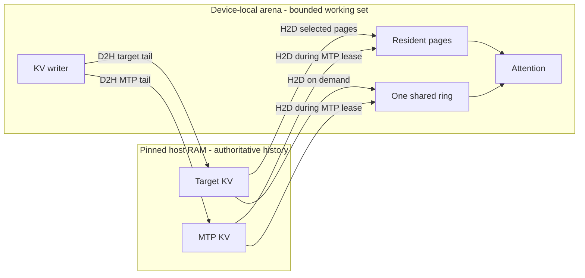
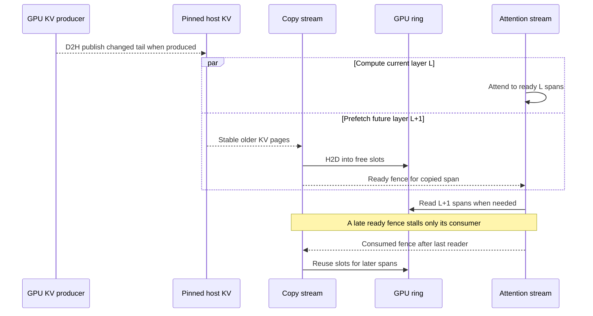
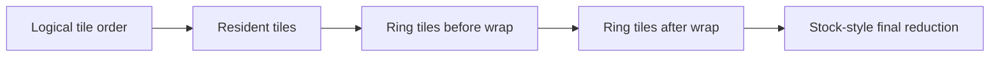
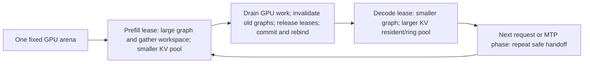
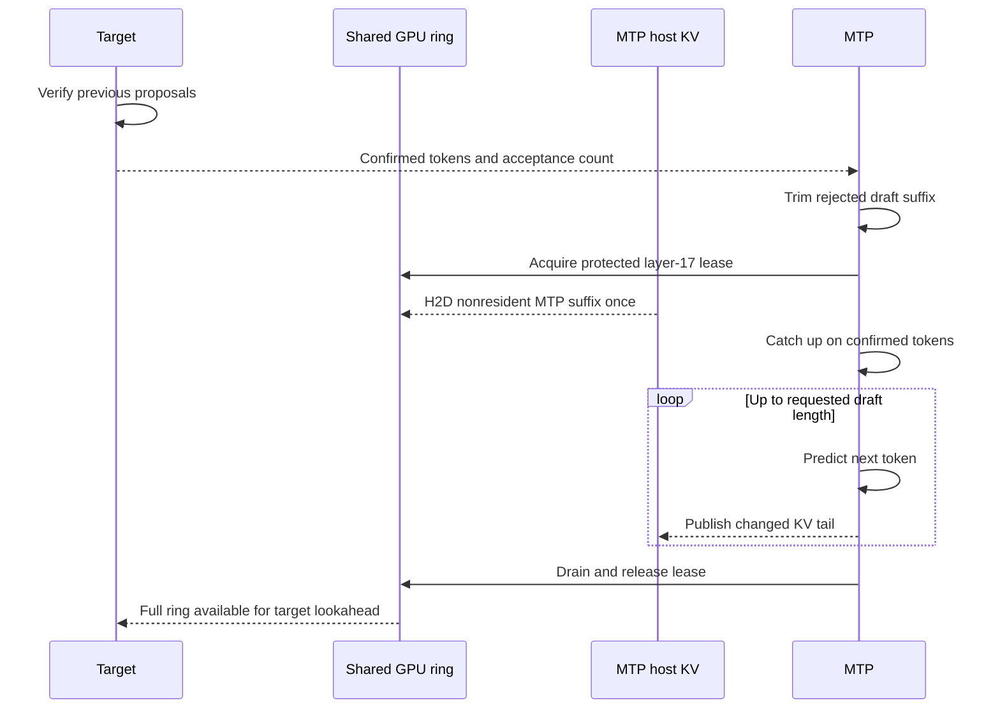
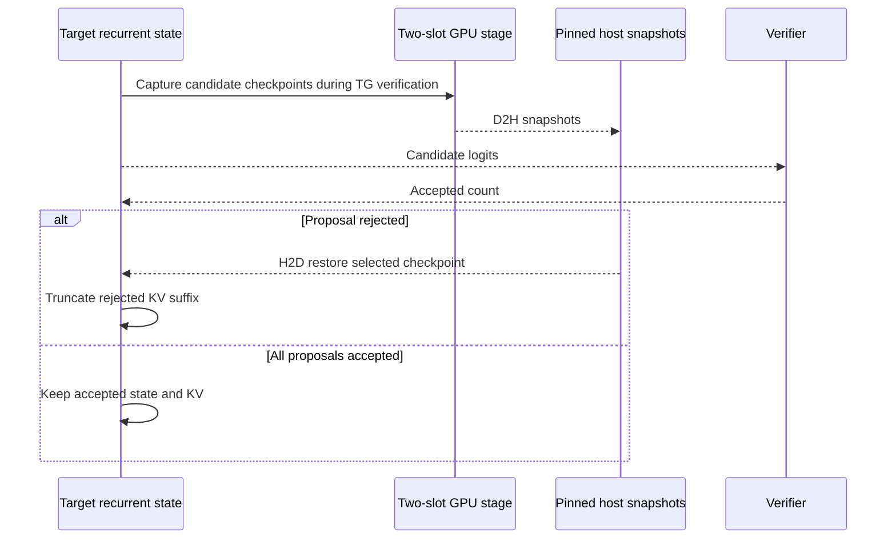
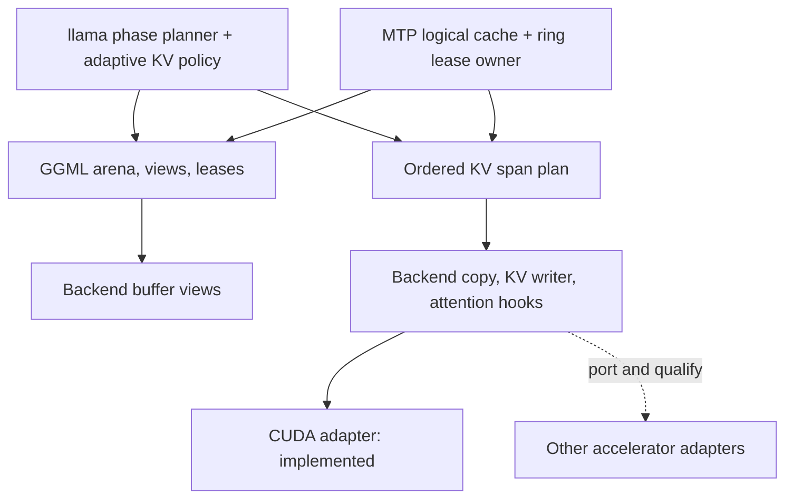

# troed's fork of Raymond's adaptive KV streaming

This is a fork of
[RaymondHuang210129/llama.cpp-adaptive-kv-streaming](https://github.com/RaymondHuang210129/llama.cpp-adaptive-kv-streaming). Their README follows. Note that for good performance when streaming KV cache your GPU needs to be on PCIe 5.0.

## Installation TL;DR if you have a 16GB CUDA card:

Download this [ASCII condensed version of ByteShape Qwen3.8-27B-IQ4_XS](https://huggingface.co/troed/Qwen3.8-27B-ASCII-Condensed).
Clone and compile this repo:

```
cmake -B build -DGGML_NATIVE=ON -DLLAMA_BUILD_EXAMPLES=OFF -DLLAMA_BUILD_TESTS=OFF -DGGML_CUDA=ON \
  -DGGML_CUDA_FA_QUANTS=q8_0-q4_0,q8_0-q8_0,q4_0-q4_0
cmake --build build --config Release -j
```

> **Do not drop the extra `GGML_CUDA_FA_QUANTS` entries.** The `q8_0-q8_0` and `q4_0-q4_0`
> kernels are required for native KV-stream attention; a pair-only list (`q8_0-q4_0` alone)
> builds but makes long streaming requests fail at the prefill→decode transition. See
> [Required FlashAttention kernels](#required-flashattention-kernels).

Put this in your models-preset.ini:

```
[Qwen3.8-27B]
spec-type = draft-mtp
spec-draft-n-max = 5
spec-draft-p-min = 0.8
device-draft = CUDA0
n-gpu-layers-draft = all
# If all 16GB are available to the model, else lower this value
shared-device-memory-mib = 3904
# Any suitable template
chat-template-file = chat_template_qwen3.8.jinja
m = Qwen3.8-27B-ASCII-Condensed-IQ4_XS-3.84bpw.gguf
ctx-size = 200192
n-gpu-layers = 99
batch-size = 256
ubatch-size = 256
cache-type-k = q8_0
cache-type-v = q4_0
fit = off
parallel = 1
temp = 1.0
top-p = 0.95
top-k = 20
min-p = 0.0
presence-penalty = 0.0
repeat-penalty = 1.0
reasoning = on
reasoning-preserve = on
# Original GGUF-converted mmproj
mmproj = Qwen3.8-mmproj-BF16.gguf
load-mode = none
flash-attn = on
```

## What's different compared to Raymond's own repo

- Synced to upstream llama.cpp: merged
  [ggml-org/llama.cpp](https://github.com/ggml-org/llama.cpp)
  [`436f6f89e`](https://github.com/ggml-org/llama.cpp/commit/436f6f89e1e581249900b37a5b8a12a36a6d0912) (2026-10-03).
- Synced to Raymond's adaptive-KV fork: merged
  [RaymondHuang210129/llama.cpp-adaptive-kv-streaming](https://github.com/RaymondHuang210129/llama.cpp-adaptive-kv-streaming)
  [`05c0a5e45`](https://github.com/RaymondHuang210129/llama.cpp-adaptive-kv-streaming/commit/05c0a5e454210ed18bf2486dfb7a6c7eba4b1cc7) (2026-10-09)
- ngram speculators can run alongside attached MTP on a streamed context:
  `--spec-type ngram-simple,draft-mtp` (any `ngram-*` type works) lets the ngram
  drafter propose the wide round and the MTP head the narrow one, sharing one
  target pool [^1]. A draft wider than the span tile runs as span-width row tiles,
  so it no longer reserves the whole-layer gather shape, and the vision projector
  loads with the combination too [^3].
- Attached MTP accepts more than three draft tokens: `--spec-draft-n-max` may be
  raised to 5, which together with a 0.7-0.8 cutoff raises TG tps [^2].

Previous fork of Raymond's v1 + ejectable MTP/DFlash2 and ngram-* is on [this branch](https://github.com/troed/llama.cpp-adaptive-kv-streaming/tree/feature/kv-stream-phase-arena-spec)
## Attached MTP depth: MTP3, MTP5, and MTP5 with ngram

All columns come from the same build, the same single GPU, and the same model,
measured at temperature 0 on one serial request. MTP5 means
`--spec-draft-n-max 5`; MTP3 is the depth Raymond's branch supports. The third
column adds an ngram drafter alongside MTP5
(`--spec-type ngram-simple,draft-mtp`), which the vision projector now loads with
too [^3].

These rows use the [installation preset](#installation-tldr-if-you-have-a-16gb-cuda-card):
the Qwen3.8 vision projector loaded (`mmproj`), `shared-device-memory-mib 3904`,
`--spec-draft-p-min 0.8` [^2], Q8_0 K / Q4_0 V and Flash Attention, on an
RTX 5060 Ti with CUDA graphs enabled. Each row is a single run over the frozen
corpus, so treat a few percent as noise; acceptance is prompt-dependent.

Decode, tokens per second:

| Context | MTP3 | MTP5 | MTP5 + ngram |
| --- | --- | --- | --- |
| 40k | 46.66 | 50.39 | 92.13 |
| 80k | 39.14 | 52.43 | 36.81 |
| 120k | 32.21 | 29.88 | 31.05 |
| 160k | 24.28 | 21.36 | 20.72 |

Prefill, tokens per second - the depth does not reach this path:

| Context | MTP3 | MTP5 | MTP5 + ngram |
| --- | --- | --- | --- |
| 40k | 764.9 | 757.4 | 754.8 |
| 80k | 657.0 | 652.4 | 652.2 |
| 120k | 559.8 | 555.3 | 555.3 |
| 160k | 479.4 | 475.9 | 476.9 |

The ngram mix is the clear win where the drafter finds long matches: at 40k it
nearly doubles MTP5 (92.13 vs 50.39), because a single wide ngram round still
lands. Past 40k its matches are rare but long; the per-round cost is dominated by
streaming, so those fewer-but-wider rounds stop paying off and the two columns
converge towards the depth. Accepted tokens decide the rate, not width.

[^1]: The streamed verify width is derived from the configured speculators, one
plus the widest draft any of them can produce, and clamped to the context and
ubatch, so a wide ngram draft needs an ubatch at least that large (the load is
refused otherwise). A verify batch a span kernel covers runs from the stream
model's own tile workspace, so on the shared-arena path the decode phase keeps
its KV pool.

[^2]: `--spec-draft-p-min` is the draft's minimum sampling probability. The
measured rows above use the preset's 0.8 (the installation TL;DR's value). A
different value changes how often the draft continues, so it moves acceptance and
realized width, and the tables are not comparable across values.

[^3]: A wide ngram verify used to cost memory rather than drafting:
ngram-simple's default `--spec-ngram-simple-size-m 48` makes the streamed verify
width 49 (one plus the widest draft any configured speculator can produce), wider
than the span kernels cover. The decode phase then reserved the whole-layer gather
shape out of the GPU arena - an attention grant of about 318 MiB against about
4.6 MiB for the span-tile figure - which cost the decode-phase KV pool roughly
1 GiB and streamed more on every forward. A verify wider than the tile now runs
as consecutive span-width row tiles over the same KV span
(`src/llama-kv-stream-resident.cpp`), so the decode grant stays at the tile figure
whenever the stream can tile and the ngram column's KV pool matches MTP5's. The
same admission change lets the vision projector carry an `ngram-*` drafter
alongside `draft-mtp`; the vision arena previously accepted only plain
`draft-mtp`.

---

# Adaptive KV Streaming for llama.cpp V2

V2 runs full-context Qwen3.8-27B on a bounded GPU KV working set. The complete KV history stays in pinned system RAM; resident GPU pages and one shared ring supply attention without dropping old tokens. V1 (`feature/kv-stream-phase-arena`) already had streaming, cross-layer prefetch, and a CUDA phase arena. V2 rebuilds those ideas on explicit memory ownership, stays closer to stock attention arithmetic, and adds long-context MTP without a second full GPU KV allocation.

> [!WARNING]
> This is experimental. End-to-end qualification uses Unsloth Qwen3.8-27B `UD-IQ4_XS` on one RTX 5070 Ti, one serial request, Flash Attention and Q8_0 K / Q4_0 V. Text and matching M-RoPE image requests support the single embedded MTP head with draft lengths 1-3. Older CUDA architectures have the build/code-path evidence below, not actual older-card qualification. Audio/video arena execution, other models and other accelerator streaming paths remain unqualified.

## Results and quick start

The figure compares V2 with draft lengths 0-3, not V1 against V2. On an RTX 5070 Ti with Unsloth `UD-IQ4_XS`, 256/256 batch sizes, UVM off, and a fixed 2,240 MiB arena, a 256-token continuation at 256 Ki context measured 8.73 tokens/s without MTP and 19.12 tokens/s with draft length 3. At 32 Ki, the rates were 41.04 and 101.05 tokens/s. MTP costs some prefill speed and memory. These are single-run measurements for one prompt and machine, not general speed guarantees.


[Vector SVG](media/adaptive-kv-stream-v2-throughput-combined.svg) | [Detailed plot with KV pool and MTP acceptance](media/adaptive-kv-stream-v2-mtp-sweep.png) ([SVG](media/adaptive-kv-stream-v2-mtp-sweep.svg))

Build from the repository root:

```sh
cmake -S . -B build-v2 -DGGML_CUDA=ON -DGGML_CUDA_FA_ALL_QUANTS=ON -DCMAKE_BUILD_TYPE=Release
cmake --build build-v2 --target llama-server -j
```

Example for the embedded-MTP `UD-IQ4_XS` GGUF. The 2,240 MiB arena fit this test machine; choose a value that fits yours. It includes phase workspaces and the KV working set, not just KV. Model weights are outside it.

```sh
./build-v2/bin/llama-server \
  --model /path/to/Qwen3.8-27B-UD-IQ4_XS.gguf \
  --ctx-size 262144 --parallel 1 \
  --batch-size 256 --ubatch-size 256 --n-gpu-layers 999 \
  --flash-attn on --cache-type-k q8_0 --cache-type-v q4_0 \
  --kv-stream-arena-mib 2240 \
  --spec-type draft-mtp --spec-draft-n-max 3 \
  --fit off --no-mmproj
```

With streaming and `--spec-type draft-mtp`, the server derives the auxiliary KV layer count from the loaded model's NextN/MTP metadata before allocating its context. Qwen3.8 contributes one layer, forming the shared 17-layer layout. The legacy `--kv-stream-auxiliary-layers 1` flag is optional and must match the model count. Multi-layer MTP metadata is detected, but its streaming execution is not yet supported; such models receive an explicit capability error.

Attached MTP **inherits the target's K/V types**: here its K is Q8_0 and V is Q4_0. Do not add `--cache-type-k-draft` or `--cache-type-v-draft` expecting a different attached-MTP quant; the shared layout currently requires matching types. To disable MTP, remove the two speculative flags and the legacy auxiliary-layer flag if present.

Recreate the fixed-arena sweep (8 Ki through 256 Ki, four MTP settings). `--no-manage-production` avoids touching the local `llm-llmster` container; omit it only if you want the script to manage that container. The included [article corpus](benchmarks/data/online-articles-262144-words.txt) is Wikipedia text under CC BY-SA 4.0 with article attributions, separate from the code license.

```sh
python3 benchmarks/run-fixed-span-sweep.py \
  --model /path/to/Qwen3.8-27B-UD-IQ4_XS.gguf \
  --server ./build-v2/bin/llama-server \
  --mtp-lengths 0,1,2,3 --arena-mib 2240 \
  --output benchmarks/results/my-v2-sweep \
  --no-manage-production
```

The script writes CSV, JSONL, logs, and a plot when Matplotlib is installed. `--auto-max-arena` instead probes the maximum for each context **and MTP mode**; those variable-budget results are not directly comparable to this fixed-budget figure.

## CUDA compatibility and qualification

Streaming follows stock's attention-family selection for the device, build and tensor shape. It does not force newer GPUs through the Pascal baseline. Optional VMM, CUDA graph capture and PDL are not prerequisites for KV storage and streaming; pinned host memory and a compiled attention path are required.

| GPU family | Build/code-path evidence | Actual hardware evidence |
| --- | --- | --- |
| SM61: GTX 10-series / P40 | Isolated CUDA 12.9 build; vector/tile, target/MTP and recovery checks through forward-JIT on the 5070 Ti | Pending |
| SM70: V100 | Uses the stock-selected legacy family; no dedicated SM70 runtime qualification | Pending |
| SM75: RTX 20-series | CUDA 13 single-target build; vector/MMA and target/MTP/recovery checks through forward-JIT | Pending |
| SM86: RTX 30-series | Same checks, preserving the existing asynchronous tile pipeline | Pending |
| SM89: RTX 40-series | CUDA 13 single-target build; vector/MMA and operator comparisons through forward-JIT | Pending |
| SM120: RTX 50-series | CUDA 13 build, optimized vector/MMA paths | RTX 5070 Ti: tested text/MTP/vision/cache/recovery configurations |

Forward-JIT runs older-target code on a newer GPU. It does not reproduce an older card's resource limits, VRAM capacity or performance. This table is not a pass for every card in a family, Windows/MSVC or every intervening compute capability. See [build and device-check commands](docs/build.md#adaptive-kv-cuda-qualification-and-startup-errors) and the [qualification ledger](DEVICE_MEMORY_CONSUMERS_ROADMAP.md#phase-c6-end-to-end-acceptance-and-handoff).

### Required FlashAttention kernels

Native KV-stream attention needs, besides the K–V pair kernel itself, a **same-type (or
f16-paired) kernel for each side**. Compile them with `-DGGML_CUDA_FA_ALL_QUANTS=ON`, or a
`GGML_CUDA_FA_QUANTS` list that contains the pair *and* each side. For mixed Q8_0 K / Q4_0 V:

```sh
-DGGML_CUDA_FA_QUANTS="q8_0-q4_0,q8_0-q8_0,q4_0-q4_0"
```

If a required kernel is missing, the backend reports native direct attention as unavailable and
the policy **silently falls back to the F16 conversion path** — this is *not* a startup error. A
fully resident **decode** then needs a full-layer gather (~143 MiB at 90 Ki tokens) that the
decode attention grant does not hold, and the request dies at the prefill→decode transition:

```
compute: target attention failed at layer 0, rows 1
ggml_backend_cuda_graph_compute: managed node ... failed with status -1
srv decode: Compute error.
```

The resolved mode is logged at load: `KV attention mode native-direct (fallback=0)` is correct;
`f16-convert` means the kernels are missing and long streaming decodes will fail. (This is a
real trap: a pair-only list such as `-DGGML_CUDA_FA_QUANTS=q8_0-q4_0` compiles cleanly and
starts fine, then dies only once decode begins.)

`GGML_CUDA_FA_QUANTS` is the current mechanism; `GGML_CUDA_FA_ALL_QUANTS` is deprecated in
current ggml but still maps to `FA_QUANTS=all`. CUDA 13 cannot compile the pre-SM75 targets; use
an isolated CUDA 12.9 or earlier toolkit for those builds. A startup error naming a missing
native attention query width is a kernel/build/geometry admission failure, not evidence that a
larger arena will fix it.

Recent compatibility checks retain stock-equivalent MMA outputs in the tested cases; regional vector reductions have a measured maximum difference of 7.45e-9 with a 1e-8 regression guard. Matched 8K/96K/128K/160K IQ4_XS, MTP=3, fixed-2,240-MiB comparisons retain all 256 output token IDs and show no material throughput regression (prefill -0.14% to -0.03%; decode +0.08% to +0.75%). These single-pair differences are not claimed as speed improvements or universal output equivalence. The opening figure is the earlier V2 MTP sweep, not this compatibility A/B test.

The arena quota bounds its participating buffers, **not all process memory**. Weights, host KV, persistent recurrent storage and CUDA driver/native-executable allocations also need space. Startup admission now distinguishes missing native kernels, arena minima, host allocation/registration and device allocation/binding failures. Precise all-phase minimum sizing and additional-byte diagnostics are the next workstream; passing today's startup checks is not a guarantee against every later OOM.

### If you still hit a CUDA out-of-memory

A long-context run can exhaust VRAM even with a valid arena, most often when llama.cpp
instantiates the **decode CUDA graph**:

```
CUDA error: out of memory
  in function ggml_cuda_graph_evaluate_and_capture ...: cudaGraphInstantiate(...)
```

That allocation is outside the arena, and a tight card (weights + arena close to total VRAM)
can leave too little for it — the process aborts and the router reloads the model. Free some
VRAM (a smaller `--shared-device-memory-mib`, fewer `--n-gpu-layers`), or **turn CUDA graphs off
at runtime** — no rebuild:

```sh
export GGML_CUDA_DISABLE_GRAPHS=1
```

Graphs are a decode-speed optimisation, not a correctness requirement. `GGML_CUDA_GRAPHS=OFF`
is the compile-time equivalent; prefer the environment variable since it needs no rebuild.

## Image requests, with optional MTP

The server can now share its arena with the matching Qwen3.8 F16 vision projector. Projector weights start unloaded. For an image batch, authoritative host KV is retained while device mirrors are suspended. The projector and its compute workspace borrow separate arena regions, and host embeddings are retained. The projector then unloads and text regains the arena before image-embedding prefill and generation. Compatible media batching and prompt-prefix caching keep their existing server behavior.

```sh
./build-v2/bin/llama-server \
  --model /path/to/Qwen3.8-27B-UD-IQ4_XS.gguf \
  --mmproj /path/to/mmproj-Qwen3.8-27B-F16.gguf \
  --ctx-size 262144 --parallel 1 \
  --batch-size 256 --ubatch-size 256 --n-gpu-layers 999 \
  --flash-attn on --cache-type-k q8_0 --cache-type-v q4_0 \
  --shared-device-memory-mib 2240 --spec-type none --fit off
```

This requires a shared arena, not the legacy fixed KV-pool flag. To enable the single embedded Qwen MTP head, replace `--spec-type none` with:

```sh
--spec-type draft-mtp --spec-draft-n-max 3 \
--spec-draft-type-k q8_0 --spec-draft-type-v q4_0
```

Draft lengths 1-5 are qualified (the 5-draft case was verified on an RTX 5060 Ti with a 3840 MiB shared arena; MTP5 costs only ~13 MiB more than MTP3, but the image projector's device grant needs that little extra headroom). MTP consumes the raw image embeddings and shifted target hidden rows as separate inputs; its cache tracks physical rows independently of image M-RoPE positions. Vision suspends both text schedulers and retires the MTP ring lease before borrowing the parent. Pending hidden rows also survive checkpoint and RAM prompt-cache restoration.

Parallel slots, separate draft models, other speculation modes, CPU projector offload, LoRA, embeddings and unqualified KV pairs are rejected. The draft must fit the target's borrowable scratch; a separate-workspace fallback is not admitted for vision. A batch that exceeds the arena returns an error; reduce image size/token limits or choose a suitable arena. The example budget was tested on the RTX 5070 Ti, not guaranteed for other models/cards. Target/MTP weights, persistent recurrent state and CUDA housekeeping remain outside the arena.

An offline [server qualification harness](tools/server/tests/test_adaptive_vision.py) compares the ordinary eager server with the arena server using deterministic local PNGs. It checks token IDs, cached/changed/follow-up and multiple images, RAM prompt-cache restoration, socket cancellation, oversized-batch recovery and optional rejected startup configurations. See [test instructions](tools/server/tests/README.md#adaptive-kv-vision-qualification). It does not stop production containers or download models.

Repeated no-MTP image requests at native context capacity with a 2,240 MiB parent were also memory-qualified at 64/64 and 256/256: sampled device usage settled at 15,466 MiB on the 16,303 MiB RTX 5070 Ti, with every vision grant returned before text resumed. These used 6K-token backgrounds, not full-262K histories. See the [memory/latency measurement companion](tools/server/tests/README.md#vision-memory-and-handoff-measurements) for reproduction and the distinction between projector reload, text restoration and lazy KV refill. Sampling does not guarantee an instantaneous peak bound; image dimensions and batch limits still matter.

With MTP=3, native context capacity, 256/256 batches and the same parent budget, repeated short image requests settled at 15,836 MiB. A separate 39K-token streaming test matched the eager control's 128 generated token IDs across image/cache scenarios. These are bounded qualification cases, not a guarantee of identical output for every prompt or an instantaneous memory-peak bound.

## KV data movement and attention

Target and MTP have separate logical histories in pinned host RAM. Their GPU pages share one physical pool. For this model a page holds 256 token positions; K and V page sizes follow the selected quants.



When everything fits, attention uses resident pages directly. Under pressure, the policy trades resident pages for ring slots. It may first stream one or a few layers while other layers stay fully resident; as context grows, more pages can become streamed. Target and MTP never own the ring at the same time. The complete history remains available in host RAM, and the ring does not duplicate it permanently.

```text
physical KV budget = resident pages across layers + shared ring slots
```

The copy stream can fill free slots for later layers while the attention stream computes the current layer. It cannot prefetch a newly written tail until that tail exists. This timeline is illustrative; actual lookahead depends on free slots and dependencies.



A ready fence prevents attention from reading an incomplete copy. A consumed fence prevents the copy stream from overwriting a still-used slot. The policy samples readiness misses, ring occupancy, and copy-stream time to adjust the resident/ring split with hysteresis. Its copy-busy percentage is **not** measured PCIe bandwidth divided by theoretical bandwidth; long contexts still pay for growing transfer and compute work.

### Keep the stock attention order

Streaming changes physical addresses, but it need not change the logical tile order. The kernel walks resident pages and up to two ring spans (before and after wrap) as one ordered attention history, then uses the stock-style final reduction. It does not normalize each chunk independently and merge approximate answers.



Small-query attention extends the stock-selected vector, tile or MMA family; the choice depends on the compiled/device capabilities and geometry, not just TG width. Q8_0 K and Q4_0 V are converted in small tiles, not copied into another full FP16 cache. Wide prefill may gather a contiguous working view to keep stock-like arithmetic, which costs prefill speed. This is not a universal bit-identity claim: qualified MMA span tests match stock, vector/tile paths can have small floating-point differences, and matched 96 Ki/144 Ki greedy TG3 runs produced the same 256 token IDs as a separate stock build. Other configurations need their own tests.

## Phase arena: give the same bytes different jobs

Prefill needs a large graph and attention workspace; decode needs a larger KV working set. V2 holds one device-local parent allocation and lends bounded views to whichever phase is active. These are **alternative layouts of the same arena**, not two simultaneous allocations.



A view names a bounded slice; a lease keeps its parent alive; a completion fence proves the GPU stopped using that slice. The phase coordinator does not move the physical parent, and changing an arena layout does not itself move KV. The host cache lets a new resident mirror be rebuilt when the physical layout changes. Failure during a handoff cannot leave stale graph pointers silently active.

Weights are outside this arena. `GGML_CUDA_ENABLE_UNIFIED_MEMORY=1` is optional for supported model buffers, but the arena remains device-local `cudaMalloc` even with UVM enabled. Other GPU programs therefore cannot rely on evicting this arena on demand.

## MTP catch-up, prediction, and rollback

The target has 16 full-attention layers; attached MTP is logical layer 17. MTP has its own host KV history but borrows the target's resident/ring pool. During its lease, resident MTP pages plus the ring-held nonresident suffix cover its full history. It loads that suffix once for a catch-up/draft phase, then gives the **entire ring** back to the target before verification. Clean resident MTP pages can be reused across rounds; a changed ring suffix may need reloading after the target has used the ring.

Why can it be layer 17? The supported MTP head has one full-attention KV cache, not another copy of the target's recurrent blocks. Its K/V use the same quantization, head geometry, and token-page layout as the target's 16 attention layers; attachment rejects a mismatch. The physical policy can therefore count 16 target layers plus one separately identified MTP layer, using the same resident-page and ring-slot accounting. MTP keeps its own authoritative host history, so its GPU pages can be replaced and later reloaded without losing tokens. During catch-up and drafting, a complete-layer lease protects its ring slots; they become reusable by the target only after the MTP work and lease finish. Model weights and the target's recurrent state are not part of this KV eviction policy.



Speculative target verification also needs a way back if it rejects a proposed token. The 48 recurrent target blocks keep their **current** state on the GPU. Candidate checkpoints are published through a bounded two-slot GPU stage into pinned host snapshots. On rejection, the chosen host checkpoint is restored to GPU state and the rejected KV suffix is discarded; accepted work is kept.



This replaces large persistent draft GPU allocations with smaller shared and phase-exclusive allocations, **not zero extra memory**:

| At 262,144 tokens, Q8_0 K / Q4_0 V | Separate draft context | Attached V2 |
| --- | --- | --- |
| MTP KV | About 416 MiB extra persistent GPU KV | Separate pinned-host history; GPU pages share the 17-layer pool |
| Draft prefill workspace | About 1.2 GiB peak request in a historical fit audit | Borrows the phase arena rather than coexisting at peak with target work |
| Recurrent rollback | Extra device snapshots | For depth 3, about 449 MiB pinned host snapshots and 18.7 MiB GPU stage |

The rows are not additive savings claims. Embedded MTP weights, resident MTP pages, active graph work, and copy traffic remain. In the plotted 2,240 MiB arena, the effective decode KV grant was about 2,228 MiB without MTP and 2,217-2,219 MiB with draft length 3. See the [MTP integration roadmap](MTP_ADAPTIVE_KV_ROADMAP.md) for design and qualification details.

## Backend-neutral memory and streaming contracts

"Backend-neutral" means ownership, layout validation, placement policy, and the MTP lease rules do not depend on a CUDA pointer or stream. It does **not** mean the attention kernels or asynchronous transfer code are portable. These are experimental fork-internal contracts, not stable upstream APIs.



### 1. Memory ownership and phase changes

A backend creates a **view** of an existing allocation; the view has an offset and bound but does not copy the bytes. The common arena plans named regions within one parent allocation. A **lease** retains a committed region and its parent while a scheduler, KV pool, or graph uses it. Representative declarations are in [ggml-backend.h](ggml/include/ggml-backend.h) and [ggml-backend-memory.h](ggml/src/ggml-backend-memory.h):

```cpp
ggml_backend_buffer_t ggml_backend_buffer_view(ggml_backend_buffer_t buffer, size_t offset, size_t size);
ggml_backend_memory_arena_t ggml_backend_memory_arena_new(ggml_backend_buffer_type_t buft, size_t capacity);
bool ggml_backend_memory_arena_begin(ggml_backend_memory_arena_t arena, uint32_t flags);
bool ggml_backend_memory_arena_commit(ggml_backend_memory_arena_t arena);
ggml_backend_memory_lease_t ggml_backend_memory_arena_acquire(ggml_backend_memory_arena_t arena, uint64_t id);
bool ggml_backend_sched_attach_memory_lease(ggml_backend_sched_t sched, ggml_backend_t backend, ggml_backend_memory_lease_t lease);
```

`begin`/`reserve`/`commit` changes the region map transactionally; the planner itself is metadata, not a page-migration engine. The lease keeps storage alive, but **does not prove queued GPU work finished**. At a phase change, [llama-memory-transition](src/llama-memory-transition.h) asks consumers to prepare, stop new work, drain work, invalidate captured graphs, release changed leases, commit the new layout, then bind and activate it. A graph or pointer from the old layout cannot be reused merely because the parent allocation has the same address. Persistent regions can remain bound when the new plan preserves them. See [Device Memory Infrastructure](DEVICE_MEMORY_INFRASTRUCTURE.md) for the fuller ownership model.

### 2. Logical KV layout, policy, and physical execution

[ggml-kv-stream.h](ggml/src/ggml-kv-stream.h) calculates K/V page offsets from the actual quant types, validates backend capabilities, and represents an attention history as **ordered spans**. Each span retains leases for its physical K/V buffers; the plan rejects gaps, overlaps, or insufficient coverage. The [adaptive policy](src/llama-kv-stream-policy.h) proposes resident/ring sizes from context length and feedback without moving bytes or launching a kernel:

```cpp
llama_kv_stream_policy_result llama_kv_stream_policy_step(
    const llama_kv_stream_policy_config & config,
    const llama_kv_stream_policy_state & previous,
    const llama_kv_stream_policy_observation & observation,
    llama_kv_stream_policy_decision & output);

ggml_kv_stream_result ggml_kv_stream_span_plan_make(
    const ggml_kv_stream_shape & shape,
    const ggml_kv_stream_span_source * spans, size_t count,
    size_t active_tokens, size_t query_tokens,
    ggml_kv_stream_span_plan_t & output);
```

Only after the runtime accepts a proposal does it repartition the physical pool. The backend adapter supplies the operations that cannot be expressed as metadata: host registration, asynchronous H2D/D2H copies, ready/consumed fences, encoded KV writes, and attention over spans. The versioned, optional [copy-ops table](ggml/src/ggml-kv-stream-copy.h) includes `enqueue_span`, `acquire_span`, `release_span`, `fence_producer`, and `poll_feedback`. The [attention-ops table](ggml/src/ggml-kv-stream-device.h) advertises supported K/V pairs and exposes `spans`/`spans_workspace`. A [buffer-local execution hook](ggml/src/ggml-backend-execution.h) routes only supported KV-write and attention tensor operations to that owner; other tensor operations remain ordinary backend work. These are **private extension points**, not a claim that a generic GGML backend already implements them. Selected callback signatures show the handoff between common scheduling and backend execution:

```cpp
// ggml_kv_stream_copy_ops
bool (*enqueue_span)(void *, size_t first_slot, const void * k, const void * v, size_t live_tokens, size_t padded_tokens);
bool (*acquire_span)(void *, size_t first_slot, size_t count);
bool (*release_span)(void *, size_t first_slot, size_t count);

// ggml_kv_stream_partial_ops
bool (*spans)(ggml_backend_t backend, const ggml_tensor * attention,
    ggml_kv_stream_span_plan_t spans, ggml_backend_buffer_t workspace);
```

### 3. MTP uses the same contracts

The target and MTP caches have different logical IDs and separate authoritative host histories. The common policy counts MTP as one more attention layer in the shared physical budget. A [complete-layer lease owner](src/llama-kv-stream-layer-lease.h) reserves its resident pages plus ring suffix, keeps the ring protected during catch-up and prediction, and exposes the same span plan to TG1-TG4 attention. Its key methods include:

```cpp
llama_kv_stream_complete_layer_lease_t acquire_populated(
    ggml_backend_t backend, const llama_kv_stream_complete_layer_request & request,
    const llama_kv_stream_logical_cache & cache, bool reuse_resident = false);
std::shared_ptr<llama_kv_stream_ring_guard> hold_ring();
bool adopt_truncated_prefix(llama_kv_stream_complete_layer_lease_t previous,
    const llama_kv_stream_logical_cache & cache);
```

`hold_ring` blocks target lookahead from overwriting MTP slots; releasing both the MTP lease and ring guard gives the full ring back. `adopt_truncated_prefix` preserves valid bytes after rejection, and `publish_tail` extends a retained lease with newly committed rows. MTP catch-up, draft acceptance, and recurrent rollback stay in llama/common code above the backend; a new accelerator backend should not duplicate that policy. It **does** need compatible host storage, copy/fence semantics, KV writes, span attention, and recurrent state transfers for the live MTP path. The [MTP integration roadmap](MTP_ADAPTIVE_KV_ROADMAP.md) records those contracts and tests.

Memory views exist for CPU, CUDA/HIP, OpenCL, SYCL, and Vulkan, but the current pinned-host registration and complete streamed-attention adapter are CUDA-specific. A backend port must advertise only real K/V pair support, preserve its own stock attention order, and pass view/lease, cancellation, graph-lifetime, numerical, and long-context tests. The [CUDA copy](ggml/src/ggml-cuda/kv-stream-copy.cu) and [attention](ggml/src/ggml-cuda/fattn.cu) code are examples, not portable kernels. The broader [consumer roadmap](DEVICE_MEMORY_CONSUMERS_ROADMAP.md) explains how phase grants and these hooks fit together.

Current limits: one serial target/MTP pair on one CUDA GPU; Qwen3.8-style 256-token page geometry; Flash Attention and KV offload enabled; no parallel slots, multi-GPU split or automatic VRAM-pressure eviction. The matching F16 image projector is qualified only through the shared-arena path above. The example's Q8_0/Q4_0 and 256/256 settings are qualified; general layout code handling more types is not a promise that every model or quant combination is ready.

---

## Upstream llama.cpp README

# llama.cpp


<div align="center">

<b>LLM inference in C/C++</b>

[](https://opensource.org/licenses/MIT)
[](https://github.com/ggml-org/llama.cpp/releases?q=tag:v0)
[](https://github.com/ggml-org/llama.cpp/releases?q=b)
[](https://github.com/ggml-org/llama.cpp/actions/workflows/server.yml)
[](https://github.com/ggml-org/llama.cpp/actions/workflows/docker.yml)
[](https://github.com/ggml-org/llama.cpp/actions/workflows/winget.yml)

[ggml](https://github.com/ggml-org/ggml) / [ops](https://github.com/ggml-org/llama.cpp/blob/master/docs/ops.md) / [maintainer PRs](https://github.com/ggml-org/llama.cpp/issues?q=is%3Apr%20is%3Aopen%20draft%3AFalse%20(author%3Argerganov%20OR%20author%3AKitaitiMakoto%20OR%20author%3Adanbev%20OR%20author%3Aaldehir%20OR%20author%3Amax-krasnyansky%20OR%20author%3ACISC%20OR%20author%3Aggerganov%20OR%20author%3Aam17an%20OR%20author%3Ajhen0409%20OR%20author%3Abartowski1182%20OR%20author%3Anikwen%20OR%20author%3Ahipudding%20OR%20author%3Aravi9%20OR%20author%3AServeurpersoCom%20OR%20author%3Apwilkin%20OR%20author%3Areeselevine%20OR%20author%3Angxson%20OR%20author%3Ajeffbolznv%20OR%20author%3Amarty1885%20OR%20author%3A0cc4m%20OR%20author%3ATitaniumtown%20OR%20author%3Aangt%20OR%20author%3AIMbackK%20OR%20author%3Aarthw%20OR%20author%3AJohannesGaessler%20OR%20author%3AORippler%20OR%20author%3Aruixiang63%20OR%20author%3Axctan%20OR%20author%3Aallozaur%20OR%20author%3Ayomaytk%20OR%20author%3Aaendk%20OR%20author%3Awine99%20OR%20author%3Agaugarg-nv%20OR%20author%3Ataronaeo%20OR%20author%3Aforforever73%20OR%20author%3Alhez%20OR%20author%3Anetrunnereve%20OR%20author%3Afairydreaming)%20sort%3Aupdated-desc) / [dev stats](https://github.com/ggml-org/llama.cpp-dev) / [lib llama API](https://github.com/ggml-org/llama.cpp/issues/9289) / [llama-server REST API](https://github.com/ggml-org/llama.cpp/issues/9291)

</div>

## Quick start

A few options to get `llama.cpp` installed on your machine:

```bash
# curl
curl -LsSf https://llama.app/install.sh | sh

# powershell
irm https://llama.app/install.ps1 | iex
```

- Visit https://llama.app and follow the instructions
- Run with Docker - see our [Docker documentation](docs/docker.md)
- Download pre-built binaries from the [releases page](https://github.com/ggml-org/llama.cpp/releases)
- Build from source by cloning this repository - check out [our build guide](docs/build.md)

Once installed:

```sh
# Download and run a model directly from Hugging Face
llama cli -hf ggml-org/Qwen3.5-0.8B-GGUF

# Launch OpenAI-compatible API server
llama serve -hf ggml-org/Qwen3.5-0.8B-GGUF
```

<table align="center">
    <tr>
        <td align="center" width=50%>
            
            <i>VLM session with <b>llama cli</b></i>
        </td>
        <td align="center">
            
            <i>Built-in web UI against <b>llama serve</b></i>
        </td>
    </tr>
<table>

## Description

The main goal of `llama.cpp` is to enable LLM (and VLM) inference with minimal setup and state-of-the-art performance on
a wide range of hardware - locally and in the cloud.

- Plain C/C++ implementation without any dependencies
- Apple silicon is a first-class citizen - optimized via ARM NEON, Accelerate and Metal frameworks
- AVX, AVX2, AVX512 and AMX support for x86 architectures
- RVV, ZVFH, ZFH, ZICBOP and ZIHINTPAUSE support for RISC-V architectures
- 1.5-bit, 2-bit, 3-bit, 4-bit, 5-bit, 6-bit, and 8-bit integer quantization for faster inference and reduced memory use
- Custom CUDA kernels for running LLMs on NVIDIA GPUs (support for AMD GPUs via HIP and Moore Threads GPUs via MUSA)
- Vulkan and SYCL backend support
- CPU+GPU hybrid inference to partially accelerate models larger than the total VRAM capacity

The `llama.cpp` project is build on top of the [ggml](https://github.com/ggml-org/ggml) library.

## Supported backends

| Backend | Target devices |
| --- | --- |
| [BLAS](docs/build.md#blas-build) | All |
| [BLIS](docs/backend/BLIS.md) | All |
| [CANN](docs/build.md#cann) | Ascend NPU |
| [CUDA](docs/build.md#cuda) | Nvidia GPU |
| [HIP](docs/build.md#hip) | AMD GPU |
| [Hexagon](docs/backend/snapdragon/README.md) | Snapdragon |
| [IBM zDNN](docs/backend/zDNN.md) | IBM Z & LinuxONE |
| [MUSA](docs/build.md#musa) | Moore Threads GPU |
| [Metal](docs/build.md#metal-build) | Apple Silicon |
| [OpenCL](docs/backend/OPENCL.md) | Adreno GPU |
| [OpenVINO [In Progress]](docs/backend/OPENVINO.md) | Intel CPUs, GPUs, and NPUs |
| [RPC](https://github.com/ggml-org/llama.cpp/tree/master/tools/rpc) | All |
| [SYCL](docs/backend/SYCL.md) | Intel GPU |
| [VirtGPU](docs/backend/VirtGPU.md) | VirtGPU APIR |
| [Vulkan](docs/build.md#vulkan) | GPU |
| [WebGPU](docs/build.md#webgpu) | All |
| [ZenDNN](docs/build.md#zendnn) | AMD CPU |

## Documentation

#### Tools

- [cli](tools/cli/README.md)
- [completion](tools/completion/README.md)
- [server](tools/server/README.md)
- [GBNF grammars](grammars/README.md)

#### Development

- [How to build](docs/build.md)
- [Running on Docker](docs/docker.md)
- [Build on Android](docs/android.md)
- [Multi-GPU usage](docs/multi-gpu.md)
- [Device memory infrastructure](DEVICE_MEMORY_INFRASTRUCTURE.md)
- [Adaptive KV streaming and MTP integration](MTP_ADAPTIVE_KV_ROADMAP.md)
- [Performance troubleshooting](docs/development/token_generation_performance_tips.md)
- [GGML tips & tricks](https://github.com/ggml-org/llama.cpp/wiki/GGML-Tips-&-Tricks)
- [XCFramework](docs/xcframework.md)
- [Completions](docs/completions.md)
- [Models](docs/models.md)
- [Release process](docs/release.md)

## Contributing

- Contributors can open PRs
- Collaborators will be invited based on contributions
- Maintainers can push to branches in the `llama.cpp` repo and merge PRs into the `master` branch
- Any help with managing issues, PRs and projects is very appreciated!
- Read the [CONTRIBUTING.md](CONTRIBUTING.md) for more information

## Acknowledgements

- [yhirose/cpp-httplib](https://github.com/yhirose/cpp-httplib) - Single-header HTTP server, used by `llama-server` - MIT license
- [nothings/stb](https://github.com/nothings/stb) - Single-header image format decoder, used by multimodal subsystem - Public domain
- [nlohmann/json](https://github.com/nlohmann/json) - Single-header JSON library, used by various tools/examples - MIT License
- [mackron/miniaudio](https://github.com/mackron/miniaudio) - Single-header audio format decoder, used by multimodal subsystem - Public domain
- [sheredom/subprocess.h](https://github.com/sheredom/subprocess.h) - Single-header process launching solution for C and C++ - Public domain
