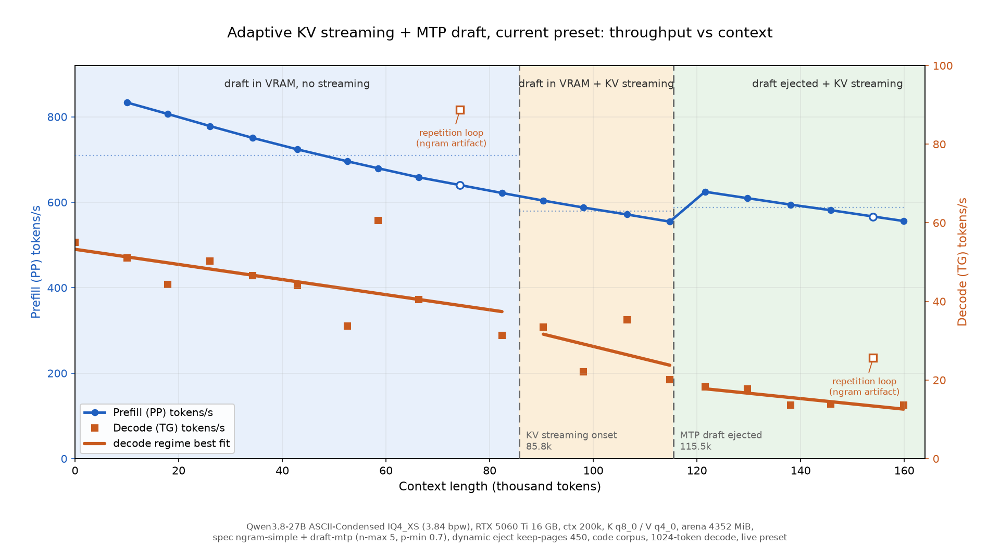

# llama.cpp adaptive KV streaming - spec fork notes

This repository is a fork of
[RaymondHuang210129/llama.cpp-adaptive-kv-streaming](https://github.com/RaymondHuang210129/llama.cpp-adaptive-kv-streaming).

Upstream adds an experimental, block-granular KV cache streaming path to the CUDA
`llama-server`. With `--kv-stream-arena-mib N` the authoritative KV tensors live
in pinned host memory while one bounded CUDA arena is shared between
phase-specific compute buffers, resident KV pages, and the transfer ring. The
upstream README (linked below) covers that design, its build, and its benchmarks.

This fork keeps that implementation and adds speculative decoding on top of the
phase arena: both MTP and DFlash2 drafts work, with the draft weights pinned in
the target arena and a dynamic eject that trades the draft for decode capacity
as the context grows. Everything below is experimental, all numbers are from
tests on a system with i7-12700K CPU, Nvidia 16GB 5060Ti GPU on PCIe 5.0x8 and
96GB 4800MT DDR5 RAM. Expecially the PCIe speed might be crucial for good KV
cache streaming results.

## Upstream sync status

- ggml-org/llama.cpp: master `6c7a87f7e` (2026-09-28)
- RaymondHuang210129/llama.cpp-adaptive-kv-streaming: master `f280b2698` (2026-08-24)

## Performance

Prefill and decode throughput for the current recommended setup (see the TLDR
below), from an empty context to 160K in 8K steps. Prompts are a source-tree
corpus; each point prefills to the target context and decodes 1024 tokens with
the preset's sampling settings. The dashed lines mark the two controller events:
KV streaming starts at about 86K and the pinned MTP draft is ejected at about
115K (`keep-pages 450`). Earlier draft-vs-upstream experiments are in the
[speculative decoding viability investigation](docs/speculative-decoding-viability.md).



## TLDR - recommended setup

If you have a 16GB CUDA GPU - just do the following:

* Clone this repo, build with these parameters

```sh
cmake -B build -DGGML_NATIVE=ON -DLLAMA_BUILD_EXAMPLES=OFF -DLLAMA_BUILD_TESTS=OFF -DGGML_CUDA_FA_QUANTS=q8_0-q4_0 -DGGML_CUDA=ON
cmake --build build --config Release -j
```

-DGGML_CUDA_FA_QUANTS selects which K/V cache type combinations get Flash Attention kernels compiled: `type_K-type_V` pairs separated by `;` (legal types `f16 bf16 q4_0 q4_1 q5_0 q5_1 q8_0`; f16-f16 is always compiled). `GGML_CUDA_FA_ALL_QUANTS` is a deprecated alias for `=all`.

* Download a suitably small Qwen model

[ASCII condensed Qwen 3.8 27B ByteShape IQ4_XS](https://huggingface.co/troed/Qwen3.8-27B-ASCII-Condensed)

The MTP draft is the target's own embedded block, so no separate draft model is
needed. A condensed DFlash2 draft is in the same repo if you prefer that.

* Use the following parameters (models-preset.ini format) when launching llama-server

```
m = Qwen3.8-27B-ASCII-Condensed-IQ4_XS-3.84bpw.gguf
spec-type = ngram-simple,draft-mtp
spec-draft-n-max = 5
# stop the MTP draft early when its top-1 probability drops below this
spec-draft-p-min = 0.7
device-draft = CUDA0
n-gpu-layers-draft = all
ctx-size = 200000
n-gpu-layers = 99
batch-size = 256
ubatch-size = 256
# lower this value if you don't have the full 16GB available for the model
kv-stream-arena-mib = 4352
cache-type-k = q8_0
cache-type-v = q4_0
kv-stream-spec-dynamic = on
kv-stream-spec-keep-pages = 450
kv-stream-spec-reenable-pages = 8
kv-stream-spec-stable-decodes = 4
fit = off
parallel = 1
temp = 1.0
top-p = 0.95
top-k = 20
min-p = 0.0
presence-penalty = 0.0
repeat-penalty = 1.0
reasoning = on
reasoning-preserve = on
# (slow) CPU only multimodal is better than none
no-mmproj-offload = on
mmproj = Qwen3.8-mmproj-BF16.gguf
load-mode = none
flash-attn = on
```

DFlash2 works as well if you prefer it: point `md` at a condensed DFlash2
draft and set `spec-type = draft-dflash` instead. The ngram speculator in the
mix above keeps drafting after the pinned draft is ejected (see
[Drafting after the eject](docs/speculative-decoding-viability.md#drafting-after-the-eject)).

## Differences from Raymond's fork

### Phase arena: speculative verify batches
- Upstream rejected generation batches whose token count was not exactly
  `n_seq_max` ("phase arena currently supports TG1 without speculative batches").
  Speculative decoding verifies `1 + n_draft` tokens on a single sequence.
- New context parameter `llama_context_params.n_max_spec_draft` ("max speculative
  draft tokens, 0 = none"). `common_context_params_to_llama()` sets it from
  `common_speculative_n_max(&params.speculative)`, so it follows the configured
  spec type (ngram, MTP, DFlash) instead of a hardcoded value.
- `llama_context::sched_reserve()` measures the token-generation graph at
  `max(n_seq_max, 1 + n_max_spec_draft)` tokens instead of `n_seq_max`.
- `llama_context::kv_stream_switch_phase()` re-reserves the decode layout at the
  same width, so the arena compute slab fits a verify batch.
- `llama_context::process_ubatch()` admits generation batches up to
  `max(n_seq_max, 1 + n_max_spec_draft)` and otherwise fails with
  "phase arena decode batch too wide".
- `n_max_spec_draft = 0` reproduces the original behaviour.

### Pinned draft context (MTP and DFlash2)
- The draft context's `n_ubatch` is capped to
  `max(8, draft.n_max + 2) * n_seq_max` so its compute graph stays small.
  `n_batch` is left unchanged, because the Qwen3.5 MTP path runs a prefill
  catch-up decode into its own KV.
- The MTP context's KV cache can be allocated from a pinned region inside the
  target's phase arena instead of a separate full-length F16 `cudaMalloc`
  (DFlash2's sliding-window KV stays in ordinary VRAM).
- The draft block weights can be allocated from the same pinned region, so an
  evicted draft returns both its KV and its weights to the arena pool.
- MTP needs no separate model: `--spec-type draft-mtp` alone makes the target
  keep its embedded MTP block, and the draft context is created against the
  target model. A separate MTP-only GGUF via `-md` makes the target skip its
  embedded MTP tensors (`load_mtp = false`) instead; measured here that route
  accepted none of its draft tokens (see
  [MTP uses the target's embedded block](#mtp-uses-the-targets-embedded-block)).
- The pin, window cap, and dynamic eject are generalized to any pinned draft
  (MTP or DFlash2). A pinned draft reserves its weights and the widened
  recurrent-state cache in the target arena; MTP additionally pins its nextn
  KV.

### New arena and context API
- ggml-cuda: `ggml_backend_cuda_phase_arena_set_pinned()`,
  `_reset_pinned()`, and `_pinned_buffer_type()`. The pinned region is
  bump-allocated from the top of the arena; the compute region must stay below
  it. The pinned buffer type shares the arena name so it is recognised as a CUDA
  buffer.
- `llama_kv_stream_pinned_buft()` returns the target context's pinned buffer
  type.
- New experimental context parameters: `spec_mtp`, `spec_draft`,
  `draft_weights_bytes`, `n_max_spec_draft`, `kv_stream_mtp_kv_pages`,
  `kv_stream_mtp_dynamic`. `spec_draft` marks any pinned draft (MTP or DFlash2);
  `draft_weights_bytes` is the draft file size reserved in the pin. The status
  struct gains `mtp_kv_pages` (the pinned MTP KV size in pages) and
  `draft_reserved_bytes` (total pinned bytes for the active draft).
- `llama_kv_stream_draft_set()` enables or disables any pinned draft (formerly
  `llama_kv_stream_mtp_set()`).
- `llama_model_borrow_output()` lets a draft model share the target's LM head
  (`output` / `output_s`) instead of carrying a duplicate copy.

## Configuration

### Phase arena (upstream)
- `--kv-stream-arena-mib N` (alias `--kv-stream-stage-mib`): size of the shared
  CUDA arena in MiB; `0` disables it. The phase arena requires `--parallel 1`,
  `--flash-attn on`, KV offload, and a Qwen3.5-family target.

### Speculative decoding
- `--spec-type draft-mtp` / `--spec-type draft-dflash`: enable the MTP or
  DFlash2 draft.
- `-md <file>`: separate draft GGUF. Use it for DFlash2 drafts. For MTP it makes
  the target skip its embedded MTP tensors (`load_mtp = false`) and the draft
  borrows the target LM head, but measured acceptance of that route is zero, so
  run MTP without `-md`.
- `--spec-draft-n-max N`: number of draft tokens. It also widens the target
  recurrent-state cache and the decode compute slab.
- `--spec-draft-type-k T` / `--spec-draft-type-v T`: draft KV cache types
  (default F16). The main `--cache-type-k`/`--cache-type-v` do not affect the
  draft.
- `--spec-draft-p-min P`: stop drafting early once the draft's top-1
  probability drops below P (default 0.0: disabled).

### MTP uses the target's embedded block

`--spec-type draft-mtp` needs no `-md`: the target loads its own MTP block and
the draft context is created against the target model, which also donates the
LM head. Measured on this stack with `spec-draft-n-max = 3`: 83 of 131 draft
tokens accepted on a 2230-token prompt, and 178 of 228 at 91K prompt tokens.
An extracted MTP file passed through `-md` accepted 0 of 375, for both
`Qwen3.8-27B-IQ4_XS-ASCII-Condensed-MTP.gguf` and
`Qwen3.8-27B-UD-IQ4_XS-ASCII-Condensed-MTP.gguf`; `-md` also makes the target
skip the MTP tensors it already carries.

The MTP block can still be split out of a merged GGUF with
`gguf-py/gguf/scripts/gguf_extract_mtp.py`, but do not pass the result as `-md`
for an MTP draft:

```sh
python3 gguf-py/gguf/scripts/gguf_extract_mtp.py \
    Qwen3.8-27B-ASCII-Condensed-UD-IQ4_XS.gguf \
    Qwen3.8-27B-ASCII-Condensed-MTP.gguf
```

The output keeps the target vocab metadata (`token_embd`, `output_norm`) and the
`blk.<mtp>.` block. It deliberately drops `output.weight` so the draft borrows
the target LM head; pass `--with-lm-head` to keep it. That file is the `-md`
route measured above: it loads and drafts, but it accepted nothing on this
stack, so prefer the target's embedded block.

### Dynamic draft eject (unique to this fork, opt-in)
- `--kv-stream-spec-dynamic`: eject the draft when the decode working set
  exceeds the draft-active decode capacity, and re-enable it when it fits again
  (default: disabled).
- `--kv-stream-spec-keep-pages N`: the single eject threshold: keep the draft
  active until the target's decode working set exceeds `N` 256-token pages,
  then eject. `0` (default) ejects at streaming onset; use a large value to
  keep the draft active throughout. The draft KV slides to follow the target.
  Requires `--kv-stream-spec-dynamic`.
- `--kv-stream-spec-reenable-pages N`: re-enable once the active pages fit at
  least `N` pages below the eject threshold (default: 8).
- `--kv-stream-spec-stable-decodes N`: consecutive decode batches required
  before a transition (default: 4).
- `--kv-stream-spec-kv-pages N`: size of the pinned draft KV reservation, in
  256-token pages. `0` (default) sizes the pin to the draft-active decode
  window automatically; a positive `N` pins exactly `N` pages and caps the
  window there. Requires `--kv-stream-spec-dynamic`.

Ejecting returns the draft weights, the draft KV cache, and the widened
recurrent-state cache to the arena pool; re-enabling restores them.

The draft is kept while the decode working set fits the draft-active decode
pool, which is what remains of the arena after the pinned reservation (draft
weights, recurrent-state cache, MTP KV) and the phase compute slab. A full
context pin would reserve about 4 MiB per 1000 context tokens, so the default
sizes the pin to the decode window instead; `--kv-stream-spec-kv-pages`
overrides that and caps the window at `N` pages minus a small catch-up margin.

## Scope and status

- Validated on an RTX 5060 Ti 16 GB with Qwen3.8-27B, a Q8_0 K cache, a Q4_0 V
  cache, one server slot (`-np 1`), and Flash Attention enabled.
- Single GPU and `llama-server` only. The phase arena requires
  `n_seq_max == 1`, Flash Attention, KV offload, and a Qwen3.5-family target.
- DFlash2 requires a draft whose vocabulary matches the target (see
  [Speculative decoding](docs/speculative-decoding-viability.md#speculative-decoding)). A condensed-vocabulary target
  (129006 tokens) does not work with the full-vocabulary DFlash2 draft
  (248320 tokens). The pre-built condensed pair ships in
  [the model repo](https://huggingface.co/troed/Qwen3.8-27B-ASCII-Condensed),
  built by `gguf-py/gguf/scripts/gguf_condense_dflash.py`.
- Quantizing the MTP draft KV (`-ctkd`/`-ctvd`) shrinks the pin, which grows the
  arena compute side and raises the init peak. At arena 3264 with `-ub 256`
  this can fail to allocate the MTP context's compute buffer. Use arena 3072
  or `-ub 128` at 3264 for now.
- Research code, no upstream guarantees.

## Upstream KV cache streaming fork

[RaymondHuang210129/llama.cpp-adaptive-kv-streaming](https://github.com/RaymondHuang210129/llama.cpp-adaptive-kv-streaming)
